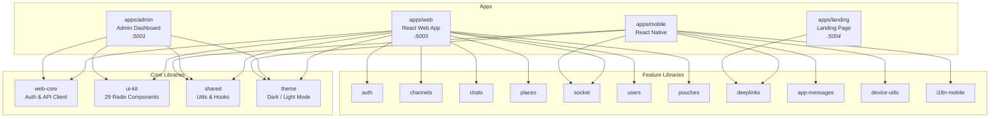

<p align="center">
  
</p>

<h1 align="center">DoU</h1>

<p align="center">
  <strong>A full-stack, cross-platform messaging & community app built with React, React Native, and Nx</strong>
</p>

<p align="center">
  
  
  
  
  
  
</p>

<p align="center">
  <a href="#getting-started">Getting Started</a> &nbsp;&middot;&nbsp;
  <a href="#architecture">Architecture</a> &nbsp;&middot;&nbsp;
  <a href="docs/DEEP-LINKING.md">Deep Linking Docs</a> &nbsp;&middot;&nbsp;
  <a href="#contributing">Contributing</a>
</p>

---

## Overview

DoU is an Nx monorepo powering a real-time messaging and community platform across **4 applications** and **15 shared libraries** — web, mobile, and admin interfaces from a single codebase.

| App         | Description                      | Stack                              |
| ----------- | -------------------------------- | ---------------------------------- |
| **Web**     | Main user-facing web app         | React 19 + Vite + Tailwind CSS     |
| **Admin**   | Admin dashboard                  | React 19 + Vite + Tailwind CSS     |
| **Mobile**  | iOS & Android native app         | React Native 0.83 + WebView bridge |
| **Landing** | Landing page & deep link handler | React 19 + Vite                    |

<details>
<summary><strong>Table of Contents</strong></summary>

- [Overview](#overview)
- [Key Features](#key-features)
- [Tech Stack](#tech-stack)
- [Architecture](#architecture)
- [Getting Started](#getting-started)
- [Development](#development)
- [Building & Deployment](#building--deployment)
- [Mobile Development](#mobile-development)
- [Environment Variables](#environment-variables)
- [CI/CD](#cicd)
- [Code Quality](#code-quality)
- [Documentation](#documentation)
- [Contributing](#contributing)
- [License](#license)

</details>

## Key Features

- **Real-time messaging** via WebSocket with optimistic updates
- **Multi-provider auth** — OAuth, Apple Sign-In, Google Sign-In
- **Push notifications** — Firebase Cloud Messaging (iOS & Android)
- **In-App Purchases** — iOS & Android subscription management
- **Places** — Location-based community features
- **Deep linking** — iOS Universal Links & Android App Links
- **Theming** — Dark / light mode with system preference detection
- **i18n** — Multi-language support with auto-detection
- **29 UI components** — Built on Radix UI primitives (shadcn/ui)

## Tech Stack

| Category         | Technology                             |
| ---------------- | -------------------------------------- |
| **Framework**    | React 19.2, React Native 0.83          |
| **Language**     | TypeScript 5.9 (strict mode)           |
| **Build**        | Vite 7, Metro, Nx 22                   |
| **Styling**      | Tailwind CSS 3.4, Radix UI (shadcn/ui) |
| **State**        | Zustand 5, TanStack Query 5            |
| **Routing**      | React Router 6, React Navigation 7     |
| **Forms**        | React Hook Form 7                      |
| **i18n**         | i18next 25                             |
| **Testing**      | Vitest 4, Jest 29, Testing Library     |
| **Code Quality** | ESLint 9, Prettier, Husky, Commitlint  |

## Architecture



### Project Structure

```
dou-app/
├── apps/
│   ├── web/                 # Main web application (port 5003)
│   ├── admin/               # Admin dashboard (port 5001)
│   ├── mobile/              # React Native app (iOS + Android)
│   │   ├── android/
│   │   ├── ios/
│   │   └── src/
│   └── landing/             # Landing page (port 5004)
├── libs/
│   ├── web-core/            # Auth, API client, initialization
│   ├── ui-kit/              # Shared UI components (shadcn/ui)
│   ├── shared/              # Common utilities and hooks
│   ├── theme/               # Theme provider (dark/light)
│   ├── auth/                # Authentication logic
│   ├── channels/            # Channel management
│   ├── chats/               # Chat functionality
│   ├── places/              # Location-based features
│   ├── socket/              # WebSocket integration
│   ├── pouches/             # API utilities and hooks
│   ├── users/               # User management
│   ├── app-messages/        # Messaging types and stores
│   ├── device-utils/        # Device info and stores
│   ├── deeplinks/           # Deep linking utilities
│   └── i18n-mobile/         # Mobile i18n setup
├── assets/                  # Shared images, logos, icons
├── scripts/                 # Build and deployment scripts
├── docs/                    # Documentation
└── .github/workflows/       # CI/CD pipelines
```

### State Management Pattern

- **Server state** — TanStack Query for caching, background refetching, and optimistic updates
- **Client state** — Zustand stores for auth, theme, device info, and UI state
- **Local state** — React `useState` / `useReducer` for component-scoped data

### Mobile Architecture

The mobile app uses a **WebView + Native Bridge** pattern:

1. React Native shell provides native capabilities (push notifications, IAP, contacts, camera)
2. Web app runs inside a WebView
3. A bridge layer enables bidirectional communication between native and web

### Shared Library System

All apps share code through `@chatic/*` path aliases:

```typescript
import { useAuth } from '@chatic/web-core';
import { Button } from '@chatic/ui-kit';
import { useWebSocket } from '@chatic/socket';
import { ThemeProvider } from '@chatic/theme';
```

## Getting Started

### Prerequisites

| Tool               | Version  | Notes                                       |
| ------------------ | -------- | ------------------------------------------- |
| **Node.js**        | v22.15.1 | Use `nvm use` — `.nvmrc` is included        |
| **Yarn**           | 1.x      | Classic Yarn                                |
| **Xcode**          | Latest   | For iOS development                         |
| **Android Studio** | Latest   | For Android development                     |
| **CocoaPods**      | Latest   | For iOS dependencies                        |
| **Ruby**           | 3.2.9    | For CocoaPods — `.ruby-version` is included |

### Installation

```bash
# Clone the repository
git clone https://github.com/lemoncloud-io/dou-app.git
cd dou-app

# Use the correct Node version
nvm use

# Install dependencies
yarn install
```

### Environment Setup

Copy the example environment files and fill in your values:

```bash
# Web
cp apps/web/.env.example apps/web/.env

# Admin
cp apps/admin/.env.example apps/admin/.env

# Mobile
cp apps/mobile/.env.example apps/mobile/.env
```

> [!WARNING]
> Environment files (`.env`) must exist before building. The app will not start without them.

<details>
<summary>Firebase configuration (Mobile only)</summary>

```bash
# iOS — copy and fill with your Firebase config
cp apps/mobile/ios/Firebase/GoogleService-Info.plist.example \
   apps/mobile/ios/Firebase/GoogleService-Info-Dev.plist

# Android — copy and fill with your Firebase config
cp apps/mobile/android/app/src/google-services.json.example \
   apps/mobile/android/app/src/dev/google-services.json
```

</details>

## Development

```bash
# Web app
yarn web:start              # http://localhost:5003

# Admin dashboard
yarn admin:start            # http://localhost:5001

# Landing page
yarn landing:start          # http://localhost:5004

# Mobile — Start Metro bundler
yarn mobile:start

# Mobile — Run on simulator/emulator
yarn mobile:ios:dev         # iOS Simulator
yarn mobile:android:dev     # Android Emulator
```

> [!TIP]
> Run `npx nx graph` to visualize the dependency graph of all apps and libraries.

## Building & Deployment

### Build

```bash
# Build individual apps
yarn web:build:dev          # Development build
yarn web:build:prod         # Production build
yarn admin:build:dev
yarn admin:build:prod
yarn landing:build:dev
yarn landing:build:prod

# Build all apps at once
yarn build:all:dev
yarn build:all:prod
```

### Deploy

Deployment uses AWS S3 + CloudFront. Required environment variables:

| Variable                         | Description                       |
| -------------------------------- | --------------------------------- |
| `DEPLOY_BUCKET_NAME`             | S3 bucket name                    |
| `DEPLOY_DEV_CF_DISTRIBUTION_ID`  | CloudFront distribution ID (dev)  |
| `DEPLOY_PROD_CF_DISTRIBUTION_ID` | CloudFront distribution ID (prod) |

```bash
yarn web:deploy:dev         # Deploy web to dev
yarn web:deploy:prod        # Deploy web to prod
yarn admin:deploy:dev
yarn admin:deploy:prod
yarn landing:deploy:dev
yarn landing:deploy:prod
```

## Mobile Development

<details>
<summary><strong>iOS Commands</strong></summary>

| Command                               | Description                        |
| ------------------------------------- | ---------------------------------- |
| `yarn mobile:pod`                     | Install CocoaPods dependencies     |
| `yarn mobile:ios:dev`                 | Run dev build on iPhone Simulator  |
| `yarn mobile:ios:prod`                | Run prod build on iPhone Simulator |
| `yarn mobile:ios:dev:device`          | Run dev build on physical device   |
| `yarn mobile:ios:dev:release`         | Release dev build on Simulator     |
| `yarn mobile:ios:dev:release:device`  | Release dev build on device        |
| `yarn mobile:ios:prod:release`        | Release prod build on Simulator    |
| `yarn mobile:ios:prod:release:device` | Release prod build on device       |
| `yarn mobile:ios:clean`               | Clean iOS build artifacts          |

</details>

<details>
<summary><strong>Android Commands</strong></summary>

| Command                              | Description                   |
| ------------------------------------ | ----------------------------- |
| `yarn mobile:android:dev`            | Run dev build on emulator     |
| `yarn mobile:android:prod`           | Run prod build on emulator    |
| `yarn mobile:android:build:apk:dev`  | Build dev APK                 |
| `yarn mobile:android:build:apk:prod` | Build prod APK                |
| `yarn mobile:android:build:aab:dev`  | Build dev AAB (Play Store)    |
| `yarn mobile:android:build:aab:prod` | Build prod AAB (Play Store)   |
| `yarn mobile:android:install:dev`    | Install dev APK via ADB       |
| `yarn mobile:android:install:prod`   | Install prod APK via ADB      |
| `yarn mobile:android:clean`          | Clean Android build artifacts |

</details>

### Mobile Platform Support

| Platform    | Min Version          | Target              |
| ----------- | -------------------- | ------------------- |
| **Android** | SDK 24 (Android 7.0) | SDK 36 (Android 15) |
| **iOS**     | See Xcode project    | Latest              |

## Environment Variables

<details>
<summary><strong>Web</strong> (<code>apps/web/.env</code>)</summary>

| Variable                     | Description                          |
| ---------------------------- | ------------------------------------ |
| `VITE_ENV`                   | Environment (`LOCAL`, `DEV`, `PROD`) |
| `VITE_PROJECT`               | Project identifier                   |
| `VITE_HOST`                  | App host URL                         |
| `VITE_OAUTH_ENDPOINT`        | OAuth API endpoint                   |
| `VITE_SOCIAL_OAUTH_ENDPOINT` | Social OAuth endpoint                |
| `VITE_IMAGE_API_ENDPOINT`    | Image API endpoint                   |
| `VITE_BACKEND_ENDPOINT`      | Backend API endpoint                 |
| `VITE_WS_ENDPOINT`           | WebSocket endpoint                   |
| `VITE_DOU_ENDPOINT`          | DoU API endpoint                     |
| `VITE_SOC_ENDPOINT`          | Social API endpoint                  |

</details>

<details>
<summary><strong>Admin</strong> (<code>apps/admin/.env</code>)</summary>

| Variable                     | Description                          |
| ---------------------------- | ------------------------------------ |
| `VITE_ENV`                   | Environment (`LOCAL`, `DEV`, `PROD`) |
| `VITE_PROJECT`               | Project identifier                   |
| `VITE_HOST`                  | App host URL                         |
| `VITE_OAUTH_ENDPOINT`        | OAuth API endpoint                   |
| `VITE_SOCIAL_OAUTH_ENDPOINT` | Social OAuth endpoint                |
| `VITE_IMAGE_API_ENDPOINT`    | Image API endpoint                   |
| `VITE_BACKEND_ENDPOINT`      | Backend API endpoint                 |
| `VITE_WS_ENDPOINT`           | WebSocket endpoint                   |
| `VITE_DOU_ENDPOINT`          | DoU API endpoint                     |
| `VITE_FRONT_ENDPOINT`        | Frontend URL for cross-linking       |

</details>

<details>
<summary><strong>Mobile</strong> (<code>apps/mobile/.env</code>)</summary>

| Variable                              | Description                 |
| ------------------------------------- | --------------------------- |
| `VITE_ENV`                            | Environment (`DEV`, `PROD`) |
| `VITE_WEBVIEW_BASE_URL`               | WebView base URL            |
| `VITE_WS_ENDPOINT`                    | WebSocket endpoint          |
| `VITE_SUBSCRIPTION_IAP_SKUS_IOS`      | iOS IAP product SKUs        |
| `VITE_SUBSCRIPTION_IAP_SKUS_ANDROID`  | Android IAP product SKUs    |
| `VITE_SUBSCRIPTION_IAP_PLANS_ANDROID` | Android IAP plan IDs        |
| `VIEW_APP_NAME`                       | Display app name            |
| `VITE_GOOGLE_WEB_CLIENT_ID`           | Google OAuth web client ID  |
| `ANDROID_KEYSTORE_FILE`               | Android keystore file path  |
| `ANDROID_KEYSTORE_PASSWORD`           | Android keystore password   |
| `ANDROID_KEY_ALIAS`                   | Android key alias           |
| `ANDROID_KEY_PASSWORD`                | Android key password        |

</details>

## CI/CD

GitHub Actions workflows are configured for automated deployment:

| Workflow           | Trigger           | Description                                     |
| ------------------ | ----------------- | ----------------------------------------------- |
| `deploy-dev.yml`   | Push to `develop` | Auto-detect changed apps, build & deploy to dev |
| `deploy-prod.yml`  | Push to `main`    | Build, deploy to prod & create GitHub release   |
| `force-deploy.yml` | Manual dispatch   | Force deploy specific apps                      |

The CI pipeline automatically detects which apps have changed and only builds/deploys the affected ones.

## Code Quality

```bash
# Lint
yarn lint                   # Check for issues
yarn lint:fix               # Auto-fix issues

# Format
yarn prettier               # Format all files
yarn prettier:staged        # Format staged files only

# Test
npx nx test web             # Test specific project
npx nx test                 # Run all tests

# Cache
yarn clean:cache            # Clear Vite/Nx caches
```

Pre-commit hooks (via Husky) automatically run linting and formatting on staged files. Commit messages are enforced with [Conventional Commits](https://www.conventionalcommits.org/) via Commitlint.

## Documentation

- [Deep Linking Setup](docs/DEEP-LINKING.md) — iOS Universal Links, Android App Links, and deferred deep links

## Contributing

1. Fork the repository
2. Create your feature branch (`git checkout -b feature/amazing-feature`)
3. Commit your changes using [Conventional Commits](https://www.conventionalcommits.org/) (`git commit -m 'feat: add amazing feature'`)
4. Push to the branch (`git push origin feature/amazing-feature`)
5. Open a Pull Request

## License

This project is licensed under the MIT License. See the [LICENSE](LICENSE) file for details.
