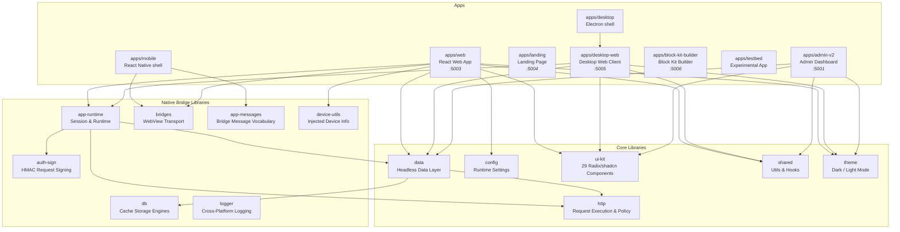

<p align="center">
  
</p>

<h1 align="center">DoU</h1>

<p align="center">
  <strong>A full-stack, cross-platform messaging & community app built with React, React Native, and Nx</strong>
</p>

<p align="center">
  
  
  
  
  
  
</p>

<p align="center">
  <a href="#getting-started">Getting Started</a> &nbsp;&middot;&nbsp;
  <a href="#architecture">Architecture</a> &nbsp;&middot;&nbsp;
  <a href="#contributing">Contributing</a>
</p>

---

## Overview

DoU is an Nx monorepo powering a real-time messaging and community platform across **8 applications** and **16 shared libraries** — web, mobile, desktop, and admin interfaces from a single codebase.

| App                   | Description                                              | Stack                              |
| --------------------- | -------------------------------------------------------- | ---------------------------------- |
| **Web**               | Main user-facing web app                                 | React 19 + Vite + Tailwind CSS     |
| **Admin V2**          | Admin dashboard                                          | React 19 + Vite + Tailwind CSS     |
| **Mobile**            | iOS & Android native app — WebView shell around Web      | React Native 0.83 + WebView bridge |
| **Landing**           | Marketing site, policy pages & invite-link bounce page   | React 19 + Vite                    |
| **Desktop**           | Electron shell around Desktop Web                        | Electron + electron-vite           |
| **Desktop Web**       | Web client rendered inside the Desktop Electron shell    | React 19 + Vite + Tailwind CSS     |
| **Block Kit Builder** | Visual editor for `@chatic/block-kit` message blocks     | React 19 + Vite + Tailwind CSS     |
| **Testbed**           | Experimental app for validating data/config/socket flows | React 19 + Vite + Tailwind CSS     |

<details>
<summary><strong>Table of Contents</strong></summary>

- [Overview](#overview)
- [Key Features](#key-features)
- [Tech Stack](#tech-stack)
- [Architecture](#architecture)
- [Getting Started](#getting-started)
- [Development](#development)
- [Building & Deployment](#building--deployment)
- [Mobile Development](#mobile-development)
- [Environment Variables](#environment-variables)
- [CI/CD](#cicd)
- [Code Quality](#code-quality)
- [Contributing](#contributing)
- [License](#license)

</details>

## Key Features

- **Real-time messaging** via WebSocket with optimistic updates
- **Multi-provider auth** — OAuth, Apple Sign-In, Google Sign-In
- **Push notifications** — Firebase Cloud Messaging (iOS & Android)
- **In-App Purchases** — iOS & Android subscription management
- **Places** — Location-based community features
- **Deep linking** — iOS Universal Links & Android App Links
- **Theming** — Dark / light mode with system preference detection
- **i18n** — Multi-language support with auto-detection
- **29 UI components** — Built on Radix UI primitives (shadcn/ui)

## Tech Stack

| Category         | Technology                             |
| ---------------- | -------------------------------------- |
| **Framework**    | React 19.2, React Native 0.83          |
| **Language**     | TypeScript 5.9 (strict mode)           |
| **Build**        | Vite 7, Metro, Nx 22                   |
| **Styling**      | Tailwind CSS 3.4, Radix UI (shadcn/ui) |
| **State**        | Zustand 5, TanStack Query 5            |
| **Routing**      | React Router 6, React Navigation 7     |
| **Forms**        | React Hook Form 7                      |
| **i18n**         | i18next 25                             |
| **Testing**      | Vitest 4, Jest 30, Testing Library     |
| **Code Quality** | ESLint 9, Prettier, Husky, Commitlint  |

## Architecture


```mermaid
graph TB
    subgraph Apps
        WEB["apps/web<br/>React Web App<br/><i>:5003</i>"]
        ADMINV2["apps/admin-v2<br/>Admin Dashboard<br/><i>:5001</i>"]
        LANDING["apps/landing<br/>Landing Page<br/><i>:5004</i>"]
        DESKWEB["apps/desktop-web<br/>Desktop Web Client<br/><i>:5005</i>"]
        BKB["apps/block-kit-builder<br/>Block Kit Builder<br/><i>:5006</i>"]
        TESTBED["apps/testbed<br/>Experimental App"]
        MOBILE["apps/mobile<br/>React Native shell"]
        DESKTOP["apps/desktop<br/>Electron shell"]
    end

    subgraph Core["Core Libraries"]
        DATA["data<br/>Headless Data Layer"]
        HTTP["http<br/>Request Execution & Policy"]
        CONFIG["config<br/>Runtime Settings"]
        UIKIT["ui-kit<br/>29 Radix/shadcn Components"]
        SHARED["shared<br/>Utils & Hooks"]
        THEME["theme<br/>Dark / Light Mode"]
    end

    subgraph Native["Native Bridge Libraries"]
        RUNTIME["app-runtime<br/>Session & Runtime"]
        BRIDGES["bridges<br/>WebView Transport"]
        APPMSG["app-messages<br/>Bridge Message Vocabulary"]
        DEVICE["device-utils<br/>Injected Device Info"]
        DB["db<br/>Cache Storage Engines"]
        LOGGER["logger<br/>Cross-Platform Logging"]
        AUTHSIGN["auth-sign<br/>HMAC Request Signing"]
    end

    MOBILE --> BRIDGES & APPMSG
    DESKTOP --> DESKWEB
    WEB --> DATA & UIKIT & SHARED & THEME & CONFIG
    WEB --> RUNTIME & BRIDGES & DEVICE
    DESKWEB --> DATA & UIKIT & SHARED & THEME & RUNTIME
    ADMINV2 --> DATA & UIKIT & SHARED & THEME
    RUNTIME --> DATA & HTTP & AUTHSIGN
    DATA --> DB & HTTP
```

### Project Structure

```
dou-app/
├── apps/
│   ├── web/                 # Main web application (port 5003)
│   ├── admin-v2/            # Admin dashboard (port 5001)
│   ├── landing/             # Marketing site & policy pages (port 5004)
│   ├── desktop-web/         # Web client for the Desktop shell (port 5005)
│   ├── block-kit-builder/   # Block Kit visual editor (port 5006)
│   ├── testbed/             # Experimental app for data/config/socket flows
│   ├── mobile/              # React Native app (iOS + Android)
│   │   ├── android/
│   │   ├── ios/
│   │   └── src/
│   └── desktop/             # Electron shell (hosts desktop-web)
├── libs/
│   ├── data/                # Headless data layer (models, cache, repositories)
│   ├── db/                  # Cache storage engines (IndexedDB / native SQLite)
│   ├── http/                # Request execution, retry & logging policy
│   ├── config/              # Runtime settings facade
│   ├── app-runtime/         # Session, sockets, repositories, sync runtimes
│   ├── bridges/             # WebView transport between web and native shell
│   ├── app-messages/        # Bridge message vocabulary (web <-> native)
│   ├── device-utils/        # Injected device info, reader hooks
│   ├── auth-sign/           # Lemon HMAC request signing
│   ├── logger/              # Cross-platform logging core
│   ├── policy-content/      # Legal text (terms, privacy, child safety)
│   ├── block-kit/           # Message block model consumed by block-kit-builder
│   ├── ui-kit/              # Generic UI components (shadcn/ui)
│   ├── web-ui-kit/          # Mobile-web design system components
│   ├── shared/              # Common utilities and hooks
│   └── theme/               # Theme provider (dark/light)
├── assets/                  # Shared images, logos, icons
├── scripts/                 # Build and deployment scripts
├── docs/                    # ADRs (docs/adr/) and infra config (docs/infra/)
└── .github/workflows/       # CI/CD pipelines
```

### State Management Pattern

- **Server state** — TanStack Query for caching, background refetching, and optimistic updates
- **Client state** — Zustand stores for auth, theme, device info, and UI state
- **Local state** — React `useState` / `useReducer` for component-scoped data

### Mobile Architecture

The mobile app uses a **WebView + Native Bridge** pattern:

1. React Native shell provides native capabilities (push notifications, IAP, contacts, camera)
2. Web app runs inside a WebView
3. A bridge layer enables bidirectional communication between native and web

### Shared Library System

All apps share code through `@chatic/*` path aliases:

```typescript
import { runtime } from '@chatic/app-runtime';
import { Button } from '@chatic/ui-kit';
import { config } from '@chatic/config';
import { ThemeProvider } from '@chatic/theme';
```

Before editing a lib, read its own `README.md` — each one documents what it owns and, where a
decision's reasoning matters, links back to the ADR that made it (see [`docs/adr/`](docs/adr/)).

## Getting Started

### Prerequisites

| Tool               | Version  | Notes                                       |
| ------------------ | -------- | ------------------------------------------- |
| **Node.js**        | v22.15.1 | Use `nvm use` — `.nvmrc` is included        |
| **Yarn**           | 1.x      | Classic Yarn                                |
| **Xcode**          | Latest   | For iOS development                         |
| **Android Studio** | Latest   | For Android development                     |
| **CocoaPods**      | Latest   | For iOS dependencies                        |
| **Ruby**           | 3.2.9    | For CocoaPods — `.ruby-version` is included |

### Installation

```bash
# Clone the repository
git clone https://github.com/lemoncloud-io/dou-app.git
cd dou-app

# Use the correct Node version
nvm use

# Install dependencies
yarn install
```

### Environment Setup

Full checklist — which `.env` files, Firebase config, and (for release builds only) signing
credentials a fresh checkout needs — lives in **[ONBOARDING.md](./ONBOARDING.md)**.

> [!WARNING]
> Environment files (`.env`) must exist before building. The app will not start without them.

## Development

```bash
# Web app
yarn web:start                # http://localhost:5003

# Admin dashboard
yarn admin-v2:start           # http://localhost:5001

# Landing page
yarn landing:start            # http://localhost:5004

# Desktop web client (served standalone, or hosted by the Desktop shell)
yarn desktop-web:start        # http://localhost:5005

# Block Kit Builder
yarn block-kit-builder:start  # http://localhost:5006

# Testbed (experimental app)
yarn testbed:start

# Desktop — Electron shell + its web client, in one command
yarn desktop:start            # deployed desktop-web build
yarn desktop:start:local      # local desktop-web dev server

# Mobile — Local run: web dev server + Metro + the app, in one command
yarn mobile:ios:local         # iOS Simulator, WebView -> http://localhost:5003
yarn mobile:android:local     # Android Emulator, same address via `adb reverse`

# Mobile — Start Metro bundler only
yarn mobile:start

# Mobile — Run against the deployed web (dev/prod)
yarn mobile:ios:dev           # iOS Simulator
yarn mobile:android:dev       # Android Emulator
```

> [!NOTE]
> `mobile:*:local` needs `apps/mobile/.env` (the LOCAL env — same meaning as in web). Copy it once
> with `cp apps/mobile/.env.example apps/mobile/.env`. See
> [apps/mobile/docs/release/local-run.md](apps/mobile/docs/release/local-run.md).

> [!TIP]
> Run `npx nx graph` to visualize the dependency graph of all apps and libraries.

## Building & Deployment

### Build

```bash
# Build individual apps
yarn web:build:dev              # Development build
yarn web:build:prod             # Production build
yarn admin-v2:build:dev
yarn admin-v2:build:prod
yarn landing:build:dev
yarn landing:build:prod
yarn desktop-web:build:dev
yarn desktop-web:build:prod
yarn block-kit-builder:build:dev
yarn block-kit-builder:build:prod
yarn desktop:build               # Electron shell

# Build all apps at once
yarn build:all:dev
yarn build:all:prod
```

### Deploy

Deployment uses AWS S3 + CloudFront. Required environment variables:

| Variable                         | Description                       |
| -------------------------------- | --------------------------------- |
| `DEPLOY_BUCKET_NAME`             | S3 bucket name                    |
| `DEPLOY_DEV_CF_DISTRIBUTION_ID`  | CloudFront distribution ID (dev)  |
| `DEPLOY_PROD_CF_DISTRIBUTION_ID` | CloudFront distribution ID (prod) |

```bash
yarn web:deploy:dev              # Deploy web to dev
yarn web:deploy:prod             # Deploy web to prod
yarn admin-v2:deploy:dev
yarn admin-v2:deploy:prod
yarn landing:deploy:dev
yarn landing:deploy:prod
yarn desktop-web:deploy:dev
yarn desktop-web:deploy:prod
yarn block-kit-builder:deploy:dev
yarn block-kit-builder:deploy:prod

# Desktop is packaged, not deployed to S3/CloudFront
yarn desktop:package:mac:dev
yarn desktop:package:mac:prod:signed
yarn desktop:package:win:dev
yarn desktop:package:win:prod
```

> [!IMPORTANT]
> `desktop-web` only deploys automatically on push to `develop`/`main` — `force-deploy.yml` (manual
> redeploy/rollback) covers Web, Admin V2 and Landing only. The Desktop Electron shell loads
> `desktop-web` from a remote URL at runtime, so a `desktop-web` deploy reaches every running Desktop
> user immediately, and the only way back is a revert commit pushed through the same pipeline.

## Mobile Development

<details>
<summary><strong>iOS Commands</strong></summary>

| Command                               | Description                          |
| ------------------------------------- | ------------------------------------ |
| `yarn mobile:pod`                     | Install CocoaPods dependencies       |
| `yarn mobile:ios:local`               | Local run against the web dev server |
| `yarn mobile:ios:dev`                 | Run dev build on iPhone Simulator    |
| `yarn mobile:ios:prod`                | Run prod build on iPhone Simulator   |
| `yarn mobile:ios:dev:device`          | Run dev build on physical device     |
| `yarn mobile:ios:dev:release`         | Release dev build on Simulator       |
| `yarn mobile:ios:dev:release:device`  | Release dev build on device          |
| `yarn mobile:ios:prod:release`        | Release prod build on Simulator      |
| `yarn mobile:ios:prod:release:device` | Release prod build on device         |
| `yarn mobile:ios:clean`               | Clean iOS build artifacts            |

</details>

<details>
<summary><strong>Android Commands</strong></summary>

| Command                              | Description                          |
| ------------------------------------ | ------------------------------------ |
| `yarn mobile:android:local`          | Local run against the web dev server |
| `yarn mobile:android:dev`            | Run dev build on emulator            |
| `yarn mobile:android:prod`           | Run prod build on emulator           |
| `yarn mobile:android:build:apk:dev`  | Build dev APK                        |
| `yarn mobile:android:build:apk:prod` | Build prod APK                       |
| `yarn mobile:android:build:aab:dev`  | Build dev AAB (Play Store)           |
| `yarn mobile:android:build:aab:prod` | Build prod AAB (Play Store)          |
| `yarn mobile:android:install:dev`    | Install dev APK via ADB              |
| `yarn mobile:android:install:prod`   | Install prod APK via ADB             |
| `yarn mobile:android:clean`          | Clean Android build artifacts        |

</details>

### Mobile Platform Support

| Platform    | Min Version          | Target              |
| ----------- | -------------------- | ------------------- |
| **Android** | SDK 24 (Android 7.0) | SDK 36 (Android 15) |
| **iOS**     | See Xcode project    | Latest              |

## Environment Variables

<details>
<summary><strong>Web</strong> (<code>apps/web/.env</code>)</summary>

| Variable                     | Description                          |
| ---------------------------- | ------------------------------------ |
| `VITE_ENV`                   | Environment (`LOCAL`, `DEV`, `PROD`) |
| `VITE_PROJECT`               | Project identifier                   |
| `VITE_HOST`                  | App host URL                         |
| `VITE_OAUTH_ENDPOINT`        | OAuth API endpoint                   |
| `VITE_SOCIAL_OAUTH_ENDPOINT` | Social OAuth endpoint                |
| `VITE_IMAGE_API_ENDPOINT`    | Image API endpoint                   |
| `VITE_BACKEND_ENDPOINT`      | Backend API endpoint                 |
| `VITE_WS_ENDPOINT`           | WebSocket endpoint                   |
| `VITE_DOU_ENDPOINT`          | DoU API endpoint                     |
| `VITE_SOC_ENDPOINT`          | Social API endpoint                  |

</details>

<details>
<summary><strong>Admin V2</strong> (<code>apps/admin-v2/.env</code>)</summary>

| Variable                     | Description                          |
| ---------------------------- | ------------------------------------ |
| `VITE_ENV`                   | Environment (`LOCAL`, `DEV`, `PROD`) |
| `VITE_PROJECT`               | Project identifier                   |
| `VITE_HOST`                  | App host URL                         |
| `VITE_OAUTH_ENDPOINT`        | OAuth API endpoint                   |
| `VITE_SOCIAL_OAUTH_ENDPOINT` | Social OAuth endpoint                |
| `VITE_IMAGE_API_ENDPOINT`    | Image API endpoint                   |
| `VITE_BACKEND_ENDPOINT`      | Backend API endpoint                 |
| `VITE_WS_ENDPOINT`           | WebSocket endpoint                   |
| `VITE_DOU_ENDPOINT`          | DoU API endpoint                     |
| `VITE_FRONT_ENDPOINT`        | Frontend URL for cross-linking       |
| `VITE_FIREBASE_*`            | Firebase web config (7 keys)         |

</details>

<details>
<summary><strong>Desktop Web / Testbed / Block Kit Builder</strong></summary>

Same shape as Web's `VITE_*` variables (`apps/desktop-web/.env`, `apps/testbed/.env`,
`apps/block-kit-builder/.env` — each has its own `.env.example`). `desktop-web` additionally reads
`VITE_SOC_ENDPOINT`, `VITE_IAP_ENDPOINT` and `VITE_DEBUG_CODE`; `testbed` mirrors Admin V2's
`VITE_FRONT_ENDPOINT` for cross-linking.

</details>

<details>
<summary><strong>Mobile</strong> (<code>apps/mobile/.env</code>)</summary>

`.env` is the LOCAL env, `.env.dev` / `.env.prod` are the built ones — the same split web uses.
Which file a build reads is decided by the build configuration (iOS `ENVFILE` build setting,
Android `envConfigFiles`), not by the script. See
[apps/mobile/docs/release/local-run.md](apps/mobile/docs/release/local-run.md).

| Variable                              | Description                          |
| ------------------------------------- | ------------------------------------ |
| `VITE_ENV`                            | Environment (`LOCAL`, `DEV`, `PROD`) |
| `VITE_WEBVIEW_BASE_URL`               | WebView base URL                     |
| `VITE_WS_ENDPOINT`                    | Unused — no code reads it            |
| `VITE_SUBSCRIPTION_IAP_SKUS_IOS`      | iOS IAP product SKUs                 |
| `VITE_SUBSCRIPTION_IAP_SKUS_ANDROID`  | Android IAP product SKUs             |
| `VITE_SUBSCRIPTION_IAP_PLANS_ANDROID` | Android IAP plan IDs                 |
| `VIEW_APP_NAME`                       | Display app name                     |
| `VITE_GOOGLE_WEB_CLIENT_ID`           | Google OAuth web client ID           |
| `ANDROID_KEYSTORE_FILE`               | Android keystore file path           |
| `ANDROID_KEYSTORE_PASSWORD`           | Android keystore password            |
| `ANDROID_KEY_ALIAS`                   | Android key alias                    |
| `ANDROID_KEY_PASSWORD`                | Android key password                 |

</details>

## CI/CD

| Workflow                | Trigger                          | Description                                                                                                                                    |
| ----------------------- | -------------------------------- | ---------------------------------------------------------------------------------------------------------------------------------------------- |
| `verify.yml`            | Pull requests, push to `develop` | Doc links, lint, typecheck & test — only the projects listed as covered; excluded projects are named at the bottom of the file with the reason |
| `deploy-dev.yml`        | Push to `develop`                | Auto-detect changed apps, build & deploy to dev                                                                                                |
| `deploy-prod.yml`       | Push to `main`                   | Build, deploy to prod & create a GitHub release                                                                                                |
| `force-deploy.yml`      | Manual dispatch                  | Force (re)deploy Web / Admin V2 / Landing to dev or prod — no other app                                                                        |
| `build-desktop.yml`     | Manual dispatch                  | Build unsigned macOS `.dmg` + Windows `.exe` installers, publish to a rolling `desktop-dev` / `desktop-prod` GitHub Release                    |
| `build-desktop-win.yml` | Manual dispatch                  | Windows-only variant of the above                                                                                                              |

`deploy-dev`/`deploy-prod` auto-detect which apps changed and only build/deploy the affected ones —
this is the only path that ships `desktop-web` (see the note in
[Building & Deployment](#building--deployment)). `verify.yml` was added later than the rest; before
it, nothing in CI ran a type check or a test.

## Code Quality

```bash
# Lint
yarn lint                   # Check for issues
yarn lint:fix               # Auto-fix issues
yarn check:undefined-names  # Fail on TS2304 — a name used but never imported; run after moving symbols
yarn check:doc-links        # Fail on a dead markdown link, or an ADR link whose label and target disagree

# Format
yarn prettier               # Format all files
yarn prettier:staged        # Format staged files only

# Test
npx nx test web             # Test specific project
npx nx test                 # Run all tests
yarn desktop:test:sandbox   # Electron preload under sandbox — run when touching apps/desktop/src/preload

# Cache
yarn clean:cache            # Clear Vite/Nx caches
```

Pre-commit hooks (via Husky) automatically run linting and formatting on staged files. Commit messages are enforced with [Conventional Commits](https://www.conventionalcommits.org/) via Commitlint.

`yarn check:undefined-names` is deliberately outside those hooks — it type-checks every buildable
project (an app or lib with a `tsconfig.app.json`/`tsconfig.lib.json`, 23 today) and takes about 20
seconds, which is too slow per commit. Run it yourself after any
change that moves or extracts a symbol. It catches what nothing else here can: ESLint disables
`no-undef` on TypeScript files, Vite strips types without resolving free identifiers, and a test
only sees the error if something renders that line. Pass a project name to narrow it
(`yarn check:undefined-names desktop-web`).

## Contributing

1. Fork the repository
2. Create your feature branch (`git checkout -b feature/amazing-feature`)
3. Commit your changes using [Conventional Commits](https://www.conventionalcommits.org/) (`git commit -m 'feat: add amazing feature'`)
4. Push to the branch (`git push origin feature/amazing-feature`)
5. Open a Pull Request

## License

This project is licensed under the Apache License 2.0. See the [LICENSE](LICENSE) file for details.
