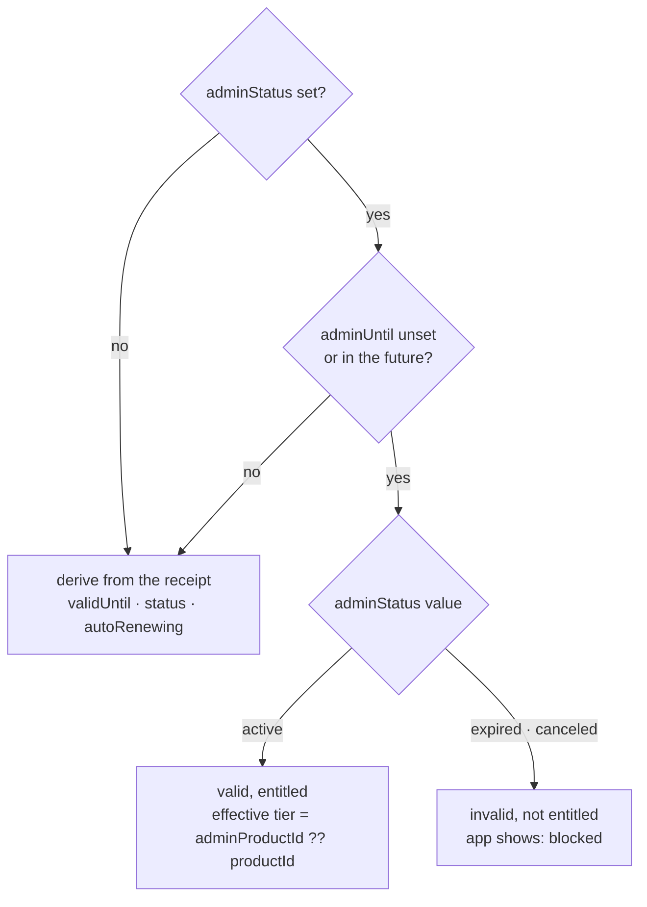

# memberships

**Where an operator grants, blocks, or clears a subscription override for CS or policy reasons.**
Before this screen existed, the only way to do any of this was to call the backend directly. It does
three things in one place: **view** a membership, **override** its period/status/tier separately
from the store receipt (grant, block, clear), and **confirm** how that override landed on the user's
clouds. The server contract this screen consumes is canonical in the backend repo's own spec; this
document only covers how the console uses it. Feature code:
`apps/admin-v2/src/app/features/memberships/`.

## Design principles

- **Admin reads never enter the local cache.** Every row here belongs to someone else's account.
  `CloudRepository`'s domain mapping resolves ownership relative to _the viewer's own session_
  (`toDomainCloud`/`resolveCloudType` in
  [`CloudHttpDataSource.ts`](../../../../libs/data/src/remote/http-data-sources/CloudHttpDataSource.ts)) —
  running someone else's cloud through it would misclassify silently. So the admin surface attaches
  only to the subscription lane, which has no local data source at all.
- **Views pass through unchanged**, matching the subscription lane's existing convention: no domain
  model exists for this axis yet, so nothing is built for one screen. A value like `aggr` that the
  domain mapping would otherwise drop rides through as-is.
- **A value the caller must not choose is pinned at the gateway**, not left to the caller to get
  right — following the existing precedent of `CloudHttpGateway.list` pinning `view: 'mine'`. The
  admin cloud query gets its own method with `view: 'admin'` pinned, rather than loosening `list`:
  the two queries differ in both permission and audience.
- **Override-derivation logic exists in exactly one place.** Whether an override is active is a
  server contract; the console and the app implementing it separately is how they drift. Both sides
  call the same pure function.
- **Irreversible actions get a confirmation dialog that states what changes**, not just "are you
  sure" — a block stops a cloud, `auto` creates one. These are real state changes, not display.
- **Which gate is real is stated explicitly, not assumed.** The two membership endpoints are
  enforced server-side by `hasAdminRole`. **The cloud list endpoint is not** — see
  [Known gap](#known-gap-the-cloud-list-endpoint-has-no-server-side-admin-check) below. The
  console's `ProtectedRoute` is a real layer for the first two and the _only_ gate in the whole stack
  for the third — and a client-side gate is not a gate.
- **What the server stores and what the app currently sees are shown as different things when they
  disagree.** An operator using this console is here to see the truth; a stored `status` that has
  drifted from live validity is surfaced as a mismatch, not hidden behind one field.

## Scope

**In:** the `/memberships` list (filtered by `status`/`productId`/`platform`/`userId`, server-side
pagination); a detail drawer with the raw membership fields, override state (who/when/why), and that
user's cloud list; an override form for grant/block/clear; four safeguards (reason required,
confirmation dialog, `auto` off by default, a badge naming the target server); and a matching change
to `apps/web`'s own subscription-status derivation so the app agrees with what the console did.

**Out:** cancelling a subscription (no backend endpoint yet); showing a user's name or email (not in
the membership response — `userId` is the only identifier available); stage resolution logic (the
gateway resolves one relay endpoint; the console only displays the result); override history beyond
the single most recent entry (the server keeps only one); physically removing the legacy `isSuper`
field (backend's call).

## Override derivation

The same rule apps/web and this console both call:



The active check takes `now` as an explicit argument — the server contract states outright that
omitting it and defaulting to `0` reads an already-expired override as active, and the same trap
exists here.

`apps/web`'s subscription state gains a fifth value, `blocked`, alongside `none`/`active`/
`cancelScheduled`/`expired`, and derives it straight from the raw override fields — never from the
stored `status`, which is only re-derived on write and can still read `active` after the grant that
set it has quietly expired. `isValid` from the server is still not trusted, for the same
already-established reason: it cuts the cancel-scheduled window wrong. `blocked` is worded distinctly
from `expired` in the UI because **billing keeps charging while blocked** — the two are not the same
failure to a user reading the screen.

## Known gap: the cloud list endpoint has no server-side admin check

Found during review, 2026-09-10, unresolved — recorded here because the drawer's cloud panel sits
directly on top of it. `GET /clouds/0/list` enforces nothing: the backend computes `hasAdmin` and
never uses it for authorization, and ownership scoping exists only inside the `view === 'mine'`
branch, which itself reads the request's `userId` ahead of the session's. **Any signed-in user can
read anyone else's cloud list** by passing `?userId=<target>`, and the response carries `ownerId`,
`email`, `accountId` and `subscriptionId`. This branch didn't create the hole, but it is the first
thing built on top of it. The fix belongs to the backend repo — an admin-role check on `view ===
'admin'`, and session scoping on the non-`'mine'` path too.

## Behavior notes

- **Unlimited means omitting `adminUntil`**, not writing a far-future date.
- **Clearing an override sends `adminStatus: ''`**; the server clears `adminUntil` and
  `adminProductId` alongside it, and the who/when/why stamp of the override that was active stays on
  the record.
- **A grant that includes a tier bump can also queue cloud creation.** With `auto` on (off by
  default), the server queues `POST /clouds/{userId}/make` for however many clouds the new limit adds
  beyond what the user already has; with `auto` off, only the limit changes.
- **Blocking does not stop billing.** The confirmation copy for a block always says so.
- **The mutation writes the response into the detail cache before invalidating the list**, in that
  order — the list is an ES-backed search, and a refetch immediately after a write can still return
  the pre-write value.
- **Empty-string filters are never sent** — a present-but-empty key still matches server-side, unlike
  an absent one.
- **The admin cloud query is targeted by `ownerId`, not `userId`.** The server's `userId` parameter
  only applies inside the `view=mine` branch; the admin filter is `CloudModel.ownerId`.
- **`GET /clouds/0/list` for admin fixes `valid: 0`**, the opposite of the ordinary default (`1`) —
  an operator needs to see expired clouds too, which the default view would otherwise drop.
- **Checking the residual `isSuper` field is a required step before removing the read for it in
  `apps/web`.** Filter the list by `isSuper=1`; every row returned needs an active override before
  that removal ships, or that user loses entitlement the moment the read is gone.

## Verifying

```bash
npx nx test http data shared admin-v2 web
npx nx run-many --target=lint --projects=web,admin-v2,@chatic/shared,@chatic/http,@chatic/data
npx tsc -b apps/admin-v2/tsconfig.app.json apps/web/tsconfig.app.json
npx tsc -b libs/{http,data,shared}/tsconfig.lib.json
```

Typecheck needs the **build** invocation (`tsc -b`), not `--noEmit` — a referenced lib without a
built `dist/*.d.ts` throws a wall of TS6305 that is a missing build, not a real error.

What the suite actually has to cover, beyond the obvious CRUD path: a caller-supplied `view`/`valid`
never overrides the pinned gateway values; the three override-form modes reject a missing reason, a
past `adminUntil`, and a tier on a block; the confirmation copy states that billing continues on a
block; `blocked` is rejected as `notEntitled` by the quota check (a new status is an easy place to
fall through a default branch); and a granted user's store purchase path reads `hasLiveReceipt` as
false — that value decides `replaceablePlan` and Google's `oldPlanId`, and reading entitlement
instead would offer a tier the user never actually bought as the one being replaced.

**Manually, before the first production query:** confirm `?view=admin&ownerId=` actually scopes to
that one user's clouds — the code path was traced but not exercised live — and confirm the `aggr`
bucket key really is `status` (a different key still works, since `readAggrBuckets` reads buckets by
shape, but the label would read wrong).
