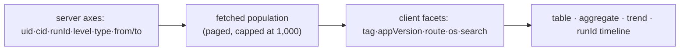

# report-logs

**A tracing console over three record kinds sharing one storage: user reports (`reportIssue` →
`/hello/report`), app-uploaded structured logs (`/hello/report-bulk`), and what the automatic error
reporter (`reportError`, retired 2026-09) left behind.** This is the single entry point for tracing a
product failure. All three land in one store (`/mocks/0/list`), and log entries share `stereo='log'`
with the retired error reports — this screen carries the responsibility of telling them apart.
Feature code: `apps/admin-v2/src/app/features/report-logs/`.

**What this replaced:** the screen used to only browse — search worked inside whatever 100-row page
had already loaded, so finding one user's logs inside ~7.7k total records was not possible. This
console makes four things possible instead: tracing one user's failure (narrow by uid, reconstruct
their logs in order), watching for errors live, cross-referencing an incoming report against that
user's logs at that moment, and comparing error distribution across a release.

## Design principles

- **The screen states plainly which axes the server can filter and which it can't**, rather than
  quietly slicing on the client and calling it a filter. See [server boundary](#server-filter-boundary).
- **The three axes that make tracing possible — `uid`, `cid`, `runId` — are promoted to server
  filters.** Clicking one onto a "pin" is the screen's central action; everything else narrows a
  population already fetched.
- **The working population is fetched explicitly, with its boundary always visible.** This is not
  search-that-pretends-to-cover-everything: the server narrows by date range first, pages accumulate
  up to a cap, and hitting the cap tells the operator to narrow the range rather than silently
  truncating.
- **The screen doesn't shift under an operator mid-analysis.** New logs arrive as a banner, not an
  automatic re-render; when they get folded in is the operator's call.
- **Occurrence order is preserved despite batched arrival.** Uploads land in batches, so `createdAt`
  (when a batch was received) clumps. Every ordering, timeline and trend in this screen sorts by
  `timestamp` (when the entry actually happened) instead.
- **Parsing binds defensively to the storage format.** A record's payload can live in `meta` (object
  or string) or in `SlackReportBody.message`; `parseReportLog` checks both and falls back to the raw
  JSON on failure — a parse failure never drops a row, only degrades its rendering.
- **Filter state lives in the URL.** A refresh or a shared link has to reproduce the exact same
  trace, following the `useSearchParams` convention `MembershipsPage` already established.

## Server filter boundary

`GET /mocks/0/list` only ever reaches the fields `saveLogEntry` copies to the top of the document;
everything else lives inside `meta` and is invisible to the query.

| Axis                                                                  | Server-filterable | Note                                                       |
| --------------------------------------------------------------------- | ----------------- | ---------------------------------------------------------- |
| `uid`, `sid`                                                          | yes               | handled specially by the backend's search-param packer     |
| `cid`, `runId`, `level`                                               | yes               | copied to the top of the stored record                     |
| `type` (`stereo`)                                                     | yes               | added directly as an ES term filter                        |
| `from`/`to`                                                           | yes               | a `createdAt` range, day boundaries in KST, `to` inclusive |
| `page`/`limit`/`offset`                                               | yes               |                                                            |
| `sort`                                                                | **never sent**    | see the trap below                                         |
| `tag`, `route`, `appVersion`, `webVersion`, `os`, `source`, `message` | no                | only inside the `meta` JSON — client-only                  |
| aggregation                                                           | no                | the backend's query builder pins `aggregation: 'stereo'`   |

**The sort trap:** omitting `sort` gets the default, `createdAt desc`. Sending `sort=createdAt` alone
does **not** mean "the same, but explicit" — it flips the order to ascending, because the backend
treats an unpaired sort field as `asc`. This client deliberately never sends `sort` at all.

## Fetching the working population

Paging logic lives in `lib/corpusPaging.ts`, separated from the fetch loop itself (which is
ordinary `react-query`) because the two behaviors worth pinning down are the stop condition and
deduplication:

- **Stop conditions**, checked in order: a short page (the server _returned_ fewer rows than the page
  size — trusting the returned count, not a possibly-stale `total`, is what stops an infinite walk
  when the underlying set shrank mid-walk and a page full of duplicates would otherwise read as "not
  done yet"); the cap; or `distinct >= total`.
- **500 rows per page, capped at 1,000.** The page size exists to bound the tail risk of a handful of
  screenshot-carrying report records landing in one response (a page of reports can run several MB).
  At the 1,000 cap, a full collection costs **two round trips** by default, or one when the server's
  `total` already fits in a page — which is what a screen left open all day, refetching on every
  filter change, can reasonably spend. A bigger population makes tag/version counts more accurate at
  the cost of more requests, memory and first-paint time; either way the counts are scoped to the
  fetched population and the screen says so, so the answer to "not enough" is always a narrower date
  range, not a bigger cap.
- `from = limit * page`, so the deepest possible request is `from=500` — comfortably inside
  Elasticsearch's default `max_result_window` (10,000). Pinned by a test.

## Occurrence-time handling

`lib/eventTime.ts` defines `eventAt(row) = row.timestamp ?? row.createdAt` and an ingest-lag
calculation that badges a row once the gap between the two crosses a threshold (60s by default).
Because the server's date-range filter is on `createdAt`, not `eventAt`, rows can leak in or out
right at a range boundary — this function is the one place that fact is computed, and the screen
surfaces it rather than hiding the discrepancy.

## Two filter tiers, one population



`level` is counted as a facet for display but filtered server-side — it is deliberately excluded
from the "clear client filters" action, because including it there would also clear a server axis
and force a full 1,000-row re-fetch for what looked like a client-only reset.

## State ownership

| State                               | Owner                   | Persisted in                                |
| ----------------------------------- | ----------------------- | ------------------------------------------- |
| Server-axis filters + pins          | `use-log-console-state` | URL query                                   |
| Client-axis filters + view mode     | `use-log-console-state` | URL query                                   |
| Fetched population (rows, progress) | `use-log-corpus`        | memory, discarded on any server-axis change |
| New-log count                       | `use-new-log-probe`     | memory                                      |
| Selected row                        | `ReportLogsPage`        | memory                                      |
| Resolved stack trace                | `StackSection`          | memory                                      |

## Known unknown: does a report record carry `uid`?

Unconfirmed against live data. Reading the backend's report-creation path, it appears a Slack report
is written without a `uid` field at all — if so, a `uid` pin narrows batched log entries but does not
pull in that same user's own reports. The screen is built to stay honest about this either way: when
a `uid` pin is active and the type filter includes reports, it shows a caveat that report records
carry no `uid` axis and won't match the pin. If live data later confirms `uid` is in fact present,
only that caveat needs to come out — `parseReportLog` already reads `mock.uid` as a fallback, so no
code change would be needed.

## Verifying

```bash
npx vitest run --root apps/admin-v2 src/app/features/report-logs
```

Coverage worth calling out specifically: the corpus-paging stop conditions (short page, cap, distinct
== total, a full page of only duplicates does **not** stop the walk, the two-round-trip default
path); occurrence-time fallback and clamping against a device clock running ahead; facet
count-then-alphabetical ordering so a tie doesn't reorder as pages arrive; URL round-tripping of
filters and pins including out-of-range values; and, only visible at the assembled-page level, that a
server-axis change re-fetches while a client-axis change does **not**.

Request-count is a designed property of this screen and is pinned by tests:

| Situation                                            | Requests                                                         |
| ---------------------------------------------------- | ---------------------------------------------------------------- |
| Server axes already narrow the result to one page    | 1                                                                |
| Full collection up to the 1,000 cap                  | 2                                                                |
| Intermediate values while typing a date              | 0                                                                |
| A previously-seen axis combination, within cache TTL | 0                                                                |
| Same, but past TTL                                   | shows cached rows immediately, then re-fetches in the background |
| Background-tab new-log probe                         | 0                                                                |

**Still to confirm against real data** (the screen sits behind the admin OAuth gate, so none of this
is checkable without a live login): how often a real day's log volume hits the 1,000-row cap, and
whether that means narrowing the default range or raising the cap; memory and response size after
switching axes repeatedly within `gcTime` (react-query has no row-count cap, only a time-based one);
the `uid`-on-reports question above; the three-column-to-overlay layout transition around 1024–1280px
(untestable in `jsdom`, which has no CSS); and focus handling when the detail panel is an overlay
(narrower than `xl`) and gets dismissed.
