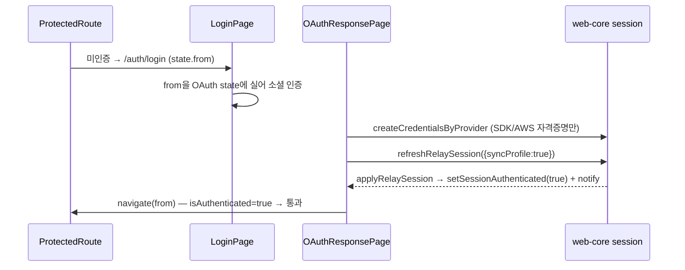
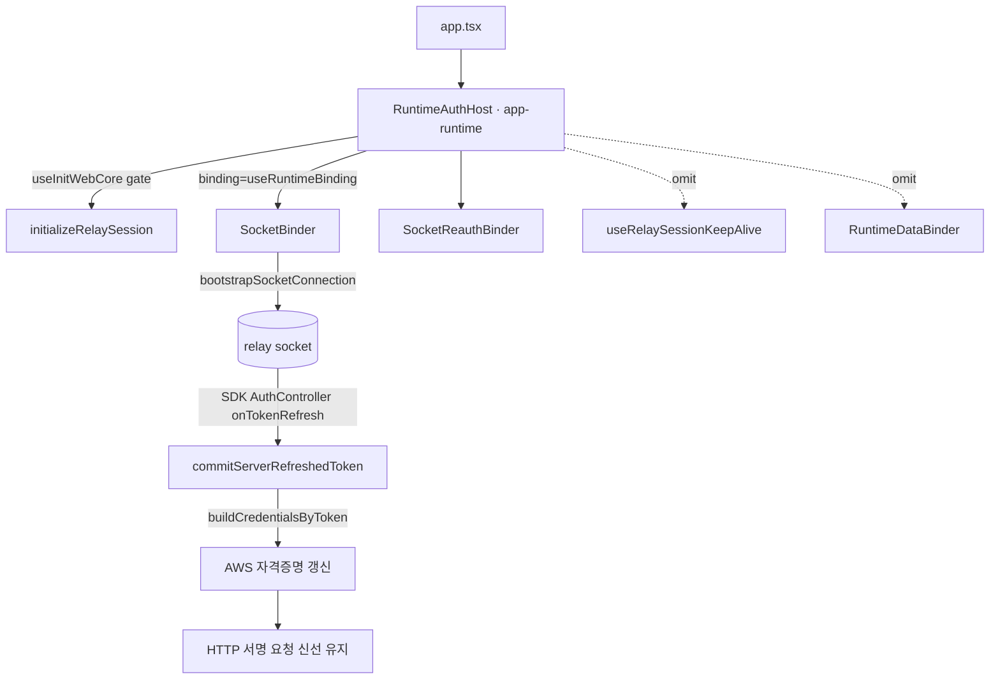

# Auth & Session — 로그인 하이드레이션 · 토큰 리프레시

> 상태: Approved · 최종 갱신: 2026-07-23 · 관련 ADR: [ADR-0028](../../../../../docs/adr/0028-admin-v2-auth-refresh-and-log-analysis.md)

## 목적

admin-v2가 (1) 소셜 로그인 후 세션 인증 상태를 올바르게 하이드레이트해 리다이렉트가 정상
동작하게 하고, (2) 만료되는 토큰을 자동 리프레시해 대시보드를 오래 열어둬도 강제 로그아웃되지
않게 한다. admin-v2는 지금까지 app-runtime을 붙이지 않아 리프레시 경로가 전혀 없었다.

## 설계 원칙

- **세션 인증 상태는 web-core setter/notify로만 바뀐다.** `isAuthenticated`는 `useSyncExternalStore`
  로 관측되며, `setSessionAuthenticated`/`applyRelaySession` 등이 `notifySessionStateChanged()`를
  부를 때만 반영된다. 자격증명(SDK/AWS) 생성만으로는 안 켜진다 — 로그인 경로는 반드시 relay 세션
  적용까지 해야 한다.
- **admin은 실제 로그인만 허용한다.** 게스트 자동 로그인(`useRelaySessionKeepAlive`)은 켜지 않는다
  — ProtectedRoute의 "관리자 인증" 모델과 충돌하기 때문.
- **리프레시는 SDK AuthController가 소유한다.** 삭제된 `useTokenRefresh`(60초 폴링 훅)를 재생성하지
  않는다. 소켓 auth 루프의 리프레시 결과를 web-core로 write-back해 HTTP 서명 자격증명까지 신선하게
  유지한다.
- **app-runtime은 순수 추가로만 확장한다.** 기존 `RuntimeConnectionHost` 동작을 바꾸지 않고, 인증
  전용 호스트를 새로 export해 web/testbed/desktop에 영향 없이 재사용 가능하게 한다.

## 범위

**포함**

- OAuth 콜백 하이드레이션 수정(리다이렉트 버그).
- app-runtime에 인증 전용 호스트 `RuntimeAuthHost` 추가 + admin-v2 채택으로 자동 토큰 리프레시.
- admin-v2 부팅을 `RuntimeAuthHost` 단일 경로로 통합(수동 `startWebCoreInit` 이중부팅 제거).

**제외**

- 로그 분석 확장(socket-lab 연동/시계열/편의) — ADR-0028 결정 C, report-logs 문서 개정으로 별도 진행.
- 클라우드/플레이스 세션, 채팅 데이터 동기화(`RuntimeDataBinder`/`useChatSync` 등) — admin-v2 불필요.

## 시나리오

**로그인 하이드레이션**

1. 미인증 사용자가 보호 경로 접근 → ProtectedRoute가 `/auth/login`으로(원 경로를 `state.from`에 보존).
2. LoginPage가 `from`을 OAuth `state`에 실어 소셜 인증으로 리다이렉트.
3. 콜백(`/auth/oauth-response`)에서 `createCredentialsByProvider(provider, code)`로 SDK/AWS 자격증명
   생성 후, **`refreshRelaySession({ syncProfile: true })`** 호출 → `applyRelaySession`이
   relay 토큰 저장 + `setSessionAuthenticated(true)` + notify.
4. `isAuthenticated`가 true가 된 상태로 `navigate(from)` → 대상 ProtectedRoute 통과(더 이상 바운스 없음).

**토큰 리프레시**

1. 로그인 후 `RuntimeAuthHost`가 relay 소켓을 연결(자격증명·deviceId·relay wss·identityToken이
   갖춰지면). SDK `AuthController`(refreshRatio 0.8, 5분 폴백)가 붙는다.
2. 토큰 만료 임박 시 SDK가 리프레시 → `onTokenRefresh` → delegate `commitRefreshedToken`
   → `commitServerRefreshedToken`이 relay 토큰 재저장 + `buildCredentialsByToken`으로 AWS 자격
   증명 재빌드 + 신원 재구성.
3. 이후 HTTP 서명 요청(리포트 조회 등)이 신선한 자격증명으로 서명되어 만료 로그아웃이 발생하지 않는다.

## 다이어그램

## 상세 구현

**app-runtime — 인증 전용 호스트 신규 추가**

- **`libs/app-runtime/src/connection/RuntimeAuthHost.tsx`** (신규) — `RuntimeConnectionHost`
  ([RuntimeConnectionHost.tsx:23](../../../../../libs/app-runtime/src/connection/RuntimeConnectionHost.tsx))를
  본떠 `useInitWebCore` 게이트 + `useSocketSessionDelegate` + `SocketBinder` + `SocketReauthBinder`만
  마운트. **`useRelaySessionKeepAlive`와 `RuntimeDataBinder`는 마운트하지 않는다.** `binding`은
  `useRuntimeBinding()`(클라우드 미선택 시 relay 슬롯만; 채팅 동기화 미포함)로 받는다.
- **`libs/app-runtime/src/index.ts`** — `RuntimeAuthHost`를 public export에 추가(순수 추가).
  SocketBinder/Reauth/delegate는 내부로 유지.

**admin-v2 — 콜백 하이드레이션 + 부팅 통합**

- **`apps/admin-v2/src/app/features/auth/OAuthResponsePage.tsx`** — `createCredentialsByProvider`
  뒤 `fetchProfile()`를 `refreshRelaySession({ syncProfile: true })` 호출로 교체
  ([useRefreshRelaySession](../../../../../libs/web-core/src/hooks/session/actions/useRefreshRelaySession.ts)
  또는 `refreshRelaySession` 서비스 직접). apps/web
  [useOAuthLogin.ts:46](../../../../../apps/web/src/app/features/auth/hooks/useOAuthLogin.ts) 패턴.
- **`apps/admin-v2/src/app/app.tsx`** — 수동 `startWebCoreInit()` 이펙트/게이트를 제거하고
  `<RuntimeAuthHost binding={useRuntimeBinding()}>`가 `AppRoutes`를 감싸도록 변경(호스트가
  `useInitWebCore`로 게이트). 미인증 상태에선 relay 슬롯 identityToken이 없어 소켓을 안 열고,
  로그인 후 열리며 리프레시 루프가 붙는다.

## 검증 방법

- **수동 — 리다이렉트**: 미인증으로 `/report-logs` 접근 → 로그인 → 콜백 후 `/report-logs`로 복귀
  (login 바운스 없음). 기존엔 `/auth/login`으로 되돌아왔음.
- **수동 — 리프레시**: 로그인 후 대시보드를 토큰 TTL 이상 열어둔 뒤 리포트 재조회가 강제 로그아웃
  없이 성공. dev 콘솔에서 소켓 연결 + `onTokenRefresh` 로그, 네트워크에서 서명 요청 성공 확인.
- **자동**: OAuthResponsePage 하이드레이션은 통합 성격이라 유닛 테스트가 어렵다 — `refreshRelaySession`
  호출 여부를 얕게 검증하는 수준으로만 두고, 실제 동작은 수동 확인에 의존.

---

## 구현 체크리스트 (임시 — Live 전환 시 삭제)

1. **[선행 검증]** dev 로그인 후 relay 소켓이 실제로 연결되고 `commitServerRefreshedToken`가 도는지
   (relay-only로 HTTP 자격증명이 갱신되는지) 콘솔/네트워크로 확인 — 리스크 1 해소.
2. `RuntimeAuthHost.tsx` 신규 작성 + `index.ts` export.
3. admin-v2 `app.tsx`를 `RuntimeAuthHost`로 전환(수동 `startWebCoreInit` 제거).
4. `OAuthResponsePage`에 `refreshRelaySession({ syncProfile: true })` 적용.
5. 수동 검증(리다이렉트/리프레시) + 타입체크/기존 테스트 통과.
6. 문서 Live 전환.

## 리스크와 미지수 (임시 — Live 전환 시 삭제)

- **relay-only 리프레시 유효성** — 조사상 relay 소켓만으로 SDK 리프레시 write-back이 HTTP 자격증명을
  갱신한다고 판단(코드 근거 확보). 그래도 실제 만료 시나리오는 부팅 시 라이브로 확인해야 함(체크리스트 1).
- **`RuntimeDataBinder` 생략 부작용** — admin은 채팅 데이터 스코프가 불필요하나, 생략으로 인해
  `useRuntimeProfile` 등 일부 런타임 훅이 admin에서 비어있을 수 있음. admin은 그 훅들을 안 쓰므로 무해로
  예상하나 확인.
- **`startWebCoreInit` 이중부팅 제거** — 기존 `app.tsx`의 수동 부팅 제거 시 초기화 순서 회귀(전송 초기화
  전 세션 접근 등)가 없는지 확인.
- **`SocketReauthBinder` 필요성** — admin 신원은 인플레이스 교체가 없어 사실상 no-op. 유지해도 무해하나
  불필요하면 제거 가능(정상 리프레시엔 영향 없음).
- **app-runtime 공개 API 추가** — `RuntimeAuthHost` export는 순수 추가라 기존 앱 영향 없음. 리뷰에서
  패키지의 "단일 공개 표면" 원칙과의 정합만 확인.
- **롤백** — 문제 시 `app.tsx`를 이전 수동 부팅으로 되돌리고 `OAuthResponsePage`는 하이드레이션만 유지
  (리다이렉트 수정은 단독으로도 안전).
