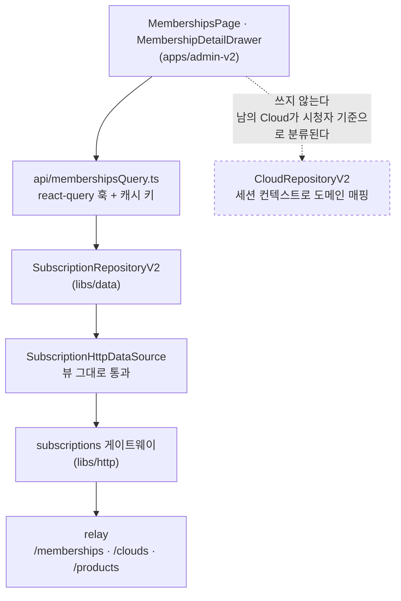
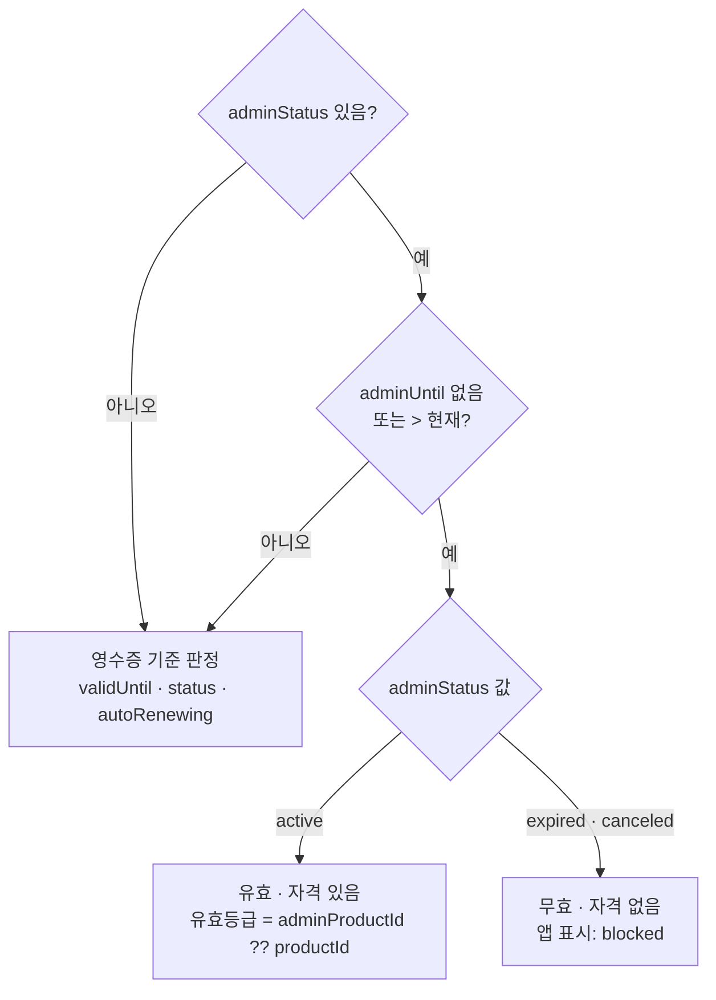
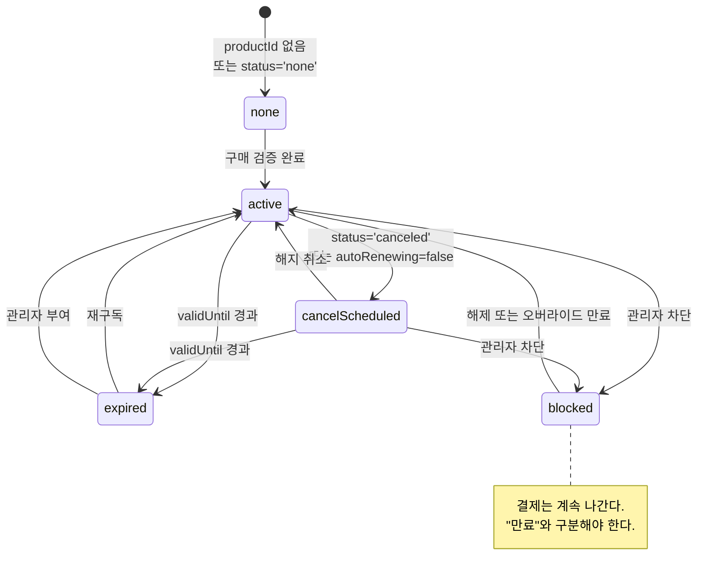
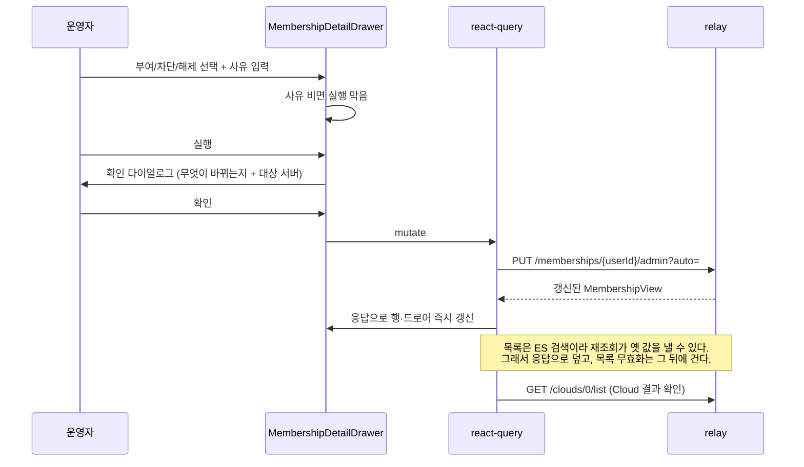

# Memberships — 관리자 구독 관리

> 상태: Live · 최종 갱신: 2026-09-10 · 관련 ADR: [ADR-0082](../../../../../docs/adr/0082-admin-membership-console-and-app-override-parity.md)

## 목적

운영자가 CS·정책 목적으로 유저 구독을 다루는 화면. 지금은 화면이 없어 백엔드를 직접 호출하는 수밖에 없다.

세 가지를 한자리에서 한다. 멤버십을 **조회**하고, 영수증과 분리된 관리자 오버라이드로 기간·상태·등급을 **부여·차단·해제**하고, 그 조작이 유저의 Cloud에 어떻게 반영됐는지 **확인**한다.

서버 계약의 정본은 vault의 `projects/@lemoncloud-io/chatic-backend-api/specs/subscription-admin/`이다. 이 문서는 그 계약을 콘솔에서 어떻게 쓰는지만 적는다.

## 설계 원칙

- **관리자 읽기는 로컬 캐시에 들어가지 않는다.** 목록에 뜨는 것은 전부 남의 유저의 멤버십과 Cloud다. `CloudRepositoryV2` 경로는 `toDomainCloud(view, context)`로 **현재 세션의 컨텍스트를 기준으로** 도메인 매핑하고, `resolveCloudType`이 소유/초대를 시청자 기준으로 분류한다([CloudHttpDataSource.ts:28](../../../../../libs/data/src/data/remote/http-data-sources/CloudHttpDataSource.ts)). 남의 Cloud를 그리로 태우면 분류가 조용히 틀린다. 그래서 관리자 표면은 **로컬 데이터소스가 아예 없는** subscription 레인에만 붙인다.
- **뷰는 그대로 통과시킨다.** subscription 레인의 기존 관례를 따른다 — "no domain model exists for this axis yet; views pass through unchanged (alias-level)"([SubscriptionHttpDataSource.ts:22](../../../../../libs/data/src/data/remote/http-data-sources/SubscriptionHttpDataSource.ts)). 관리자 화면 하나를 위해 도메인 모델을 새로 만들지 않는다. `aggr`처럼 도메인 매핑이 떨어뜨리는 값도 그대로 살아 온다.
- **호출자가 고르면 안 되는 값은 게이트웨이가 박는다.** `CloudHttpGateway.list`가 `view: 'mine'`을 고정한 선례를 따른다([clouds.ts:7](../../../../../libs/http/src/gateways/clouds.ts)). 관리자 Cloud 조회의 `view: 'admin'`도 같다. `list`를 느슨하게 고치지 않고 **메서드를 따로 둔다** — 두 조회는 권한도 대상도 다르다.
- **파생 규칙은 한 벌만 둔다.** 오버라이드 활성 판정은 서버 계약(SPEC §3.3)이고, 콘솔과 앱이 각자 구현하면 갈린다. 백엔드 스펙이 같은 함정을 적어 두었다 — "파생은 진입점 하나다. 둘 다 열어 두면 호출자가 오버라이드를 모르는 쪽을 골라 조용히 틀린다." 순수 함수 하나를 공유한다.
- **되돌리기 어려운 조작은 확인을 거친다.** 차단은 Cloud를 멈추고 `auto`는 Cloud를 만든다. 표시가 아니라 실제 변경이다.
- **어느 게이트가 진짜인지 구분해서 적는다.** 멤버십 두 경로는 서버가 `hasAdminRole`로 막는다. **Cloud 목록은 막지 않는다**(아래 §보안 실측). 콘솔의 `ProtectedRoute`는 앞의 둘에는 방어층이고, Cloud 조회에는 스택 전체에서 유일한 게이트다 — 그리고 클라이언트 게이트는 게이트가 아니다.
- **서버가 말하는 것과 앱이 보는 것을 구분해 보여준다.** 콘솔은 운영자가 진실을 보는 자리다. 저장된 `status`와 실시간 `isValid`가 어긋나면 그 사실 자체를 드러낸다.

## 범위

**포함**

- `/memberships` 목록 — 필터(`status` · `productId` · `platform` · `userId`) + 서버 페이지네이션.
- 목록 컬럼: `userId` · 상태(`status` + `isValid`) · 오버라이드 배지 · 상품 · 유효기간 · 플랫폼 · 최근 관리자 조작.
- 행 선택 → 우측 상세 드로어: 멤버십 원본 필드 · 오버라이드 현황(누가·언제·왜) · 그 유저의 Cloud 목록과 상태 집계.
- 오버라이드 폼: 부여 · 차단 · 해제. `adminStatus` · `adminUntil` · `adminProductId` · `adminReason` · `auto`.
- 안전장치 넷: 사유 필수 · 확인 다이얼로그 · `auto` 기본 꺼짐 · 대상 서버 배지.
- 상단 네비에 `Memberships` 등록.
- `apps/web`의 구독 판정을 오버라이드에 맞춤 — `blocked` 상태 신설, `isSuper` 읽기 제거.
- 공유 계층 확장: `libs/http` 게이트웨이 → `libs/data` 데이터소스 → `SubscriptionRepositoryV2`.
- `@lemoncloud/chatic-backend-api` `0.26.810` → `0.26.811`.

**제외**

- **구독 취소** — 백엔드에 엔드포인트가 없다(Google 배선 대기).
- **유저 이름·이메일 표시** — 멤버십 응답에 없다. `userId`로만 식별한다.
- **화면에서의 스테이지 전환** — 게이트웨이가 relay 엔드포인트 하나를 해석한다. 표시만 한다.
- **오버라이드 이력** — 서버가 최근 1건만 남긴다. 그 1건만 보여준다.
- **`isSuper` 필드 물리 제거** — 백엔드 몫이다.
- **admin-v2 배포 복구** — `libs/socket → web-core`가 `admin:build`를 깨뜨리는 문제는 별건이다.

## 시나리오

### S1. 만료된 유저에게 기간을 부여한다

1. 운영자가 `/memberships`로 진입한다. `ProtectedRoute`의 `$role.role === 'admin'` 게이트를 이미 통과한 상태다.
2. 상태 필터를 `expired`로 두고 목록을 좁힌다. 또는 `userId`를 직접 넣어 한 건으로 좁힌다.
3. 행을 선택하면 우측 드로어가 열린다. 영수증 기준 유효기간이 지났고 오버라이드는 없음으로 보인다. 그 유저의 Cloud가 보류 상태로 몇 개인지 집계에 나온다.
4. 오버라이드 폼에서 **부여**를 고르고 만료일을 정한다. 만료일을 비우면 무기한이다.
5. 사유를 적는다. 비우면 실행 버튼이 눌리지 않는다.
6. 실행하면 확인 다이얼로그가 뜬다 — "이 유저의 구독을 2026-12-31까지 유효로 만듭니다. 보류된 Cloud가 복원됩니다."
7. 확인하면 `PUT /memberships/{userId}/admin`이 나간다. 응답이 갱신된 뷰이므로 드로어와 목록 행을 그 값으로 갱신한다.
8. Cloud 목록을 다시 불러 복원 결과를 확인한다.

### S2. 등급을 올려 주고 Cloud까지 만든다

1. S1의 4단계에서 **부여**와 함께 등급을 고른다. 상품 목록은 `GET /products/plans`에서 온다.
2. `auto`를 켠다. 기본은 꺼져 있다.
3. 확인 다이얼로그가 "한도가 3개로 늘고, 모자란 2개의 생성 요청이 큐에 들어갑니다"라고 말한다.
4. 실행하면 서버가 부족분만큼 `POST /clouds/{userId}/make`를 큐잉한다. 응답의 큐잉 건수를 토스트로 알린다.
5. `auto`를 끄면 한도만 늘고 생성은 유저가 한다.

### S3. 남용 유저를 서버에서 막는다

1. 행을 선택하고 오버라이드 폼에서 **차단**을 고른다. `expired`와 `canceled` 중 하나다.
2. 확인 다이얼로그가 결과를 그대로 적는다 — "구독이 무효가 되고 이 유저의 Cloud가 보류·회수 대상이 됩니다. **스토어 결제는 계속 나갑니다.**"
3. 실행하면 서버가 무효로 판정하고 Cloud를 정리 경로에 태운다.
4. 앱에서 그 유저는 `blocked` 상태를 본다 — "만료"가 아니다. 결제가 나가는 중이라 만료라고 말하면 안 된다.

### S4. 부여를 되돌린다

1. 오버라이드가 걸린 행을 열고 **해제**를 고른다.
2. `adminStatus: ''`가 나간다. 서버가 `adminUntil`과 `adminProductId`를 함께 비운다.
3. 판정이 즉시 영수증 기준으로 돌아온다. 누가·언제·왜 조작했는지의 스탬프는 남는다.

### S5. 부여 기간이 저절로 끝난 것을 본다

1. `adminUntil`이 지난 행은 서버가 되돌리는 코드가 없어 저장된 `status`가 `active`인 채로 남아 있다.
2. 반면 `isValid`는 조회 시점에 다시 파생하므로 `false`로 온다.
3. 목록은 둘을 나란히 보여주고, 어긋난 행에 표식을 단다. 운영자는 "이건 부여가 만료된 것"임을 화면에서 안다.

### S6. `isSuper` 잔여를 확인한다

1. `apps/web`에서 `isSuper` 읽기를 걷기 **전에** 하는 확인이다.
2. 필터에 `isSuper=1`을 넣어 목록을 뽑는다. `isSuper`는 문서화된 필터 필드다(SPEC §4.3).
3. 나온 행이 전부 활성 오버라이드를 갖고 있으면 안전하다. 없는 행이 있으면 그 유저는 읽기를 걷는 순간 만료로 보이므로, 먼저 오버라이드를 부여한다.

## 다이어그램

### 배선 — 관리자 표면이 타는 길



### 오버라이드 파생 — 서버와 앱이 같은 규칙을 쓴다



### 앱의 구독 상태 — 4종에서 5종으로



### 오버라이드 조작 시퀀스



## 상세 구현

### 파일 배치

```
libs/http/src/gateways/
  subscriptions.ts                        adminMemberships · updateMembershipByAdmin · adminClouds
  subscriptions.spec.ts                   URL·고정 파라미터 검증 (11건)

libs/data/src/data/remote/gateways/
  http.ts                                 SubscriptionHttpDomainGateway 의 Pick<> 화이트리스트

libs/data/src/data/remote/http-data-sources/
  SubscriptionHttpDataSource.ts           같은 셋 + AdminOverrideOptions (auto 의 wire 인코딩)

libs/data/src/data/repositories-v2/
  SubscriptionRepositoryV2.ts             같은 셋을 위임

libs/shared/src/utils/
  membershipOverride.ts                   isAdminOverrideActive · resolveEffectiveProductId
  membershipOverride.test.ts              14건

apps/admin-v2/src/app/features/memberships/
  api/membershipsQuery.ts                 훅 넷(목록·Cloud·상품·오버라이드) + 캐시 키
  api/membershipsQuery.spec.ts            파라미터 조립 4건
  lib/overrideForm.ts                     폼 → 본문, 검증, 확인 문구
  lib/overrideForm.spec.ts                24건
  lib/membershipRow.ts                    오버라이드 배지 · status↔isValid 어긋남 · 유효 등급 표시
  lib/targetServer.ts                     대상 서버 판별
  lib/membershipRow.spec.ts               19건 (targetServer 포함)
  lib/cloudAggregation.ts                 aggr → 버킷
  lib/cloudAggregation.spec.ts            5건
  components/MembershipTable.tsx
  components/MembershipDetailDrawer.tsx
  components/CloudPanel.tsx
  components/OverridePanel.tsx
  pages/MembershipsPage.tsx
  routes/index.tsx · index.ts

apps/admin-v2/src/app/
  routes.tsx · layout/PrivateLayout.tsx    /memberships 라우트와 네비 항목

apps/web/src/app/features/subscription/
  lib/membershipStatus.ts                 오버라이드 파생 + blocked + isSuper 제거
  lib/membershipStatus.test.ts            오버라이드 7건 추가
  lib/quota.ts                            blocked 를 notEntitled 로 거절
  lib/quota.test.ts                       1건 추가
  hooks/usePlanCatalog.ts                 한도가 유효 등급을 따르게
  pages/SubscriptionPage.tsx              blocked 배너·상태 문구
apps/web/public/locales/{ko,en}/translation.json   statusBlocked · blockedNotice

package.json · yarn.lock                  chatic-backend-api ^0.26.811
```

### 1. 게이트웨이 — 고정값은 여기서 박는다

`libs/http/src/gateways/subscriptions.ts`에 셋을 더한다. `SubscriptionHttpGateway`의 기존 메서드와 같은 형태다.

| 메서드                                          | 요청                                     | 고정값                      |
| ----------------------------------------------- | ---------------------------------------- | --------------------------- |
| `adminMemberships(params)`                      | `GET {relay}/memberships/0/list`         | 없음                        |
| `updateMembershipByAdmin(userId, body, params)` | `PUT {relay}/memberships/{userId}/admin` | 없음                        |
| `adminClouds(ownerId, params)`                  | `GET {relay}/clouds/0/list`              | `view: 'admin'`, `valid: 0` |

`adminClouds`의 고정값 둘이 이 계층에 있어야 하는 이유가 다르다. `view: 'admin'`은 **호출자가 고를 값이 아니다** — `view`를 열면 `mine`으로도 부를 수 있게 되고, 그 분기는 세션 스코핑이 다르다. `valid: 0`은 **관리자 조회의 기본값이 일반 조회와 반대**라서다. 서버 기본값이 `1`이라 만료된 Cloud가 빠지는데(`chatic-backend-api`의 `src/modules/clouds/api-clouds.ts` 실측), 운영자는 만료된 것까지 봐야 한다.

`ownerId`는 파라미터로 나간다. **`userId`가 아니다** — 서버에서 `userId`는 `view=mine` 분기에서만 쓰이고, 관리자 조회의 필터는 `CloudModel.ownerId`다.

응답 타입은 `ListResult<CloudView, AggrResult>`다. `ListResult`의 두 번째 제네릭이 집계 자리이고(SDK `dist/cores/types.d.ts:121`), 상태별 집계가 거기 실려 온다. `AggrResult`는 `Record<string, Record<string, number>>` — `{ status: { active: 3 } }` 꼴이다. `aggr` 자체는 `R | R[]` 이라 단건과 배열을 모두 받아야 하고, `readAggrBuckets`가 그 둘과 키 이름 변경까지 흡수한다.

`clouds.spec.ts`의 관례대로 `spec.ts`를 붙인다 — `executeSignedRelayRequest`를 목으로 두고 URL과 파라미터가 정확히 무엇으로 불렸는지 확인한다. 특히 "호출자가 `view`를 넘겨도 `admin`이 이긴다"를 명시적으로 검증한다.

### 2. 데이터소스와 리포지토리 — 통과만 한다

`SubscriptionHttpDataSource`와 `SubscriptionRepositoryV2`에 같은 셋을 그대로 얹는다. 두 클래스 모두 게이트웨이 호출을 위임하기만 하는 형태라 새로 정할 것이 없다. 리포지토리의 `requireHttp()` 가드도 그대로 탄다.

계층이 하나 더 있다. `SubscriptionHttpDomainGateway`가 게이트웨이 메서드를 `Pick<>`으로 화이트리스트하고 있어, 세 메서드를 거기 더해야 데이터소스에서 보인다([http.ts](../../../../../libs/data/src/data/remote/gateways/http.ts)).

`auto`의 wire 인코딩(`1` 또는 없음)은 데이터소스가 쥔다. 콘솔은 `auto: true`라고만 말한다 — `CloudHttpDataSource.makeCloud`의 `dryRun`이 같은 자리에 같은 이유로 있다.

`subscription`은 이미 런타임에 배선돼 있다 — `createRepositoriesV2`가 `httpDataSources?.subscription`을 넘기고([repositories-v2/index.ts:90](../../../../../libs/data/src/data/repositories-v2/index.ts)), `httpFactory`가 `subscriptionGateway()`를 만든다([httpFactory.ts:27](../../../../../libs/app-runtime/src/data/factories/httpFactory.ts)). admin-v2는 `main.tsx`의 `initAppRuntime()` 뒤에 `runtime.data.useRuntimeRepositories()`로 바로 받는다. **배선 작업이 따로 없다.**

### 3. 공유 파생 함수

`libs/shared/src/utils/membershipOverride.ts`에 순수 함수 둘을 둔다.

```ts
isAdminOverrideActive(membership, now): boolean
resolveEffectiveProductId(membership, now): string | undefined
```

활성 판정은 서버 계약 그대로다 — `adminStatus`가 있고, `adminUntil`이 없거나(`0` 포함) `adminUntil > now`. **`now`는 인자로 받는다.** 서버 스펙이 "판정 시각은 생략할 수 없다. 없을 때 `0`으로 보면 만료된 오버라이드가 활성으로 판정된다"고 못박았고, 같은 함정이 여기에도 있다.

`libs/shared`에 두는 이유는 **admin-v2와 apps/web이 둘 다 이미 의존하는 유일한 lib**이기 때문이다. admin-v2는 `@chatic/data`를 직접 쓰지 않는다 — "this console depends on `@chatic/app-runtime` alone"([ProtectedRoute.tsx:6](../../../src/app/components/ProtectedRoute.tsx))이 그 경계다. `libs/shared/utils`가 지금은 일반 유틸(`formatDate`·`createQueryKeys`)만 담고 있어 도메인 함수가 살짝 이질적이지만, 두 앱이 같은 서버 계약을 각자 구현하는 것보다 낫다.

### 4. 콘솔 데이터 훅

`api/membershipsQuery.ts`가 `usersQuery.ts`의 형태를 그대로 따른다 — `createQueryKeys`로 키를 만들고 `runtime.data.useRuntimeRepositories()`에서 리포지토리를 받는다.

- `useAdminMemberships(params)` — 목록. `refetchOnWindowFocus: false`.
- `useAdminClouds(ownerId)` — 드로어가 열린 유저의 Cloud. `enabled: !!ownerId`.
- `useUpdateMembershipByAdmin()` — 뮤테이션. 성공 시 응답으로 상세 캐시를 덮고, 그 다음에 목록 키를 무효화한다.

**순서가 중요하다.** 목록은 ES 검색이라 쓰기 직후 재조회가 옛 값을 낼 수 있다. 응답이 갱신된 뷰이므로 그것으로 먼저 덮고, 목록 무효화는 뒤에 건다.

빈 문자열 필터는 보내지 않는다. `buildReportLogListParams`가 같은 이유로 같은 처리를 한다 — 서버는 키가 없으면 필터 없음으로 보지만 빈 문자열은 그대로 매칭한다.

### 5. 오버라이드 폼

`lib/overrideForm.ts`가 폼 상태를 요청 본문으로 바꾸고, 확인 문구를 만든다. UI에서 분리해 두면 검증과 문구를 테스트할 수 있다.

폼의 모드는 셋이다.

| 모드 | `adminStatus`             | `adminUntil`  | `adminProductId` |
| ---- | ------------------------- | ------------- | ---------------- |
| 부여 | `active`                  | 비우면 무기한 | 선택             |
| 차단 | `expired` 또는 `canceled` | 선택          | 보내지 않음      |
| 해제 | `''`                      | 보내지 않음   | 보내지 않음      |

클라이언트 검증은 서버 규칙을 앞당겨 잡는다. 서버가 거부할 것을 화면에서 먼저 막는 것이지, 서버 검증을 대신하는 것이 아니다.

- 사유는 필수다. API는 선택이지만 콘솔이 강제한다(ADR-0082 결정 6).
- `adminUntil`은 미래여야 한다. 과거와 음수를 서버가 거부한다.
- **무기한은 만료일을 비우는 것**이다. 먼 미래 날짜를 대신 넣지 않는다.
- `adminProductId`는 `GET /products/plans`에서 받은 목록에서만 고른다. 서버가 존재하지 않는 상품을 거부한다.

확인 문구는 모드와 `auto`에 따라 달라진다. 차단 문구는 **결제가 계속 나간다는 사실**을 반드시 담는다.

### 6. 화면

`pages/MembershipsPage.tsx`가 목록과 드로어를 쥔다. `UsersPage`의 골격(헤더·스켈레톤·에러 재시도·페이지네이션)을 따르고, 필터 바와 드로어가 더 붙는다.

- 필터 바: `status` · `productId` · `platform` 셀렉트 + `userId` 입력. 상태는 URL 쿼리에 실어 새로고침에 살아남게 한다(`useSearchParams`, `UsersPage` 선례).
- 대상 서버 배지: `VITE_BACKEND_ENDPOINT`를 그대로 보여주고, `/v1`이면 운영으로 표시한다. 헤더와 확인 다이얼로그 양쪽에 둔다.
- 테이블 행: `status` 배지와 `isValid` 배지를 나란히 둔다. 둘이 어긋나면 행에 표식을 단다(S5).
- 오버라이드 배지: 원본 필드에서 만든다. "부여 중 · ~2026-12-31" / "무기한 부여" / "차단됨" / 없음.
- 드로어는 `ui-kit`의 `sheet`를 쓴다. `ReportDetailDrawer`는 직접 만든 패널이지만, 그건 payload 렌더가 특수해서다. 여기는 표준 컴포넌트로 충분하다.
- 확인은 `alert-dialog`를 쓴다.

### 7. `apps/web` — 판정을 오버라이드에 맞춘다

바꾸는 것은 [membershipStatus.ts](../../../../web/src/app/features/subscription/lib/membershipStatus.ts) 하나다. 소비자는 `usePlanCatalog`와 `SubscriptionPage` 둘뿐이다.

`SubscriptionState`에 `blocked`를 더해 다섯이 된다. 판정 순서가 이렇게 바뀐다.

1. ~~`isSuper` → `active`~~ **제거한다.**
2. 오버라이드 활성(`isAdminOverrideActive`)이면
    - `adminStatus === 'active'` → `active`, `isEntitled: true`. `productId`는 `resolveEffectiveProductId`가 준다.
    - 그 외(`expired` · `canceled`) → `blocked`, `isEntitled: false`.
3. 아래는 지금 그대로다 — `productId` 없음/`status === 'none'` → `none`, `validUntil > now` → `cancelScheduled` 또는 `active`, 그 외 → `expired`.

**오버라이드는 저장된 `status`가 아니라 원본 필드에서 판정한다.** `status`는 마지막 쓰기 때 파생해 저장한 값이라 부여 만료 뒤에도 `active`로 남는다. `adminUntil`을 렌더 시각과 직접 비교하면 만료가 즉시 반영된다.

서버의 `isValid`는 여전히 쓰지 않는다. 그 판단은 해지 예약 구간을 잘못 자른다는 기존 근거가 그대로 유효하다.

`blocked`의 화면 문구는 `SubscriptionPage`에 새로 넣는다. "만료"와 다른 말이어야 한다.

이 변경은 `apps/web/docs/feature/subscription/tier-and-quota.md`의 정본을 흔든다. 그 문서의 「구독 상태 4종」·상태 다이어그램·상세 구현 §3을 같이 고친다.

## 보안 실측 (2026-09-10, dev-3 리뷰)

**서버가 진짜로 막는 것**

- `GET /memberships/0/list` — `hasAdminRole('admin')`, 질의 전에 403. 기본 `GET /memberships`도 여기로 라우팅된다.
- `PUT /memberships/{userId}/admin` — `hasAdminRole()`, body 파싱 전에 403. `adminStatus` 허용목록, `adminUntil` 과거·음수 거부, `adminProductId` 존재 확인, `adminAt`/`adminBy` 서버 스탬프, 슬랙 리포트 무조건 발송.
- 자격·한도는 `guardQuota`가 **서버 시계로** 다시 파생한다. 앱이 무엇을 계산하든 생성은 서버가 판정한다.

**서버가 막지 않는 것 — 미해결**

`GET /clouds/0/list`에는 관리자 게이트가 없다(`api-clouds.ts` `doGetList` 실측). `hasAdmin`을 계산하고도 권한 판단에 쓰지 않고, `useSession`은 `hasAdmin ? false : false`로 항상 false이며, 소유자 고정은 `view === 'mine'` 분기 안에만 있다. 그 분기조차 `_uid`가 세션 uid보다 요청의 `userId`를 먼저 쓴다.

**즉 로그인한 아무나 `?userId=<피해자>`로 남의 Cloud 목록을 읽는다.** 응답에 `ownerId`·`email`·`accountId`·`subscriptionId`가 실린다. 이 브랜치가 만든 구멍은 아니지만, 드로어의 Cloud 패널이 그 위에 서 있다. **수정은 chatic-backend-api 몫이다** — `view === 'admin'`에 `hasAdminRole` 검사를 걸고, `mine`이 아닌 경로도 세션으로 스코핑해야 한다.

## 검증 방법

**자동** (2026-09-10 기준 전부 통과)

```bash
npx nx test http       # 89건
npx nx test data       # 362건
npx nx test shared     # 24건
npx nx test admin-v2   # 175건
npx nx test web        # 2443건
npx nx run-many --target=lint --projects=web,admin-v2,@chatic/shared,@chatic/http,@chatic/data
```

jest 30은 `--testPathPattern`이 아니라 `--testPathPatterns`다. admin-v2는 vitest라 패턴을 `-- --run <pattern>`으로 넘긴다.

타입체크는 `--noEmit`이 아니라 **빌드 모드**로 해야 한다. 참조된 lib의 `dist/*.d.ts`가 없으면 TS6305가 무더기로 뜨는데, 그건 진짜 오류가 아니라 참조가 안 빌드된 상태다.

```bash
npx tsc -b apps/admin-v2/tsconfig.app.json    # 0건
npx tsc -b apps/web/tsconfig.app.json         # 0건
npx tsc -b libs/{http,data,shared}/tsconfig.lib.json
```

무엇을 덮는지:

- 게이트웨이 — 세 메서드의 URL·파라미터. 호출자가 `view`/`valid`를 넘겨도 고정값이 이기는지, 호출자가 준 `userId`가 필터가 되지 않는지.
- 공유 파생 — `adminUntil` 없음/`0`/미래/과거/정확히 현재. 해제(`''`)가 "오버라이드 없음"으로 읽히는지.
- 폼 — 세 모드의 본문. 사유 없으면 막히는지, 과거 만료일이 막히는지, 무기한이 `adminUntil`을 아예 안 보내는지, 차단에 등급이 안 실리는지. 확인 문구가 "결제는 계속 나간다"를 담는지.
- 행 표시 — 만료된 오버라이드가 배지에서 사라지는지, `status`↔`isValid` 어긋남을 잡는지.
- `apps/web` 판정 — 부여·차단·해제·오버라이드 만료, 그리고 `isSuper`가 더는 자격을 주지 않는지.
- 한도 — `blocked`가 `notEntitled`로 거절되는지. 상태를 하나 늘리면 기본 갈래로 새기 쉬운 자리다.
- 스토어 경로 — 부여받은 유저에게 `hasLiveReceipt`가 false인지. 이 값이 `replaceablePlan`과 Google `oldPlanId`를 정한다. 자격(`isEntitled`)을 쓰면 부여받은 유저가 산 적 없는 등급을 교체 대상으로 보낸다.
- `auto` wire 인코딩 — `true`면 `{ auto: 1 }`, 아니면 아예 안 보냄.

**런타임** (2026-09-10 확인)

dev 서버를 띄워 `/memberships`를 열면 세션이 없어 로그인 게이트로 보내지지만, 피처 모듈 13개가 전부 200으로 로드되고 콘솔 오류가 없다. 배선이 런타임에 풀리는 것까지가 세션 없이 확인 가능한 범위다. `npx nx build admin-v2 --configuration=dev`도 통과한다.

**첫 실운영 조회에서 반드시 확인할 것**

- **`?view=admin&ownerId=` 가 실제로 그 유저의 Cloud만 내는지.** 코드 경로(`CloudTransformer.bodyToModel`이 `ownerId`를 무조건 매핑 → `packSearchParam`이 `FIELDS`를 훑어 필터로 넣음)는 따라갔지만 실제 호출로는 확인하지 못했다. 안 걸러지면 남의 Cloud가 전부 나오므로, 드로어의 Cloud 섹션을 먼저 닫고 별건으로 돌린다.
- `aggr`의 키가 `status`인지. 아니어도 `readAggrBuckets`가 버킷을 읽지만, 다른 키라면 라벨이 기대와 다를 수 있다.

**수동** (콘솔은 배포되지 않는다 — 로컬에서 `.env`를 채워 띄운다)

1. admin이 아닌 계정으로 `/memberships` 진입 → 게이트에서 막히는지.
2. 목록 필터 넷이 서버 쪽에서 걸리는지(총 건수가 따라 줄어드는지).
3. 한 유저로 부여 → 앱에서 유효, 차단 → 앱에서 `blocked`, 해제 → 원래대로. 셋을 이어서 확인한다.
4. `auto` 켜고 등급 부여 → Cloud 생성이 큐잉되는지. 끄면 한도만 느는지.
5. `isSuper=1` 필터로 잔여를 뽑아 전부 활성 오버라이드가 있는지(S6). **`apps/web` 변경 배포 전에 한다.**
