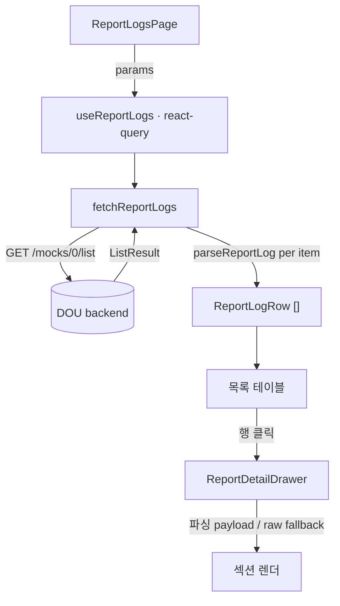
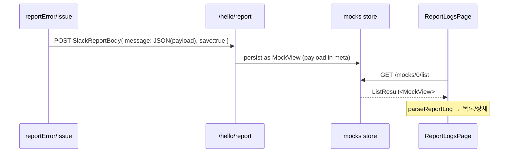

# Report Logs — 리포트 로그 목록 조회

> 상태: Approved · 최종 갱신: 2026-07-23 · 관련 ADR: [ADR-0027](../../../../../docs/adr/0027-admin-v2-report-log-list.md)

## 목적

`reportError`(자동 수집)와 `reportIssue`(사용자 이슈 리포트)가 남긴 리포트를 admin-v2에서
조회하는 관리자용 화면. 두 함수는 `${DOU_ENDPOINT}/hello/report`로 payload를 JSON 직렬화해
저장하는데([common.ts:102](../../../../../libs/web-core/src/api/common.ts:102)), 지금까지는
Slack 채널로만 흘러가 **한 곳에서 훑어볼 수단이 없었다.** 이 화면이 제품 에러/이슈 추적의
단일 진입점이 된다.

## 설계 원칙

- **저장 포맷에 방어적으로 결합한다.** 클라이언트는 payload를 `SlackReportBody.message`에
  JSON 문자열로만 실어 보내고(구조화 `meta`는 안 보냄), `MockView`에는 `title`/`message`
  최상위 필드가 없다. 저장 시 백엔드가 payload를 `meta`로 인코딩할 가능성이 높지만
  (`MockModel.meta` = "json encoding all data", `SlackReportResult.$meta` = "저장된 meta
  payload") **실제 위치·형태(meta 객체 vs 문자열, message 원문)는 미확인**이다. `parseReportLog`는
  meta·message 양쪽을 방어적으로 탐색하고, 실패 시 raw JSON 폴백으로 원본을 보존한다.
- **socket-lab 스택을 미러링한다.** 새 추상화를 만들지 않는다 — `api/`(webTransport) +
  `hooks/`(react-query) + `pages/` + `routes/` 관례를 그대로 따른다.
- **응답 타입은 로컬 정의.** SDK(`@lemoncloud/chatic-backend-api`)의 타입 export에 의존하지
  않고, `deviceApi`처럼 피처 로컬 응답 인터페이스를 둔다([deviceApi.ts](../../../src/app/features/socket-lab/api/deviceApi.ts)).
- **서버 우선, 클라이언트 폴백.** 검색·기간 필터는 서버 파라미터가 지원되면 서버에서,
  아니면 불러온 페이지 대상 클라이언트 필터로 처리하고 그 한계를 UI에 명시한다.

## 범위

**포함**

- 전체 리포트(모든 사용자) 목록 조회 — `reportError` + `reportIssue` 둘 다, type 구분 표시.
- 목록 컬럼: type · 제목 · 메시지 · 사용자(name/uid) · app · 시각(상대표기).
- 필터: 텍스트 검색 + 기간(날짜) + type(error/issue) + app.
- 3가지 뷰 토글: **목록**(페이지네이션) · **집계**(메시지별 건수, 표본) · **추이**(시간대별 막대 차트, 급증 강조).
- 행 클릭 → 사이드 드로우로 전체 payload 상세(방어적 파싱 + raw JSON 폴백 + 복사 + 관측 점프).
- **socket-lab 연동**: 상세의 `uid` → `/socket-lab?observe=<uid>`로 이동해 Observe watchlist에 자동 추가(ADR-0028 결정 C).
- 편의기능: stage 전환(prod v1 / dev d1) · 자동 새로고침(15초) · CSV 내보내기.
- `/report-logs` 라우트 및 앱 상단 네비 등록.

**제외**

- **서버사이드 필터/검색** — `/mocks/0/list` 파라미터 지원 미확인. 검색·필터·집계·추이는
  전부 **불러온 페이지/표본 한정**(전체 대상 아님), UI에 명시.
- uid 기준 "내 것만" 필터.
- 리포트 삭제/편집 등 쓰기 액션.

## 시나리오

1. 관리자가 `/report-logs`로 진입한다(기존 `ProtectedRoute` 인증 통과 필요).
2. 마운트 시 `useReportLogs({ page: 0, limit })`가 `GET ${DOU_ENDPOINT}/mocks/0/list`를 호출한다.
3. 응답 `list: MockView[]`의 각 항목을 `parseReportLog`로 파싱해
   `{ id, type('error'|'issue'), title, app, env, createdAt, payload }` 행으로 변환한다.
4. 최신순 테이블로 렌더: type 배지 · 제목 · app · env · 시각.
5. 상단 컨트롤에서 텍스트를 입력하거나 기간을 지정하면 목록이 좁혀진다.
6. 행을 클릭하면 오른쪽 사이드 드로우가 열리고, 파싱된 payload를 섹션별로 보여준다
   (메시지·스택 / HTTP / 유저 / 클라우드 / 디바이스·네트워크 / issue의 최근 로그·버전).
   파싱이 깨진 항목은 raw JSON 그대로 표시한다.

## 다이어그램

## 상세 구현

신규 피처 폴더 `apps/admin-v2/src/app/features/report-logs/`:

- **`api/reportLogApi.ts`** — `fetchReportLogs(params)`가
  `webTransport.buildSignedRequest({ method:'GET', baseURL: \`${DOU_ENDPOINT}/mocks/0/list\` }).setParams({ page, limit, ... }).execute<ReportLogListResponse>()`호출.`DOU_ENDPOINT`는 `@chatic/web-core`에서 import([config/index.ts:6](../../../../../libs/web-core/src/config/index.ts)).
호출 패턴은 [userApi.ts:89](../../../src/app/features/socket-lab/api/userApi.ts:89)·[deviceApi.ts](../../../src/app/features/socket-lab/api/deviceApi.ts) 미러링.
응답 타입 `ReportLogListResponse { list: MockView[]; total?; page?; limit?; aggr? }`는 로컬 정의.
- **`lib/parseReportLog.ts`** — `MockView` → `ReportLogRow` 변환 + payload 파싱.
  payload 저장처가 `meta`(객체/문자열)인지 `message` 원문인지 미확인이므로 **양쪽을
  방어적으로 탐색**해 언랩한다. type은 저장된 title 접두어(`issue:` vs `error`)로 우선
  판별하고(파싱 실패해도 확보), 보조로 payload의 `stack`/`http` 유무를 본다. payload 필드
  형태는 [ErrorReportPayload / IssueReportExtras](../../../../../libs/web-core/src/api/types/common.ts) 기준
  (error/issue 스키마가 다르고 `device` 형태도 달라, 고정 필드 가정 없이 키-값 렌더).
- **`hooks/use-report-logs.ts`** — `useQuery({ queryKey:['admin-v2','report-logs',params], queryFn })`.
  [use-device-list.ts](../../../src/app/features/socket-lab/hooks/use-device-list.ts) 미러링.
- **`components/ReportDetailDrawer.tsx`** — 사이드 드로우. 표시 데이터 세트는 apps/web의
  이슈 리포트 위젯([IssueReportOverlay](../../../../../apps/web/src/app/features/issue-report/components/IssueReportOverlay.tsx) → [buildReportContext](../../../../../apps/web/src/app/features/issue-report/lib/buildReportContext.ts))이
  첨부하는 항목 기준: 메시지·스택 / HTTP / 유저 / 클라우드 / 디바이스·네트워크·viewport·path / 최근 로그·버전. 하단에 raw JSON 폴백.
- **`components/ReportLogTable.tsx`** — 요약 테이블(type 배지·제목·app·env·시각). 공용 테이블
  컴포넌트가 없으므로 Tailwind 유틸 + 테마 토큰(`bg-card`, `text-foreground` 등)으로 직접 작성.
- **`pages/ReportLogsPage.tsx`** (+ `pages/index.ts`) — 검색어·기간 로컬 state를 hook params로
  전달, 테이블 + 드로우 조립.
- **`routes/index.tsx`** (+ `index.tsx` re-export) — `SocketLabRoutes` 형태 미러링.
- **`app/routes.tsx`** — `ProtectedRoute` 아래에 `/report-logs/*` 라우트 추가
  ([routes.tsx:19](../../../src/app/routes.tsx:19) 인접).

## 검증 방법

- **응답 shape 실측(선행)**: dev 서버(`preview_start`)로 admin-v2 로그인 후 `/report-logs`
  진입, `read_network_requests`로 `/mocks/0/list` 실제 응답을 확인해 `MockView.meta`의
  payload 위치/형태와 지원 파라미터를 확정한다.
- **파싱 유닛 테스트**: `lib/parseReportLog.spec.ts` — error/issue payload 샘플, meta가
  객체인 경우/문자열인 경우/깨진 경우 각각 올바른 `ReportLogRow`·폴백을 내는지.
- **수동 확인**: 목록 최신순 정렬, 검색/기간 필터 동작, 행 클릭 시 드로우 섹션 렌더 및
  raw JSON 폴백.

---

## 구현 체크리스트 (임시 — Live 전환 시 삭제)

1. **[선행] 응답 shape 실측** — dev 서버 띄워 `/mocks/0/list` 실제 응답/파라미터 확인.
   결과에 따라 `parseReportLog`의 meta 언랩 지점과 검색/기간 서버 파라미터 여부 확정.
2. `api/reportLogApi.ts` — `fetchReportLogs` + `ReportLogListResponse` 로컬 타입.
3. `lib/parseReportLog.ts` + `lib/parseReportLog.spec.ts` — 변환/판별/폴백 + 테스트.
4. `hooks/use-report-logs.ts` — react-query 래퍼.
5. `components/ReportLogTable.tsx` — 요약 테이블.
6. `components/ReportDetailDrawer.tsx` — 상세 드로우(섹션 + raw 폴백).
7. `pages/ReportLogsPage.tsx` + 검색/기간 컨트롤 배선.
8. `routes/index.tsx` + `index.tsx` + `app/routes.tsx` 라우트 등록.
9. 수동 검증(목록/필터/드로우) 및 문서 Live 전환.

## 리스크와 미지수 (임시 — Live 전환 시 삭제)

- **`/mocks/0/list` 응답 shape 미확인** — payload 저장처가 `meta`(객체/문자열)인지 `message`
  원문인지, 아니면 재구성이 필요한지. 클라가 `body.meta`를 안 보내지만 백엔드가 저장 시
  meta로 인코딩할 여지가 커, 없다고 단정하지 않는다. 체크리스트 1에서 실측 전까지
  `parseReportLog`는 잠정 구현.
- **검색·기간 서버 파라미터 지원 미확인** — 미지원 시 클라이언트(현재 페이지) 폴백으로
  축소되고 부분 검색 한계를 UI에 명시. 롤백: 필터 컨트롤 숨기고 목록+상세만 유지.
- **SDK 타입 export 불확실** — `ListResult`/`MockView`가 패키지 루트에서 export되는지 미확인
  → 로컬 응답 타입으로 우회(원칙과 일치).
- **권한/프라이버시** — 화면이 모든 사용자 uid·이름·cloud 정보를 노출. 현재는 기존
  `ProtectedRoute`에만 의존(ADR-0027 결과 참조). 추가 게이팅 필요 여부는 후속 판단.
