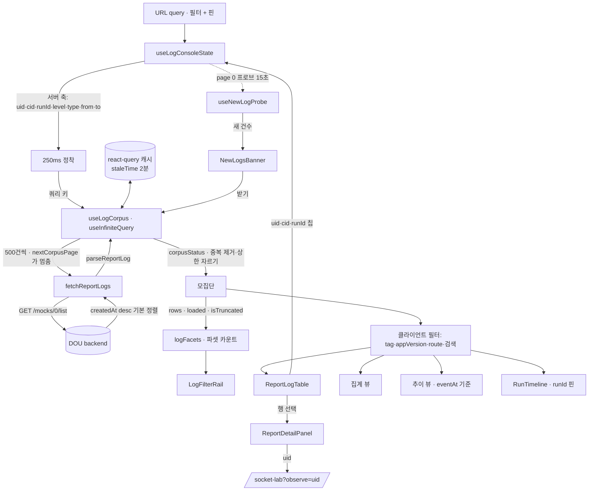
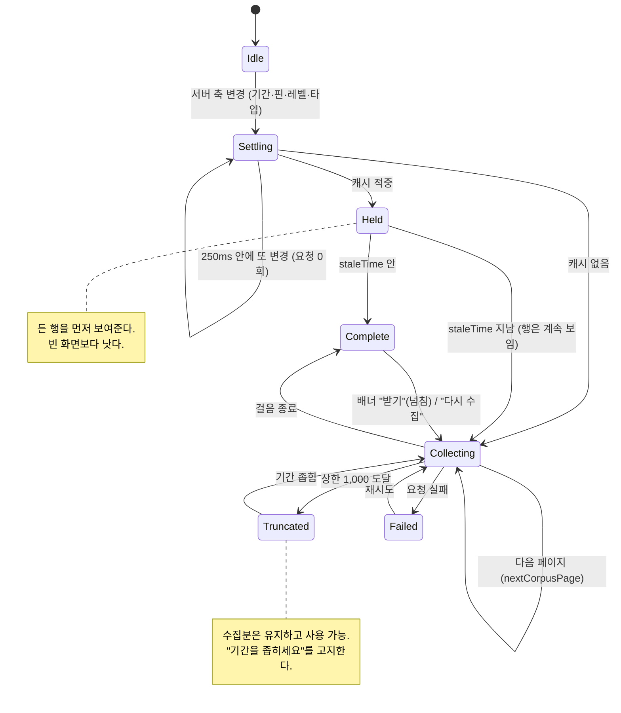
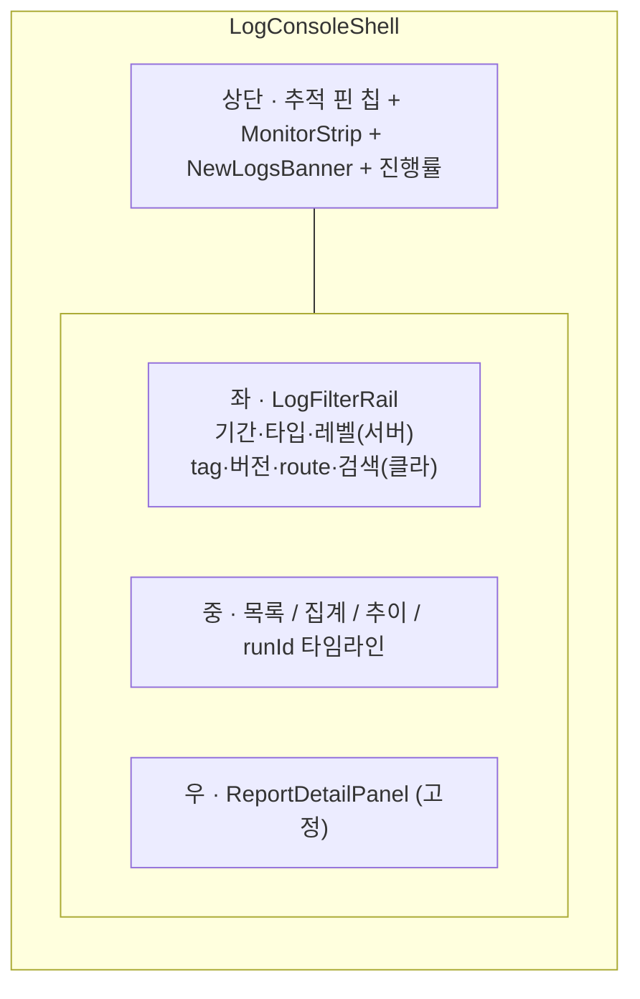

# Report Logs — 로그 추적 콘솔

> 상태: Live · 최종 갱신: 2026-09-10 · 관련 ADR: [ADR-0027](../../../../../docs/adr/0027-admin-v2-report-log-list.md), [ADR-0083](../../../../../docs/adr/0083-admin-log-monitoring-console.md)

## 목적

사용자 제보(`reportIssue` → `/hello/report`)와 앱이 배치로 올린 구조화 로그
(`/hello/report-bulk`), 그리고 2026-09에 폐지된 자동 에러 리포트(`reportError`)가 남긴
레코드를 admin-v2에서 조회·추적하는 관리자 화면. 제품 장애 추적의 단일 진입점이다.

세 종류가 한 저장소(`/mocks/0/list`)에 섞여 있고, 로그 쪽은 `stereo='log'`을 구 에러
리포트와 공유한다. 화면이 이 셋을 갈라 보여주는 책임을 진다.

**해결하려는 것** — 지금까지 이 화면은 "훑어보기"만 됐다. 검색이 불러온 페이지 100건
안에서만 돌아서, 전체 7.7k건 중 특정 유저의 로그를 찾는 게 불가능했다. ADR-0083은
이 화면을 **추적 콘솔**로 재편해 네 가지 작업을 성립시킨다.

1. 특정 유저 장애 추적 — uid로 좁혀 그 사람의 로그를 시간순으로 재구성
2. 전체 에러 모니터링 — 지금 무엇이 터지고 있는지 감시
3. 제보 대응 — 제보를 받아 그 사용자의 그 시점 로그와 대조
4. 릴리스 회귀 확인 — 버전별 에러 분포 비교

## 설계 원칙

- **서버가 걸 수 있는 축과 못 거는 축을 화면이 정직하게 구분한다.** 서버 필터는
  `uid`·`sid`·`cid`·`runId`·`level`·`type`(stereo)·`from`/`to`뿐이다. `tag`·`route`·
  `appVersion`·`os`·`message` 본문은 `meta` JSON 안에만 있어 클라이언트 몫이다.
  클라이언트 필터는 "무엇을 대상으로 걸렸는지"를 화면에 적는다 — 조용히 자르지 않는다.
- **추적 축은 서버로 승격한다.** uid·cid·runId는 서버 필터가 되므로, 이 셋을 클릭으로
  거는 것이 화면의 중심 동작이다. 나머지는 이미 확보한 모집단을 좁히는 보조 필터다.
- **모집단은 명시적으로 확보하고, 그 경계를 드러낸다.** 페이지 안 검색으로 위장하지
  않는다. 기간으로 서버에서 먼저 좁히고, 그 결과를 상한까지 누적하고, 상한에 닿으면
  기간을 좁히라고 말한다.
- **분석 중에 화면이 발밑에서 바뀌지 않는다.** 새 로그는 배너로 알리고, 반영 시점은
  사용자가 정한다.
- **발생 순서를 보존한다.** 배치 업로드라 `createdAt`(도달)은 뭉쳐 들어온다. 화면의
  순서·타임라인·추이는 `timestamp`(발생) 기준이다.
- **저장 포맷에 방어적으로 결합한다.** payload는 `meta`(객체/문자열)·`SlackReportBody.message`
  어디에도 있을 수 있다. `parseReportLog`는 양쪽을 탐색하고, 실패 시 raw JSON 폴백으로
  원본을 보존한다. 파싱 실패가 행을 잃는 사유가 되지 않는다.
- **socket-lab 스택을 미러링한다.** `api/`(webTransport) + `hooks/`(react-query) +
  `lib/` + `components/` + `pages/` + `routes/` 관례를 그대로 따른다.
- **필터 상태는 URL에 둔다.** 새로고침과 링크 공유가 유지돼야 추적 작업이 성립한다.
  memberships 화면의 `useSearchParams` 관례를 따른다
  ([MembershipsPage.tsx:34](../../../src/app/features/memberships/pages/MembershipsPage.tsx:34)).
- **응답 타입은 피처 로컬 정의.** SDK 타입 re-export에 의존하지 않는다.

## 범위

**포함**

- 3분할 레이아웃: 좌 필터 레일 / 중 목록·집계·추이 / 우 상세 고정 패널.
- 추적 핀 — `uid`·`cid`·`runId`를 행·상세에서 클릭해 상단 칩으로 고정, 서버 필터로 승격.
- 기간 선축소 + 자동 연속 페치 모집단 확보 (500건씩, 상한 1,000, 진행률·상한 고지).
- 축을 쿼리 키로 쓰는 react-query 캐시 (`staleTime` 2분) — 되돌아온 축은 요청 0회.
- 클라이언트 파셋 필터: `tag`·`appVersion`·`route`·`source`·`os`·`app`·`env` + 자유 검색.
  모두 확보한 모집단 전체 대상.
- 상단 모니터링 스트립 — 레벨별 카운트, 최근 구간 급증 표시.
- `새 로그 N건 · 받기` 배너 (백그라운드 1페이지 프로브, 자동 반영 없음).
- runId 타임라인 — 한 실행 구간의 로그를 발생 시각순으로 보는 뷰.
- 상세 패널: 기존 드로어 본문(메시지·스택·소스맵 해석·HTTP·유저·클라우드·디바이스·
  첨부·최근 로그·raw 폴백)을 그대로 이관.
- socket-lab 연동 유지 — 상세의 uid → `/socket-lab?observe=<uid>`.
- 편의: stage 전환(prod v1 / dev d1) · CSV 내보내기 · 필터/핀 URL 동기화.
- 외형: `@chatic/ui-kit`으로 통일.

**제외**

- `chatic-backend-api` 수정 일체. 특히 조회 축 추가(`tag`/`route`/`appVersion` hoist),
  `aggregation` 파라미터화, 전문검색 경로 — 필요성은 아래 "미지수"에 남긴다.
- 서버 집계(`aggr`) 활용. `buildQuery`가 `aggregation: 'stereo'`로 고정해 쓸 데가 없다.
- 상한(1,000건) 밖 데이터 조회. 기간을 좁히는 것이 해법이다.
- 로그 보존·삭제·편집, 슬랙 등 외부 알림.
- 자동 갱신(폴링으로 모집단 재구축).

## 시나리오

### ① 특정 유저 장애 추적

1. 관리자가 `/report-logs`로 진입한다(`ProtectedRoute` 인증 통과 필요).
2. 기간을 지정한다(기본: 오늘). 서버 조회가 그 범위로 좁혀지고, 연속 페치가 시작돼
   `2,300 / 2,300건 수집 완료` 같은 진행 표시가 뜬다.
3. 목록에서 문제된 행의 `uid` 값을 클릭한다. 상단에 `유저 1000123` 핀이 붙고
   URL이 `?uid=1000123`으로 바뀌며, 서버 조회가 그 uid로 다시 돌아 모집단이 재수집된다.
4. 이제 목록은 그 유저의 로그만이다. `실행`(runId) 값을 누르면 그 실행 구간으로 한 번 더
   좁혀지고, 중앙이 자동으로 **타임라인**으로 전환돼 발생 시각 오름차순으로 무슨 일이
   있었는지가 한 줄기로 보인다. 항목 사이의 간격(1초 이상)이 함께 그려진다 — 에러 앞의
   30초 공백은 그 자체가 발견인 경우가 많다.
5. 행을 고르면 우측 패널에 상세가 뜬다. 목록은 그대로 있어 다음 행으로 바로 넘어간다.
   스택이 있으면 소스맵을 골라 그 자리에서 풀거나, `IDE로 추적`으로 `yarn trace`용 블롭을
   복사한다.
6. URL을 복사해 넘기면 상대가 같은 화면을 본다.

### ② 전체 에러 모니터링

1. 기간을 오늘로, 레벨을 `error`로 둔다. 서버가 그 축으로 좁혀준다.
2. 상단 스트립이 레벨별 카운트와 최근 구간 급증을 보여준다.
3. 중앙을 **집계**로 돌리면 메시지별 상위 항목이, **추이**로 돌리면 발생 시각 기준
   막대가 나온다. 둘 다 확보한 모집단 전체 기준이며, 표본 크기가 함께 표시된다.
4. 좌측 파셋에서 `tag`를 고르면 그 태그만 남는다 — 클라이언트 필터라는 배지가 붙는다.
5. 분석 중 새 로그가 들어오면 상단에 `새 로그 12건 · 받기` 배너만 뜬다. 누르면 머리에
   붙고, 안 누르면 화면은 그대로다.

### ③ 제보 대응

1. 타입을 `issue`로 좁혀 제보 목록을 본다.
2. 제보 행을 열면 상세에 첨부 스크린샷과 리포터 정보(`payload.user`)가 보인다.
3. 상세의 `유저` 핀을 누르면 그 uid가 서버 축으로 올라가 모집단이 다시 수집된다.
   종류를 `로그`로 바꾸면 그 유저의 로그만 남는다. 제보 자체는 uid 축이 없어 핀에 걸리지
   않을 수 있고, 그럴 때 핀 줄에 그 사실이 적힌다(아래 "미지수").
4. 필요하면 `관측` 버튼으로 socket-lab Observe로 넘어간다.

### ④ 릴리스 회귀 확인

1. 기간을 릴리스 전후로 잡고 레벨 `error`로 모집단을 확보한다.
2. 좌측 `appVersion` 파셋이 버전별 건수를 보여준다. 새 버전에서만 나오는 항목이
   집계 뷰에서 상위로 올라온다.
3. 이 판단은 확보한 모집단 안에서만 유효하다 — 상한에 닿았으면 화면이 그렇게 말하고,
   기간을 좁혀 다시 보게 유도한다.

## 다이어그램

### 데이터 흐름

### 모집단 확보 상태

### 화면 레이아웃

## 상세 구현

피처 폴더 `apps/admin-v2/src/app/features/report-logs/`.

### 서버 조회 경계 (근거)

`GET /dou-{stage}/mocks/0/list`는 쿼리 파라미터를
`MockTransformer.bodyToModel` → `packSearchParam` → ES term 필터로만 옮긴다.
`saveLogEntry`가 문서 최상단에 올려두는 조회 축 사본이 필터 가능한 전부다
([proxy.ts:127](/Users/raine/Documents/lemoncloud-io/chatic-backend-api/src/modules/mock/proxy.ts:127),
[transformer.ts:85](/Users/raine/Documents/lemoncloud-io/chatic-backend-api/src/modules/mock/transformer.ts:85),
[abstract-services.ts:1266](/Users/raine/Documents/lemoncloud-io/chatic-backend-api/src/cores/abstract-services.ts:1266)).

| 축                                                                    | 서버 | 비고                                                                                                                                                 |
| --------------------------------------------------------------------- | ---- | ---------------------------------------------------------------------------------------------------------------------------------------------------- |
| `uid`, `sid`                                                          | O    | `packSearchParam`이 별도 처리 (abstract-services.ts:1286)                                                                                            |
| `cid`, `runId`, `level`                                               | O    | `MockModel` 최상단 사본 + `bodyToModel` 매핑                                                                                                         |
| `type` (= `stereo`)                                                   | O    | `doGetList`가 `stereo.keyword` term으로 직접 추가                                                                                                    |
| `from`/`to`                                                           | O    | `createdAt` range, KST 일 경계, `to` 포함                                                                                                            |
| `page`/`limit`/`offset`                                               | O    |                                                                                                                                                      |
| `sort`                                                                | O    | **넘기지 않는다.** 미지정 시 기본이 `createdAt desc`이고, `sort=createdAt`만 주면 오름차순으로 뒤집힌다 (`asc \|\| 'asc'`, abstract-services.ts:493) |
| `tag`, `route`, `appVersion`, `webVersion`, `os`, `source`, `message` | X    | `meta` JSON 안에만 존재                                                                                                                              |
| 집계                                                                  | X    | `buildQuery`가 `aggregation: 'stereo'` 고정                                                                                                          |

### 신규·변경 파일

**`api/reportLogApi.ts`** — `FetchReportLogsParams`에 `uid`·`cid`를 추가하고,
`buildReportLogListParams`가 비어있지 않을 때만 실어 보내는 기존 규칙을 그대로 따른다.
`sort`는 노출하지 않는다(기본 정렬을 쓴다). `STEREO_BY_KIND`·stage 처리는 유지.

`AbortSignal`은 받지 않는다. `SealedWebTransport`의 요청 빌더가
`setBody`/`setParams`/`execute`만 노출하고(ADR-0070 결정 2의 봉인된 표면,
[lemonTransport.ts:32](../../../../../libs/http/src/transport/lemonTransport.ts:32)),
그 표면을 넓히는 것은 이번 범위가 아니다. 그래서 취소는 협조적이다 — 아래 `useLogCorpus`
항목 참고.

**`lib/corpusPaging.ts`** — 걸음이 어디서 멈추는지, 모아진 페이지가 무엇으로 합쳐지는지.
손으로 쓴 페치 루프가 갖고 있던 규칙이 여기로 나왔다 — 루프 자체는 react-query가 이미
가진 기계였고, 남길 값은 종료 조건과 중복 제거였다.

- `nextCorpusPage(pages)` — 종료 조건. ① 짧은 페이지(서버가 **반환**한 수가 페이지 크기
  미만)면 `total`이 뭐라 하든 끝. `total`은 첫 응답 값이고 집합은 그 아래서 줄어들 수
  있으므로, 페이지 길이를 믿는 것이 낡은 `total`로 무한히 걷는 것을 막는다. 반환 수로
  재는 이유는 중복만 담긴 꽉 찬 페이지가 "끝"으로 읽히지 않게 하기 위해서다. ② 상한.
  ③ `distinct >= total`.
- `corpusStatus(pages)` — 페이지를 순서대로 펴서 `id`로 중복을 제거하고 상한까지 자른다.
  자르는 이유는 표시 때문이다 — "N / 상한"을 보여주는 쪽이 상한 넘는 N을 보면 안 된다.
- **페이지 500 · 상한 1,000.** 쪼개는 목적은 스크린샷을 실은 제보 레코드 몇 건의 꼬리
  위험을 묶는 것이고, 500이면 그 목적은 그대로 달성된다(한 페이지에 제보 몇 건 = 수 MB).
  상한 1,000이면 전수 수집이 **왕복 2회**, 서버 total이 한 페이지 아래면 **1회**다. 종일
  열어두는 화면이 필터를 바꿀 때마다 낼 수 있는 값이 이 정도다. 모집단을 키우면 태그·버전
  카운트가 정확해지지만 요청·메모리·첫 렌더 시간을 그만큼 낸다 — 어느 쪽이든 카운트는
  모집단 범위이고 화면이 그걸 말하므로, 모자랄 때의 답은 더 좁은 기간이다.
- `from = limit * page`이므로 가장 깊은 요청이 `from=500`, ES 기본 `max_result_window`
  (10,000) 안이다. 이 산술은 테스트로 고정해 뒀다.

**`lib/eventTime.ts`** — `eventAt(row) = row.timestamp ?? row.createdAt`과
`ingestLagMs(row)`. 지연이 임계(기본 60초)를 넘으면 행에 배지를 붙이는 판정도 여기 둔다.
서버 기간 필터는 `createdAt` 기준이므로 기간 가장자리에서 샘이 생긴다 — 이 함수가
그 사실의 단일 근원이 되고, 화면이 그것을 고지한다.

**`lib/logFacets.ts`** — 모집단 대상 파셋 카운트 + 필터.
`buildFacets(rows)` → `{ level, tag, app, env, appVersion, webVersion, route, source, os }`
각각 `{ value, count }[]` 내림차순(동수는 사전순으로 고정해 페이지가 도착할 때마다
순서가 뒤집히지 않게 한다). `matchesFacets`/`matchesQuery`가 좁히기를 담당하며,
자유 검색은 공백으로 나눈 모든 항이 포함돼야 하는 AND 매칭이다.

`level`은 파셋으로 **세지만** 필터는 서버가 한다. 그래서 `use-log-console-state`의
클라이언트 축 목록에서 제외된다 — 포함하면 "수집분 필터 초기화"가 서버 축까지 지워
1,000건을 다시 걷게 만든다.

**`lib/bucketReportLogs.ts`** — `createdAt` → `eventAt` 기준으로 버킷을 나눈다.
이것이 추이 그래프를 실제 발생 분포로 되돌리는 한 줄이다.

**`lib/groupReportLogs.ts`** — `latestAt`을 `eventAt` 기준으로.

**`lib/reportLogFormat.ts`** — CSV 컬럼에 `cid`·`timestamp`·`appVersion`·
`route`·`os` 추가.

**`components/LogConsoleShell.tsx`** — 3분할 레이아웃 껍데기. 상태를 갖지 않는다.
좁은 화면에서는 필터 레일이 먼저 접히고(`md` 미만), 상세 패널은 `lg` 미만에서 오버레이로
떨어진다. 이 전환은 JS 브레이크포인트가 아니라 CSS다 — 뷰포트를 측정하면 리사이즈마다
다시 재고, 첫 페인트에서 틀린 모양이 나온다.

**`components/TrackingPins.tsx`** — 활성 핀 칩과 해제. 핀을 걸고 푸는 것은
`use-log-console-state`의 서버 축 변경이다.

**`components/PinButton.tsx`** — 값 옆에 붙는 작은 핀 버튼. 목록 행과 상세
패널 양쪽에서 같은 컴포넌트를 쓴다.

**`components/LogFilterRail.tsx`** — 좌측 레일. 서버 축 그룹과 클라이언트 축
그룹을 시각적으로 나누고, 후자에는 "수집분 대상" 배지를 단다. 파셋은
`logFacets` 결과를 카운트와 함께 보여준다.

**`components/MonitorStrip.tsx`** — 레벨별 카운트와 최근 구간 급증.
급증 판정은 `bucketReportLogs` 결과의 마지막 버킷 대비 앞 버킷 중위값으로 한다.

**`components/NewLogsBanner.tsx`** — 개수 + `받기`.

**`components/CorpusProgress.tsx`** — 진행률·완료·상한 도달 고지.
상한에 닿으면 기간을 좁히라는 문구와 함께 표시한다.

**`components/ReportDetailBody.tsx`** (신규, 이관) — 현재
`ReportDetailDrawer.tsx`의 본문 렌더러들(`KeyValueSection`·`TextSection`·
`HttpSection`·`StackSection`·`LogsSection`·`ImagesSection`·`LogEntryDetailSection`)을
그대로 옮긴다. 소스맵 해석(`resolveStack`)과 `yarn trace` 블롭(`traceBlob`) 동작은
손대지 않는다 — 이 화면에서 가장 값이 높은 부분이다.

**`components/ReportDetailPanel.tsx`** — 패널 껍데기. 헤더의 uid·cid·runId에
`PinButton`을 달고, 기존 `관측`·`복사` 버튼과 socket-lab 점프를 유지한다. 발생 시각을
앞세우고, 도달이 눈에 띄게 밀린 행에만 지연 배지를 붙인다.
`ReportDetailDrawer.tsx`는 삭제됐다.

**`components/RunTimeline.tsx`** — runId 핀이 걸렸을 때의 시간순 뷰.
`eventAt` 오름차순, 레벨 색, 인접 항목 간 간격 표시.

**`lib/badgeClass.ts`** — 종류·레벨 배지 색을 한곳에 모았다.
목록·집계·상세가 같은 행에 라벨을 붙이는데 팔레트가 세 군데에 흩어져 이미 어긋나기
시작했다. 로그 엔트리는 종류(`log-entry`)가 아니라 **레벨**을 배지로 쓴다 — 종류는 모든
배치 행이 같아서 정보가 없고, 레벨이 훑는 축이다.

**`components/ReportLogTable.tsx`** — `@chatic/ui-kit`의 `Table`로 재작성하고
uid·runId 핀 컬럼, 버전/화면 컬럼을 추가했다. 배지 팔레트는 `lib/badgeClass`를 쓴다 —
공용 `Badge`의 variant가 default/secondary/destructive/outline뿐이어서 `warn`을
`error`·`info`와 구분할 수 없다.

**`components/ReportLogGroupTable.tsx`** — ui-kit `Table`로 재작성, 배지는 `badgeClass`,
`최근 발생`은 `eventAt` 기준.

**`components/ReportLogTimeChart.tsx`** — 버킷 출처가 발생 시각으로 바뀐 것만 반영(문서 주석).

**`pages/ReportLogsPage.tsx`** — 조립만 남긴다. 현재 341줄의 로컬 state와
인라인 필터 마크업이 위 훅·컴포넌트로 빠진다.

### 상태 소유

| 상태                         | 소유                    | 저장                          |
| ---------------------------- | ----------------------- | ----------------------------- |
| 서버 축 필터 + 핀            | `use-log-console-state` | URL query                     |
| 클라이언트 축 필터 + 뷰 모드 | `use-log-console-state` | URL query                     |
| 모집단(누적 행·진행)         | `use-log-corpus`        | 메모리 (서버 축 변경 시 폐기) |
| 새 로그 개수                 | `use-new-log-probe`     | 메모리                        |
| 선택된 행                    | `ReportLogsPage`        | 메모리                        |
| 소스맵 해석 결과             | `StackSection`          | 메모리 (기존 그대로)          |

## 검증 방법

**명령**: `npx vitest run --root apps/admin-v2 src/app/features/report-logs`
(피처 208건 / admin-v2 전체 328건 통과, 2026-09-10)

**순수 로직** — 네트워크·DOM 없이 돈다.

- `lib/corpusPaging.spec.ts` (16건) — 페이지 평탄화·중복 제거·id 없는 행 유지·상한 자르기,
  상한과 전체가 같을 때 truncated 아님, 첫 페이지 total 고정, 짧은 페이지 종료,
  distinct가 total 도달 시 종료, 중복만 담긴 꽉 찬 페이지는 계속 걷기, `pageSize=0` 무한
  경로 차단, **기본값에서 왕복 2회**, ES 결과 창(10,000) 안에 머무는지.
- `lib/eventTime.spec.ts` (19건) — `timestamp` 우선(`0`도 값으로 취급), `createdAt` 폴백,
  지연 계산·기기 시계 앞선 경우 클램프, 임계 판정, 기간 밖 판정, 두 정렬 비교자.
- `lib/logFacets.spec.ts` (12건) — 카운트 내림차순·동수 사전순, 빈 값 제외, 축별 독립,
  파셋 AND 매칭, 자유 검색 AND·대소문자 무시.
- `lib/parseReportLog.spec.ts` (28건, 확장) — 새 축 승격, hoist 사본 폴백, OS 반쪽,
  제보 행의 `mock.uid` 폴백과 payload 우선, 제보 버전이 `webVersion`으로 읽히는지.
- `lib/bucketReportLogs.spec.ts` · `lib/groupReportLogs.spec.ts` (확장) — 한 배치로 올라온
  행들이 발생 시각으로 갈리는지, 그룹 대표 행이 발생 기준 최신인지.

**컴포넌트·훅**

- `hooks/use-log-console-state.spec.tsx` (15건) — URL ↔ 상태 왕복, 허용값 밖 방어,
  무관한 파라미터 보존, 핀 순서, runId 핀의 뷰 전환·복귀, 클라이언트 축 초기화가
  서버 축을 건드리지 않는지.
- `components/ReportDetailBody.spec.tsx` (14건) — 기존 드로어 스펙을 그대로 이관.
  스택 심볼리케이션·`yarn trace` 복사·번들 불일치 경고가 이관 후에도 동작한다.
- `pages/ReportLogsPage.spec.tsx` (22건) — 조립된 화면을 가짜 목록 엔드포인트로 구동.
  캐시 동작(되돌아온 축 0회, 오래된 모집단 먼저 보여주고 갱신, `다시 수집`)과 요청 수
  (상한까지 정확히 2회, 정착으로 삼켜지는 중간 값 0회)가 여기서만 드러난다.
  이 층에서만 드러나는 것들을 본다: 서버 축 변경은 재수집하고 클라이언트 축 변경은
  **재수집하지 않는지**, 파셋 목록이 선택 후에도 줄지 않는지, 깊은 페이징 중복이 한 번만
  세지는지, uid 핀이 서버 쿼리로 나가고 제보 고지가 뜨는지, runId 핀이 오름차순 타임라인을
  여는지, 상세가 목록을 덮지 않고 나란히 열리는지, 정렬이 발생 시각 기준인지.

**요청 수** — 이 화면의 설계 속성이므로 테스트로 고정해 뒀다
(`pages/ReportLogsPage.spec.tsx`, `lib/corpusPaging.spec.ts`).

| 상황                              | 요청                          |
| --------------------------------- | ----------------------------- |
| 서버 축이 한 페이지 안으로 좁혀줌 | 1회                           |
| 상한 1,000까지 전수 수집          | 2회                           |
| 날짜를 타이핑하는 동안의 중간 값  | 0회                           |
| 되돌아온 축, TTL 안               | 0회                           |
| 되돌아온 축, TTL 지남             | 든 행 즉시 + 뒤에서 다시 걷기 |
| 배경 탭의 새 로그 프로브          | 0회                           |

**수동 확인 (미완)** — 화면이 admin OAuth 게이트 뒤에 있어 로그인 없이는 실데이터로
확인할 수 없다. 실데이터·실화면으로 남은 항목:

1. 실제 하루치 로그량에서 1,000건 상한에 닿는 빈도. 자주 닿으면 기본 기간을 좁힐지
   (오늘 → 최근 6시간) 상한을 올릴지 판단한다.
2. `gcTime` 안에 여러 축을 오간 뒤의 메모리와 `limit=500` 응답 크기(제보 레코드의 스크린샷
   base64). react-query에는 항목 수 상한이 없고 `gcTime`만 있으므로, 한도가 필요하면
   그때 정한다.
3. **uid 축 실태** — 아래 "미지수" 참고.
4. **1280px 전후 레이아웃.** 3열은 `xl`부터다. `lg`(1024px)에서는 레일 256px + 상세 416px를
   빼면 목록에 352px만 남아 이중 스크롤이 되므로, 상세는 `xl` 미만에서 오버레이이고 레일도
   같은 지점에서 접힌다. jsdom에는 CSS가 없어 이 전환은 테스트로 못 잡는다
   (`ReportLogsPage.spec.tsx`의 "상세가 목록을 덮지 않는다"는 DOM 공존만 증명한다).
5. 오버레이 상태(<`xl`)에서 Escape·backdrop 닫기와, 닫은 뒤 포커스 위치.

---

## 미지수 (실데이터 확인 필요)

**제보 레코드의 `uid`.** `doPostSlack`은 `proxy.mock.get(_id, { id, stereo:'log' })`로
문서를 만들 뿐 uid를 심지 않는 것으로 읽힌다
([api-mocks.ts:140](/Users/raine/Documents/lemoncloud-io/chatic-backend-api/src/modules/mock/api-mocks.ts:140)).
사실이면 uid 핀은 배치 로그 엔트리만 걸고 그 유저의 제보는 딸려오지 않는다.

화면은 이 불확실성을 안고도 오해를 만들지 않도록 만들어져 있다 — uid 핀이 걸리고 종류
필터가 제보를 포함할 때 "제보 레코드는 uid 축이 없어 이 핀에 걸리지 않습니다"를 고지한다
(`TrackingPins`의 `uidCaveat`). 실측으로 uid가 심긴다고 확인되면 그 고지만 지우면 된다.
`parseReportLog`는 이미 `mock.uid`를 폴백으로 읽으므로 코드 변경은 필요 없다.
