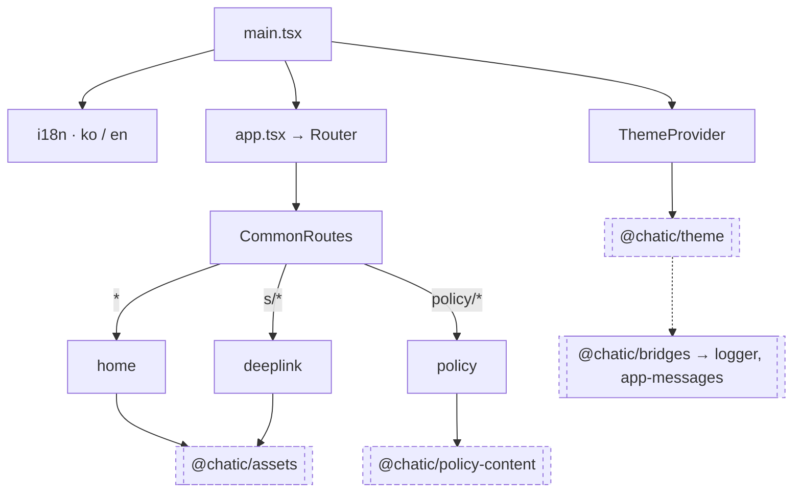

# @chatic/landing

**The public site, and the origin the mobile app's links point at.** One React + Vite SPA serving
three unrelated jobs from `app.chatic.io`: the marketing home page, the `/policy/*` URLs an app store
listing and the app's own My Page both cite, and the `/s/*` bounce page that sends an invite link
into the installed app or into the web app. It has no session, no data layer and no backend call of
its own.

53 TypeScript files under `src/`, three features, five shared components, zero tests.

## Purpose

This app answers one question: **what does a stranger with no account see?** Every other frontend in
the repo assumes a signed-in user and a working socket. This one assumes nothing — a first-time
visitor, a crawler, a reviewer opening a privacy policy from a store listing, or a phone that
followed a shared link before the app was ever installed.

It does **not** own:

- the legal text it renders — that is [`@chatic/policy-content`](../../libs/policy-content/README.md),
  shared with `apps/web` so the two never disagree; that document also covers version selection and
  what a version bump does and does not trigger
- the product itself — the web app lives at `dou.chatic.io` (`apps/web`) and is a separate build on
  a separate bucket
- the invite code — `/s/*` reads the URL and forwards; it never resolves, validates or stores one

### Why it is a separate app

Three things are true of it and of nothing in `apps/web`, and each is checkable:

1. **It deploys to its own origin.** `scripts/deploy-landing.sh` targets `app.chatic.io` (prod) and
   `app-dev.chatic.io` (dev); the web app's domains are `dou.chatic.io` and `dou-dev.chatic.io` (see
   `WEB_CONFIG` in `src/app/features/deeplink/constants/index.ts`). Separate S3 buckets, separate
   CloudFront distribution, separate `package.json` version.
2. **The origin is the deep-link origin.** `public/.well-known/apple-app-site-association` and
   `public/.well-known/assetlinks.json` are what make iOS Universal Links and Android App Links
   resolve to `io.chatic.dou`. They must be served from the domain the links use, and the deploy
   script refuses to run without them. That alone forces a site at this origin.
3. **It loads with no session.** Its entire `@chatic` surface is three packages, and none of them is
   an auth, data or socket module:

```bash
grep -rho "@chatic/[a-z-]*" apps/landing/src | sort | uniq -c
```

## Design principles

1. **No session, ever.** Nothing here reads a token, a user or a cache. A page that needs to know who
   is reading it belongs in `apps/web`.
2. **No network call to our own backend.** The only `fetch` in the app is an orphan (see
   [Traps](#traps)); `/s/*` redirects the browser and lets the destination do the work.
3. **Legal text is imported, never typed.** `src/app/features/policy/constants/index.ts` is a
   two-line re-export of the `@chatic/policy-content` barrel. A paragraph written into a page
   component here is a second copy of a policy, which is the failure that library exists to prevent.
4. **The routes are public URLs with external references.** `/policy/terms`, `/policy/privacy`,
   `/policy/child` and `/s/...` are cited by store listings, `public/sitemap.xml` and links already
   sent to people. Renaming one breaks something this repo cannot see.
5. **Nothing depends on this app.** It is a leaf: no lib and no other app imports it, so its only
   blast radius is the site itself.

## Scope

**In** — the marketing home page, the three policy pages with their version selector, the deep-link
bounce page, the `.well-known` association files, SEO metadata (`index.html`, `sitemap.xml`,
`robots.txt`, OG images).

**Out** — policy content (`libs/policy-content`), theming (`libs/theme`), shared illustrations and
icons (`assets`), everything a signed-in user does (`apps/web`).

## Structure



The dashed arrow is the one the diagram cannot explain: **no file in this app imports
`@chatic/bridges`, `@chatic/logger` or `@chatic/app-messages`** — see
[Dependencies](#dependencies-why-a-marketing-site-pulls-a-bridge-and-a-logger).

### Routes

`src/app/routes/CommonRoutes.tsx` splits on three prefixes, and each feature owns its own subtree.

| URL               | Renders                                         |
| ----------------- | ----------------------------------------------- |
| `/`               | `HomePage` — hero, features, pricing, CTA       |
| `/policy/terms`   | `TermsOfServicePage`                            |
| `/policy/privacy` | `PrivacyPolicyPage`                             |
| `/policy/child`   | `ChildPolicyPage`                               |
| `/policy/*`       | redirect to `/policy/terms`                     |
| `/s/*`            | `DeepLinkPage` — any path under `/s` reaches it |
| anything else     | redirect to `/`                                 |

`createBrowserRouter` means every one of these is served by S3 as `index.html`; the CloudFront
distribution has to rewrite unknown paths to it or `/policy/terms` 404s on a hard refresh.

### Directories

```text
apps/landing/
├── index.html                  ko-only metadata, canonical https://app.chatic.io/
├── vite.config.mts             build, dev server on :5004, window-injected VITE_* vars
├── public/.well-known/         apple-app-site-association, assetlinks.json
├── public/                     sitemap.xml, robots.txt, two OG images
└── src/
    ├── main.tsx                the only composition point: ThemeProvider + i18n + App
    ├── i18n/                   i18next, ko + en, detector key `@landing.language`
    ├── app/routes/             CommonRoutes (the three-way split) and the RouterProvider
    ├── app/shared/             Header, Footer, StoreButton, StoreIcons, Toast, useToast
    └── app/features/
        ├── home/               5 section components, store URLs
        ├── policy/             3 pages over one PolicyPageLayout + VersionSelector
        └── deeplink/           1 page, 4 hooks, the app-launch and web-redirect logic
```

There is no `project.json`: Nx infers every target from `vite.config.mts` and the package name, so
`build`, `test`, `typecheck`, `lint` and `dev` exist without being declared anywhere. `nx show
project landing` and `nx show project @chatic/landing` both resolve to it.

## Dependencies: why a marketing site pulls a bridge and a logger

Nx's graph gives this app five libraries under `libs/` — `app-messages`, `bridges`, `logger`,
`policy-content`, `theme` — plus the root `assets` project. Only three of the six are imported by a
file here:

| Library                  | Reached how               | Used for                                                    |
| ------------------------ | ------------------------- | ----------------------------------------------------------- |
| `@chatic/policy-content` | direct, 1 file            | the three policy tables and their types                     |
| `@chatic/theme`          | direct, 2 files           | `ThemeProvider` in `main.tsx`, the theme toggle in `Header` |
| `@chatic/assets`         | direct, 5 files           | illustrations and icons (also a Vite alias to `assets/src`) |
| `@chatic/bridges`        | transitive, via `theme`   | nothing here calls it                                       |
| `@chatic/logger`         | transitive, via `bridges` | nothing here calls it                                       |
| `@chatic/app-messages`   | transitive, via `bridges` | nothing here calls it                                       |

The whole chain hangs off one import inside `libs/theme/src/provider/ThemeProvider.tsx`:

```ts
import { isNative, webClient } from '@chatic/bridges';
```

`ThemeProvider` mirrors the theme into native storage by posting a `SavePreference` message, but only
when `isNative()` is true — that is, only when the page is running inside the mobile app's WebView.
On `app.chatic.io` in an ordinary browser it is false, the effect returns immediately, and the bridge
is never used. `@chatic/logger` and `@chatic/app-messages` arrive only because `bridges` uses them
internally.

**So the finding is: three of the five libraries are inherited, not needed.** They ship in the bundle
and no landing code path reaches them. This is worth knowing for two reasons. Bundle size on a page
whose job is to load fast for a stranger is a real cost. And the lever is not in this app — trimming
it means making `libs/theme`'s native sync optional, not editing anything under `apps/landing`.

```bash
grep -rn "@chatic/bridges\|@chatic/logger\|@chatic/app-messages" apps/landing/src   # 0 hits
```

The landing app's own diagnostics are plain `console.log` / `console.error` calls in
`useWebRedirect.ts` — it does not use the repo's logger.

## Usage

```bash
yarn landing:start                 # nx serve landing → http://localhost:5004
yarn landing:build:dev             # vite build → dist/apps/landing
yarn landing:deploy:dev            # build, then scripts/deploy-landing.sh dev
yarn landing:deploy:prod           # build, then scripts/deploy-landing.sh prod
```

`apps/landing/package.json` carries a name, a version and `private: true` — no scripts and no
dependencies. Everything resolves from the workspace root.

### Build and deploy

CI is [`.github/workflows/deploy-dev.yml`](../../.github/workflows/deploy-dev.yml) and its prod twin.
A push touching `apps/landing/src/**`, `public/**`, `index.html`, `vite.config.mts`, the tsconfigs or
the Tailwind/PostCSS configs sets the `landing` filter output, which:

1. bumps `apps/landing/package.json` version,
2. adds `landing` to the build-and-deploy matrix with prefix `LANDING`, so the `LANDING_DEV_*`
   secrets are written to `apps/landing/.env`,
3. runs `yarn landing:deploy:dev`,
4. uploads the build's source maps as a CI artifact (the S3 sync excludes `*.map`),
5. announces the deploy to Slack with the new version.

[`scripts/deploy-landing.sh`](../../scripts/deploy-landing.sh) does the rest: it refuses to proceed
unless `dist/apps/landing/index.html` and both `.well-known` files exist, syncs in four passes so
`index.html` and `version.json` get `no-cache` while hashed assets do not, substitutes
`REDACTED_TEAM_ID` in the AASA file with `$APPLE_TEAM_ID` before uploading it as
`application/json`, and invalidates CloudFront.

The `.env` is mostly theatre for this app: the only `import.meta.env` reference in `src/` is the
`DEV` flag in `src/app/features/deeplink/constants/index.ts`. Environment selection at runtime is
done by sniffing the hostname for `-dev`, which is what picks the `chatic-dev` URL scheme and the
`io.chatic.dou.dev` package id.

## Scenarios

### 1. A store reviewer opens the privacy policy

`/policy/privacy` → `PolicyRoutes` → `PrivacyPolicyPage`, which reads `PRIVACY_CONTENTS` through the
local two-line barrel and renders the language i18next detected, with `VersionSelector` offering the
older versions the library carries. No request is made; the text is in the bundle.

### 2. Someone taps an invite link on a phone with the app installed

The OS matches the URL against the `.well-known` files served from this origin and opens
`io.chatic.dou` directly — this site never loads. That is the success case, and it is entirely the
deploy script's two uploads.

### 3. The same link, no app installed

The browser lands on `/s/...` → `DeepLinkPage`. `useDeviceDetect` classifies the device;
`useAppLauncher` tries the custom scheme (`chatic://`) on iOS or an `intent://` URL with a store
fallback on Android, then after 2.5s offers the store; `useWebRedirect` rewrites a `/s?code=...` link
into `https://dou.chatic.io/auth/login?code=...&provider=invite&version=2&...` — appending `relay=1`
when the link carries no backend address, or `_backend=<url>` when it does.

### 4. Someone edits a policy paragraph

Nothing in this app changes. The edit lands in `libs/policy-content`, and both this site and
`apps/web` pick it up on their next build — two builds, two deploys. The
[policy-content README](../../libs/policy-content/README.md) is the canon for what that does and does
not trigger.

## Traps

- **This project is excluded from the CI gate.**
  [`.github/workflows/verify.yml`](../../.github/workflows/verify.yml) leaves `@chatic/landing` out of
  both the `typecheck` and the `test` run, and lists it as red in both. `lint` does cover it.
- **The typecheck really is red — 32 errors.** 29 of them are the same error,
  `TS2503: Cannot find namespace 'JSX'`, one per `: JSX.Element` annotation across 26 files: React 19
  removed the global `JSX` namespace, and `@types/react` 19 exposes it as `React.JSX`. The other
  three are `TS7030` in `Toast.tsx` (a `useEffect` that does not return on every path) and two
  `TS6307` for `src/i18n/locales/{en,ko}.json`, which `tsconfig.app.json` imports but does not
  `include`. Vite never type checks, so the site builds and deploys in this state.

    ```bash
    npx tsc -b apps/landing/tsconfig.app.json
    ```

- **There are no tests.** Not failing tests — zero spec files, while the inferred `test` target runs
  bare `vitest` with no `--passWithNoTests`, so it has nothing to run and cannot pass.

    ```bash
    find apps/landing/src -name '*.spec.*' -o -name '*.test.*'   # empty
    ```

- **`src/app/features/deeplink/utils/fingerprint.ts` is dead.** `generateFingerprint` calls out to
  `api.ipify.org`, is exported from no barrel (`utils/index.ts` is an empty `export {}`) and is
  called from nowhere. Deleting it removes a third-party request that the file's mere existence
  suggests the site makes.
- **Both deploy workflows filter on `apps/landing/project.json`, which does not exist.** The path
  simply never matches; every other pattern in the filter does, so this is harmless until someone
  adds a `project.json` and expects it to trigger a deploy.
- **`index.html` is Korean-only** — `lang="ko"`, Korean title, description and OG tags — while the app
  itself falls back to English (`fallbackLng: 'en'`). Crawlers and link previews see Korean whatever
  the reader's browser says.
- **The `.well-known` files are load-bearing and untestable from here.** A wrong `appID` or `paths`
  entry does not break the build, does not break the site, and silently stops every Universal Link
  from opening the app. Anything that changes the domain, the bundle id, or the AASA content needs a
  real device check after the CloudFront invalidation lands.

## How to verify

```bash
npx tsc -b apps/landing/tsconfig.app.json     # red today, see Traps
npx nx lint @chatic/landing                   # passes (one warning), and it is in CI
npx nx build @chatic/landing                  # passes — the build the deploy wraps
yarn landing:start                            # http://localhost:5004
```

Nothing imports this app, so a change here reaches no other project — the reverse is not true:
`libs/policy-content`, `libs/theme` and `assets` all reach it, and `tsconfig.app.json` references
exactly those three.
