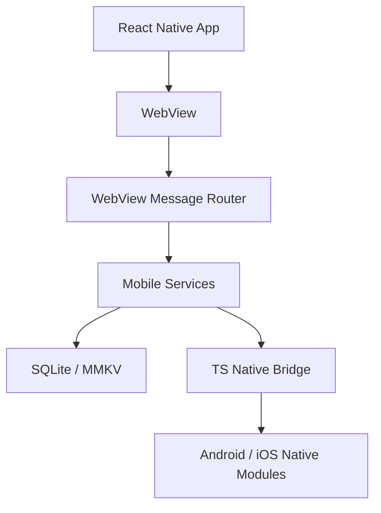

# Chatic Mobile

`apps/mobile` is the React Native hybrid mobile app. These docs are written for agents and developers who need to understand ownership and data flow before editing code.

## Read Order

Start with the architecture map, then jump to the category that owns your change.

1. [architecture](./docs/architecture.md)
2. [native module](./docs/native-module.md)
3. [service](./docs/service.md)
4. [webview](./docs/webview.md)
5. [cache](./docs/cache.md)
6. [push](./docs/push.md)
7. [upload](./docs/upload.md)

## Category Map

| Category                                 | Read when changing                                             | Primary code                                                                              |
| ---------------------------------------- | -------------------------------------------------------------- | ----------------------------------------------------------------------------------------- |
| [architecture](./docs/architecture.md)   | app shape, startup, layer ownership                            | `src/main.tsx`, `src/app/App.tsx`, `src/app/features`                                     |
| [native module](./docs/native-module.md) | Android/iOS native APIs, file/upload bridge, OS behavior       | `src/app/bridge`, `android/app/src/main/java/io/chatic/dou`, `ios/Bridges`                |
| [service](./docs/service.md)             | mobile domain behavior, dependency injection, shared instances | `src/app/services/provider.ts`, `src/app/services`                                        |
| [webview](./docs/webview.md)             | web-to-app messages, injected runtime, bridge handlers         | `src/app/webview`                                                                         |
| [cache](./docs/cache.md)                 | SQLite, MMKV, local data sources, cache bridge APIs            | `src/app/database`, `src/app/data/cache`, `src/app/services/cache`                        |
| [push](./docs/push.md)                   | FCM/APNs, badge, foreground event, background queue            | `src/main.tsx`, `src/app/services/notification`, `src/app/webview/hooks/useFcmHandler.ts` |
| [upload](./docs/upload.md)               | large file upload, native upload engine, upload recovery       | `src/app/services/upload`, `src/app/webview/hooks/useUploadHandler.ts`                    |

## System Shape

## Working Rules

- Identify the owning category before editing.
- Keep WebView handlers thin; domain behavior belongs in services.
- Register shared service instances through `services/provider.ts`.
- Keep native bridge contracts aligned across TypeScript, Android, and iOS.
- Update the matching doc when structure, lifecycle, data flow, or bridge contracts change.
