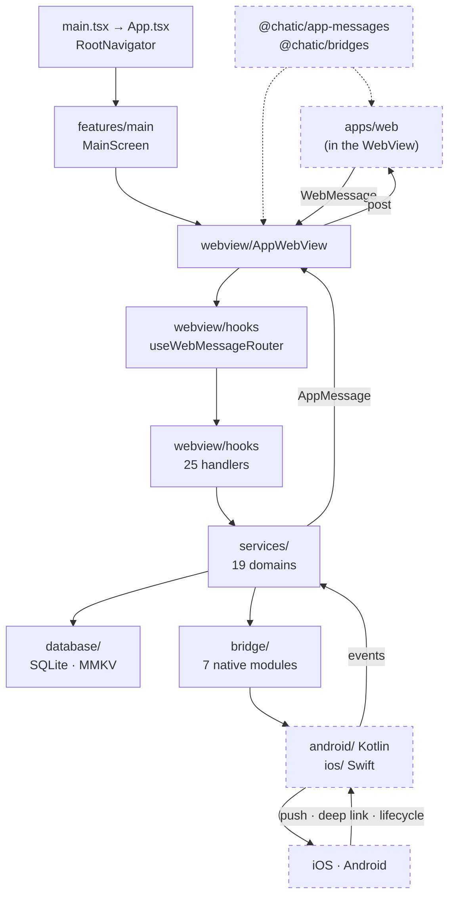
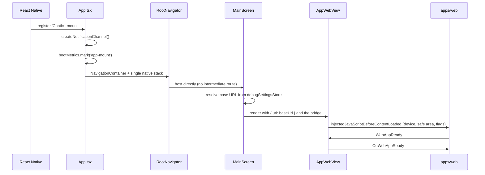

# @chatic/mobile

**The React Native shell that hosts the Chatic web client in a WebView and answers the messages it
sends.** It boots the app, mounts one WebView, and stands behind it as the only thing in the product
that can reach the operating system — push tokens, deep links, the local SQLite and MMKV stores, file
uploads, permissions, native sign-in SDKs, the status bar and the app icon.

The screens are not here. Everything the user reads, taps and navigates is `apps/web`, running inside
the WebView. When you are looking for a list, a chat room, a setting or a debug panel, you are in the
wrong project. This one owns the parts of those features that the browser cannot do.

This document covers the **overview and structure** only. The per-topic detail is under
[`docs/`](#documents).

## Purpose

There is one boundary and it is a message. The web client never calls a native API; it posts a typed
message and waits for the reply. The shell never renders product UI; it answers the message and
posts back.

The vocabulary of those messages is not declared here, and the command that shows it is the whole
dependency statement:

```bash
grep -rhoE "from '@chatic/[a-z-]+'" --include='*.ts' --include='*.tsx' apps/mobile/src \
  | sort | uniq -c | sort -rn
```

Five workspace packages, and `@chatic/app-messages` outnumbers the rest together.
[`@chatic/app-messages`](../../libs/app-messages/README.md) declares every message name and payload;
[`@chatic/bridges`](../../libs/bridges/README.md) owns the transport, the reply matching and the
timeouts on both sides of the boundary; [`@chatic/logger`](../../libs/logger/README.md) owns the log
entry contract and the upload queue; [`@chatic/device-utils`](../../libs/device-utils/README.md) and
[`@chatic/shared`](../../libs/shared/README.md) supply the small shared pieces.

What this app does **not** own: product screens, routing between them, data fetching and the debug
panel UI (`apps/web`); the message vocabulary (`@chatic/app-messages`); the framing and the request
bookkeeping (`@chatic/bridges`); the desktop shell's answers to the same messages (`apps/desktop`).

`@chatic/config` is a special case, and the absence is deliberate: this app never imports it, but
`ConfigKvService` and `useConfigKvHandler` persist its shell lane. The library's name appears in this
source tree only in comments.

## Design principles

1. **A handler decodes and delegates; it never decides.** Every hook under `webview/hooks` reads the
   payload, calls a service, and shapes the reply. Domain behaviour in a handler is the failure mode
   this rule exists to catch — it becomes unreachable from anything but a WebView message, so the
   native side of the same feature cannot use it.
2. **Services are the execution boundary, and they look only downward.** `services/` imports nothing
   from `webview/` or `features/`, and the grep that shows it is in [How to verify](#how-to-verify).
   A service that reaches up into a handler has made the feature untestable without a WebView.
3. **One shared instance per service, assembled in `services/provider.ts`.** The provider is a
   singleton with lazy getters, so a second SQLite handle or a second upload manager cannot exist.
4. **Native parity is a three-way contract.** A native capability is a TypeScript module under
   `bridge/`, a Kotlin implementation under `android/`, and a Swift one under `ios/`. Shipping two of
   the three leaves one platform failing at runtime with no type error.
5. **The shell renders chrome, never content.** The only components in `features/` are the system
   bars, a full-screen loader, a resume overlay and a deep-link error view. Anything with product
   meaning belongs to the web client.
6. **Boot order is load-bearing.** `App.tsx` seeds safe-area insets synchronously from
   `initialWindowMetrics` and the navigator hosts `MainScreen` directly, so the WebView starts loading
   before any async round-trip can delay it. Reordering these is a measurable regression, not a
   refactor — see [docs/boot-optimization.md](./docs/boot-optimization.md).

## Scope

**In** — the WebView host and the message router; the 25 handler hooks that answer web messages; the
19 service domains behind them; the 7 native bridge modules and their Android/Kotlin and iOS/Swift
counterparts; the local SQLite and MMKV stores; push registration, notification channels, badge
counts and push-tap routing; deep links and universal links; large-file upload; boot metrics; theme
and system bars; the build, run and store-deploy pipelines.

**Out** — screens, navigation between them, data fetching, product state and the debug panel UI
(`apps/web`); message names and payload shapes
([`@chatic/app-messages`](../../libs/app-messages/README.md)); the transport and reply bookkeeping
([`@chatic/bridges`](../../libs/bridges/README.md)); log entry shape, masking and the upload queue
([`@chatic/logger`](../../libs/logger/README.md)); the same messages answered on desktop
(`apps/desktop`).

## Structure



The arrow the diagram does not draw is the one that is forbidden: **nothing under `services/` points
back up at `webview/` or `features/`.** A service is callable from a handler, from a native event
listener and from a test, and it stays that way only while it knows about none of them.

### Boot, and the first message



`AppWebView` injects the same script twice — as
`injectedJavaScriptBeforeContentLoaded` and as `injectedJavaScript` — because only the first runs
before the web client's own pre-paint code, and only the second survives a reload.

### Directories

```text
apps/mobile/
├── src/
│   ├── main.tsx           AppRegistry.registerComponent('Chatic', App) — four lines, nothing else
│   ├── main-web.tsx       the web target's entry point
│   └── app/
│       ├── App.tsx        safe-area provider, system bars, navigation container, version check
│       ├── webview/       62 files: AppWebView, SimpleWebView, the router, 25 handlers, injection
│       ├── services/      97 files across 19 domains, assembled in provider.ts
│       ├── bridge/        7 modules onto native: app icon, back nav, badge sync, file manager,
│       │                  push marks, system bars, upload manager
│       ├── database/      SQLite (op-sqlite) and MMKV; table names and row types in types.ts
│       ├── data/          local data sources over the SQLite tables
│       ├── features/      core chrome and features/main — MainScreen and ModalScreen only
│       ├── stores/        zustand stores, including debugSettingsStore (resolves the WebView URL)
│       ├── hooks/         useServices, useResolvedTheme, useAppVersionCheck
│       ├── customZip/     the static server that serves a locally unpacked web bundle
│       └── utils/
├── android/               Kotlin: MainActivity, bridge, handler, module, push, service, worker
├── ios/                   Swift: Chatic, Bridges, ChaticNotificationServiceExtension
├── fastlane/              store upload lanes
└── docs/                  15 topic documents — see Documents
```

There is no `screens/` directory to open beyond `features/main`, and no `api/` directory at all —
network calls belong to the web client. `webview/core/bridge.ts` holds `createBridge`, the twenty
lines that turn a `WebView` ref into a post/receive pair; there is no `Bridge.ts` class.

## Usage

The shell is not imported by anything — it is run. Every script lives in the **root**
`package.json`, not in `apps/mobile/package.json`, which declares only `test` and `upload:server`.

```bash
# Local run: web dev server + Metro + simulator, from one command. Needs apps/mobile/.env.
yarn mobile:ios:local
yarn mobile:android:local

# Metro on its own, against apps/mobile/.env
yarn mobile:start

# Simulator builds against the deployed web
yarn mobile:ios:dev          # scheme "Chatic Dev"
yarn mobile:android:dev      # mode devDebug, appId io.chatic.dou.dev

# After changing native dependencies
yarn mobile:pod
yarn mobile:sync             # nx sync-deps mobile
```

`yarn mobile:local:check` is the guard the local-run scripts call first: it fails with a copy-paste
fix when `apps/mobile/.env` is missing. See [docs/local-run.md](./docs/local-run.md).

### Wiring

```text
main.tsx
└── App.tsx
    ├── notificationService.createNotificationChannel()
    ├── bootMetricsService.mark('app-mount')
    ├── useAppVersionCheck(true)          → update alert
    └── RootNavigator
        └── MainScreen
            ├── useAppBridge(webViewRef)  → createBridge + onMessage
            ├── debugSettingsStore.getResolvedWebviewBaseUrl()
            └── AppWebView
                └── useWebMessageRouter({ bridge })
                    └── 25 handler hooks → useServices() → provider
```

`provider.ts` builds `LogService` first, because almost every other service takes it as its first
constructor argument. SQLite and its data sources are lazy — the database opens on the first cache
call, not at boot.

## Scenarios

### 1. The web client asks for something native

`webClient.request(...)` in the web posts a typed message. `AppWebView`'s `onMessage` hands it to
`useWebMessageRouter`, which queues it and dispatches by type to one handler hook. The handler calls a
service and returns a response object; the router posts it back with the original `refId`, and
`@chatic/bridges` resolves the caller's promise. A message with no handler still gets a reply — that
is the bridge's job, not this app's.

### 2. Adding a native capability

Declare the request and response types in
[`@chatic/app-messages`](../../libs/app-messages/README.md). Write the service under
`services/<domain>/`, register it in `services/provider.ts`, and add a handler hook under
`webview/hooks/` wired into `useWebMessageRouter`. If it needs the OS, add the TypeScript module under
`bridge/` and both native implementations — Kotlin under `android/app/src/main/java/io/chatic/dou/`
and Swift under `ios/Bridges/`. See [docs/native-module.md](./docs/native-module.md) and
[docs/service.md](./docs/service.md).

### 3. A push arrives

Firebase delivers to native. In the background the native side increments the badge and marks the
push; on a tap, `DeepLinkManager` and `DeeplinkService` resolve a route and hand it to the web client
as a message rather than navigating natively. The web client owns the destination; the shell only
knows which one it is. See [docs/push.md](./docs/push.md),
[docs/badge.md](./docs/badge.md) and [docs/deeplink.md](./docs/deeplink.md).

### 4. The web client reads or writes the cache

`useCrudCacheHandler` and `useSearchCacheHandler` route to `CacheCrudService` and `CacheSearchService`
over the SQLite data sources in `data/`. The web client holds no rows of its own — this is the only
durable store on the device besides MMKV. See [docs/cache.md](./docs/cache.md).

### 5. A log entry crosses the boundary

The web posts `SendLog`, one entry at a time, and `useLogHandler` puts it into the logger hub, where
the store's subscription picks it up like any native entry. `useLogStoreHandler` is read-only:
`FetchLogUploadQueue` is non-destructive by contract, and `ack` is what releases entries. See
[`@chatic/logger`](../../libs/logger/README.md).

### 6. Shipping a build

`yarn mobile:version` bumps, `scripts/deploy-mobile.sh` builds and uploads, and `fastlane/` carries
the lanes. There are four store apps — iOS and Android, each dev and prod. See
[docs/deploy.md](./docs/deploy.md).

## Documents

| Document                                                 | What it covers                                                                     |
| -------------------------------------------------------- | ---------------------------------------------------------------------------------- |
| [docs/app-update.md](./docs/app-update.md)               | Launch-time version check and the update alert the shell shows                     |
| [docs/badge.md](./docs/badge.md)                         | App icon badge count — foreground totals from web, background increments in native |
| [docs/boot-metrics.md](./docs/boot-metrics.md)           | The boot timeline `BootMetricsService` records, and where the marks are read       |
| [docs/boot-optimization.md](./docs/boot-optimization.md) | Why the WebView mounts early and what the navigator does not do                    |
| [docs/cache.md](./docs/cache.md)                         | SQLite and MMKV persistence, the local data sources, the cache bridge API          |
| [docs/deeplink.md](./docs/deeplink.md)                   | Universal links, custom scheme and push taps converging on one route               |
| [docs/deploy.md](./docs/deploy.md)                       | Version bump and store upload for the four store apps                              |
| [docs/local-run.md](./docs/local-run.md)                 | Running the web dev server, Metro and a simulator together; the `.env` this needs  |
| [docs/native-module.md](./docs/native-module.md)         | Android and iOS native modules, and the parity contract between them               |
| [docs/push.md](./docs/push.md)                           | FCM/APNs permission, token registration, notification channels, foreground events  |
| [docs/service.md](./docs/service.md)                     | The execution boundary in `services/` and the DI rules in `provider.ts`            |
| [docs/theme.md](./docs/theme.md)                         | Light default, status bar and background, web↔native theme sync                   |
| [docs/upload.md](./docs/upload.md)                       | Large file upload through the native upload manager, and recovery                  |
| [docs/webview.md](./docs/webview.md)                     | The message boundary in detail — handlers, the injected runtime, the router        |
| [docs/webview-debugging.md](./docs/webview-debugging.md) | Attaching a remote inspector to the WebView running inside the app                 |

These fifteen are the detail, and this README is the map.

## How to verify

```bash
npx jest --config apps/mobile/jest.config.js     # 57 spec files
npx tsc -b apps/mobile/tsconfig.json             # the app sources
```

The traps here, some of which differ from the libraries:

- **The type check does not cover the specs.** `apps/mobile/tsconfig.json` references
  `tsconfig.app.json` alone, and that project excludes every `*.test.ts(x)`. `tsconfig.spec.json`
  exists but nothing references it, so a broken fixture surfaces as `… is not a function` when jest
  runs, never as a type error.
- **CI does not type check this project.** `.github/workflows/verify.yml` names `@chatic/mobile` in
  the `typecheck` exclusion list. `lint` and `test` do cover it. Run the type check by hand and read
  the result against what the branch changed, not against zero.
- **A stale `dist` or `out-tsc` produces phantom errors** after anything moves. `rm -rf` and look
  again; `apps/mobile/tsconfig.tsbuildinfo` is worth deleting with them.
- Check the two import rules the structure depends on — both print nothing when they hold:

    ```bash
    grep -rn "from '.*webview" apps/mobile/src/app/services
    grep -rn "from '.*features" apps/mobile/src/app/services
    ```

- **Native code is not checked by any of this.** Kotlin and Swift compile only in a real build:
  `yarn mobile:android:dev` and `yarn mobile:ios:dev`. A bridge changed on the TypeScript side alone
  passes every command above and fails on the device.
- Changing anything under `@chatic/app-messages` or `@chatic/bridges` reaches `apps/desktop` and
  `apps/web` as well. Neither is covered by this app's commands.
