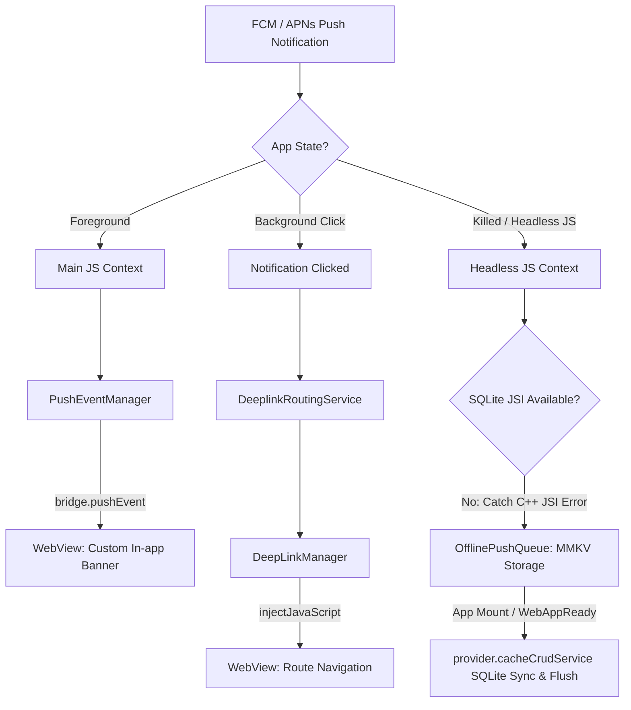
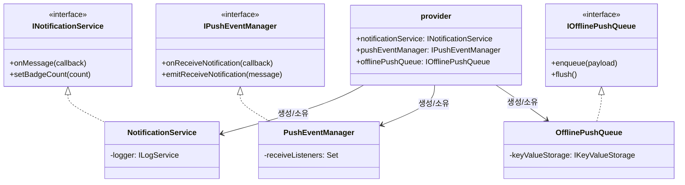
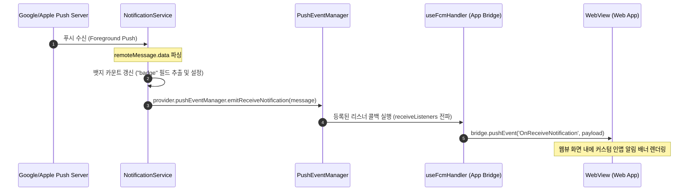
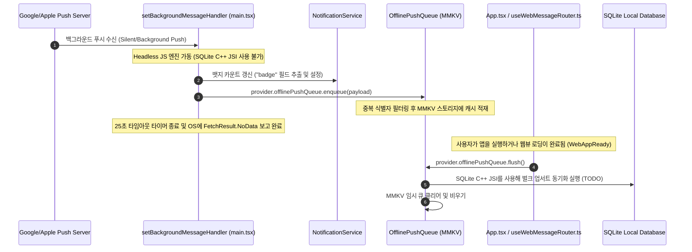

# Project Structure

---

# 푸시 알림 및 통합 라우팅 아키텍처 (Push Notification & Unified Routing)

본 어플리케이션은 하이브리드 웹뷰 환경에서 **사일런트(Silent), 백그라운드(Background), 포그라운드(Foreground)** 알림을 안정적으로 수신하고 처리하기 위해 인터페이스 기반의 구조 및 오프라인 동기화 큐 시스템을 적용하고 있습니다.

## 1. 아키텍처 개요 (Architecture Overview)

하이브리드 환경의 제약 조건을 해결하기 위해 다음의 4가지 설계 원칙을 적용하였습니다.

1. **포그라운드 알림 제어 차단 (Foreground Suppression)**: 포그라운드 수신 시 OS 수준의 알림 배너를 억제하고 컨트롤을 WebView에 넘겨 맞춤형 인앱 배너를 띄웁니다.
2. **헤드리스 에러 복구 (Headless JS SQLite ReferenceError Fallback)**: 앱이 완전히 종료(Killed)된 상태에서 Silent Push가 유입되면 Android Headless JS가 실행됩니다. 이때 C++ JSI 바인딩이 누락되어 SQLite를 호출하면 앱이 강제 종료되므로, JSI 에러를 캐치해 **MMKV 기반의 `OfflinePushQueue`**에 임시 적재한 후 차후 앱 실행 또는 WebView 준비 완료(`WebAppReady`) 시점에 SQLite로 벌크 업서트(Bulk Upsert)합니다.
3. **백그라운드 25초 타임아웃 보장 (iOS Safeguard)**: iOS/Android의 백그라운드 최대 수행 시간(30초)에 의한 강제 종료 및 OS 밴(Ban) 정책을 회피하기 위해 `Promise.race`를 탑재하여 25초 이내에 강제 종료 처리와 `NoData` 완료 보고를 보장합니다.
4. **런타임 번역 동적 갱신 (Dynamic Android Channel i18n)**: 안드로이드 알림 설정 창에 기기 언어 설정이 즉시 반영되도록, 채널명을 정적 상수가 아닌 런타임 다국어 유틸인 `t('notification.channel.*')`를 이용해 동적으로 등록 및 변경 갱신합니다.
5. **뱃지 필드 자동 추출 및 설정 (Automatic Badge Extraction)**: 수신된 FCM/APNs `data` 페이로드 내에 `"badge"` 필드(예: `"badge": "5"`)가 존재할 경우, 포그라운드/백그라운드/종료(Headless) 전 상태에 걸쳐 자동으로 문자열을 숫자로 파싱하여 네이티브 앱 아이콘 뱃지 값(`setBadgeCount`)을 갱신합니다.

---

## 2. 주요 구성 컴포넌트 (Key Components)

### 📂 `src/app/services/notification`

- **`NotificationService`** (`types.ts` / `NotificationService.ts`)
    - `@react-native-firebase/messaging` 및 `@notifee/react-native` 모듈 래퍼.
    - 퍼미션 요청, APNs/FCM 토큰 발급, 앱 뱃지 카운트 제어(`setBadgeCount`, `getBadgeCount`) 담당.
    - 다국어 패키지(`@chatic/i18n-mobile`)의 `t()`와 바인딩되어 안드로이드 알림 채널명을 동적으로 생성 및 갱신.
- **`OfflinePushQueue`** (`types.ts` / `OfflinePushQueue.ts`)
    - MMKV 키-값 스토리지(`provider.keyValueStorage`)를 버퍼로 사용하는 오프라인 저장소.
    - 중복 수신된 페이로드를 식별자 기준으로 데듀플리케이션(Deduplication)하여 인큐.
    - WebView가 로드되어 `WebAppReady` 이벤트를 네이티브로 보내거나 앱 진입 시 `flush()`를 호출하여 대기 페이로드를 콘솔 디버깅/SQLite 적재(`TODO`) 처리 후 큐를 비웁니다.
- **`PushEventManager`** (`types.ts` / `PushEventManager.ts`)
    - 네이티브의 알림 감지 콜백과 WebView 브릿지를 안전하게 디커플링하는 싱글톤 이벤트 리스너 레지스트리.
    - 포그라운드 이벤트(`OnReceiveNotification`)의 다중 구독자 전파 지원.
- **`DeeplinkRoutingService`** (`types.ts` / `DeeplinkRoutingService.ts`)
    - 알림 배너나 푸시 팝업 클릭 시 획득한 커스텀 페이로드(`notification.data`)를 분석해 일관된 프론트엔드 라우팅 URL로 파싱하고 `DeepLinkManager`로 핸들링 처리를 위임하는 중간 제어 모듈 (`TODO` 로깅 플레이스홀더 구성).

---

## 3. 웹뷰 브릿지 연동 (WebView Bridge Integration)

- **`useFcmHandler.ts`**
    - WebView 단에서 디바이스 토큰 조회를 요청하는 `FetchFcmToken` 요청 처리 및 네이티브 응답 반환.
    - 포그라운드 알림 감지 시 브릿지를 통해 WebView에 실시간 이벤트 푸시 전송.
    - 백그라운드 클릭 및 앱 종료 상태 클릭(Cold Start) 시 전달된 페이로드를 `DeeplinkRoutingService`로 라우팅 처리 지시.
- **`useWebMessageRouter.ts`**
    - WebView에서 네이티브 앱 아이콘 뱃지 값을 제어할 수 있는 브릿지 명령 핸들러 바인딩.
        - `FetchBadgeCount`: 앱 아이콘에 설정된 뱃지 카운트 반환.
        - `SetBadgeCount`: 인자로 받은 특정 숫자로 배지 갱신.
    - `WebAppReady` 수신 즉시 `OfflinePushQueue.flush()`를 수행하여 백그라운드 대기 상태였던 푸시 캐시를 동기화.

---

## 4. 수동 기능 테스트 및 진단 (Manual Testing Dashboard)

개발자 도구 화면인 **`NotificationTestScreen.tsx`** 내에 아래 항목들을 빠르게 검증할 수 있는 디버그 패널이 준비되어 있습니다.

1. **뱃지 제어 (Badge Control)**: 네이티브 뱃지 카운트 값을 직접 조회하고 증가(`+1`)시키거나 클리어(`0`) 할 수 있습니다.
2. **오프라인 큐 시뮬레이터 (MMKV Queue Simulation)**: 가상의 Silent Push 유입을 모킹하여 MMKV 큐에 적재하고, 플러시 클릭 시 순서대로 큐에서 유실 없이 소비되는지 디버그 콘솔을 통해 확인합니다.
3. **알림 클릭 테스트 (Mock Route Click)**: 가상 배너 클릭 유입을 발생시켜 라우터 모듈이 수신 페이로드를 잘 가공하는지 진단합니다.

---

## 5. 핵심 서비스 간의 관계 및 데이터 흐름 (Relationships & Data Flow)

푸시 시스템을 구성하는 세 가지 주요 서비스인 `NotificationService`, `PushEventManager`, `OfflinePushQueue`는 단독으로 동작하지 않고, 앱의 라이프사이클 및 실행 환경 상태(포그라운드/백그라운드/종료)에 맞춰 상호 긴밀하게 협력합니다.

### A. 서비스 간 정적 구조 및 관계도 (Static Relationship)

이 세 서비스는 모두 인터페이스 기반(`types.ts`)으로 설계되었으며, `provider.ts` 의 의존성 주입 체계(`provider.notificationService`, `provider.pushEventManager`, `provider.offlinePushQueue`)에 등록되어 인스턴스가 관리됩니다.

- **`NotificationService` (네이티브 알림 생산자)**: 네이티브 OS(FCM/APNs)로부터 직접 알림 이벤트를 공급받는 최하위 입출력 인터페이스입니다.
- **`PushEventManager` (포그라운드 브로커)**: `NotificationService`와 하이브리드 웹뷰 브릿지(`useFcmHandler`) 사이를 조율하는 중간 이벤트 분배기 역할을 합니다.
- **`OfflinePushQueue` (백그라운드 임시 버퍼)**: 메인 컨텍스트가 로드되지 않은 헤드리스 환경 또는 데이터 유실이 우려되는 종료 상태에서 페이로드를 안전하게 MMKV 디스크에 캐싱해두는 임시 금고 역할을 합니다.

---

### B. 시나리오별 동적 데이터 흐름 (Dynamic Data Flow)

#### 1) 포그라운드(Foreground) 상태 흐름

앱이 활성화되어 사용자가 사용 중일 때 푸시가 유입되는 흐름입니다.

#### 2) 백그라운드 및 종료(Headless JS) 상태 흐름

앱이 완전히 백그라운드로 내려갔거나 종료(Killed)되었을 때 알림이 유입되는 흐름입니다. SQLite가 사용 불가한 환경에서도 유실이 없도록 임시 디스크(MMKV)에 저장했다가 다시 주입합니다.

이와 같이 세 서비스는 **OS 입력 단자(`NotificationService`)**, **포그라운드 전파 단자(`PushEventManager`)**, **백그라운드 캐시 단자(`OfflinePushQueue`)**로 역할이 철저히 격리되어 상호 간의 간섭 없이 안정적으로 수신 처리를 완수합니다.
