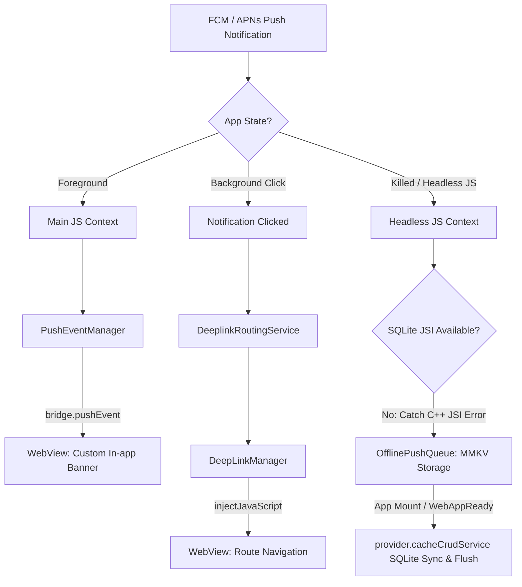
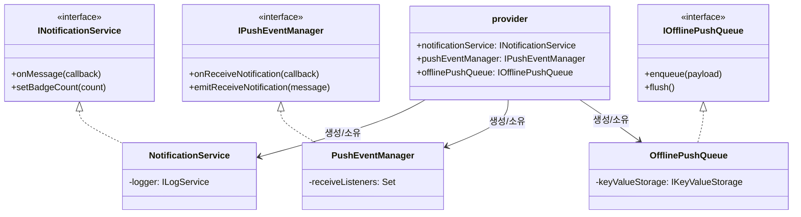
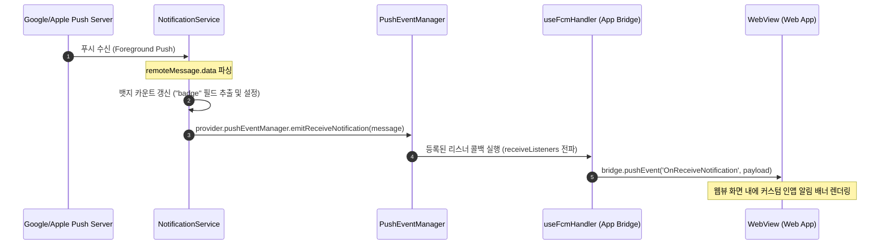
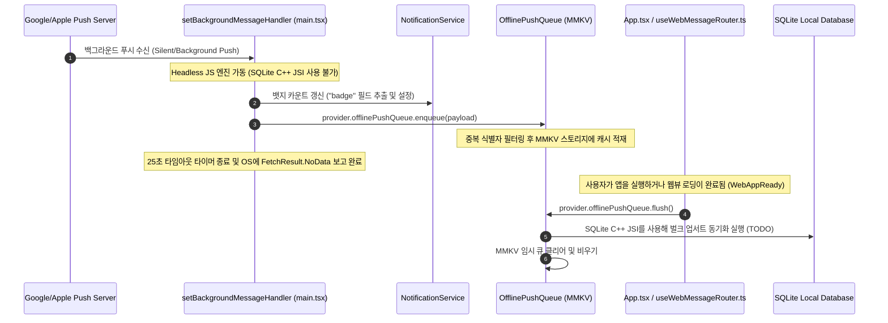
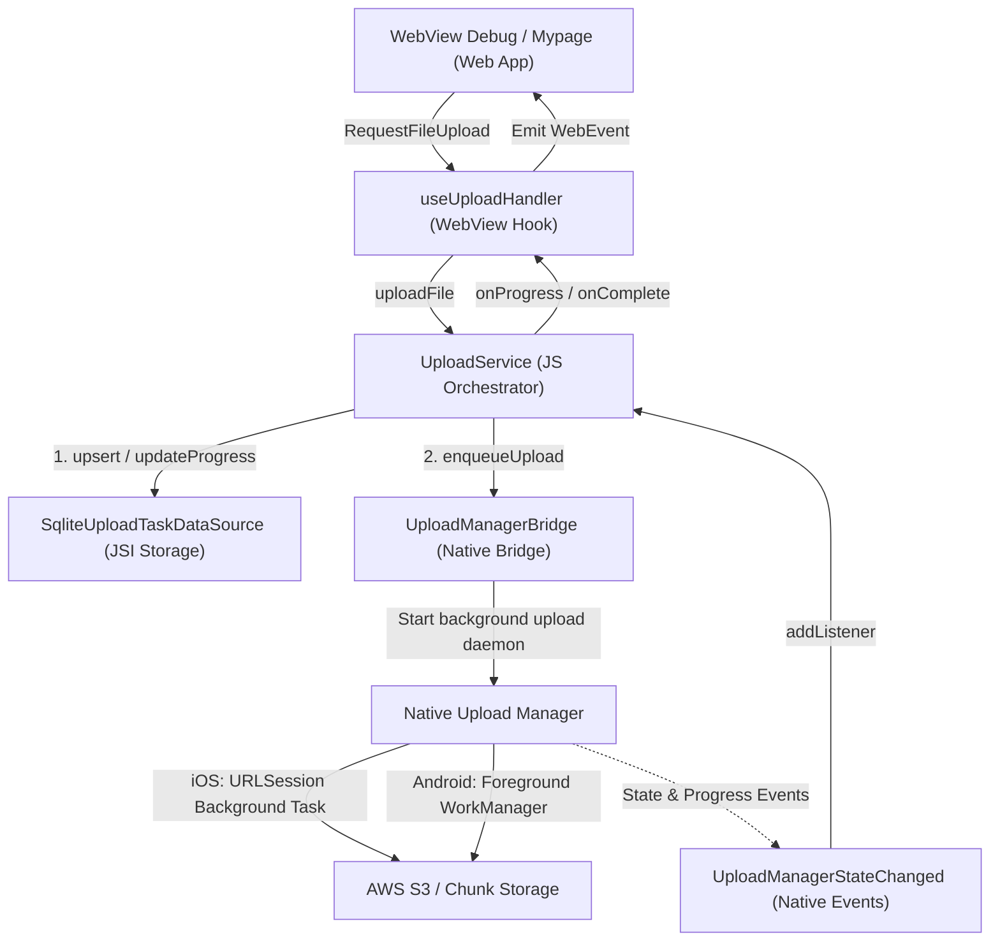

# Project Structure

---

# 푸시 알림 및 통합 라우팅 아키텍처 (Push Notification & Unified Routing)

본 어플리케이션은 하이브리드 웹뷰 환경에서 **사일런트(Silent), 백그라운드(Background), 포그라운드(Foreground)** 알림을 안정적으로 수신하고 처리하기 위해 인터페이스 기반의 구조 및 오프라인 동기화 큐 시스템을 적용하고 있습니다.

## 1. 아키텍처 개요 (Architecture Overview)

하이브리드 환경의 제약 조건을 해결하기 위해 다음의 4가지 설계 원칙을 적용하였습니다.

1. **포그라운드 알림 제어 차단 (Foreground Suppression)**: 포그라운드 수신 시 OS 수준의 알림 배너를 억제하고 컨트롤을 WebView에 넘겨 맞춤형 인앱 배너를 띄웁니다.
2. **헤드리스 에러 복구 (Headless JS SQLite ReferenceError Fallback)**: 앱이 완전히 종료(Killed)된 상태에서 Silent Push가 유입되면 Android Headless JS가 실행됩니다. 이때 C++ JSI 바인딩이 누락되어 SQLite를 호출하면 앱이 강제 종료되므로, JSI 에러를 캐치해 **MMKV 기반의 `OfflinePushQueue`**에 임시 적재한 후 차후 앱 실행 또는 WebView 준비 완료(`WebAppReady`) 시점에 SQLite로 벌크 업서트(Bulk Upsert)합니다.
3. **백그라운드 25초 타임아웃 보장 (iOS Safeguard)**: iOS/Android의 백그라운드 최대 수행 시간(30초)에 의한 강제 종료 및 OS 밴(Ban) 정책을 회피하기 위해 `Promise.race`를 탑재하여 25초 이내에 강제 종료 처리와 `NoData` 완료 보고를 보장합니다.
4. **런타임 번역 동적 갱신 (Dynamic Android Channel i18n)**: 안드로이드 알림 설정 창에 기기 언어 설정이 즉시 반영되도록, 채널명을 정적 상수가 아닌 런타임 다국어 유틸인 `t('notification.channel.*')`를 이용해 동적으로 등록 및 변경 갱신합니다.
5. **뱃지 필드 자동 추출 및 설정 (Automatic Badge Extraction)**: 수신된 FCM/APNs `data` 페이로드 내에 `"badge"` 필드(예: `"badge": "5"`)가 존재할 경우, 포그라운드/백그라운드/종료(Headless) 전 상태에 걸쳐 자동으로 문자열을 숫자로 파싱하여 네이티브 앱 아이콘 뱃지 값(`setBadgeCount`)을 갱신합니다.

---

## 2. 주요 구성 컴포넌트 (Key Components)

### 📂 `src/app/services/notification`

- **`NotificationService`** (`types.ts` / `NotificationService.ts`)
    - `@react-native-firebase/messaging` 및 `@notifee/react-native` 모듈 래퍼.
    - 퍼미션 요청, APNs/FCM 토큰 발급, 앱 뱃지 카운트 제어(`setBadgeCount`, `getBadgeCount`) 담당.
    - 다국어 패키지(`@chatic/i18n-mobile`)의 `t()`와 바인딩되어 안드로이드 알림 채널명을 동적으로 생성 및 갱신.
- **`OfflinePushQueue`** (`types.ts` / `OfflinePushQueue.ts`)
    - MMKV 키-값 스토리지(`provider.keyValueStorage`)를 버퍼로 사용하는 오프라인 저장소.
    - 중복 수신된 페이로드를 식별자 기준으로 데듀플리케이션(Deduplication)하여 인큐.
    - WebView가 로드되어 `WebAppReady` 이벤트를 네이티브로 보내거나 앱 진입 시 `flush()`를 호출하여 대기 페이로드를 콘솔 디버깅/SQLite 적재(`TODO`) 처리 후 큐를 비웁니다.
- **`PushEventManager`** (`types.ts` / `PushEventManager.ts`)
    - 네이티브의 알림 감지 콜백과 WebView 브릿지를 안전하게 디커플링하는 싱글톤 이벤트 리스너 레지스트리.
    - 포그라운드 이벤트(`OnReceiveNotification`)의 다중 구독자 전파 지원.
- **`DeeplinkRoutingService`** (`types.ts` / `DeeplinkRoutingService.ts`)
    - 알림 배너나 푸시 팝업 클릭 시 획득한 커스텀 페이로드(`notification.data`)를 분석해 일관된 프론트엔드 라우팅 URL로 파싱하고 `DeepLinkManager`로 핸들링 처리를 위임하는 중간 제어 모듈 (`TODO` 로깅 플레이스홀더 구성).

---

## 3. 웹뷰 브릿지 연동 (WebView Bridge Integration)

- **`useFcmHandler.ts`**
    - WebView 단에서 디바이스 토큰 조회를 요청하는 `FetchFcmToken` 요청 처리 및 네이티브 응답 반환.
    - 포그라운드 알림 감지 시 브릿지를 통해 WebView에 실시간 이벤트 푸시 전송.
    - 백그라운드 클릭 및 앱 종료 상태 클릭(Cold Start) 시 전달된 페이로드를 `DeeplinkRoutingService`로 라우팅 처리 지시.
- **`useWebMessageRouter.ts`**
    - WebView에서 네이티브 앱 아이콘 뱃지 값을 제어할 수 있는 브릿지 명령 핸들러 바인딩.
        - `FetchBadgeCount`: 앱 아이콘에 설정된 뱃지 카운트 반환.
        - `SetBadgeCount`: 인자로 받은 특정 숫자로 배지 갱신.
    - `WebAppReady` 수신 즉시 `OfflinePushQueue.flush()`를 수행하여 백그라운드 대기 상태였던 푸시 캐시를 동기화.

---

## 4. 수동 기능 테스트 및 진단 (Manual Testing Dashboard)

개발자 도구 화면인 **`NotificationTestScreen.tsx`** 내에 아래 항목들을 빠르게 검증할 수 있는 디버그 패널이 준비되어 있습니다.

1. **뱃지 제어 (Badge Control)**: 네이티브 뱃지 카운트 값을 직접 조회하고 증가(`+1`)시키거나 클리어(`0`) 할 수 있습니다.
2. **오프라인 큐 시뮬레이터 (MMKV Queue Simulation)**: 가상의 Silent Push 유입을 모킹하여 MMKV 큐에 적재하고, 플러시 클릭 시 순서대로 큐에서 유실 없이 소비되는지 디버그 콘솔을 통해 확인합니다.
3. **알림 클릭 테스트 (Mock Route Click)**: 가상 배너 클릭 유입을 발생시켜 라우터 모듈이 수신 페이로드를 잘 가공하는지 진단합니다.

---

## 5. 핵심 서비스 간의 관계 및 데이터 흐름 (Relationships & Data Flow)

푸시 시스템을 구성하는 세 가지 주요 서비스인 `NotificationService`, `PushEventManager`, `OfflinePushQueue`는 단독으로 동작하지 않고, 앱의 라이프사이클 및 실행 환경 상태(포그라운드/백그라운드/종료)에 맞춰 상호 긴밀하게 협력합니다.

### A. 서비스 간 정적 구조 및 관계도 (Static Relationship)

이 세 서비스는 모두 인터페이스 기반(`types.ts`)으로 설계되었으며, `provider.ts` 의 의존성 주입 체계(`provider.notificationService`, `provider.pushEventManager`, `provider.offlinePushQueue`)에 등록되어 인스턴스가 관리됩니다.

- **`NotificationService` (네이티브 알림 생산자)**: 네이티브 OS(FCM/APNs)로부터 직접 알림 이벤트를 공급받는 최하위 입출력 인터페이스입니다.
- **`PushEventManager` (포그라운드 브로커)**: `NotificationService`와 하이브리드 웹뷰 브릿지(`useFcmHandler`) 사이를 조율하는 중간 이벤트 분배기 역할을 합니다.
- **`OfflinePushQueue` (백그라운드 임시 버퍼)**: 메인 컨텍스트가 로드되지 않은 헤드리스 환경 또는 데이터 유실이 우려되는 종료 상태에서 페이로드를 안전하게 MMKV 디스크에 캐싱해두는 임시 금고 역할을 합니다.

---

### B. 시나리오별 동적 데이터 흐름 (Dynamic Data Flow)

#### 1) 포그라운드(Foreground) 상태 흐름

앱이 활성화되어 사용자가 사용 중일 때 푸시가 유입되는 흐름입니다.

#### 2) 백그라운드 및 종료(Headless JS) 상태 흐름

앱이 완전히 백그라운드로 내려갔거나 종료(Killed)되었을 때 알림이 유입되는 흐름입니다. SQLite가 사용 불가한 환경에서도 유실이 없도록 임시 디스크(MMKV)에 저장했다가 다시 주입합니다.

이와 같이 세 서비스는 **OS 입력 단자(`NotificationService`)**, **포그라운드 전파 단자(`PushEventManager`)**, **백그라운드 캐시 단자(`OfflinePushQueue`)**로 역할이 철저히 격리되어 상호 간의 간섭 없이 안정적으로 수신 처리를 완수합니다.

---

# 고성능 네이티브 기반 대용량 파일 업로드 아키텍처 (Native-Driven Chunk Upload System)

본 어플리케이션은 1GB 이상의 대용량 파일을 하이브리드 웹뷰 환경에서 안정적이고 빠르게 업로드하기 위해, **100% 네이티브 모듈 주도형 청크 업로드 엔진**과 **SQLite 기반 오프라인 상태 영속화 시스템**을 갖추고 있습니다.

하이브리드 환경의 성능 병목이었던 JS 엔진 내 파일 바이너리 처리(Base64 인코딩/디코딩) 및 React Native Bridge의 직렬화 오버헤드를 근본적으로 해결하기 위해, 모든 전송 파이프라인과 백그라운드 처리를 OS 네이티브 데몬에게 직접 위임합니다.

## 1. 아키텍처 개요 (Architecture Overview)

성능과 배터리 효율 극대화를 위해 다음의 핵심 설계를 구현하였습니다:

1. **JNI 경유 바이너리 전달 제거 (Zero JNI Buffer Copy)**: JS 컨텍스트에서 대용량 파일의 청크를 쪼개어 Base64로 전송하는 레거시 패턴을 삭제하였습니다. 대신 웹뷰 및 서비스 레이어는 메타데이터와 엔드포인트 정보만 네이티브 브릿지에 전달하며, 실제 디바이스 스토리지 상의 바이너리 IO 및 전송 제어는 네이티브 스레드에서 직접 수행합니다.
2. **네이티브 상태 드리븐 동기화 (Event-Driven State Engine)**: JS 서비스 레이어는 타이머 기반의 폴링이나 추정 진행률 계산을 배제하고, 네이티브 업로드 엔진이 백그라운드 스레드에서 직접 발행하는 `UploadManagerStateChanged` 이벤트를 리스닝하여 정확한 바이트 진행도 및 상태 전이를 콜백에 매핑합니다.
3. **SQLite JSI 기반 중단점 복구 (Resume-from-Offset)**: 앱 강제 종료, OS 메모리 압박으로 인한 크래시, 네트워크 유실 상황에서도 사용자가 업로드를 중단점에서 이어서 재개할 수 있도록, 청크 단위 완료 시점마다 **SQLite JSI 스토리지(`SqliteUploadTaskDataSource`)**에 마지막 업로드 완료 바이트 오프셋과 청크 인덱스를 영속화합니다.
4. **수동/자동 복구 지원 (Manual Recovery)**: 앱 부팅 시 `listRecoverableUploads()` API를 호출하여 이전에 완료되지 않은 채 중단된 업로드 작업 정보를 SQLite로부터 불러와 UI 상에 일시정지(`paused`) 또는 실패(`failed`) 상태로 표시하고, 사용자의 명시적 클릭 시 복구를 수행할 수 있는 인터페이스를 제공합니다.
5. **iOS Swift 및 Background URLSession 통합 (Swift Delegate-based Engine)**: Background URLSession 전송 시 completionHandler 블록을 지원하지 않고 강제 크래시를 유발하는 iOS OS 정책을 회피하기 위해, Swift 기반 업로드 모듈로 전면 재작성하였습니다. `UploadChunkContext`와 전용 델리게이트 수신 구조를 구성하여 앱이 Suspend 되거나 종료되더라도 시스템 데몬(`nsurlsessiond`)이 청크 업로드를 순차적이고 안정적으로 처리하도록 고도화하였습니다.
6. **Android 14+ 데이터 동기화 포그라운드 준수 (Android 14+ Foreground Service Type Safety)**: Target SDK 34+ 사양에 맞춰 Android `UploadBackgroundService` 및 WorkManager의 `SystemForegroundService` 모두 매니페스트 레벨에서 `android:foregroundServiceType="dataSync"`로 통합 지정 및 선언하고, 런타임에 명시적인 `ServiceInfo.FOREGROUND_SERVICE_TYPE_DATA_SYNC` 타입 비트를 실어 Foreground Service를 기동함으로써 OS 차원의 강제 킬(Kill) 및 런타임 예외를 완전히 차단하였습니다.

---

## 2. 주요 구성 컴포넌트 (Key Components)

### 📂 `src/app/services/upload`

- **`UploadService`** (`types.ts` / `UploadService.ts`)
    - 업로드 상태 관리 및 이벤트를 네이티브 리스너와 바인딩하는 메인 오케스트레이터.
    - 브릿지가 항상 연결되어 있는 하이브리드 보장을 기반으로 하므로, 불필요한 JS Fallback Loop 및 Semaphore Concurrency Logic을 제거하고 완전한 네이티브 단일 파이프라인으로 구성되었습니다.
    - `UploadManagerBridge`와 연동하여 Enqueue, Pause, Resume, Cancel 동작을 직접 제어합니다.
- **`SqliteUploadTaskDataSource`** (`repository/types.ts` / `repository/SqliteUploadTaskDataSource.ts`)
    - `@op-engineering/op-sqlite` 라이브러리를 경유해 SQLite 스키마 테이블에 파일 메타데이터, 청크 오프셋 상태를 즉각 쓰기/읽기 수행하는 로컬 저장소 계층.
    - 비동기 SQLite JSI 바인딩을 적용하여 데이터 조회/쓰기 동작의 병목을 없앴습니다.

### 📱 네이티브 플랫폼 영역 (Native Platform Components)

- **iOS Swift 업로드 엔진 (`UploadManager.swift` / `UploadManager.m`)**
    - **백그라운드 세션 (`URLSessionConfiguration.background`)**: 앱이 백그라운드에 진입하거나 Suspend 되더라도 iOS 시스템 데몬(`nsurlsessiond`)이 백그라운드 환경에서 전송 작업을 끝까지 유지하도록 전담 제어합니다.
    - **파일 기반 청크 전송**: iOS 백그라운드 세션의 제한 사항(인메모리 바이너리 스트리밍 불가)을 준수하기 위해, 청크 단위로 multipart/form-data 규격의 임시 파일(`NSTemporaryDirectory()`)을 생성해 `uploadTask(with:fromFile:)`로 전송합니다.
    - **델리게이트 기반 상태 시퀀싱**: 백그라운드 세션 내의 completionHandler 호출 제한(크래시 유발) 문제를 해결하기 위해 `URLSessionTaskDelegate`를 완벽 구현하여, 각 청크 전송의 완료 피드백을 수신하고 다음 청크를 순차 기동하는 이벤트 루프를 구성합니다.
    - **직렬 상태 관리 큐 (`stateQueue`)**: 모든 태스크 등록/조회/삭제 및 업로드 상태 전이를 전용 직렬 큐(`DispatchQueue`) 위에서 동기화하여 다중 스레드 레이스 컨디션을 완전히 방지합니다.
    - **백오프 재시도 및 메인 스레드 연동**: 일시적 네트워크 장애 발생 시 지수 백오프 기반으로 임시 파일을 재사용해 자동 재시도하며, 모든 이벤트 완료 후 OS가 앱을 다시 정상 휴면할 수 있도록 `urlSessionDidFinishEvents` 시점에 AppDelegate 완료 핸들러를 메인 스레드에서 즉각 해제 보고합니다.

- **Android Kotlin 업로드 엔진 (`UploadBackgroundService.kt` / `UploadWorker.kt`)**
    - **하이브리드 포그라운드 동기화 (Foreground Service + WorkManager)**: 대용량 파일 전송 중 OS에 의한 강제 프로세스 회수를 원천 차단하기 위해 안드로이드 Foreground Service와 WorkManager가 상호 보완하는 구조로 설계되었습니다.
    - **WorkManager 제약 조건 제어 (`UploadWorker`)**: 기기의 네트워크 연결(`NetworkType.CONNECTED`) 상태 조건을 보장하고, 실행 즉시 Foreground Worker로 등록되어 OS가 장기 실행 작업으로 관리하게 만듭니다.
    - **포그라운드 서비스 및 멀티스레드 전송 (`UploadBackgroundService`)**: 최대 3개의 파일 동시 업로드를 관리하는 고성능 스레드풀(`FixedThreadPool`)을 운용하며, 물리 파일 스트리밍 IO(`FileInputStream`) 및 CPU 유지를 위한 `WakeLock`을 직접 핸들링합니다.
    - **Android 14+ 데이터 동기화 규격 대응**: `AndroidManifest.xml`에 `tools:node="merge"` 속성을 정의하여 내장 `SystemForegroundService`에 `foregroundServiceType="dataSync"` 속성을 강제 주입 병합하고, 런타임 Foreground Service 기동 시 `FOREGROUND_SERVICE_TYPE_DATA_SYNC` 타입 비트를 명시적으로 결합해 OS 런타임 충돌을 배제하였습니다.
    - **안드로이드 브로드캐스트 이벤트 통신**: 실시간 전송 현황을 `ACTION_UPLOAD_EVENT` 인텐트 브로드캐스트로 발행하며, 이를 브릿지(`UploadManagerModule`)에서 가로채 JS 영역의 `UploadManagerStateChanged` 이벤트로 즉각 주입합니다.

---

## 3. 기능 수동 테스트 및 진단 (Upload Debug Screen)

개발자 전용 도구 화면인 **`UploadTestScreen.tsx`**를 통해 네이티브 백그라운드 업로드 기능을 안정적으로 진단할 수 있습니다:

1. **대용량 가상 파일 staging (Sparse Mock Generator)**: Unix `ftruncate` API를 브릿지로 호출하여, 실제 SSD 쓰기 주기(Flash Lifecycle) 손상 없이 기기 디렉토리에 즉각 **1GB / 5GB 크기의 가상 파일**을 스테이징 생성합니다.
2. **AppState 백그라운드 추적기 (Background Endurance Logger)**: 앱이 포그라운드(Active)에서 백그라운드(Background)로 진입 및 복귀할 때의 앱 상태를 실시간 로깅하여 OS의 백그라운드 정책 속에서도 네이티브 이벤트가 지속 수신되는지 가시적으로 확인합니다.
3. **고해상도 성능 대시보드 (Throughput & ETA Dashboard)**: 초당 전송 속도(**MB/s**), 소요 시간, 그리고 전송 추세를 수학적으로 추정한 **남은 시간(ETA)** 정보를 실시간으로 계산해 화면 상에 렌더링합니다.
