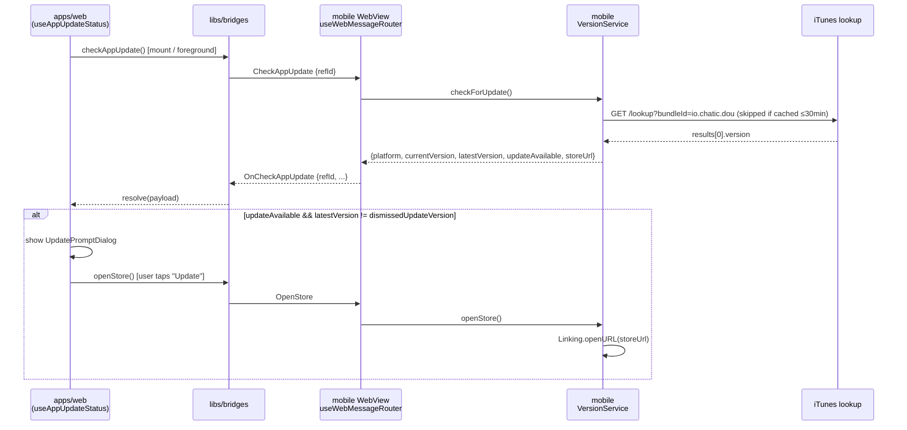

# App update check

Compares the app's current version against the store's live version, and offers an update — a
native alert at boot, and a web dialog that can appear anywhere in the app.

## Design principles

- **Only a live version counts.** A build still in review is never treated as "an update exists".
  The only version source is what the store actually serves — for iOS, an iTunes lookup by bundle
  id. Android has no equivalent live-version API yet, so it never reports an update
  (`getLatestVersion('android')` returns `null`).
- **The comparison lives in one place.** `VersionService` (mobile) does the fetch and the
  comparison; every consumer — the boot alert, the web bridge handler, the my-page row — reads its
  result rather than repeating the logic.
- **The web never guesses ahead of a check.** `CHATIC_APP_SHOULD_UPDATE`, the boot-time WebView
  injection, is always `false` on a cold start because the App Store lookup only resolves after the
  WebView exists — so the shared `useAppUpdateStatus` store treats the bridge round trip
  (`appBridge.checkAppUpdate()`) as the only source of truth, not the injected value.
- **Non-native never asks.** In a plain browser (`isNative()` false) the web skips the bridge call
  entirely and stays on "no update".

## Two independent paths to the same service

`VersionService.checkForUpdate()` is called from two places that don't know about each other:

1. **Boot-time native alert** — `App.tsx` calls `useAppVersionCheck(true)` once on mount; if an
   update exists it calls `showUpdateAlert()`, a native `Alert.alert` with "later" / "update"
   (update opens the store URL directly via `Linking.openURL`). The result is also cached in a
   module-level singleton and pushed to the web as `OnUpdateDeviceInfo`
   (`useVersionCheckHandler.ts`), independently of the dialog below.
2. **Web dialog, on demand** — `useAppUpdateStatus` (web) calls `appBridge.checkAppUpdate()` on
   mount and on every foreground return (`useAppForeground`). The mobile handler
   (`useAppUpdateHandler.ts`) answers with the same `VersionService.checkForUpdate()` result,
   `OnCheckAppUpdate`. `VersionService` caches a **successful** lookup for 30 minutes
   (`CACHE_TTL_MS`) so repeated calls in a long-lived session are cheap; a failed or unavailable
   lookup (Android, network error) is never cached, so the very next call retries.

Both paths can fire in the same app run — the native alert is boot-only and fire-once, the web
dialog re-checks every time the app returns to the foreground.

## Web dialog flow

`useAppUpdatePrompt` opens `UpdatePromptDialog` when `updateAvailable` is true **and** the live
version differs from the one the user already dismissed
(`config.get('ui.dismissedUpdateVersion')` via `@chatic/config`, `lane: 'local'`). Both "later" and
"update" persist the current `latestVersion` as dismissed — "update" as well, because a user who
went to the store does not need to be asked again for the same version. A newer live version clears
the effective dismissal simply because it no longer matches.



## Files

| Layer  | File                                                                     | Role                                                              |
| ------ | ------------------------------------------------------------------------ | ----------------------------------------------------------------- |
| mobile | `src/app/services/version/VersionService.ts`                             | `getLatestVersion`, `checkForUpdate` (with cache), `openStore`    |
| mobile | `src/app/hooks/useAppVersionCheck.ts`                                    | Boot-time check → native `Alert`, module singleton for consumers  |
| mobile | `src/app/webview/hooks/useVersionCheckHandler.ts`                        | Pushes the boot-time result to web as `OnUpdateDeviceInfo`        |
| mobile | `src/app/webview/hooks/useAppUpdateHandler.ts`                           | Answers `CheckAppUpdate` / `OpenStore` bridge messages            |
| web    | `apps/web/src/app/bridge/appBridge.ts` (`checkAppUpdate`, `openStore`)   | Bridge facade the web calls                                       |
| web    | `apps/web/src/app/features/appUpdate/hooks/useAppUpdateStatus.ts`        | Shared zustand store; runs the check on mount and on foreground   |
| web    | `apps/web/src/app/features/appUpdate/hooks/useAppUpdatePrompt.ts`        | Dismissal logic against `config` lane `ui.dismissedUpdateVersion` |
| web    | `apps/web/src/app/features/appUpdate/components/AppUpdatePromptHost.tsx` | Mounted once at the app root — route-independent                  |
| web    | `apps/web/src/app/features/appUpdate/components/UpdatePromptDialog.tsx`  | The dialog itself                                                 |

## Version comparison

`parseVersion`/`isNewerVersion` (in `VersionService.ts`) split each version on `.`, compare
numerically part by part, and treat a missing trailing part as `0` — `1.2` is not newer than
`1.2.0`, and `1.10.0` is newer than `1.9.9`.

## Verification

```bash
npx jest --config apps/mobile/jest.config.js -t Version
npx jest --config apps/web/jest.config.js -t "app update|useAppUpdate"
```

- mobile: `services/version/VersionService.test.ts`, `hooks/useAppVersionCheck.test.ts`,
  `webview/hooks/useAppUpdateHandler.test.ts`.
- web: `features/appUpdate/hooks/useAppUpdateStatus.test.ts`,
  `features/appUpdate/hooks/useAppUpdatePrompt.test.ts`,
  `features/appUpdate/components/UpdatePromptDialog.test.tsx`.
- Android's live-version lookup, the iTunes round trip on a real device, and the store-open
  itself need a real device or simulator — none of that is covered by the jest suites above.
