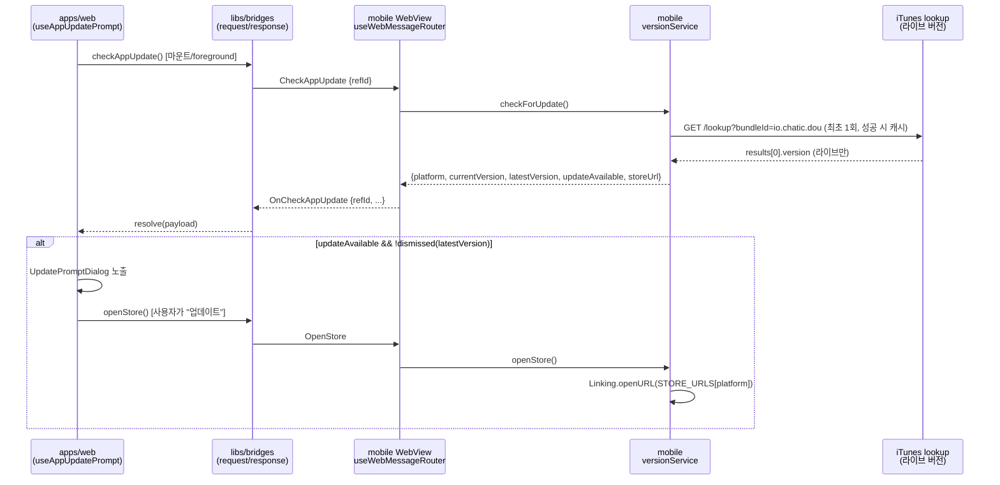
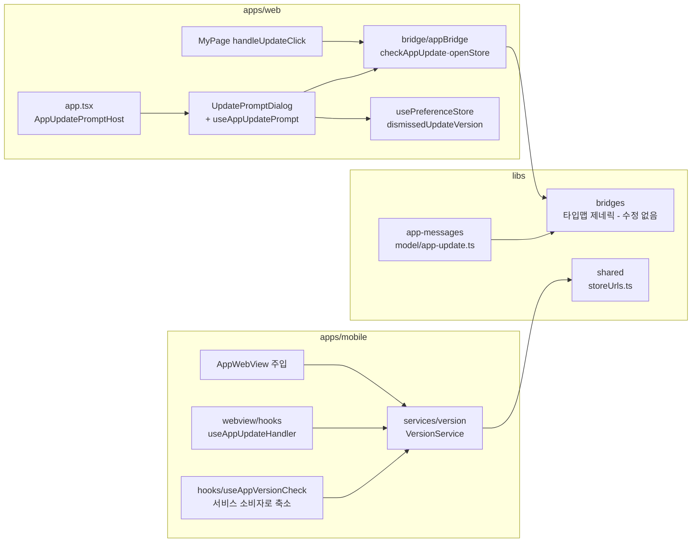

# 앱 업데이트 안내 (App Update Check)

> 상태: Live · 최종 갱신: 2026-07-29 · 관련 ADR: [ADR-0033](../../../docs/adr/0033-app-update-check-ios-first.md)

## 목적

앱(WebView 하이브리드)의 현재 버전과 스토어에 **실제 게시된(라이브)** 버전을 비교해, 웹 화면에서 업데이트 안내 팝업을 노출하고 스토어로 이동시킨다. 기존에는 네이티브 Alert + 전역 주입(`window.CHATIC_APP_*`)만 있어 웹이 원하는 시점에 조회할 수 없었고, `shouldUpdate` 타입이 경로마다 불일치(주입=문자열, push=boolean)했다.

## 설계 원칙

- **라이브 버전만 신뢰한다.** 심사중(승인 전) 버전을 "업데이트 있음"으로 오탐하는 경로를 만들지 않는다. 버전 소스는 스토어가 실제 서빙하는 값(iOS=iTunes lookup)만 사용한다.
- **버전 판단 책임은 네이티브 셸에 있다.** 웹은 비교 로직을 갖지 않고 네이티브의 판단 결과를 소비한다 (기존 `deviceInfoStore` 원칙 유지).
- **버전 로직은 `services/version` 한 곳에.** 훅·주입·알림·브리지 핸들러는 모두 서비스의 소비자다.
- **계약은 플랫폼 중립.** Android 백엔드 연동 시 `getLatestVersion('android')` 구현만 교체하면 되도록, 계약·웹 레이어는 플랫폼을 모른 채 동작한다.
- **선택형 안내.** 강제 업데이트 아님. `forceUpdate` 필드만 계약에 예약.
- **웹 팝업은 라우트와 무관한 전역 레이어.** 특정 페이지에 종속되면 그 페이지를 벗어난 동안 노출 기회를 놓친다 — 앱 루트(`app.tsx`)에 마운트해 어떤 화면에 있든 동작한다.

## 범위

**포함:** app-messages 계약(`CheckAppUpdate`/`OpenStore`), mobile `versionService` + 기존 훅/주입 리팩터, WebView 브리지 핸들러, web `appBridge.checkAppUpdate()`/`openStore()`, web 업데이트 안내 팝업(버전당 1회 persist), MyPage 스토어 이동 정리.

**제외:** Android 라이브 버전 조회(백엔드 `GET /app-version` 후속), 강제 업데이트 UI, What's New, 네이티브 앱 레포 쪽 핸들러 배선(이 repo 밖).

## 시나리오

1. **앱 부팅(iOS):** `useAppVersionCheck` 훅이 마운트 시 `versionService.checkForUpdate()`를 호출 → iTunes lookup으로 라이브 버전 조회+비교 → 업데이트가 있을 때만 모듈 싱글턴에 결과 캐시 → 기존과 동일하게 WebView 주입(`CHATIC_APP_LATEST_VERSION` 등) + 네이티브 Alert + `OnUpdateDeviceInfo` push.
2. **웹 초기 진입/포그라운드 복귀:** `AppUpdatePromptHost`(앱 루트, `app.tsx`)의 `useAppUpdatePrompt`가 `appBridge.checkAppUpdate()` 요청 → 네이티브가 `versionService.checkForUpdate()`(성공한 조회는 세션 내 캐시) 결과를 `OnCheckAppUpdate`로 응답 → `updateAvailable === true`이고 `dismissedUpdateVersion !== latestVersion`이면 `UpdatePromptDialog` 노출.
3. **팝업에서 "업데이트":** `appBridge.openStore()` 호출 + 해당 버전을 dismiss 처리(같은 버전으로는 재노출 방지) → 네이티브가 `Linking.openURL(STORE_URLS[platform])`로 스토어 이동.
4. **팝업에서 "나중에"(또는 ESC/바깥 클릭으로 닫힘):** `usePreferenceStore.dismissUpdate(latestVersion)` → `dismissedUpdateVersion` localStorage persist → 같은 버전으로는 재노출 없음. 다음 라이브 버전이 나오면 다시 노출.
5. **비네이티브(브라우저):** `useAppUpdatePrompt`가 `isNative()`가 아니면 `checkAppUpdate()` 호출 자체를 생략 → 팝업 미노출.
6. **Android:** `versionService.getLatestVersion('android')`가 항상 `null` → `checkForUpdate()`가 `updateAvailable: false`로 안전 폴백 → 팝업 없음.

## 다이어그램

## 상세 구현

### 1. app-messages 계약 (`libs/app-messages/src/types/`)

- **새 파일 `model/app-update.ts`** — `model/update.ts`는 이미 Electron 데스크톱 auto-update(electron-updater) 페이로드가 사용 중이므로 별도 파일로 분리.
  - `CheckAppUpdatePayload = {}` (요청), `OnCheckAppUpdatePayload = { platform: 'ios' | 'android'; currentVersion: string; latestVersion: string; updateAvailable: boolean; storeUrl: string; forceUpdate?: boolean }` (응답)
  - `OpenStorePayload = {}`, `OnOpenStorePayload = {}`
- `model/index.ts`에 `export * from './app-update';` 추가.
- `web-message.ts` `WebMessagePayloadMap`에 `CheckAppUpdate`, `OpenStore` 추가("10. App Update (mobile)" 섹션).
- `app-message.ts` `AppMessageDataMap`에 `OnCheckAppUpdate`, `OnOpenStore` 추가.
- `web-message-response.ts` `WEB_MESSAGE_RESPONSE_TYPE`에 `CheckAppUpdate: 'OnCheckAppUpdate'`, `OpenStore: 'OnOpenStore'` 매핑 추가 — `satisfies Record<WebMessageType, AppMessageType>`가 누락을 컴파일 에러로 강제.
- `libs/bridges/src`는 수정 불필요 (타입맵 제네릭).
- 참고: `VersionInfo`는 `model/device.ts`에 기존재 (기존 주입/push 경로용 — 유지).

### 2. mobile `versionService` (`apps/mobile/src/app/services/version/`)

기존 서비스 패턴(`services/<name>/{types.ts, <Name>Service.ts, index.ts}` + `provider.ts` lazy getter) 준수. 예: `services/dynamicAppIcon/`.

- `types.ts` — `IVersionService`, `AppUpdateCheckResult`(=`OnCheckAppUpdatePayload`), `AppUpdatePlatform`(`'ios' | 'android'`).
- `VersionService.ts` — 생성자 DI(`logService`).
  - `getCurrentVersion()`: `DeviceInfo.getVersion()`.
  - `getLatestVersion(platform)`: iOS = iTunes lookup(`https://itunes.apple.com/lookup?bundleId=io.chatic.dou` → `results[0].version`), Android = `null` 반환 (백엔드 준비 후 교체 지점).
  - `checkForUpdate()`: 조회+비교 → `AppUpdateCheckResult`. **성공한(라이브 버전을 얻은) 조회만** 인스턴스에 캐시 — Android/네트워크 실패 등 `null` 응답은 캐시하지 않아 다음 호출이 재시도한다.
  - `openStore()`: `getStoreUrl(Platform.OS)`(`@chatic/shared`) + `Linking.openURL`.
  - `parseVersion`/`isNewerVersion` — 기존 `useAppVersionCheck.ts`에서 이관된 플랫폼 무관 순수 함수, 모듈 레벨로 export.
- `provider.ts`에 lazy getter(`versionService`) + `services/index.ts`에서 export.
- `LogTag`에 `'VERSION'` 태그 추가(`services/log/types.ts`).

### 3. 기존 훅/주입 리팩터 (동작 불변)

- `hooks/useAppVersionCheck.ts` — iTunes fetch·비교·`parseVersion`/`isNewerVersion` 제거, `versionService.checkForUpdate()` 소비로 축소. 모듈 싱글턴(`getVersionCheckResult`/`onVersionCheckComplete`)과 `showUpdateAlert`, 훅 반환 시그니처(`{hasUpdate, showUpdateAlert}`)는 그대로 유지 — 소비자(`App.tsx`, `AppWebView.tsx`, `useVersionCheckHandler.ts`)는 무수정.
- `AppWebView.tsx` 주입과 `injectionScripts.ts`는 변경 없음 — 여전히 훅의 모듈 싱글턴 캐시를 동기 read.

### 4. mobile 브리지 핸들러

- 새 훅 `webview/hooks/useAppUpdateHandler.ts` — `useServices()`로 얻은 `versionService`를 사용. `CheckAppUpdate` → `checkForUpdate()` 결과를 `{type: 'OnCheckAppUpdate', success, data|error}`로 반환, `OpenStore` → `openStore()` 후 `{type: 'OnOpenStore', success}` 반환 (기존 `useOAuthHandler.ts` 패턴과 동일 — 핸들러가 반환한 객체를 라우터가 refId/버전과 함께 감싸 응답).
- `hooks/useServices.ts`에 `versionService` 노출 추가.
- `useWebMessageRouter.ts`의 `handlerMap`에 `CheckAppUpdate`/`OpenStore` 연결(`handlersRef` 초기값·effect 갱신 객체 양쪽에 핸들러 추가).

### 5. web appBridge (`apps/web/src/app/bridge/appBridge.ts`)

- `checkAppUpdate()` — `webClient.request({ type: 'CheckAppUpdate', data: {} })` (`oauthLogin` 패턴). 비네이티브에선 `NATIVE_NOT_SUPPORTED`로 reject.
- `openStore()` — `webClient.post({ type: 'OpenStore', data: {} })` (`openURL` 패턴, fire-and-forget).

### 6. web 업데이트 팝업

- `usePreferenceStore.ts`에 `dismissedUpdateVersion: string`(기본 `''`) + `dismissUpdate(version)` 추가. **`local` 전략**(localStorage만) — 설계 시 검토했던 `native+local`(`isFirstRun`과 동일)에서 변경: 이 값은 네이티브/서버 어느 쪽도 읽지 않는 순수 클라이언트 UX 가드(같은 버전 재노출 방지)라서, `pushMuted`/`channelSort`/`pinnedChannels`처럼 로컬 전용 전략이 더 맞고 `PreferenceKey`(app-messages) 유니온을 확장할 필요도 없다.
- `UpdatePromptDialog`(`features/appUpdate/components/`) — `@chatic/ui-kit` `AlertDialog`/`AlertDialogContent` + `ConfirmDialog.tsx`와 동일한 2버튼(하단 가로 분할) 스타일. "나중에" 버튼은 `AlertDialogCancel`(별도 onClick 없이 다이얼로그 close → `onOpenChange`가 `onDismiss` 호출), "업데이트" 버튼은 `AlertDialogAction onClick={onUpdate}`. 번역 키는 새 `appUpdate.*` 네임스페이스(ko/en `translation.json`).
- `useAppUpdatePrompt`(`features/appUpdate/hooks/`) — 마운트 시 + `useAppForeground` 복귀 시 `appBridge.checkAppUpdate()` 호출. `isNative()`가 아니면 호출 자체를 생략. 노출 조건 `updateAvailable && latestVersion !== dismissedUpdateVersion`. `dismiss()`/`goToStore()` 둘 다 `dismissUpdate(latestVersion)`을 호출해 같은 버전 재노출을 막는다(스토어로 이동한 경우도 재차 물어볼 필요가 없으므로).
- `AppUpdatePromptHost` — 위 훅과 다이얼로그를 연결하는 최소 컴포넌트. **`app.tsx`(앱 루트)에 `GlobalBridgeListener` 옆으로 마운트** — 애초 검토했던 "OnboardingModal 옆(HomePage)"이 아니라 라우트 전환과 무관한 전역 레이어를 택함(설계 원칙 참고).

### 7. MyPage 정리

- `MyPage.tsx`의 `handleUpdateClick` — 네이티브면 `appBridge.openStore()`(스토어 URL 계산을 네이티브에 위임), 비네이티브는 기존 `getStoreUrl()` + `window.open()` 유지.

## 검증 방법

- **유닛 테스트** (`*.test.ts(x)` 컨벤션):
  - mobile: `services/version/VersionService.test.ts`(parseVersion/isNewerVersion, checkForUpdate 성공/동일버전/HTTP실패/네트워크예외/캐시/Android, openStore), `hooks/useAppVersionCheck.test.ts`(마운트 조회, 캐시/리스너, checkOnMount=false, showUpdateAlert), `webview/hooks/useAppUpdateHandler.test.ts`(성공/실패 응답 매핑).
  - web: `bridge/appBridge.test.ts`(checkAppUpdate/openStore 호출), `stores/usePreferenceStore.test.ts`(dismissUpdate persist), `features/appUpdate/hooks/useAppUpdatePrompt.test.ts`(비네이티브 skip, 노출/미노출 조건, 실패 시 무시, foreground 재조회, dismiss/goToStore), `features/appUpdate/components/UpdatePromptDialog.test.tsx`(렌더·버튼 클릭).
- **typecheck**: `nx typecheck app-messages`, `nx typecheck mobile`, `nx typecheck web` — 전부 통과(이 worktree에 기존재하던 무관한 실패 3건은 네이티브 모듈/타입 누락으로 이번 변경과 무관).
- **mobile 전체 테스트**: `nx test mobile` — 143개 통과. 별도 3개 스위트(`useUploadHandler`, `customZipService`, `useDeepLinkNavigation`)는 이 worktree의 사전 존재 이슈(react-native-image-picker/react-native-zip-archive/react-navigation ESM 트랜스폼 미설정)로 실행 자체가 실패하며, 이번 변경과 무관.
- **web 전체 테스트**: `nx test web` — 609개 통과, typecheck 포함 회귀 없음.
- **수동/실기기 확인 (한계)**: 이 개발 환경은 백엔드가 연결되지 않아(guest 로그인 실패) 인증이 필요한 `/mypage` 등 라우트 진입과, 네이티브 브리지 왕복(실제 `checkAppUpdate` 요청-응답)을 브라우저 프리뷰로 재현할 수 없었다. 웹 레이어의 트리거·표시·dismiss 로직은 유닛 테스트로 충분히 커버했으나, **iOS 실기기에서의 iTunes 조회·팝업 노출·스토어 이동 전체 흐름은 별도 확인이 필요하다.**
