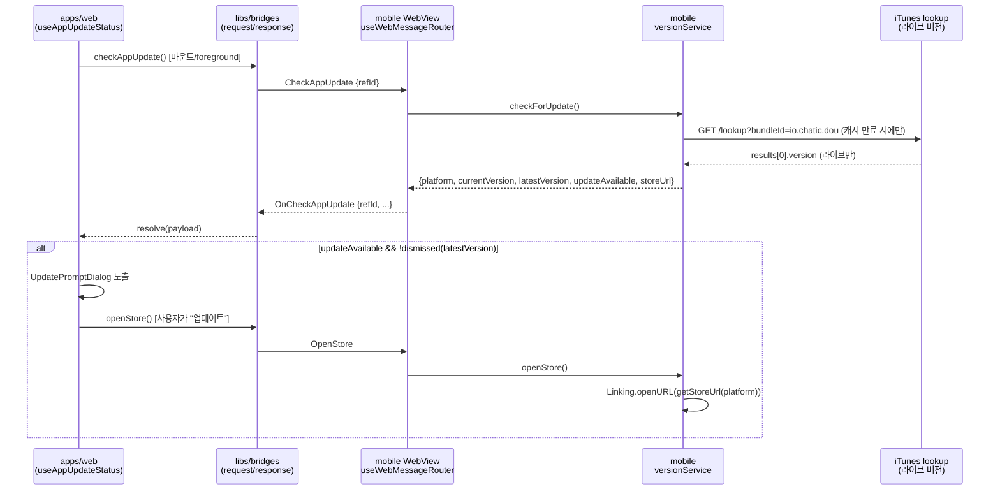

# 앱 업데이트 안내 (App Update Check)

> 상태: Live · 관련 ADR: [ADR-0033](../../../docs/adr/0033-app-update-check-ios-first.md)

## 목적

앱의 현재 버전과 스토어에 **실제 게시된(라이브)** 버전을 비교해, 업데이트가 있으면 안내하고
스토어로 보낸다. 심사중(승인 전) 버전은 라이브가 아니므로 "업데이트 있음"으로 세지 않는다.

## 설계 원칙

- **라이브 버전만 신뢰한다.** 버전 소스는 스토어가 실제 서빙하는 값(iOS = iTunes lookup)뿐이다.
- **버전 판단은 네이티브 셸이 한다.** 웹은 비교 로직을 갖지 않고 판단 결과만 소비한다.
- **버전 로직은 `services/version` 한 곳에.** 훅·주입·알림·브릿지 핸들러는 전부 그 소비자다.
- **계약은 플랫폼 중립.** Android가 붙을 때 `getLatestVersion('android')` 구현만 바뀌도록, 계약과
  웹 레이어는 플랫폼을 모른 채 동작한다.
- **선택형 안내다.** 강제 업데이트가 아니고, `forceUpdate` 필드만 계약에 예약돼 있다.
- **웹 팝업은 라우트와 무관한 전역 레이어.** 특정 페이지에 매달면 그 페이지를 벗어난 동안 노출
  기회를 놓치므로 앱 루트(`app.tsx`)에 마운트한다.

## 플랫폼 현황

| 플랫폼  | 라이브 버전 조회                                         | 결과                                   |
| ------- | -------------------------------------------------------- | -------------------------------------- |
| iOS     | `https://itunes.apple.com/lookup?bundleId=io.chatic.dou` | `results[0].version`                   |
| Android | 없음 — Play Developer API 백엔드가 아직 없다             | `null` → `updateAvailable: false` 폴백 |

Android는 조회 자체가 없으므로 팝업도 뜨지 않는다. 실패가 아니라 안전한 무응답이다.

## 안내 경로가 둘이다

같은 판단이 서로 다른 두 UI로 나간다. 하나를 고칠 때 다른 하나를 같이 보게 하려고 적어 둔다.

| 경로           | 트리거                                                           | UI                                       |
| -------------- | ---------------------------------------------------------------- | ---------------------------------------- |
| 네이티브 Alert | `App.tsx`의 `useAppVersionCheck(true)` — 마운트 시 1회           | RN `Alert` 2버튼, 스토어는 `Linking`으로 |
| 웹 팝업        | `AppUpdatePromptHost` → `useAppUpdatePrompt` — 마운트·포그라운드 | `UpdatePromptDialog`, 스토어는 브릿지로  |

## 주요 파일

| 자리                                                                                      | 역할                                                                                                          |
| ----------------------------------------------------------------------------------------- | ------------------------------------------------------------------------------------------------------------- |
| [`services/version/VersionService.ts`](../src/app/services/version/VersionService.ts)     | 조회·비교·캐시·`openStore()`. `parseVersion`/`isNewerVersion`도 여기서 export                                 |
| [`hooks/useAppVersionCheck.ts`](../src/app/hooks/useAppVersionCheck.ts)                   | 서비스 소비자. 모듈 싱글턴 캐시(`getVersionCheckResult`/`onVersionCheckComplete`)와 네이티브 Alert            |
| [`webview/hooks/useAppUpdateHandler.ts`](../src/app/webview/hooks/useAppUpdateHandler.ts) | `CheckAppUpdate`/`OpenStore` 브릿지 핸들러                                                                    |
| `libs/app-messages` `model/app-update.ts`                                                 | `CheckAppUpdate`/`OnCheckAppUpdate`, `OpenStore`/`OnOpenStore` 페이로드                                       |
| `libs/shared` `consts/storeUrls.ts`                                                       | `STORE_URLS`·`getStoreUrl` — 스토어 URL의 단일 출처                                                           |
| `apps/web` `features/appUpdate/`                                                          | `useAppUpdateStatus`(공유 스토어) · `useAppUpdatePrompt`(팝업) · `UpdatePromptDialog` · `AppUpdatePromptHost` |
| `apps/web` `features/mypage/pages/SettingsPage.tsx`                                       | 버전 행의 `handleOpenStore` — 네이티브면 브릿지, 아니면 `window.open`                                         |

`model/update.ts`는 이 계약이 아니다 — Electron 데스크톱 auto-update(electron-updater) 페이로드가
이미 그 이름을 쓰고 있어서 `model/app-update.ts`로 갈랐다.

## 계약

```
CheckAppUpdate {}
  → OnCheckAppUpdate { platform, currentVersion, latestVersion, updateAvailable, storeUrl, forceUpdate? }
OpenStore {}
  → OnOpenStore {}
```

`web-message-response.ts`의 `WEB_MESSAGE_RESPONSE_TYPE`이 `satisfies Record<WebMessageType, AppMessageType>`
라서, 매핑을 빠뜨리면 컴파일이 막는다. `libs/bridges`는 타입맵 제네릭이라 손댈 게 없다.

## 흐름



## 캐시는 30분 TTL이다

`VersionService`는 프로세스 수명 싱글턴이고 모바일 세션은 며칠씩 이어질 수 있다. 그래서
**성공한 조회만** `CACHE_TTL_MS = 30분` 동안 캐시한다 — 빠른 포그라운드 토글이 매번 App Store를
때리지 않게 하되, 오래 산 세션도 새로 게시된 버전을 다음 포그라운드에서 알아채도록 짧게 잡았다.
실패·미지원(Android·네트워크 오류) 응답은 **캐시하지 않아** 바로 다음 호출이 재시도한다.

## 주입값은 판단 근거가 아니다

`window.CHATIC_APP_SHOULD_UPDATE`·`CHATIC_APP_LATEST_VERSION`은 지금도 주입되지만, 웹의 업데이트
판정은 **브릿지 조회만** 쓴다([`useAppUpdateStatus`](../../web/src/app/features/appUpdate/hooks/useAppUpdateStatus.ts)).
이유는 타이밍이다 — 콜드 스타트에서 App Store lookup은 WebView가 만들어진 **뒤에** 끝나므로 주입값은
항상 `'false'`이고, 뒤따르는 `OnUpdateDeviceInfo` push는 `useDeviceInfo()` 소비자가 device-info
스토어를 채우기 전에 도착하면 버려진다. 물어본 그 시점에 옳은 소스는 브릿지 조회뿐이다.

`useAppUpdateStatus`는 결과를 zustand 스토어 하나에 모은다. 팝업과 마이페이지 버전 행이 서로 다른
답을 내지 않게 하려는 것이고, 여러 곳에서 동시에 마운트해도 위 캐시 덕에 비용이 없다.

## 재노출 억제

- 팝업 노출 조건은 `updateAvailable && latestVersion !== dismissedUpdateVersion`이다.
- "나중에"와 "업데이트" **둘 다** `dismissUpdate(latestVersion)`을 호출한다. 스토어로 보낸 뒤에
  다시 묻는 것도 소음이기 때문이다.
- `dismissedUpdateVersion`은 `usePreferenceStore`의 **`local` 전략**(localStorage 전용)이다.
  네이티브도 서버도 읽지 않는 순수 클라이언트 UX 가드라서, `PreferenceKey` 유니온을 넓힐 이유가 없다.
- 다음 라이브 버전이 나오면 값이 달라지므로 다시 노출된다.

## 변경 체크리스트

- 새 필드가 `model/app-update.ts` · `web-message.ts` · `app-message.ts` · `web-message-response.ts`
  네 곳에 일관되게 들어갔는가?
- 스토어 URL을 `getStoreUrl` 밖에서 다시 조립하지 않았는가?
- Android 경로가 여전히 `updateAvailable: false`로 안전하게 떨어지는가?
- 실패한 조회를 캐시하지 않는가? (캐시하면 네트워크 복구 후에도 계속 "업데이트 없음"이 된다)
- 새 판정 근거를 주입 전역에서 읽지 않는가? (위 "주입값은 판단 근거가 아니다")
