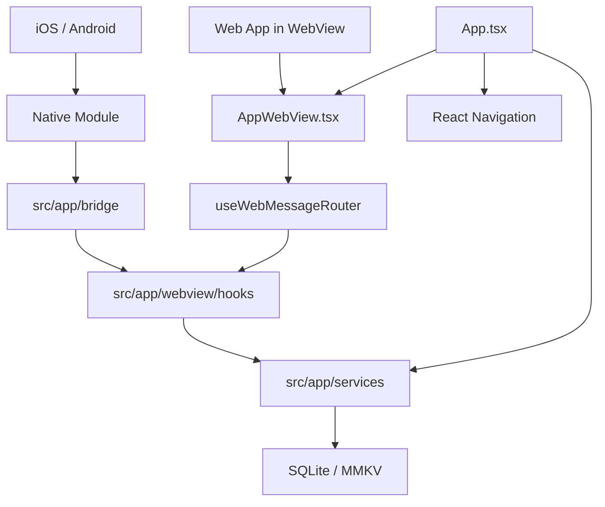
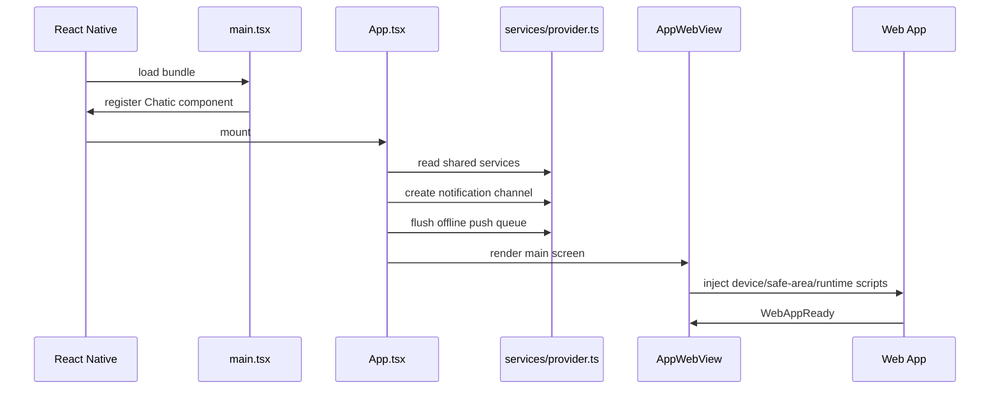

# Mobile Architecture

이 문서는 `apps/mobile`을 처음 읽는 에이전트와 개발자가 전체 구조를 빠르게 잡기 위한 최상위 지도다. 세부 구현은 같은 폴더의 카테고리 문서를 함께 본다.

## 핵심 구조

`apps/mobile`은 React Native 기반 하이브리드 앱이다. 네이티브 앱 shell이 WebView를 띄우고, WebView 안의 웹 앱은 typed bridge message로 모바일 기능을 요청한다. 모바일 기능은 대부분 `services/provider.ts`에서 조립된 service를 통해 실행된다.

## 주요 진입점

| 파일                                                 | 역할                                                                         |
| ---------------------------------------------------- | ---------------------------------------------------------------------------- |
| `src/main.tsx`                                       | React Native 앱 등록, background FCM handler 등록                            |
| `src/main-web.tsx`                                   | web target entrypoint                                                        |
| `src/app/App.tsx`                                    | navigation, deeplink linking, notification channel init, debug overlay mount |
| `src/app/features/core/navigation/RootNavigator.tsx` | root navigation stack                                                        |
| `src/app/features/main/navigation/MainNavigator.tsx` | main app screen navigation                                                   |

## 계층별 책임

| 계층          | 책임                                                     | 문서                                   |
| ------------- | -------------------------------------------------------- | -------------------------------------- |
| Native module | OS/native API, background worker, file/upload primitives | [native-module.md](./native-module.md) |
| Service       | 모바일 기능의 단일 실행 경계와 DI 조립                   | [service.md](./service.md)             |
| WebView       | web app host, injected runtime, bridge router            | [webview.md](./webview.md)             |
| Cache         | SQLite/MMKV/local data source                            | [cache.md](./cache.md)                 |
| Push          | FCM/APNs, badge, foreground event, offline queue         | [push.md](./push.md)                   |
| Upload        | large file upload, native upload manager, recovery       | [upload.md](./upload.md)               |

## 기본 실행 시나리오

## 작업 전 체크리스트

- WebView에서 시작되는 기능이면 [webview.md](./webview.md)를 먼저 본다.
- service를 추가하거나 바꾸면 [service.md](./service.md)의 DI 규칙을 따른다.
- native API가 필요하면 [native-module.md](./native-module.md)에서 Android/iOS parity를 확인한다.
- SQLite/MMKV를 건드리면 [cache.md](./cache.md)에서 소유권을 확인한다.
- push/upload는 lifecycle 제약이 강하므로 각각 [push.md](./push.md), [upload.md](./upload.md)를 먼저 읽는다.
