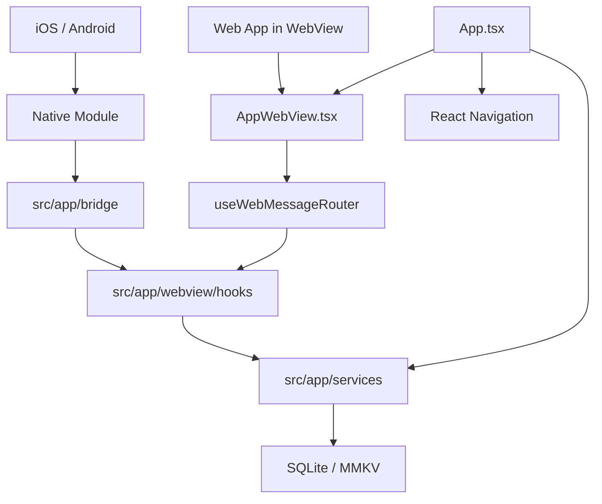
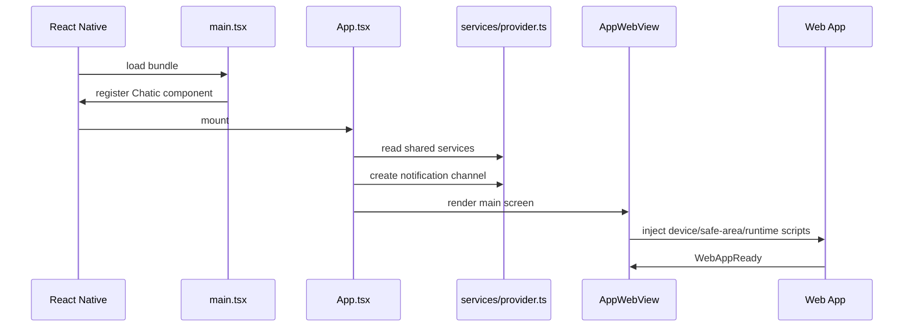

# Mobile Architecture

`apps/mobile`을 처음 읽는 사람이 전체 구조를 빠르게 잡기 위한 지도다. 어떤 문서를 언제 보는지는
[최상위 README](../README.md)의 카테고리 맵을 참고하고, 세부 구현은 각 카테고리 문서를 본다.

## 핵심 구조

`apps/mobile`은 React Native 기반 하이브리드 앱이다. 네이티브 shell이 WebView를 띄우고, WebView 안의
웹 앱은 typed bridge message로 모바일 기능을 요청한다. 모바일 기능은 대부분 `services/provider.ts`에서
조립된 service를 통해 실행된다.

## 주요 진입점

| 파일                                                 | 역할                                                                          |
| ---------------------------------------------------- | ----------------------------------------------------------------------------- |
| `src/main.tsx`                                       | React Native 앱 등록                                                          |
| `src/main-web.tsx`                                   | 웹 타깃 entrypoint                                                            |
| `src/app/App.tsx`                                    | navigation, 딥링크 linking, notification channel 초기화, debug overlay 마운트 |
| `src/app/features/core/navigation/RootNavigator.tsx` | 루트 navigation stack                                                         |
| `src/app/features/main/navigation/MainNavigator.tsx` | 메인 화면 navigation                                                          |

## 계층별 책임

| 계층          | 책임                                                         | 문서                                                                         |
| ------------- | ------------------------------------------------------------ | ---------------------------------------------------------------------------- |
| Native module | OS/native API, background worker, 파일/업로드 primitive      | [native-module.md](./native-module.md)                                       |
| Service       | 모바일 기능의 단일 실행 경계와 DI 조립                       | [service.md](./service.md)                                                   |
| WebView       | 웹 앱 host, 주입 런타임, bridge router                       | [webview.md](./webview.md) · [webview-debugging.md](./webview-debugging.md)  |
| Cache         | SQLite/MMKV/로컬 data source                                 | [cache.md](./cache.md)                                                       |
| Push          | FCM/APNs, 네이티브 포그라운드 이벤트, 뱃지, 탭·딥링크 라우팅 | [push.md](./push.md) · [badge.md](./badge.md) · [deeplink.md](./deeplink.md) |
| Upload        | 대용량 파일 업로드, 네이티브 업로드 매니저, 복구             | [upload.md](./upload.md)                                                     |

## 기본 실행 시나리오

## 작업 전 체크리스트

- WebView에서 시작되는 기능이면 [webview.md](./webview.md)를 먼저 본다.
- service를 추가하거나 바꾸면 [service.md](./service.md)의 DI 규칙을 따른다.
- 네이티브 API가 필요하면 [native-module.md](./native-module.md)에서 Android/iOS parity를 확인한다.
- SQLite/MMKV를 건드리면 [cache.md](./cache.md)에서 소유권을 확인한다.
- push/upload는 lifecycle 제약이 강하므로 각각 [push.md](./push.md), [upload.md](./upload.md)를 먼저 읽는다.
