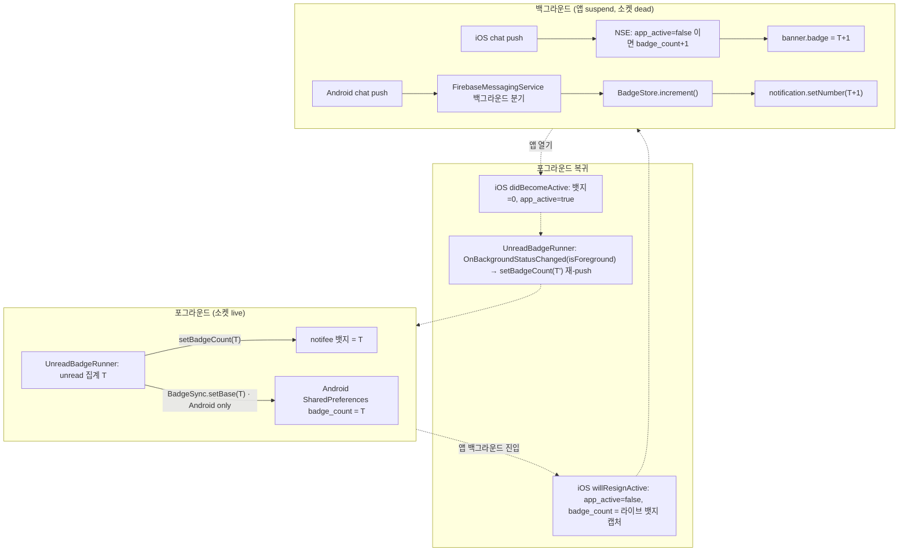

# Badge

앱 아이콘 뱃지 카운트의 생애주기를 다룬다 — 포그라운드 집계(웹), 백그라운드 증가(네이티브),
그리고 포그라운드 복귀 시 조정(reconcile). push 수신 파이프라인 자체는 [push.md](./push.md) 참고.

## 배경 / 문제

- 뱃지의 원래 유일한 writer는 웹 `UnreadBadgeRunner`다. 활성 클라우드의 unread를 집계해
  브릿지 `SetBadgeCount`(절대값)로 내려주며, 이는 **소켓이 살아있는 포그라운드에서만** 동작한다.
- OS가 백그라운드에서 앱을 suspend하면 소켓·주기 sync가 모두 멈춰 뱃지가 마지막 포그라운드 값에
  고정된다. 그래서 백그라운드에 메시지가 쌓여도 아이콘 뱃지가 실시간으로 오르지 않는다.
- 백그라운드에서 뱃지를 움직일 수 있는 유일한 실행 지점은 **OS 푸시 수신 시 네이티브 코드**다
  (iOS Notification Service Extension / Android `FirebaseMessagingService`). JS/웹은 이때 잠들어 있다.

## 설계 원칙 — 네이티브 공유 카운터 = 단일 진실원

앱 아이콘 뱃지 숫자의 진실원을 **네이티브 공유 저장소의 카운터**로 두고, 두 writer를 여기에 수렴시킨다.

| writer               | 시점       | 동작                                                             |
| -------------------- | ---------- | ---------------------------------------------------------------- |
| 웹 재집계            | 포그라운드 | 활성 클라우드 unread를 집계한 절대값 `T`를 카운터·OS 뱃지에 기록 |
| 네이티브 push 핸들러 | 백그라운드 | chat 푸시마다 카운터 `+1` 하고 OS 뱃지에 반영                    |
| 웹 포그라운드 재집계 | 복귀       | 진짜 값 `T'`를 다시 기록해 백그라운드 드리프트를 정정            |

핵심 제약: **양 플랫폼 모두 백그라운드 증가 경로에서 "현재 표시된 뱃지"를 읽을 수 없다.**
iOS NSE는 `applicationIconBadgeNumber`에 접근할 수 없고, Android는 런처 뱃지를 읽는 공개 API가 없다.
따라서 증가는 반드시 **자체 저장한 base**에서 출발해야 하며, 그 base는 포그라운드에서 주입된다.

base 주입 방식만 플랫폼별로 다르다(비대칭):

- **iOS** — 앱 프로세스는 라이브 뱃지를 읽을 수 있으므로 `applicationWillResignActive`에서
  `applicationIconBadgeNumber`를 App Group에 **캡처**한다. JS가 값을 넘길 필요가 없다.
- **Android** — 런처 뱃지를 못 읽으므로, 웹이 `SetBadgeCount` 할 때 `BadgeSync.setBase(n)`로
  SharedPreferences에 **명시적으로** 기록한다.

## 흐름

## 증가 대상 규칙

세 규칙 모두 iOS NSE(`applyBadgeIncrementIfNeeded`)와 Android FCM 서비스(`isChatChannel` + 백그라운드 분기)에
동일하게 적용된다.

- **chat 채널만**: `dou_chat`, `dou_chat_muted`. 뮤트도 포함하는데, 웹의 unread 집계가 뮤트 채널을
  제외하지 않으므로 일관성을 위해서다. `dou_notice`/`dou_marketing`/`dou_cloud`는 증가시키지 않는다.
- **포그라운드 가드**: 포그라운드에선 웹이 소켓으로 이미 뱃지를 갱신하므로 네이티브 증가를 막아
  이중 카운트를 방지한다. iOS는 App Group `app_active` 플래그, Android는 `isAppInForeground()`로 판단한다.
- **silent 제외**: silent 푸시는 배너도 없고 뱃지도 올리지 않는다.

## 플랫폼 상세

### iOS — App Group 공유 카운터

- App Group `group.io.chatic.dou`를 app(dev/prod)과 NSE 양쪽 entitlements에 등록한다.
- App Group keys: `badge_count`(Int), `app_active`(Bool).
- `AppDelegate.applicationDidBecomeActive` → 뱃지 0 클리어 + `app_active=true`.
- `AppDelegate.applicationWillResignActive` → `app_active=false` + `badge_count`에 라이브 뱃지 캡처.
- `NotificationService.applyBadgeIncrementIfNeeded` (NSE) → chat && `!app_active` 일 때만 `badge_count+1` 후 `content.badge` 설정.
- **Provisioning (수동, 코드 밖)**: Apple Developer 포털에서 4개 app id(app·NSE × dev·prod)에
  App Groups capability를 켜고 프로비저닝 프로파일을 재발급해야 한다. Xcode의
  "Signing & Capabilities"에서 `group.io.chatic.dou`가 붙었는지 확인한다.

### Android — SharedPreferences 공유 카운터

- `BadgeStore` (`chatic_badge` prefs, key `badge_count`): get/set/increment.
- `ChaticFirebaseMessagingService` 백그라운드 분기(chat, non-silent)에서 `BadgeStore.increment()` 후
  `NotificationCompat.Builder.setNumber()`로 반영한다.
- **런처 의존**: Android 아이콘 뱃지 카운트 표시는 런처마다 다르다(notifee가 겪는 것과 동일한 한계).
  숫자를 지원하지 않는 런처는 알림에서 오는 dot만 표시한다.

## 주요 파일

| 파일                                                                                     | 역할                                                                        |
| ---------------------------------------------------------------------------------------- | --------------------------------------------------------------------------- |
| `src/app/features/home/UnreadBadgeRunner.tsx` (web)                                      | unread 집계 → `setBadgeCount`, 포그라운드 복귀 시 재-push                   |
| `src/app/bridge/BadgeSyncBridge.ts`                                                      | `setBase(n)` TS wrapper (Android만 native 호출, iOS no-op)                  |
| `src/app/services/notification/NotificationService.ts`                                   | `setBadgeCount`/`clearBadge`가 notifee + `BadgeSyncBridge.setBase`를 동기화 |
| `android/.../module/BadgeSyncModule.kt`                                                  | `BadgeSync.setBase` native module                                           |
| `android/.../push/BadgeStore.kt`                                                         | Android 공유 카운터(SharedPreferences)                                      |
| `android/.../push/ChaticFirebaseMessagingService.kt`                                     | 백그라운드 chat 푸시 시 카운터 증가                                         |
| `ios/Chatic/AppDelegate.swift`                                                           | `app_active` 플래그 토글 + `resignActive`에서 base 캡처                     |
| `ios/ChaticNotificationServiceExtension/NotificationService.swift`                       | 백그라운드 chat 푸시 시 App Group 카운터 증가                               |
| `ios/ChaticNotificationServiceExtension/ChaticNotificationServiceExtension.entitlements` | NSE App Group entitlement                                                   |

## 조정 타임라인 (예시)

1. 포그라운드: 웹이 unread `T=3` 집계 → 뱃지 3, 카운터 3.
2. 앱 백그라운드: (iOS) `resignActive`가 `badge_count=3` 캡처, `app_active=false`.
3. 백그라운드 chat 푸시 2개: 카운터 3→4→5, 뱃지 5.
4. 앱 열기: (iOS) `didBecomeActive`가 뱃지 0 + `app_active=true` → 웹이 재연결·재집계해
   `setBadgeCount(T')` 재-push → 뱃지·카운터가 진짜 값으로 정정.

## 알려진 한계

- **Android 런처 의존**: 위 참고. 카운트 대신 dot만 뜨는 런처가 있다.
- **`getBadgeCount`(notifee) stale**: 백그라운드 native 증가는 notifee 저장값을 갱신하지 않으므로
  `FetchBadgeCount`는 stale할 수 있다. 웹은 native 뱃지를 읽지 않고 계산·set만 하므로 로직에는 무관하다
  (디버그 표시 용도).
- **iOS 재백그라운드 창**: `didBecomeActive`(뱃지 0)와 웹 재-push 사이의 짧은 창에 앱이 다시
  백그라운드로 가면 base가 0으로 캡처될 수 있다. 다음 정상 포그라운드에서 self-heal 된다.

## 검증

- **유닛**: `BadgeSyncBridge.test.ts`, `NotificationService.test.ts`(모바일), `UnreadBadgeRunner.test.tsx`(웹).
- **기기(수동)**: `scripts/send-test-push.js`로 백그라운드 chat 푸시 → 뱃지 증가 관찰, 앱 열기 → 재집계 정정,
  뮤트 포함/공지·마케팅 제외, 포그라운드 이중 카운트 없음 확인. Kotlin/Swift는 저장소에 유닛 테스트
  하네스가 없어 기기 검증으로 대체한다.
