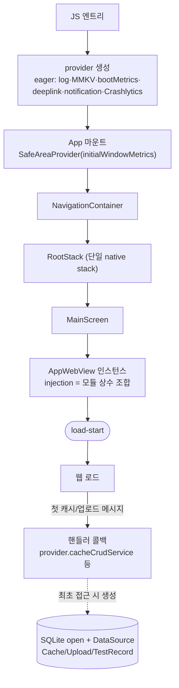
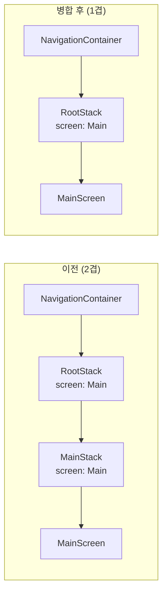

# 부팅 최적화 — 네이티브 웹뷰 조기 마운트 (Boot Optimization)

> 상태: Live · 최종 갱신: 2026-07-23 · 관련 ADR: [ADR-0027](../../../docs/adr/0027-native-webview-early-mount-boot-optimization.md)
> 관련: [boot-metrics](./boot-metrics.md)(계측) · [webview](./webview.md) · [service](./service.md) · [deeplink](./deeplink.md)

## 목적

`apps/mobile`은 네이티브 셸이 단일 WebView를 호스팅하는 하이브리드 앱이다. 부팅은 완전 직렬이라
네이티브 pre-webview 지연이 WebView URL 로드 시작(`load-start`)을 통째로 뒤로 민다.
[계측](./boot-metrics.md) 베이스라인(v0.19.2, 콜드 8건)에서 **네이티브 pre-webview가 부팅의
53%(평균 580ms)**, 콜드 변동폭 326–882ms였다.

이 문서는 그 pre-webview 구간을 앞당기고 콜드 변동을 흡수하는 **1차 최적화**를 다룬다.
목표는 콜드부팅 `load-start` 중앙값을 **−150ms 이상** 단축하고, 기능 회귀(딥링크·네비게이션·웹뷰
동작) 없이 유지하는 것이다.

## 설계 원칙

이 영역(부팅 임계경로)을 앞으로 확장·수정할 때도 지키는 기준:

1. **임계경로 최소주의.** WebView URL 로드에 직접 필요하지 않은 계산·I/O·인스턴스화는 부팅 경로에서
   제거하거나 지연한다. "첫 프레임 → WebView 생성"에 기여하지 않으면 뒤로 미룬다.
2. **측정으로만 판정한다.** 각 변경은 독립 커밋 + 실기기 콜드부팅 3회+ BootMetrics 전후 중앙값 비교.
   효과가 없거나 회귀가 보이면 그 단계만 리버트. 추정으로 커밋하지 않는다.
3. **지연은 lazy getter로, deferral 타이머로 하지 않는다.** 비필수 초기화를 미룰 때 `InteractionManager`
   같은 시간 기반 지연 대신 "최초 접근 시 생성"을 쓴다 — "쓸 때 준비 안 됨" 리스크를 구조적으로 차단.
4. **관측성은 성능에 우선한다.** 부팅 구간 크래시 리포팅(Crashlytics)처럼 장애 진단에 필요한 계층은
   지연 대상에서 제외하고 eager 유지한다.
5. **계약 보존.** 네비게이션 구조를 바꿔도 라우트 이름·`navigationRef` 규약·딥링크 `OnNavigate` 경로
   같은 외부 계약은 유지한다.

## 범위

**포함** — 네이티브 pre-webview 구간 4개 최적화:

- SafeAreaProvider 메트릭 주입 (insets 비동기 왕복 제거)
- DeviceInfo 동기 호출 모듈 레벨 캐싱 (injection 스크립트 임계경로 단축)
- 네비게이터 스택 병합 (네이티브 컨테이너 2겹 → 1겹)
- provider + 서비스 접근 체인의 비필수 초기화 lazy 전환

**제외** — 웹 측 번들·런타임 최적화(2차), 서비스워커 캐싱(3차), 배포/CDN 정책, 네이티브 앱
프로세스~JS 엔트리 미계측 구간.

## 시나리오

### S1. 콜드부팅

직렬 흐름 `provider 생성 → App 마운트 → NavigationContainer → RootStack → MainScreen → WebView
인스턴스 → load-start`에서 각 구간이 다음처럼 단축된다:

- **provider 생성** — SQLite/캐시/업로드 등 비필수 계층이 lazy가 되어 생성자 동기 비용이 줄고, SQLite
  `open`이 부팅 경로에서 빠진다 (`JS엔트리 → provider-ready`).
- **App → MainScreen** — `initialWindowMetrics`로 insets 측정 왕복이 사라져 첫 프레임에 렌더되고,
  스택이 1겹이라 네이티브 컨테이너 마운트가 1회로 준다 (`app-mount → main-screen`).
- **MainScreen → load-start** — DeviceInfo 값이 모듈 상수라 injection 스크립트 prop 계산에서 동기
  브릿지 왕복이 사라진다 (`main-screen → load-start`의 JS 부분).

### S2. 딥링크/푸시탭 진입 (계약 유지)

스택 병합 후에도 진입 경로는 그대로다. `useDeepLinkNavigation`이 콜드/웜 캡처를 소유하고, web
라우트는 `OnNavigate` 브릿지로, native 라우트는 `navigationRef.reset(state)`로 적용한다
(`useDeepLinkNavigation.ts:83-110`). native route state는 단일 스택에 맞게 평탄해졌다: 폴백은
`{ routes: [{ name: 'Main' }] }`, `main/modal`은 `{ routes: [{ name: 'Modal' }] }`(최상위 sibling).
`Debug` 라우트는 별도 중첩 네비게이터 개념이라 병합과 무관하게 그대로 유지된다. `ModalScreen`
구현체는 (네비게이터 미등록 상태 그대로) 보존한다. 사용자가 보는 동작(콜드스타트 스플래시 유지, web
경로 라우팅)은 불변.

### S3. 지연 서비스 최초 사용 (lazy 트레이드오프)

웹이 첫 캐시/검색/업로드/테스트레코드 메시지를 보내면, 해당 핸들러 콜백이 그때 `provider.<service>`를
읽어 서비스를 최초 생성하고 — 그 과정에서 `sqliteDatabase`(memoized)가 열린다. 이 시점은 `load-start`
이후(웹 로드 중)라 pre-webview 경로에서 빠진다. 최초 SQLite open 지연이 그 메시지 응답에 실릴 수 있어
측정 대상이다(§검증). 유의미하면 해당 서비스만 eager로 되돌린다.

## 다이어그램

### 최적화 후 부팅 임계경로

### 네비게이터 구조 변경 (4.3)

## 상세 구현

핵심 파일과 역할. 대안 비교·선택 이유는
[ADR-0027](../../../docs/adr/0027-native-webview-early-mount-boot-optimization.md) 참조.

### 4.1 SafeAreaProvider `initialWindowMetrics`

`App.tsx:56`의 `<SafeAreaProvider>`에 `initialWindowMetrics`(react-native-safe-area-context가
동기로 주는 초기 프레임 insets)를 `initialMetrics` prop으로 주입. insets 비동기 측정 왕복을 제거해
네비게이터·MainScreen을 첫 프레임에 렌더.

### 4.2 DeviceInfo 동기 호출 모듈 캐싱

- 렌더마다 반복되던 `getUniqueIdSync()`·`getApplicationName()`·`getDeviceId()` 등 동기 브릿지 호출을
  `AppWebView.tsx`의 모듈 상수 `CACHED_DEVICE_INFO`로 1회 승격(기존 `appVersion`/`buildNumber` 패턴과
  동일).
- injection `deviceInfo` params 조립은 순수 함수 [`buildDeviceInfoParams`](../src/app/webview/utils/buildDeviceInfoParams.ts)로
  추출 — 캐싱된 정적 값 + 동적 값(stage·언어·firebaseInstallId·버전체크)을 받아 `DeviceInfoParams`를
  만든다. 필드 매핑(deprecated `installationId`/신규 `uniqueDeviceId`에 bare device id, composite
  `uniqueId` 결합)이 유닛 테스트 대상이 됐다.

### 4.3 네비게이터 스택 병합

- `RootNavigator.tsx`가 `MainScreen`을 `Main` 스크린으로 직접 등록. `MainNavigator.tsx` 삭제.
- `MainScreenProps` 타입을 (삭제된 `MainNavigator`에서) `main/navigation/index.ts`로 이전,
  `NativeStackScreenProps<RootStackParamList, 'Main'>`로 재정의. `MainScreen.tsx`의 `import ... from
'../navigation'` 경로는 유지.
- `core/navigation/type.ts`의 `RootStackParamList`를 `{ Main: undefined }`로 평탄화,
  `MainStackParamList` 제거. `navigationRef`(`navigationRef.ts`) 타입 자동 반영.
- 딥링크 native route state 평탄화(`deeplinkUtils.ts`): 폴백 `{ routes: [{ name: 'Main' }] }`,
  `main/modal` → `{ routes: [{ name: 'Modal' }] }`(중첩 제거, 최상위 sibling). `Debug` 분기는 별도
  중첩 네비게이터라 변경 없음. `ModalScreen`/`ModalScreenParams`는 (미등록 상태 그대로) 보존.
- **불변:** web-route `OnNavigate` 경로, `navigationRef.reset()` 규약, `MainScreen`의 `route` prop
  (현재 `route.params`는 로깅 전용·항상 `undefined`).

### 4.4 provider + 접근 체인 lazy 전환

provider getter만으로는 부족하다 — `services/index.ts` 배럴이 모듈 로드 시 `export const x =
provider.x`로 서비스를 즉시 읽고, 그 배럴이 부팅 경로에서 import되기 때문이다. 그래서 SQLite 계열은
**접근 체인 전체**를 지연시킨다:

- [`provider.ts`](../src/app/services/provider.ts): 비필수 서비스를 lazy getter로 전환(최초 접근 시
  생성·memoize). `sqliteDatabase` getter가 최초 생성 시 `initTables()`를 부른다(생성자에서 이동).
  DataSource들은 `dataSources` memoized getter로 묶는다.
    - **Eager 유지:** `logService`·`consoleLogger`·`logBufferService`·`keyValueStorage`·
      `bootMetricsService`·`notificationService`·`pushEventManager`·`deeplinkManager`·`deeplinkService`·
      `firebaseCrashlyticsService`(부팅 크래시 관측성 — `init()` 즉시 호출 유지).
    - **Lazy:** `sqliteDatabase` + 9 DataSource + `cacheCrudService`·`cacheSearchService`·
      `uploadService`·`testRecordService`, 그리고 `deviceService`·`clipboardService`·`smsService`·
      `permissionService`·`oauthService`·`dynamicAppIconService`·`firebaseInstallationService`·
      `subscriptionIapService`·`preferenceService`.
- [`services/index.ts`](../src/app/services/index.ts): SQLite 계열 5개(`sqliteDatabase`·
  `cacheCrudService`·`cacheSearchService`·`uploadService`·`testRecordService`)의 eager const export
  제거 — 배럴 로드 시 getter 발동을 막는다. 소비처는 `provider.x`로 접근. 저비용 서비스는 배럴 const로
  eager 유지(생성자 비용 미미, 소비처 churn 회피).
- [`useServices.ts`](../src/app/hooks/useServices.ts): SQLite 계열을 반환 객체에서 제거(렌더 시 접근 =
  부팅 경로 노출 방지).
- SQLite 핸들러 훅 4개([`useCrudCacheHandler`](../src/app/webview/hooks/useCrudCacheHandler.ts)·
  [`useSearchCacheHandler`](../src/app/webview/hooks/useSearchCacheHandler.ts)·
  [`useTestRecordHandler`](../src/app/webview/hooks/useTestRecordHandler.ts)·
  [`useUploadHandler`](../src/app/webview/hooks/useUploadHandler.ts)): 훅 최상위 구조분해 대신 **콜백
  내부에서 `provider.x`** 접근(`provider`는 안정적 싱글톤 → deps에서 제외, 콜백 안정성 유지). upload은
  `createUploadHandlers(bridge, getUploadService, logger)`로 시그니처를 getter화해 지연.
- 디버그 화면(`StorageTestScreen`·`UploadTestScreen`)은 부팅 경로가 아니라 `provider.x` 직접 접근으로만
  갱신(컴파일 유지 목적).

## 검증 방법

- **타입체크:** `npx tsc -p apps/mobile/tsconfig.app.json --noEmit` — 신규 타입에러 0(유일한 에러는
  사전 존재하는 `@nx/react-native/typings/svg.d.ts` 누락).
- **유닛 테스트** (`npx jest --config apps/mobile/jest.config.js`):
    - 4.2 — [`buildDeviceInfoParams.test.ts`](../src/app/webview/utils/buildDeviceInfoParams.test.ts):
      캐싱 값 매핑·composite uniqueId·deviceModel 폴백.
    - 4.3 — [`deeplinkUtils.test.ts`](../src/app/services/deeplinks/deeplinkUtils.test.ts): native route
      state가 평탄 구조(`Modal`/`Main` 최상위)를 반환.
    - 전체 mobile 스위트: 19 통과 / 109 테스트 통과.
- **회귀 스모크(실기기):** 딥링크 진입, 백버튼, 포그라운드 복귀, lazy 전환된 캐시/검색/업로드/테스트레코드
  첫 사용 동작.
- **BootMetrics(실기기):** 단계별 콜드부팅 3회+ 중앙값 전후 비교(FAB 디버그 메뉴 › 부팅 성능). 특히 4.4는
  웹 첫 캐시 메시지의 SQLite open 지연을 함께 관찰. 목표: `load-start` 중앙값 −150ms 이상.
- **알려진 사전 실패(변경 무관 베이스라인):** typecheck의 nx-svg 타이핑 누락, 그리고 jest에서
  `useDeepLinkNavigation.test.ts`(native-stack ESM 미설정)·`useUploadHandler.test.ts`(전이 네이티브
  모듈 로드) 2개 스위트 — baseline에서도 동일하게 미실행.

### 측정 결과 (실기기, 콜드 4회 중앙값)

JS 엔트리 기준 마크(ms). 목표 `load-start` −150ms 대비 **−281.5ms 달성(약 1.9배)**.

| 마크              |  Before |     After |          Δ |
| ----------------- | ------: | --------: | ---------: |
| provider-ready    |      54 |       4.5 |      −49.5 |
| app-mount         |     140 |        82 |        −58 |
| main-screen-mount |     360 |        80 |       −280 |
| **load-start**    | **438** | **156.5** | **−281.5** |
| web-app-ready     |     689 |     484.5 |     −204.5 |

구간별 기여:

- `app-mount → main-screen` **220ms → ≈0** (4.1 insets 왕복 제거 + 4.3 스택 2겹→1겹). 최대 기여.
  병합 후 자식(MainScreen) effect가 부모(App)보다 먼저 실행돼 두 마크가 사실상 동시점이 됨.
- `JS엔트리 → provider-ready` **54 → 4.5ms** (4.4 — SQLite open·DataSource·서비스 생성이 생성자에서 빠짐).
- `main-screen → load-start` **≈77ms 유지** (4.2는 측정상 무효 — 이 구간은 WebView 인스턴스 생성이 지배.
  브릿지 왕복 제거는 실제 이뤄졌으나 부팅 시간 영향은 미미). 저리스크·무해로 유지.
