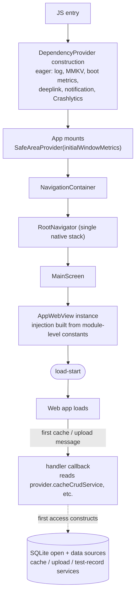

# Boot Optimization

`apps/mobile` is a hybrid shell: the WebView is the entire product surface, so nothing the user sees
exists until it starts loading. Boot is fully serial, so any native work ahead of WebView
instantiation delays `load-start` directly. This document describes what stays on that critical
path, what is deferred, and why. See [boot-metrics.md](./boot-metrics.md) for how the timeline is
measured on-device (ADR-0027 is the decision record for this track).

## Critical path



## Design principles

1. **Minimize the critical path.** Anything not required to get the WebView's URL loading is removed
   or deferred. If it doesn't contribute to "first frame → WebView created", it moves later.
2. **Defer with a lazy getter, not a timer.** `DependencyProvider` (`services/provider.ts`) defers
   non-essential services by constructing them on first property access, never on a fixed delay — a
   time-based deferral risks "not ready when used"; a lazy getter cannot be read before it exists.
3. **Observability outranks performance.** Crash reporting during the boot window
   (`firebaseCrashlyticsService`) stays eager even though it costs a synchronous constructor call —
   losing a boot-window crash report is worse than the delay it avoids.
4. **External contracts survive.** Collapsing the navigator into one stack keeps route names,
   `navigationRef` semantics, and the deep-link `OnNavigate` path unchanged — see
   [deeplink.md](./deeplink.md).

## What is deferred, and how

### `App.tsx` and the navigator

- `SafeAreaProvider` receives `initialMetrics={initialWindowMetrics}` — the frame insets
  `react-native-safe-area-context` already has synchronously at native launch. This removes the
  async insets round-trip that would otherwise block the first render of the navigator and
  `MainScreen`.
- `RootNavigator` hosts `MainScreen` directly as the `Main` screen of one
  `createNativeStackNavigator`. There is no intermediate navigator layer: `RootStackParamList` is
  `{ Main: undefined }`, and `MainScreen` takes no route params — deep-link destinations reach the
  web client through the `OnNavigate` bridge message (`useDeepLinkNavigation`), never through native
  route params.

### `AppWebView` injection

`AppWebView.tsx` reads `DeviceInfo`'s synchronous bridge calls (`getUniqueIdSync`,
`getApplicationName`, `getDeviceId`, `getSystemVersion`, plus `getVersion`/`getBuildNumber`) once
into a module-level `CACHED_DEVICE_INFO` constant instead of on every render. Building the injected
script sits on the critical path — `AppWebView` injects it as both
`injectedJavaScriptBeforeContentLoaded` (runs before the web client's own pre-paint code) and
`injectedJavaScript` (survives a reload) — so a native bridge round-trip per render would have
repeated on every re-render before the WebView even exists.

### `DependencyProvider` (`services/provider.ts`)

The provider is a singleton, assembled once in its constructor, split into two groups:

- **Eager** — constructed synchronously because boot-time code depends on them directly: logging,
  `keyValueStorage` (MMKV), `bootMetricsService`, cold-start capture (`deeplinkManager`,
  `deeplinkService`, `pushEventManager`, `notificationService`), and `firebaseCrashlyticsService`.
- **Lazy** — exposed as getters that construct and memoize on first access: `sqliteDatabase` and
  everything built on it (the ten cache-domain data sources plus `upload`), and
  `deviceService`, `clipboardService`, `smsService`, `permissionService`, `oauthService`,
  `dynamicAppIconService`, `firebaseInstallationService`, `subscriptionIapService`,
  `preferenceService`, `configKvService`, `versionService`, `unfurlService`.

```bash
grep -c "public get " apps/mobile/src/app/services/provider.ts
```

`services/index.ts` does not re-export the SQLite-backed services as barrel constants — a barrel
`export const x = provider.x` would read the lazy getter at module-load time and defeat the
deferral, since that barrel is itself imported from the boot path. Consumers reach them through
`provider.x` directly, and the SQLite-backed WebView handler hooks (`useCrudCacheHandler`,
`useSearchCacheHandler`, `useTestRecordHandler`, `useUploadHandler`) read `provider.x` inside their
callback bodies rather than destructuring it at the top of the hook, so rendering the hook does not
itself trigger construction.

The first SQLite-backed message the web sends — cache, search, upload, or test-record — is what
actually opens the database. See [cache.md](./cache.md) and [upload.md](./upload.md).

## Out of scope

Web bundle and runtime optimization, service-worker caching, and deploy/CDN policy are not covered
here — none of them sit on this app's native pre-WebView path.

## Verification

- [`buildDeviceInfoParams.test.ts`](../src/app/webview/utils/buildDeviceInfoParams.test.ts) covers
  the cached-value mapping into the injected `DeviceInfoParams`.
- [`deeplinkUtils.test.ts`](../src/app/services/deeplinks/deeplinkUtils.test.ts) covers the
  single-stack native route state (`Main`/`Modal` as top-level siblings).
- Boot timing itself is not asserted by a unit test — it is read from the on-device timeline in
  [boot-metrics.md](./boot-metrics.md) (FAB debug menu › Boot Performance). Reordering anything
  under [What is deferred, and how](#what-is-deferred-and-how) is a measurable regression there, not
  a refactor.
