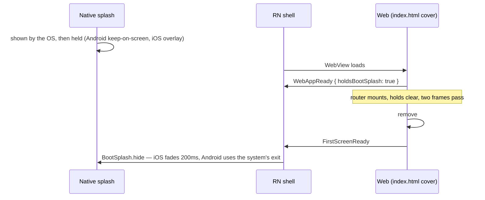

# Boot splash

The launch splash is the **only** screen in the product that shows the logo, and it stays on screen
until the web has painted its first real screen. Everything else that covers the WebView — the web's
own boot cover, the resume overlay, the crash-reload cover — is the theme background and nothing
more.

This replaced a chain of four logo screens (OS launch screen → RN overlay → web `#splash` → web
`LoadingFallback`) with blank frames between them, which users saw as the same screen blinking twice
on every cold start. The rule that came out of it: a cover is only ever lifted onto something that
has already painted, and only one layer ever draws the logo, so there is nothing to line up pixel for
pixel between layers.

## What the user sees

| Entry                                      | Sequence                                                                            |
| ------------------------------------------ | ----------------------------------------------------------------------------------- |
| Cold start                                 | launch splash (logo) → first screen                                                 |
| Android warm start (Activity recreated)    | launch splash (logo) → first screen                                                 |
| Activity recreated with no system splash   | background → first screen (the hold blocks drawing; nothing to show but the window) |
| Boot slower than the native cap (5s)       | launch splash → web cover (background; dots after 1s) → first screen                |
| Cold start from a deep link or push tap    | launch splash → the target screen (home is never shown)                             |
| Back → foreground (iOS)                    | `ResumeOverlay` (background) → screen                                               |
| Back → foreground (Android)                | nothing covers it — Android does not flash                                          |
| WebView content process died               | `ResumeOverlay` (background) → first screen                                         |
| WebView remount (debug reload, custom zip) | web cover (background) → first screen                                               |
| Plain browser                              | web cover (background) → first screen                                               |

## The handoff



**Native holds, web releases.** `BootSplashService.onFirstScreenReady` calls `BootSplashBridge.hide`,
which releases the Android `setKeepOnScreenCondition` hold (`BootSplashState`) or fades out the iOS
overlay (`BootSplashOverlay`). The web decides when, because only the web knows when it has drawn a
screen; see `apps/web/docs/shell/boot-cover.md` for what "first screen" means there.

**Android sets no exit animation, on purpose.** `setOnExitAnimationListener` makes the system hand
its starting window over to the Activity as a copy, and on a busy start that handover times out
(`Activity transferring splash screen timeout` in logcat): the system then removes its splash with
its own animation — grey, then black — and the copy appears after it, so the splash showed twice.
Without a listener there is no handover; the system keeps its own splash until the hold is released
and removes it with its default exit. `hide`'s `fade` argument is honoured on iOS only.

**Version skew is negotiated, not assumed.** A web build that sends `FirstScreenReady` says so in the
handshake (`WebAppReady.holdsBootSplash`). Without that flag, `BootSplashService.onWebAppReady` lifts
the splash on the handshake itself — an older web build would otherwise sit under the splash until
the cap on every launch. A newer web on an older app gets `NOT_FOUND` for its `FirstScreenReady`
post, which nothing waits on.

**Every exit is capped.** Native lifts its own splash 5s after it was shown (per Activity on
Android, per launch on iOS) so a dead JS runtime cannot strand the user on the logo; the web lifts its
cover after 10s. A page load error and the deep-link error view reveal at once (`onLoadFailed`), so a
failure is never hidden behind a splash.

**Nothing raises an OS prompt under the splash.** The web asks for the FCM token as soon as it is
authenticated, which is mid-boot. `NotificationService.requestPermission` waits for the reveal
(`bootSplashService.whenRevealed`, capped at 5s) whenever a prompt would actually show: on Android a
permission activity opened over the held splash played its window transition onto the app's undrawn
window — black for over a second, then the splash a second time. An already-decided permission is
not delayed.

**The hold is per Activity, not per process.** On an Android warm start the JS runtime survives while
the Activity is recreated and the splash is shown again. `BootSplashState.arm()` runs in every
`onCreate`, and `BootSplashService` forwards every reveal instead of remembering one — a remembered
"already hidden" would leave the second splash up until its cap.

**The first reveal of a boot is also a measurement.** `DependencyProvider` subscribes
`BootMetricsService.recordReveal` to the reveals, which records the `first_screen` sample once per
boot session — see [boot-metrics.md](./boot-metrics.md#the-firebase-first_screen-sample). A warm
start's second reveal records nothing.

## The crash-reload cover

When the WebView's content process dies (`onContentProcessDidTerminate` / `onRenderProcessGone`)
the page reloads into a full web boot with no launch splash available — both platforms only show one
at launch. `AppWebView` calls `useResumeOverlay().coverReload()`, and the cover lifts on the same
reveal (`bootSplashService.subscribe`) or after `RELOAD_COVER_CAP_MS`. It shares `ResumeOverlay` with
the iOS resume cover; the two causes are separate flags, so one clearing does not lift the other.

## Theme

The splash background is `#FFFFFF` / `#121212` with a night variant on both platforms. Which variant
the **first** frame uses is not ours to choose: the OS draws the launch screen from a cached snapshot
before any app code runs, in the OS appearance. So for an OS-light, app-dark user:

| Platform     | First frame | Rest of the splash                                      |
| ------------ | ----------- | ------------------------------------------------------- |
| Android 12+  | app theme   | app theme — `UiModeManager.setApplicationNightMode`     |
| Android ≤ 11 | OS theme    | OS theme (the starting window cannot be re-themed)      |
| iOS          | OS theme    | app theme — `overrideUserInterfaceStyle` on the overlay |

`App.tsx` sends `themeStore`'s mode through `BootSplashBridge.setStartupTheme` on every start and
change, which is what the next launch reads. On iOS the override is set on the overlay view only:
setting it on the window would change what React Native's `useColorScheme` reports, and `'system'`
is resolved from that value. On Android `setApplicationNightMode` does change the app's
configuration, which is safe here because `android:configChanges` includes `uiMode` (no Activity
recreate) and `'system'` maps to `MODE_NIGHT_AUTO`, the OS scheme again.

The remaining colour switch is faded (200ms, iOS) rather than cut, which is as far as the platform lets
this go — every iOS app with an in-app theme has the same first frame.

## Code

| Piece                 | Location                                                                                   |
| --------------------- | ------------------------------------------------------------------------------------------ |
| JS bridge             | [`bridge/BootSplashBridge.ts`](../../src/app/bridge/BootSplashBridge.ts)                   |
| Reveal decisions      | [`services/bootSplash/`](../../src/app/services/bootSplash/)                               |
| `FirstScreenReady`    | [`webview/hooks/bootSplashHandlers.ts`](../../src/app/webview/hooks/bootSplashHandlers.ts) |
| Crash-reload cover    | [`webview/hooks/useResumeOverlay.ts`](../../src/app/webview/hooks/useResumeOverlay.ts)     |
| Android hold and exit | `android/.../MainActivity.kt`, `splash/BootSplashState.kt`, `module/BootSplashModule.kt`   |
| Android assets        | `res/drawable/splash_icon.xml`, `res/drawable-*dpi/splash_logo.png`, `values(-night)/`     |
| iOS hold and exit     | `ios/Bridges/BootSplashOverlay.swift`, `BootSplashModule.swift`/`.m`, `AppDelegate.swift`  |
| iOS assets            | `LaunchScreen.storyboard`, `BootSplashLogo-f09e2a`, `BootSplashBackground-f09e2a`          |

The logo is `assets/src/logo/logo.png` (1115×983) drawn at 96×85 pt/dp, centred on the full window.
The splash PNGs are generated from it; regenerate them when the logo changes. On Android the icon
drawable is **not** declared at that size: the system lays the icon out in a 108dp box (the
adaptive-icon convention) and scales the box by 192/108 into the visible icon area, so
`splash_icon.xml` declares the logo at 54×48dp to land at 96×85dp. Declared at 96×85 it measured
about 170dp on screen.

## How to verify

```bash
yarn nx test @chatic/mobile && yarn nx test web
```

Unit tests cover the reveal rules (`BootSplashService.test.ts`), the handler, the crash-reload cover
(`useResumeOverlay.test.ts`) and the web side (`apps/web/src/app/runtime/bootSplash.test.ts`). The
handoff itself is only visible on a device: record the boot (`xcrun simctl io <udid> recordVideo`,
`adb shell screenrecord`) and step through the frames — no frame without the logo before the first
screen, and no frame where the logo moves. Do it for cold, Android warm (Developer options → "Don't
keep activities"), deep-link cold start, OS-light/app-dark, and a killed WebView process. On iOS the
simulator caches the launch screen: erase the simulator after changing the storyboard or its assets.
