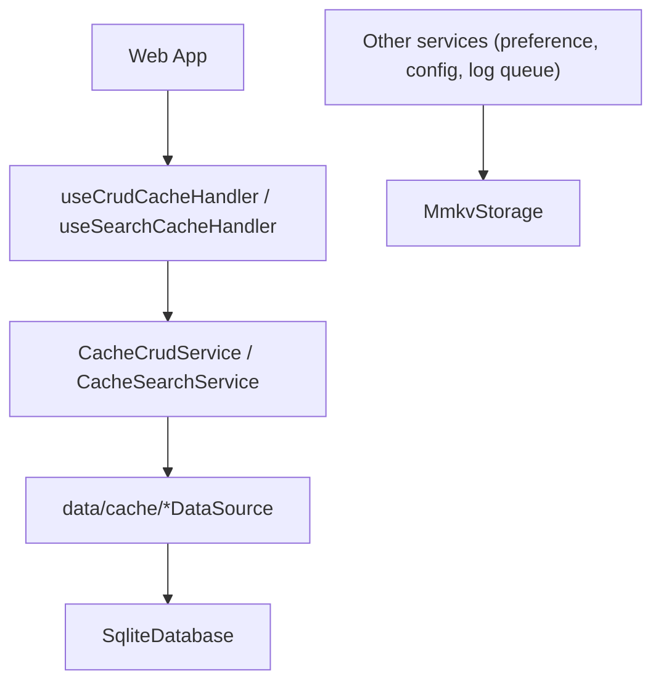
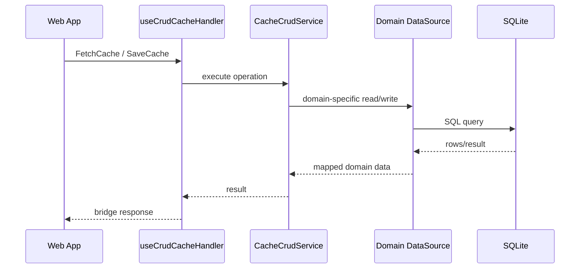

# Cache

The local persistence the app owns: two storage engines, a data-source layer per domain over
SQLite, and the WebView-facing cache service that answers the web client's cache messages.

## Storage

| Store  | Location                  | Holds                                                                   |
| ------ | ------------------------- | ----------------------------------------------------------------------- |
| SQLite | `src/app/database/sqlite` | Structured records — one table per cache domain, plus upload task state |
| MMKV   | `src/app/database/mmkv`   | Small key-value state — preferences, config, the log upload queue       |

```bash
grep -c "TABLES\." apps/mobile/src/app/database/sqlite/tables.ts
```

Eleven tables: ten cache domains plus `upload_tasks`. MMKV is not used for structured lists or
queries — that scope stays with SQLite, and expanding an MMKV key into a query surface belongs in a
data source instead.

## Structure



## Data sources

`services/provider.ts` builds ten `data/cache/*DataSource` instances lazily, all over the same
`SqliteDatabase` handle (see [boot-optimization.md](./boot-optimization.md)):

| File                       | Domain                                                     |
| -------------------------- | ---------------------------------------------------------- |
| `ChatDataSource.ts`        | Chat records                                               |
| `ChannelDataSource.ts`     | Channel records                                            |
| `JoinDataSource.ts`        | Channel–user membership                                    |
| `SiteDataSource.ts`        | Site/place records                                         |
| `UserDataSource.ts`        | User profile records                                       |
| `ProfileDataSource.ts`     | Per-site display profiles                                  |
| `MetaDataSource.ts`        | Sync cursors                                               |
| `InviteCloudDataSource.ts` | Invite-cloud records                                       |
| `InviteDataSource.ts`      | Sent relay 1:1 invite cards (ADR-0052)                     |
| `TestRecordDataSource.ts`  | Debug/test records                                         |
| `fetchManyByIds.ts`        | Shared `id IN (...)` batch helper, not a domain of its own |

`CacheCrudService.SUPPORTED_CACHE_TYPES` is the switch these nine domains resolve through (upload
and test-record are reached through their own services, not `CacheCrudService`). A `CacheType` the
web sends that isn't in that list still gets `{ success: true, data: null }` rather than an error —
the web deploys ahead of the app, so an unrecognized type has to look like an empty cache, not a
failure.

## Cache CRUD



## Batch reads (`FetchManyCacheData`)

Every web call is one bridge round trip, so round-trip count is the cost that matters. A merge write
on the web side has to read the existing row per item before writing it, and doing that one item at
a time turned into real cost — 50 chat rows saved as 51 round trips.

- `FetchManyCacheData` → `CacheCrudService.fetchMany` → the domain's own `fetchMany`, if it has one.
- `fetchMany` is an **optional** member of `ICacheDataSource`. When a domain doesn't implement it,
  the service falls back to calling `fetch` once per id — the bridge round trip is still one, so the
  goal (fewer round trips than the web) is still met; only the number of in-process SQL calls grows.
- A domain with the standard `(cid, uid, id, data)` shape can delegate to the shared
  `fetchManyByIds` helper. Its `WHERE` clause must match that domain's own `fetch` exactly —
  `invitecloud` is a global table and deliberately omits `cid`/`uid` — or the batch path and the
  single-item path answer differently for the same id.
- Missing ids are simply absent from the result; the response length and order do not have to match
  the request. The web re-indexes the response by id.
- An app build old enough not to know a cache message answers with `NOT_FOUND`
  (`AppBridgeHost.processRequest`), and `NativeDBAdapter.loadMany` in `libs/db` treats that as a
  one-time signal to fall back to per-id fetches for the rest of that session. Adding a new cache
  message needs this fallback path covered on the web side too, because the web ships ahead of the
  app — see [`@chatic/db`](../../../libs/db/README.md).

## Handlers that send no response

When a handler returns nothing, the host sends nothing back (`AppBridgeHost.processRequest`).
`SendLog` uses this: the web's log forwarder posts without a `refId`, so a response would arrive
with no pending call to match — it would be discarded as an untargeted event. Discarding it isn't
free: each discarded response still costs one `evaluateJavascript` call on the UI thread, the same
resource cache round trips contend for, so a busy log period was amplifying cache latency for
nothing. A new fire-and-forget message should return nothing from its handler for the same reason.

## Ownership

- SQL schema and table names belong to `database/sqlite`.
- Domain row mapping belongs to `data/cache`.
- The WebView contract belongs to `services/cache` and its handler hooks.
- Upload recovery state belongs to the upload repository (`services/upload/repository`), not the
  cache service — see [upload.md](./upload.md).
- MMKV holds small values and queues; it does not grow into structured list or query storage.

## Checklist

- Do the schema, data source, and service agree on the same domain name?
- Is `cid`/`uid` scope present everywhere the data needs it?
- Does the WebView cache handler stay ignorant of SQL detail?
- For a new data source: does `fetchMany`'s `WHERE` clause match that domain's `fetch`?
- For a new cache message: does the web side have a legacy-app fallback for it?
