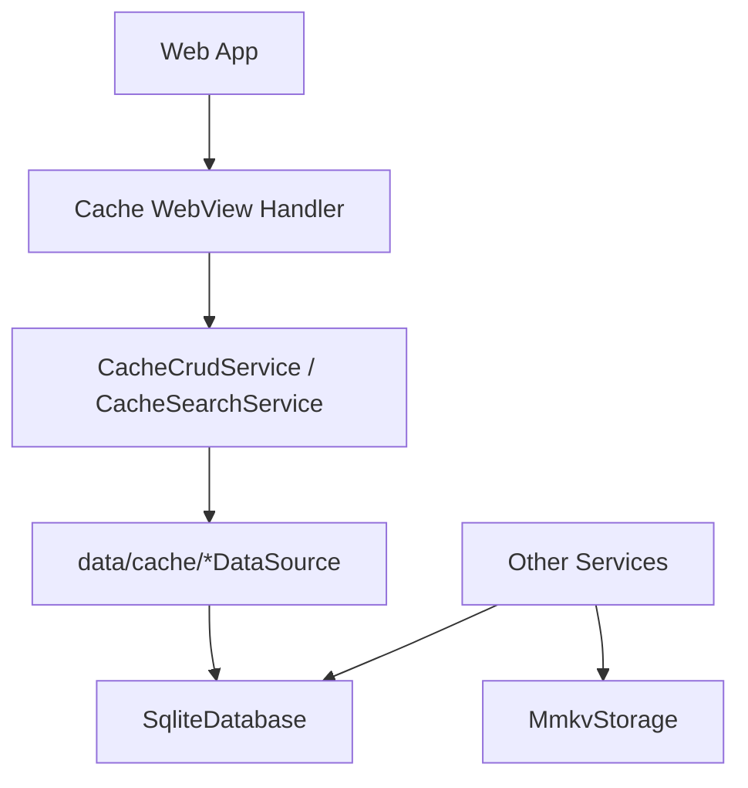
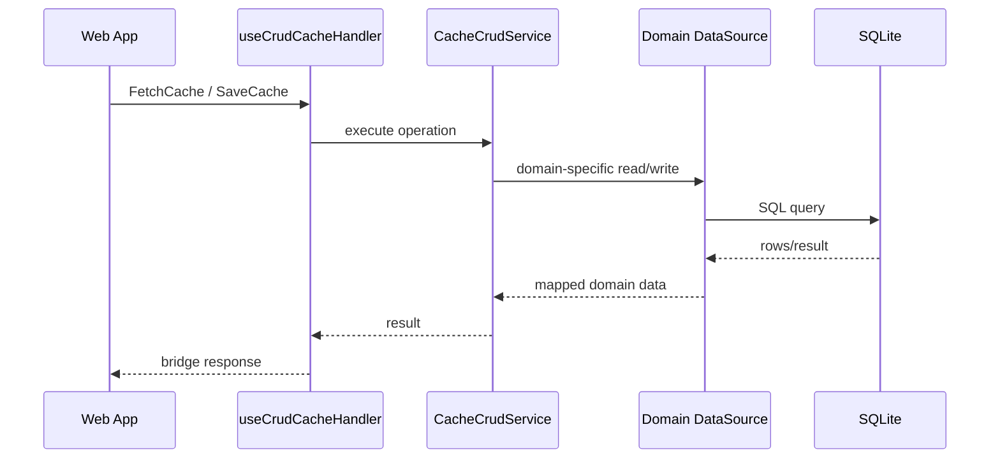

# Cache

Cache 문서는 모바일 앱의 local persistence 구조를 설명한다.

## 저장소 구분

| 저장소        | 위치                      | 용도                                             |
| ------------- | ------------------------- | ------------------------------------------------ |
| SQLite        | `src/app/database/sqlite` | structured record, 캐시 테이블, 업로드 task 상태 |
| MMKV          | `src/app/database/mmkv`   | 작은 key-value 상태, preference, 가벼운 queue    |
| Data source   | `src/app/data/cache`      | 테이블/도메인별 SQL 접근                         |
| Cache service | `src/app/services/cache`  | WebView용 CRUD/search API                        |

## 구조

## Data Source

| 파일                       | 도메인                                 |
| -------------------------- | -------------------------------------- |
| `ChatDataSource.ts`        | chat records                           |
| `ChannelDataSource.ts`     | channel records                        |
| `JoinDataSource.ts`        | channel-user membership                |
| `SiteDataSource.ts`        | site/place records                     |
| `UserDataSource.ts`        | user profile records                   |
| `ProfileDataSource.ts`     | site display profiles                  |
| `MetaDataSource.ts`        | sync cursors (meta)                    |
| `InviteCloudDataSource.ts` | invite cloud records                   |
| `InviteDataSource.ts`      | sent relay 1:1 invite cards (ADR-0052) |
| `TestRecordDataSource.ts`  | debug/test records                     |
| `fetchManyByIds.ts`        | 도메인 공용 `id IN (...)` 배치 조회    |

## Cache CRUD 시나리오

## 배치 조회 (`FetchManyCacheData`)

웹에서 호출 한 번은 브릿지 왕복 한 번이므로, "몇 번 부르는지"가 곧 성능이다. 웹의 병합 쓰기는
아이템마다 기존 행을 읽어야 하는데 그게 왕복 N회가 되면서 실제 비용이 됐다 — 채팅 50건 저장이
51 왕복이었다.

- `FetchManyCacheData` → `CacheCrudService.fetchMany` → 도메인 `fetchMany`(선택 구현).
- `fetchMany`는 `ICacheDataSource`의 **선택** 멤버다. 미구현이면 service가 `fetch`를 반복해서
  채운다 — 이래도 브릿지 왕복은 1회이므로 목적은 달성된다. 늘어나는 건 인프로세스 SQL 횟수뿐.
- 표준 `(cid, uid, id, data)` 스키마 도메인은 `fetchManyByIds`에 위임하면 된다. `WHERE` 조합은
  각 도메인의 `fetch`와 **반드시 같은 규칙**이어야 한다(invitecloud는 전역이라 cid/uid를 넣지
  않는다). 어긋나면 배치 경로와 단건 경로가 다른 답을 낸다.
- 없는 id는 결과에서 빠진다 — 반환 길이·순서가 요청과 일치하지 않는다. 웹이 id로 다시 색인한다.
- 이 메시지를 모르는 구버전 앱에서는 host가 `NOT_FOUND`로 거절하고 웹이 id별 조회로 자동
  폴백한다(`NativeDBAdapter.loadMany`). 새 캐시 메시지를 추가할 때는 이 폴백 경로를 같이 갖춰야
  한다 — 웹이 앱보다 먼저 배포되기 때문이다.

## 응답을 보내지 않는 핸들러

핸들러가 아무것도 반환하지 않으면 host는 응답을 내려보내지 않는다(`AppBridgeHost.processRequest`).
`SendLog`가 이 경로다 — 웹의 로그 전달자는 refId 없이 올려보내므로 응답이 내려가도 매칭될 pending이
없어 폐기되는데, 폐기되는 응답 한 건마다 `evaluateJavascript`가 UI 스레드에서 한 번 돈다. 캐시 왕복이
경합하는 그 자원이므로, 로그 건수만큼 정체를 키우는 순수 낭비였다.

fire-and-forget 성격의 새 메시지를 추가할 때는 반환값을 생략하면 된다.

## 소유권 규칙

- SQL schema/table 이름은 `database/sqlite`가 소유한다.
- domain row mapping은 `data/cache`가 소유한다.
- WebView contract는 `services/cache`와 handler가 소유한다.
- upload recovery state는 upload repository가 소유한다. 일반 cache service에 섞지 않는다.
- MMKV는 작은 값과 queue에 사용하고 structured list/query storage로 확장하지 않는다.

## 변경 체크리스트

- schema, data source, service가 같은 domain naming을 쓰는가?
- cid/uid scope가 필요한 데이터에서 누락되지 않았는가?
- WebView cache handler가 SQL detail을 알지 않도록 유지되는가?
- 새 데이터 소스라면 `fetchMany`의 `WHERE` 조합이 그 도메인 `fetch`와 같은 규칙인가?
- 새 캐시 메시지라면 구버전 앱 폴백이 웹 쪽에 있는가?
