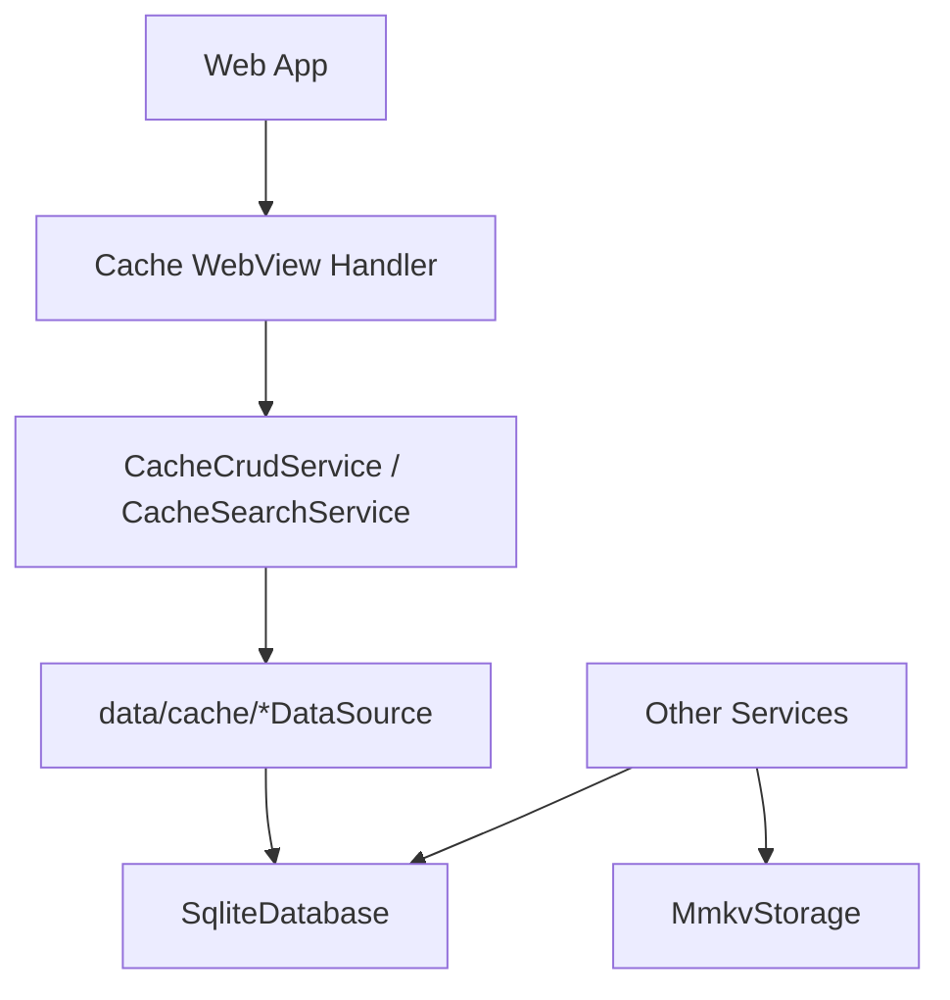
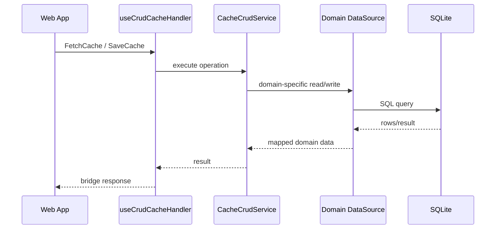

# Cache

Cache 문서는 모바일 앱의 local persistence 구조를 설명한다.

## 저장소 구분

| 저장소        | 위치                      | 용도                                             |
| ------------- | ------------------------- | ------------------------------------------------ |
| SQLite        | `src/app/database/sqlite` | structured record, 캐시 테이블, 업로드 task 상태 |
| MMKV          | `src/app/database/mmkv`   | 작은 key-value 상태, preference, 가벼운 queue    |
| Data source   | `src/app/data/cache`      | 테이블/도메인별 SQL 접근                         |
| Cache service | `src/app/services/cache`  | WebView용 CRUD/search API                        |

## 구조

## Data Source

| 파일                       | 도메인                                 |
| -------------------------- | -------------------------------------- |
| `ChatDataSource.ts`        | chat records                           |
| `ChannelDataSource.ts`     | channel records                        |
| `JoinDataSource.ts`        | channel-user membership                |
| `SiteDataSource.ts`        | site/place records                     |
| `UserDataSource.ts`        | user profile records                   |
| `ProfileDataSource.ts`     | site display profiles                  |
| `MetaDataSource.ts`        | sync cursors (meta)                    |
| `InviteCloudDataSource.ts` | invite cloud records                   |
| `InviteDataSource.ts`      | sent relay 1:1 invite cards (ADR-0052) |
| `TestRecordDataSource.ts`  | debug/test records                     |

## Cache CRUD 시나리오

## 소유권 규칙

- SQL schema/table 이름은 `database/sqlite`가 소유한다.
- domain row mapping은 `data/cache`가 소유한다.
- WebView contract는 `services/cache`와 handler가 소유한다.
- upload recovery state는 upload repository가 소유한다. 일반 cache service에 섞지 않는다.
- MMKV는 작은 값과 queue에 사용하고 structured list/query storage로 확장하지 않는다.

## 변경 체크리스트

- schema, data source, service가 같은 domain naming을 쓰는가?
- cid/uid scope가 필요한 데이터에서 누락되지 않았는가?
- WebView cache handler가 SQL detail을 알지 않도록 유지되는가?
