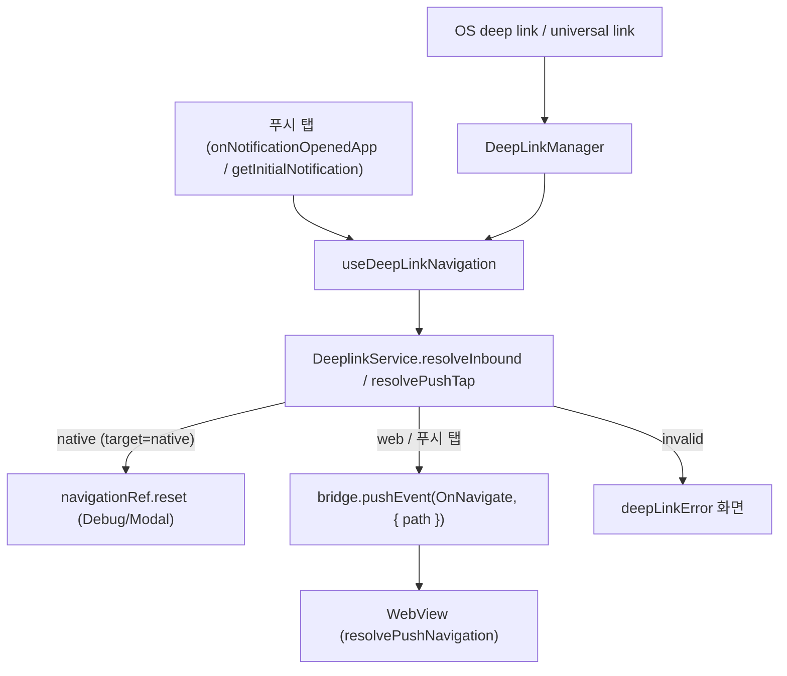

# Deep Link

딥링크(유니버설 링크 / 커스텀 스킴)와 푸시 알림 탭은 모두 **하나의 목표**로 수렴한다:
`WEBVIEW_URL` 기준 상대 경로(`path`)를 만들어 `OnNavigate` 브릿지 이벤트로 웹에 넘기는 것.
모바일은 도메인을 재계산하지 않는다 — 프론트 도메인은 항상 `WEBVIEW_URL`(`VITE_WEBVIEW_BASE_URL`)이고,
클라우드/사이트 컨텍스트(`cid`/`sid`)는 그 경로의 쿼리에 실려 웹이 읽는다.

## 주요 파일

| 파일                                                      | 역할                                                                                                                            |
| --------------------------------------------------------- | ------------------------------------------------------------------------------------------------------------------------------- |
| `src/app/services/deeplinks/DeepLinkManager.ts`           | OS 딥링크 URL 캡처 (cold start 초기 URL + warm start 이벤트 구독)                                                               |
| `src/app/services/deeplinks/DeeplinkService.ts`           | 단일 해석기. `resolveInbound(url)`(web/native/invalid) · `resolvePushTap(data)`. `handleUrl`은 로컬/디버그 트리거               |
| `src/app/services/deeplinks/deeplinkUtils.ts`             | 순수 헬퍼: 검증, 초대 변환(`convertShortUrlWithEnvsSync`), 상대경로 축약(`resolveDeepLink`), cid/sid 병합(`resolvePushTapPath`) |
| `src/app/webview/hooks/useDeepLinkNavigation.ts`          | 인바운드 네비게이션 단일 소유자. OS 딥링크·초대링크·푸시 탭 캡처 → `OnNavigate`(web) / `navigationRef`(native) / 에러           |
| `src/app/features/core/navigation/navigationRef.ts`       | `target=native` 라우트 적용을 위한 공유 navigation ref ([`push.md`](./push.md) 참고)                                            |
| `apps/web/.../bridge/navigation/resolvePushNavigation.ts` | (웹) `OnNavigate` 경로에서 `cid`/`sid`를 추출·제거하고 클라우드/사이트를 전환                                                   |

## 구조

## 초대 링크 변환

초대 링크는 웹이 인식 가능한 폼으로 변환해야 한다. `convertShortUrlWithEnvsSync`가 담당한다.
입력 폼은 두 가지이고, **`relay` 플래그의 존재 여부가 판별자**다.

**① 클라우드 폼** (백엔드 주소를 링크가 실어 나름)

- **입력**: `https://app-dev.chatic.io/s?code=invt:910447:...&api=uzjpiaey7a&stage=dev`
- **출력(상대 경로)**: `/?code=invt:910447:...&provider=invite&version=2&_backend=https://uzjpiaey7a.execute-api.ap-northeast-2.amazonaws.com/dev`

**② 릴레이 폼** (릴레이 서버는 백엔드 주소가 필요 없음)

- **입력**: `https://app-dev.chatic.io/s?code=invt:910447:...&relay`
- **출력(상대 경로)**: `/?code=invt:910447:...&provider=invite&version=2&relay=1`

변환 규칙:

- `code`는 그대로 보존하고 `provider=invite`, `version=2`를 붙인다.
- `_backend`는 `backend` 파라미터가 있으면 그대로, 없고 `api`+`stage`가 있으면 `https://{api}.execute-api.{region}.amazonaws.com/{stage}`로 조립한다 (`region`은 `INVITE_BACKEND_REGION = ap-northeast-2` 상수).
- 릴레이 폼은 `_backend`를 **생략하는 대신 `relay=1`을 명시**한다. 웹이 "`_backend`가 없으니 릴레이"라고 추론하지 않고 마커로 판정하게 하기 위한 규격이다. 백엔드 주소는 웹의 `getDynamicRelayBackend()`(env 릴레이 엔드포인트)가 채운다.
- `relay`는 **값이 아니라 존재 여부(`searchParams.has`)로 판별**한다. 값 없는 `&relay`는 `get('relay') === ''`(빈 문자열)이라 진위값 검사로는 놓친다. 들어온 형태(`&relay`, `relay=`)와 무관하게 출력은 항상 `relay=1`로 정규화한다.
- 소비한 파라미터(`code`/`api`/`stage`/`backend`/`relay`)는 forward 루프에서 제외한다. 그 외 쿼리 파라미터(`utm_*` 등)는 그대로 전달한다.
- **도메인은 넣지 않는다.** 출력은 호스트 없는 상대 경로이며, 최종 도메인은 하위 `toLocalUrl`이 `WEBVIEW_URL`로 붙인다. (예전의 `getFrontendDomainForUrl` "dev" 문자열 휴리스틱과 `FRONTEND_DOMAIN_*` 상수는 제거됨 — 도메인 소스는 `.env`의 `VITE_WEBVIEW_BASE_URL` 하나로 일원화.)

## OnNavigate 경로 계약

`OnNavigate`로 웹에 넘기는 `path`는 다음을 지킨다:

- **형태**: `pathname + search + hash` (도메인 없는 상대 경로). 웹뷰의 base는 항상 `WEBVIEW_URL`이다.
- **`cid`/`sid`**: 쿼리 파라미터로 싣는다. 웹(`resolvePushNavigation`)이 이를 읽어 클라우드/사이트를 전환한 뒤 쿼리에서 제거하고 라우팅한다. 즉 `cid`/`sid`는 라우트 파라미터가 아니라 세션 컨텍스트다.
- 딥링크 경로와 푸시 탭 경로가 모두 `DeeplinkService`(→ `useDeepLinkNavigation`)를 거쳐 동일한 `OnNavigate` 계약으로 수렴한다.

## ⚠️ React Native URL 함정 (회귀 주의)

경로/쿼리를 조립할 때 **`new URL(...).searchParams.set()` 후 `.pathname + .search`를 읽는 패턴을 쓰지 말 것.**
React Native 내장 `URL`(`react-native/Libraries/Blob/URL.js`)의 `.search` 게터는 원본 문자열(`_url`)을
정규식으로 파싱해 돌려주며, `URLSearchParams.set()`로 넣은 값을 **반영하지 않는다.** 그 결과 초대 링크가
쿼리를 통째로 잃고 `/`로 붕괴한다. Node/Jest의 `URL`은 반영하므로 유닛 테스트는 통과하고 기기에서만 깨진다.

- 읽기(`searchParams.get/has/forEach`, `.search`/`.pathname`/`.hash` 게터)는 안전하다.
- **쓰기는 문자열로 직접 조립**한다(값은 `encodeURIComponent`). `convertShortUrlWithEnvsSync`,
  `resolvePushPath`가 이 방식으로 되어 있다. (앱 전역에 `react-native-url-polyfill`은 설치되어 있지 않음.)

## 변경 체크리스트

- 새 경로/쿼리 조립이 RN `URL`의 `searchParams.set()`+`.search` 패턴에 의존하지 않는가? (위 함정 참고)
- 새 딥링크 유형이 `resolveInbound`(웹) / `buildNativeRouteState`(네이티브)에 반영됐는가?
- 초대 링크 출력이 도메인 없는 상대 경로인가? 프론트 도메인이 `WEBVIEW_URL` 외의 곳에서 재계산되지 않는가?
- `OnNavigate`의 `path`가 `pathname+search+hash` 형태이고, `cid`/`sid`가 쿼리에 실리는가?
- 웹의 `resolvePushNavigation` 계약(`cid`/`sid`를 쿼리에서 읽고 제거)과 어긋나지 않는가?
