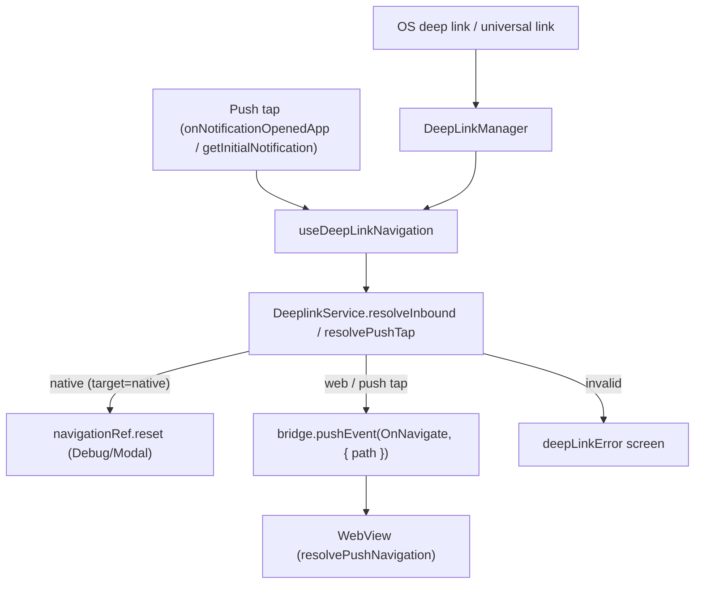

# Deep Link

The deferred-deep-link backend (Firestore rules/indexes, cleanup functions, `.well-known` assets)
lives outside this app, at [docs/infra/deep-linking/](../../../docs/infra/deep-linking/README.md) —
this doc covers only what runs inside the shell once a link arrives.

Universal links, the custom scheme, and a push notification tap all converge on **one goal**: turn
the inbound intent into a `WEBVIEW_URL`-relative `path`, and hand it to the web via the `OnNavigate`
bridge event. The shell never recomputes the frontend domain — the base is always `WEBVIEW_URL`
(`VITE_WEBVIEW_BASE_URL`), and cloud/site context (`cid`/`sid`) travels as query parameters on that
path for the web to read.

## Key files

| File                                                      | Role                                                                                                                                                                                        |
| --------------------------------------------------------- | ------------------------------------------------------------------------------------------------------------------------------------------------------------------------------------------- |
| `src/app/services/deeplinks/DeepLinkManager.ts`           | Captures raw OS URLs — cold-start (`getInitialURL`, plus an iOS native-module fallback for a buffered universal link, plus a short wait for a late `url` event) and warm-start subscription |
| `src/app/services/deeplinks/DeeplinkService.ts`           | The single resolver: `resolveInbound(url)` (`web`/`native`/`invalid`) and `resolvePushTap(data)`                                                                                            |
| `src/app/services/deeplinks/deeplinkUtils.ts`             | Pure helpers: validation, invite conversion (`convertShortUrlWithEnvsSync`), path reduction (`resolveDeepLink`), cid/sid merge (`resolvePushTapPath`)                                       |
| `src/app/webview/hooks/useDeepLinkNavigation.ts`          | Single owner of inbound navigation: OS links, invite links and push taps → `OnNavigate` (web) / `navigationRef` (native) / the error screen                                                 |
| `src/app/features/core/navigation/navigationRef.ts`       | Shared navigation ref for applying `target=native` routes (see [push.md](./push.md))                                                                                                        |
| `apps/web/.../bridge/navigation/resolvePushNavigation.ts` | (web) Extracts and strips `cid`/`sid` from the `OnNavigate` path and switches cloud/site                                                                                                    |

## Structure

The bridge buffers `OnNavigate` until the `WebAppReady` handshake completes (see
[webview.md](./webview.md)), so a cold-start link or tap is delivered as soon as the web is ready —
no manual startup delay is needed.

## Invite link conversion

An invite link must be converted into a form the web recognizes; `convertShortUrlWithEnvsSync` does
this. There are two input forms, and **whether `relay` is present is the discriminator**.

**① Cloud form** (the link itself carries a backend address)

- Input: `https://app-dev.chatic.io/s?code=invt:910447:...&api=uzjpiaey7a&stage=dev`
- Output (relative path): `/?code=invt:910447:...&provider=invite&version=2&_backend=https://uzjpiaey7a.execute-api.ap-northeast-2.amazonaws.com/dev`

**② Relay form** (the relay server needs no backend address)

- Input: `https://app-dev.chatic.io/s?code=invt:910447:...&relay`
- Output (relative path): `/?code=invt:910447:...&provider=invite&version=2&relay=1`

Conversion rules:

- `code` is preserved as-is; `provider=invite` and `version=2` are appended.
- `_backend` comes from `backend` verbatim if present, otherwise from `api`+`stage` as
  `https://{api}.execute-api.{region}.amazonaws.com/{stage}` (`region` is the
  `INVITE_BACKEND_REGION = ap-northeast-2` constant).
- A relay-form link **omits `_backend` and states `relay=1` explicitly** instead — a deliberate
  marker so the web decides "relay" from that flag rather than from the absence of `_backend`. The
  backend address for a relay link comes from the web's own `getDynamicRelayBackend()` (an env
  relay endpoint).
- `relay` is judged by **presence (`searchParams.has`), never by value** — a bare `&relay` parses to
  an empty-string value, which a truthiness check on `get('relay')` would miss. Whatever form it
  arrives in (`&relay`, `relay=`), the output is always normalized to `relay=1`.
- Consumed parameters (`code`/`api`/`stage`/`backend`/`relay`) are excluded from the forward loop;
  everything else (`utm_*`, etc.) passes through unchanged.
- **No domain is added.** The output is a host-less relative path; the final domain is applied later
  by `WEBVIEW_URL`.

A `/s/{code}` legacy short-code link is no longer supported and resolves to `invalid` —
`convertShortUrlWithEnvsSync` throws for it, and the old Firestore-backed short-URL lookup it used is
gone.

## The `OnNavigate` path contract

The `path` handed to the web via `OnNavigate` follows these rules:

- **Shape**: `pathname + search + hash` — no domain. The WebView's base is always `WEBVIEW_URL`.
- **`cid`/`sid`** travel as query parameters. The web (`resolvePushNavigation`) reads them, switches
  cloud/site, then strips them and routes on what remains — they are session context, not route
  parameters.
- Both the deep-link path and the push-tap path go through `DeeplinkService` (via
  `useDeepLinkNavigation`) and converge on this same contract.

For a push tap specifically, `resolvePushTapPath` also decides what a **linkless** payload does: a
push whose `type` is one of `ROOTED_PUSH_TYPES` (currently just `cloud`, whose payload carries no
`link` by contract) resolves to `/`; every other linkless payload resolves to `null` and only
foregrounds the app — a chat push with no link is treated as a malformed payload, not a request to
navigate away from wherever the user already is. When a link does exist, `cid`/`sid` are merged into
its query only if the link does not already carry them explicitly.

## ⚠️ React Native URL pitfall (regression risk)

When assembling a path or query, **do not use `new URL(...).searchParams.set()` and then read
`.pathname + .search`.** React Native's built-in `URL` (`react-native/Libraries/Blob/URL.js`)
derives its `.search` getter from the original string (`_url`) via regex, and does **not** reflect
values set through `URLSearchParams.set()`. The result is an invite link silently losing its entire
query and collapsing to `/`. Node's/Jest's `URL` does reflect the mutation, so a unit test passes
while a real device breaks.

- Reading (`searchParams.get/has/forEach`, the `.search`/`.pathname`/`.hash` getters) is safe.
- **Write by assembling the string directly** (`encodeURIComponent` each value) — this is how
  `convertShortUrlWithEnvsSync` and `resolvePushTapPath` build their output.
  (`react-native-url-polyfill` is not installed anywhere in the app.)

## Change checklist

- Does any new path/query assembly avoid RN `URL`'s `searchParams.set()` + `.search` pattern? (see
  the pitfall above)
- Is a new deep-link kind reflected in `resolveDeepLink` (native) and in whatever consumes `resolveInbound` on the web side?
- Is an invite link's output a host-less relative path, with the frontend domain never recomputed
  outside `WEBVIEW_URL`?
- Is `OnNavigate`'s `path` shaped `pathname+search+hash`, with `cid`/`sid` carried in the query?
- Does it still match the web's `resolvePushNavigation` contract (read `cid`/`sid` from the query,
  then strip them)?
