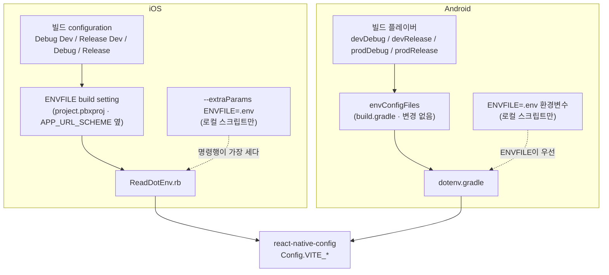
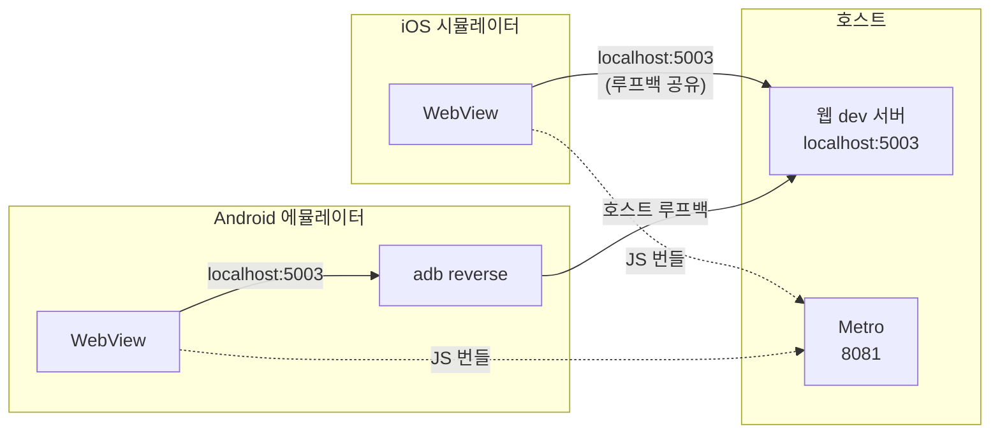
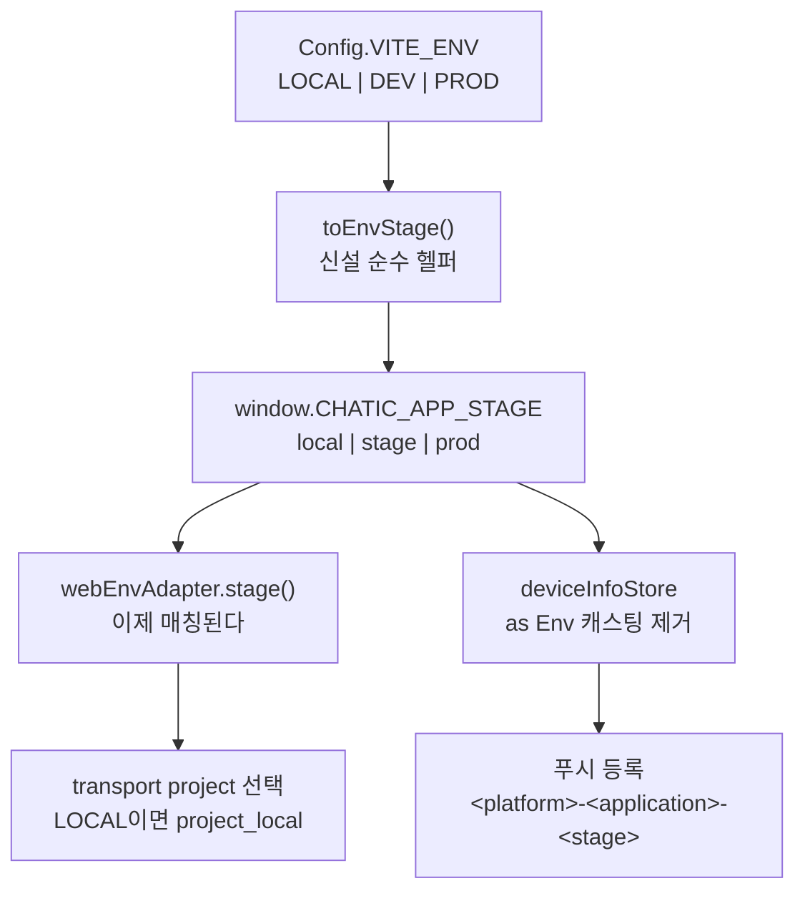

# 로컬 실행 (Local Run)

> 상태: **Live** · 최종 갱신: 2026-09-14 · 관련 ADR: [ADR-0084](../../../docs/adr/0084-app-local-run-and-shell-stage-vocabulary.md)

## 목적

앱을 **로컬 웹 dev 서버에 붙여** 한 명령으로 돌리는 수단이다.

앱은 네이티브 셸 + WebView라, 화면을 고치는 작업은 대부분 웹을 고치는 작업이다. 웹은
`yarn web:start`로 로컬이 뜨고 데스크톱은 `yarn desktop:start:local`이 있는데, **앱만 그 짝이
없었다.** 로컬 웹을 앱 안에서 보려면 env 파일에 자기 LAN IP를 적고 Android면
`network_security_config.xml`에도 그 IP를 추가한 뒤 네이티브를 다시 빌드해야 했다.

같이 푸는 문제가 둘 더 있다. **env 파일 세 개의 의미가 mobile만 달랐던 것**과, **셸이 주입하는
stage 값이 웹에서 통째로 무시되고 있던 것**이다. 둘 다 로컬 실행이 지나가는 자리라 같이 정리한다.

## 설계 원칙

이 영역을 앞으로 확장·수정할 때도 지키는 기준이다.

1. **웹뷰 주소는 빌드 시점에 정해진다.** 런타임에 바꾸는 수단을 만들지 않는다 — 웹이 브릿지로 자기가
   로드될 주소를 바꿀 수 있게 되는 경로를 막기 위해 의도적으로 삭제된 기능이다
   ([ADR-0080](../../../docs/adr/0080-debug-panel-shared-model-and-stage-visibility.md) 결정 13).
   주소를 바꾸려면 재빌드한다.
2. **env 파일 세 개의 의미는 리포 전체에서 같다.** `.env`=로컬, `.env.dev`=dev 빌드,
   `.env.prod`=prod 빌드. web · desktop-web · admin-v2가 쓰는 규칙이고 mobile도 같다.
3. **어느 env를 읽을지는 빌드 설정이 정한다.** 스크립트는 덮기만 한다. GUI 빌드(Xcode ·
   Android Studio)는 셸 환경변수를 못 받으므로, 매핑이 스크립트에만 있으면 GUI 빌드가 엉뚱한 env로
   떨어진다.
4. **주소는 플랫폼 간 같다.** iOS든 Android든 `http://localhost:5003`이다. 플랫폼별 주소 분기를
   만들지 않는다.
5. **같은 사실을 두 곳에 두지 않는다.** 딥링크 스킴처럼 빌드 설정과 런타임이 같은 매핑을 각자 갖고
   있으면, 세 번째 값이 들어오는 순간 어긋난다.

## 범위

**포함**

| 대상                   | 내용                                             |
| ---------------------- | ------------------------------------------------ |
| `apps/mobile` env      | `.env` 의미 변경 · `.env.example` 로컬 템플릿화  |
| `apps/mobile/ios`      | configuration별 `ENVFILE` build setting 신설     |
| `apps/mobile` 딥링크   | 스킴 분기 두 벌을 헬퍼 하나로 합치고 극성 수정   |
| `apps/mobile` 주입     | `CHATIC_APP_STAGE` 어휘를 `Env`로 변환           |
| `apps/mobile/ios` 스킴 | `.env`를 덮어쓰던 build pre-action 삭제          |
| `libs/device-utils`    | `as Env` 캐스팅 → 어휘 매핑 테이블               |
| 루트 `package.json`    | `mobile:ios:local` · `mobile:android:local`      |
| Android 네트워크       | `network_security_config.xml`의 개인 IP 3건 삭제 |
| 문서                   | 이 문서 · `README.md` · `webview-debugging.md`   |

**제외**

- **실기기.** LAN IP · iOS ATS 예외 · Android cleartext가 전부 따라붙는다. 시뮬레이터/에뮬레이터만.
- **런타임 웹 주소 스위처.** 설계 원칙 1.
- **디버그 패널 진입 완화.** 로컬에서도 10-tap + `VITE_DEBUG_CODE` 그대로다.
- **`mobile:start`(Metro)의 이름.** 웹의 `web:start`와 의미가 다르지만(한쪽은 앱이 뜨고 한쪽은
  번들러만 뜬다) 바꾸면 기존 워크플로가 깨진다.
- **`envConfigFiles`(Android).** 이미 원하는 대로다. 건드리지 않는다.
- **데스크톱의 stage 어휘.** 그 값이 푸시 브로커의 SNS 앱 이름이라 클라가 혼자 못 바꾼다.
- **`VITE_WS_ENDPOINT` 죽은 항목 제거.** 별건이다.

## 시나리오

### 1. 처음 셋업 (1회)

```bash
cp apps/mobile/.env.example apps/mobile/.env   # 로컬용 — VITE_ENV=LOCAL
cp apps/web/.env.example apps/web/.env         # 웹도 같은 규칙
```

`apps/mobile/.env`의 `VITE_WEBVIEW_BASE_URL`은 `http://localhost:5003`이 기본값이라 손댈 게 없다.
IAP SKU·`VITE_GOOGLE_WEB_CLIENT_ID` 같은 값은 dev 것과 같으므로 `.env.dev`에서 옮겨 적는다.

> **기존 iOS 개발자는 이사가 한 번 필요하다.** 지금 `apps/mobile/.env`에 들어 있는 dev 설정을
> `apps/mobile/.env.dev`로 옮긴 뒤, `.env`를 위 절차대로 로컬용으로 다시 만든다. 이 변경 전까지
> iOS는 dev 빌드에도 `.env`를 읽었다.

### 2. iOS 시뮬레이터 로컬 실행

```bash
yarn mobile:ios:local
```

1. `apps/mobile/.env`가 있는지 확인한다. 없으면 위 복사 명령을 안내하고 멈춘다.
2. 웹 dev 서버(5003)와 Metro를 `concurrently`로 띄운다.
3. `ENVFILE=.env` 명령행 override로 "Chatic Dev" 스킴을 빌드·설치한다.

시뮬레이터는 호스트의 루프백을 그대로 쓰므로 `localhost:5003`이 바로 닿는다. `Info.plist`의 ATS
예외에 `localhost`가 이미 있어 http도 통과한다.

### 3. Android 에뮬레이터 로컬 실행

```bash
yarn mobile:android:local
```

2번과 같고, 앞에 한 단계가 붙는다.

1. `adb reverse tcp:5003 tcp:5003` — 기기의 `localhost:5003`을 **호스트의 루프백**으로 넘긴다.
2. (이하 동일)

`adb reverse`가 루프백으로 넘기므로 웹 dev 서버가 `localhost`에만 바인딩돼 있어도 닿는다
([vite.config.mts](../../web/vite.config.mts)의 `server.host`를 바꿀 필요가 없다).
`network_security_config.xml`의 `localhost` 항목이 cleartext를 허용한다.

> **`adb reverse`는 기기 재연결·재부팅마다 날아간다.** 에뮬레이터를 다시 띄웠으면 스크립트를 다시
> 돌린다.

### 4. dev / prod 빌드 (이 변경 후)

```bash
yarn mobile:ios:dev        # ENVFILE build setting → .env.dev
yarn mobile:android:dev    # envConfigFiles → .env.dev
```

스크립트에 `ENVFILE`이 없다. 빌드 설정이 정하므로 명령은 지금과 똑같이 생겼고, **바뀌는 건 iOS가
읽는 파일뿐이다** (`.env` → `.env.dev`).

### 5. Xcode / Android Studio GUI 빌드

"Chatic Dev" 스킴을 Xcode에서 직접 눌러도 `.env.dev`를 읽는다 — configuration의 `ENVFILE` build
setting이 정하기 때문이다. Android Studio도 `envConfigFiles`가 같은 일을 한다.

**이 장치가 없으면 GUI 빌드는 `.env`(로컬)로 떨어진다.** `.env`의 의미가 바뀌는 순간 이건 실제
사고가 되므로, iOS build setting 신설은 선택이 아니다.

## 다이어그램

### env 해석 — 누가 어느 파일을 정하는가



### 로컬 실행의 네트워크 경로



### stage 값의 흐름 (변경 후)



> `webEnvAdapter.stage()`는 주입값이 유효할 때 **웹 자신의 `VITE_ENV`를 이긴다**. 지금은 어휘가
> 어긋나 항상 폴백하고 있어서 주입값이 아무 효과가 없다.

## 상세 구현

### env 경로는 둘인데, 하나는 비어 있다

모바일에는 독립된 env 경로가 둘 있다.

| 경로                                                  | 읽는 시점     | 소비                 | 로컬 실행이 쓰는 쪽 |
| ----------------------------------------------------- | ------------- | -------------------- | ------------------- |
| react-native-config                                   | 네이티브 빌드 | `Config.VITE_*`      | **여기가 전부다**   |
| `babel-plugin-transform-inline-environment-variables` | Metro 번들링  | `process.env.VITE_*` | 안 쓴다             |

두 번째 경로는 [babel.config.js](../babel.config.js)가 `VITE_ENV` 등 9개를 번들에 인라인하도록
설정돼 있고, `mobile:start`가 `dotenv -e apps/mobile/.env`로 그걸 먹인다. 그런데 `apps/mobile`과
`libs/` 전체에서 **`process.env.VITE_*`를 읽는 코드가 0건**이다 (모바일이 쓰는 lib은 app-messages ·
bridges · device-utils · logger · shared 다섯이고, 어느 것도 읽지 않는다). `.env`의 의미가 바뀌어도
이 경로는 움직이지 않는다.

`dotenv-cli`는 파일이 없어도 exit 0으로 통과하므로, `.env`를 아직 안 만든 사람의 `mobile:start`도
깨지지 않는다.

### 누가 어느 env 파일을 정하는가

| 플랫폼  | 매핑 주체                               | dev        | prod        | 로컬 override                  |
| ------- | --------------------------------------- | ---------- | ----------- | ------------------------------ |
| iOS     | configuration별 `ENVFILE` build setting | `.env.dev` | `.env.prod` | `--extraParams "ENVFILE=.env"` |
| Android | `envConfigFiles` (`build.gradle`)       | `.env.dev` | `.env.prod` | `ENVFILE=.env` 환경변수        |

iOS의 `ENVFILE`은 `APP_URL_SCHEME` 바로 옆, 같은 네 configuration에 들어 있다
([project.pbxproj](../ios/Chatic.xcodeproj/project.pbxproj)의 `Debug` · `Release` · `Debug Dev` ·
`Release Dev`). 두 설정이 붙어 있는 게 의도다 — 스킴 등록과 env 선택은 같은 축이고, 하나만 바꾸면
아래 `getAppScheme()`이 어긋난다.

> **두 스킴의 build pre-action을 삭제했다.** `Chatic.xcscheme` · `Chatic Dev.xcscheme`이 매 빌드마다
> `echo ".env.dev" > /tmp/envfile`과 `cp .env.dev .env`를 돌리고 있었다. `ReadDotEnv.rb`가
> `/tmp/envfile`을 `ENVFILE`보다 **먼저** 보므로 그게 남아 있으면 위 표 전체가 죽은 코드가 되고,
> `cp`가 개발자의 로컬 `.env`까지 지운다. 위 `ENVFILE` build setting이 같은 스킴→configuration
> 매핑을 그 두 부작용 없이 해낸다. `/tmp/envfile`은 이제 어느 경로로도 만들지 않는다.

### 딥링크 스킴 — 출처는 하나다

OS에 등록되는 스킴은 빌드 설정이 정한다: iOS는 `APP_URL_SCHEME`, Android는 플레이버별 `appScheme`
manifest 플레이스홀더. 런타임이 그 매핑을 다시 계산해야 할 때(React Navigation이 warm-start 링크를
선행 슬래시 경로로 넘겨서, 스킴을 다시 붙여 파싱해야 한다) 쓰는 것이
[`getAppScheme()`](../src/app/services/deeplinks/deeplinkUtils.ts) 하나다.

```ts
export const getAppScheme = (): string => (Config.VITE_ENV === 'PROD' ? 'chatic' : 'chatic-dev');
```

극성이 `=== 'PROD'`인 것이 핵심이다. prod가 아닌 모든 configuration이 `chatic-dev`를 등록하므로
`LOCAL`도 거기로 가야 한다. 예전의 `=== 'DEV'` 형태는 `VITE_ENV=LOCAL`에서 `chatic`을 계산해
등록된 스킴과 어긋났다. [`customZipGate.ts`](../src/app/customZip/customZipGate.ts)의
`isCustomZipAllowed`가 이미 같은 `!== 'PROD'` 극성을 쓴다.

호출부는 둘이고 둘 다 이 함수를 쓴다 — `reconstructDeepLinkUrl`(같은 파일)과
[`DeeplinkService`](../src/app/services/deeplinks/DeeplinkService.ts)의 생성자.

### stage 어휘 — 변환은 한 곳, 타입이 강제한다

`Config.VITE_ENV`(`LOCAL`·`DEV`·`PROD`)와 `Env`(`local`·`stage`·`prod`)는 어휘가 다르다. 변환은
[`toEnvStage()`](../src/app/utils/stage.ts) 하나뿐이다.

| 자리                                                                              | 하는 일                                                                                     |
| --------------------------------------------------------------------------------- | ------------------------------------------------------------------------------------------- |
| [`toEnvStage()`](../src/app/utils/stage.ts)                                       | `VITE_ENV` → `Env`. 알 수 없는 값은 `'prod'` (예전 `\|\| 'PROD'` 폴백과 같은 보수적 기본값) |
| [`AppWebView.tsx`](../src/app/webview/AppWebView.tsx)                             | 주입 스크립트의 `stage`                                                                     |
| [`useVersionCheckHandler.ts`](../src/app/webview/hooks/useVersionCheckHandler.ts) | `OnUpdateDeviceInfo` 브릿지 이벤트의 `stage`                                                |

`DeviceInfoParams.stage`와 `DynamicDeviceInfo.stage`의 타입을 `string`에서 `Env`로 좁혔다. 변환을
빠뜨리면 컴파일이 막는다 — 이 실수가 원래 타입이 넓어서 통과했던 것이다.

웹 쪽에서는 [`deviceInfoStore`](../../../libs/device-utils/src/stores/deviceInfoStore.ts)가
`as Env` 단언 대신 값을 좁힌다. 단언이 `'DEV'`·`'dev'`를 그대로 통과시키고 있었다. 인식하지 못한
값은 `'local'`로 떨어진다 — 이 읽기가 전역이 없을 때(순수 웹) 늘 쓰던 기본값이다.

**데스크톱은 건드리지 않는다.** 계속 `'dev'` / `'prod'`를 주입한다 — 그 값이 곧 푸시 브로커의 SNS
플랫폼 앱 이름이기 때문이다(아래).

### 왜 데스크톱은 어휘를 안 맞추는가

서버가 stage로 SNS 플랫폼 애플리케이션 이름(`<platform>-<application>-<stage>`)을 조립한다. 그런데
그 값을 실제로 보내는 건 데스크톱뿐이다.

| 경로                                                                                                               | stage를 보내는가                                |
| ------------------------------------------------------------------------------------------------------------------ | ----------------------------------------------- |
| 모바일 ([`useDeviceTokenRegistration.ts`](../../web/src/app/bridge/useDeviceTokenRegistration.ts))                 | **아니다** — "deliberately NOT sent"            |
| 데스크톱 ([`useDeviceTokenRegistration.ts`](../../desktop-web/src/app/shared/hooks/useDeviceTokenRegistration.ts)) | **그렇다** — `window.CHATIC_APP_STAGE`를 그대로 |

그리고 브로커의 어휘는 `Env`가 아니다. [`cross-cloud-push.md`](../../../docs/specs/cross-cloud-push.md)가
SNS 플랫폼 앱을 `chatic-desktop-{dev,prod}` 둘로 못박는다 — **`-stage`는 존재하지 않는다.** 데스크톱을
`'stage'`로 바꾸면 dev 채널 설치가 없는 앱에 등록되고 FCM이 전달을 멈춘다.

그래서 **푸시로 나가는 문자열은 이 변경으로 하나도 바뀌지 않는다.** 모바일 주입값만 `Env`로 맞추고,
읽는 쪽(`deviceInfoStore`)의 매핑 테이블이 세 어휘를 전부 흡수한다.

### 네트워크 설정

[`network_security_config.xml`](../android/app/src/main/res/xml/network_security_config.xml)은
`localhost`와 `10.0.2.2`만 남는다. 개발자별 LAN IP 세 건은 지웠다 — `adb reverse`로 주소가
`localhost`가 되어 더 필요 없다. iOS는 `Info.plist`의 ATS 예외에 `localhost`가 이미 있다.

## 검증 방법

### 자동

```bash
yarn mobile:test                                # 57 suites / 465 tests
yarn web:test                                   # 286 suites / 2,720 tests
npx tsc -b apps/mobile/tsconfig.app.json        # 선재 1건 외 0
yarn desktop:typecheck                          # 선재 7건 외 0
```

| 테스트                                                                                    | 검증                                                          |
| ----------------------------------------------------------------------------------------- | ------------------------------------------------------------- |
| [`utils/stage.test.ts`](../src/app/utils/stage.test.ts)                                   | `toEnvStage`의 세 값 · 알 수 없는 값 · 소문자 입력            |
| [`deeplinkUtils.test.ts`](../src/app/services/deeplinks/deeplinkUtils.test.ts)            | `getAppScheme`이 PROD에서만 `chatic`, 경로 재조립이 같은 스킴 |
| [`buildDeviceInfoParams.test.ts`](../src/app/webview/utils/buildDeviceInfoParams.test.ts) | 주입 `stage`가 `Env` 어휘                                     |

> `apps/mobile` 타입체크에는 `debugSettingsStore.ts(90,13)` TS2322가, `desktop:typecheck`에는
> `libs/bridges` 스펙과 `main/index.ts`의 implicit-any 등 7건이 남는다. 둘 다 develop에 이미 있던
> 것이고 이 트랙이 건드린 줄이 아니다.

### 수동 (미확인 — 실기기·실빌드 필요)

| 확인                                       | 방법                                                                                          | 상태   |
| ------------------------------------------ | --------------------------------------------------------------------------------------------- | ------ |
| iOS 로컬                                   | `yarn mobile:ios:local` → 웹뷰가 로컬 웹을 로드                                               | 미확인 |
| Android 로컬                               | `yarn mobile:android:local` → 같음                                                            | 미확인 |
| `ENVFILE` build setting이 먹는가           | `yarn mobile:ios:dev` 로그의 `going to read env file from` 줄이 `.env.dev`                    | 미확인 |
| `--extraParams`가 build setting을 이기는가 | `yarn mobile:ios:local` 로그의 같은 줄이 `.env`                                               | 미확인 |
| Xcode GUI                                  | "Chatic Dev" 스킴 직접 빌드 → 웹뷰가 dev 주소 (로컬 아님)                                     | 미확인 |
| 딥링크                                     | 로컬 빌드에서 `chatic-dev://` 링크가 앱을 연다                                                | 미확인 |
| 푸시                                       | dev 빌드 설치 후 푸시가 여전히 도착하는가 (나가는 값은 안 바뀌었으므로 회귀 확인용)           | 미확인 |
| `.env` 보존                                | `yarn mobile:ios:local` 후에도 `apps/mobile/.env`가 로컬 값 그대로인가 (pre-action 삭제 확인) | 미확인 |
