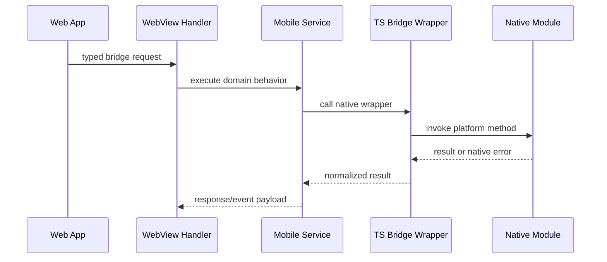

# Native Module

이 문서는 React Native JavaScript가 직접 처리하기 어렵거나 OS 권한/백그라운드 실행이 필요한 기능의 native module 구조를 설명한다.

## 위치

| 영역                         | 경로                                                                                                |
| ---------------------------- | --------------------------------------------------------------------------------------------------- |
| TypeScript wrapper           | `src/app/bridge/*Bridge.ts`                                                                         |
| Android package/module       | `android/app/src/main/java/io/chatic/dou/bridge`, `android/app/src/main/java/io/chatic/dou/module`  |
| Android push service         | `android/app/src/main/java/io/chatic/dou/push`                                                      |
| Android background upload    | `android/app/src/main/java/io/chatic/dou/service`, `android/app/src/main/java/io/chatic/dou/worker` |
| Android back-press handler   | `android/app/src/main/java/io/chatic/dou/handler`                                                   |
| iOS bridge                   | `ios/Bridges`                                                                                       |
| iOS app delegate integration | `ios/Chatic/AppDelegate.swift`                                                                      |

## 모듈 매핑

| 기능            | TypeScript                                        | Android                                                                   | iOS                                                      |
| --------------- | ------------------------------------------------- | ------------------------------------------------------------------------- | -------------------------------------------------------- |
| Upload          | `UploadManagerBridge.ts`                          | `UploadManagerModule.kt`, `UploadBackgroundService.kt`, `UploadWorker.kt` | `Upload/UploadManager.swift`, `Upload/UploadManager.m`   |
| File            | `FileManagerBridge.ts`                            | `FileManagerModule.kt`                                                    | `FileManager.m`                                          |
| App icon        | `AppIconBridge.ts`                                | `AppIconManagerModule.kt`                                                 | `AppIconManager.m`                                       |
| System bars     | `SystemBarsBridge.ts`                             | `SystemBarsModule.kt`                                                     | 없음 — RN `StatusBar`가 처리 (아래)                      |
| Back navigation | `BackNavigationBridge.ts`                         | `BackNavigationModule.kt`, `handler/BackNavigationHandler.kt`             | 없음 — 하드웨어 뒤로가기가 없다 (아래)                   |
| Push delivery   | n/a                                               | `push/ChaticFirebaseMessagingService.kt`                                  | `AppDelegate.swift` + `RNCPushNotificationIOS`           |
| Badge sync      | `BadgeSyncBridge.ts`                              | `BadgeSyncModule.kt`, `push/BadgeStore.kt`                                | App Group via `AppDelegate.swift` + NSE (RN module 없음) |
| Push marks      | `PushMarksBridge.ts`                              | `PushMarksModule.kt`, `push/PushMarkStore.kt`                             | `PushMarksModule.m` + App Group 레코드                   |
| Native logging  | n/a — `services/log/native/nativeLoggerBridge.ts` | `NativeLoggerModule.kt`                                                   | `NativeLoggerModule.swift`, `NativeLoggerModule.m`       |

**Android 전용 두 개.** `SystemBarsBridge`·`BackNavigationBridge`는 `Platform.OS !== 'android'`면
아무것도 하지 않고 돌아온다 — iOS에 대응 네이티브 모듈이 없고, 필요도 없다. 상태바는 RN의
`StatusBar`가 양 플랫폼을 덮고([`SystemBars.tsx`](../src/app/features/core/components/SystemBars.tsx)가
둘을 함께 호출한다), iOS에는 시스템 뒤로가기 버튼 자체가 없다.

**네이티브 로깅의 JS 쪽은 브릿지 폴더에 없다.** Push marks는 `src/app/bridge/PushMarksBridge.ts`로
관례를 따르지만, 네이티브 로깅은 [`services/log/native/nativeLoggerBridge.ts`](../src/app/services/log/native/nativeLoggerBridge.ts)에
있다 — 요청/응답 래퍼가 아니라 `NativeEventEmitter` 구독이라서, 네이티브가 밀어 올리는 로그를 코어
hub로 흘려보낸다(ADR-0047). `src/app/bridge`만 훑으면 이 모듈을 놓친다.

## 호출 흐름

## 설계 원칙

- TypeScript wrapper는 native method 이름과 payload shape를 숨기는 안정적인 경계다.
- service는 native module을 직접 호출해도 되지만 WebView handler가 native module을 직접 호출하지 않도록 유지한다.
- Android/iOS 중 한쪽만 구현된 기능은 문서와 handler에서 명시적으로 fallback 또는 unsupported error를 다룬다.
- background 작업은 OS lifecycle 제약을 우선 고려한다. upload처럼 장시간 실행되는 기능은 service와 repository에 복구 상태를 남긴다.
- push 전달은 네이티브 lifecycle 문제다: Android는 `ChaticFirebaseMessagingService`를 쓰고, iOS는 `AppDelegate`가 APNs 콜백을 `RNCPushNotificationIOS`로 포워딩한다.
- 백그라운드 푸시가 남긴 상태(뱃지 카운터·크로스 클라우드 마크)는 네이티브 공유 저장소에 쌓이고 JS가 나중에 읽어 간다. 소켓과 웹이 잠든 시간대의 유일한 실행 지점이기 때문이다 — [badge.md](./badge.md)·[push.md](./push.md) 참고.

## 변경 체크리스트

- TypeScript bridge wrapper가 payload와 error를 normalize하는가?
- Android package/module 등록이 필요한가?
- iOS Objective-C bridge export가 필요한가?
- 동일 기능의 Android/iOS 동작 차이가 문서화됐는가?
- native error가 WebView까지 raw exception으로 새지 않는가?
