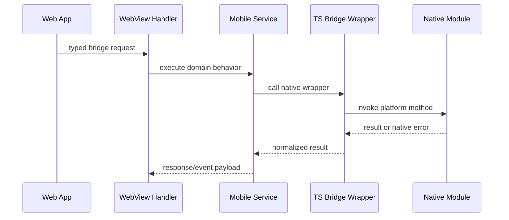

# Native Module

이 문서는 React Native JavaScript가 직접 처리하기 어렵거나 OS 권한/백그라운드 실행이 필요한 기능의 native module 구조를 설명한다.

## 위치

| 영역                         | 경로                                                                                                |
| ---------------------------- | --------------------------------------------------------------------------------------------------- |
| TypeScript wrapper           | `src/app/bridge/*Bridge.ts`                                                                         |
| Android package/module       | `android/app/src/main/java/io/chatic/dou/bridge`, `android/app/src/main/java/io/chatic/dou/module`  |
| Android push service         | `android/app/src/main/java/io/chatic/dou/push`                                                      |
| Android background upload    | `android/app/src/main/java/io/chatic/dou/service`, `android/app/src/main/java/io/chatic/dou/worker` |
| iOS bridge                   | `ios/Bridges`                                                                                       |
| iOS app delegate integration | `ios/Chatic/AppDelegate.swift`                                                                      |

## 모듈 매핑

| 기능            | TypeScript                | Android                                                                   | iOS                                                      |
| --------------- | ------------------------- | ------------------------------------------------------------------------- | -------------------------------------------------------- |
| Upload          | `UploadManagerBridge.ts`  | `UploadManagerModule.kt`, `UploadBackgroundService.kt`, `UploadWorker.kt` | `Upload/UploadManager.swift`, `Upload/UploadManager.m`   |
| File            | `FileManagerBridge.ts`    | `FileManagerModule.kt`                                                    | `FileManager.m`                                          |
| App icon        | `AppIconBridge.ts`        | `AppIconManagerModule.kt`                                                 | `AppIconManager.m`                                       |
| System bars     | `SystemBarsBridge.ts`     | `SystemBarsModule.kt`                                                     | platform-specific native behavior                        |
| Back navigation | `BackNavigationBridge.ts` | `BackNavigationModule.kt`, `BackNavigationHandler.kt`                     | platform-specific native behavior                        |
| Push delivery   | n/a                       | `push/ChaticFirebaseMessagingService.kt`                                  | `AppDelegate.swift` + `RNCPushNotificationIOS`           |
| Badge sync      | `BadgeSyncBridge.ts`      | `BadgeSyncModule.kt`, `push/BadgeStore.kt`                                | App Group via `AppDelegate.swift` + NSE (RN module 없음) |

## 호출 흐름

## 설계 원칙

- TypeScript wrapper는 native method 이름과 payload shape를 숨기는 안정적인 경계다.
- service는 native module을 직접 호출해도 되지만 WebView handler가 native module을 직접 호출하지 않도록 유지한다.
- Android/iOS 중 한쪽만 구현된 기능은 문서와 handler에서 명시적으로 fallback 또는 unsupported error를 다룬다.
- background 작업은 OS lifecycle 제약을 우선 고려한다. upload처럼 장시간 실행되는 기능은 service와 repository에 복구 상태를 남긴다.
- Push delivery is a native lifecycle concern: Android uses `ChaticFirebaseMessagingService`, while iOS forwards APNs callbacks from `AppDelegate` into `RNCPushNotificationIOS`.

## 변경 체크리스트

- TypeScript bridge wrapper가 payload와 error를 normalize하는가?
- Android package/module 등록이 필요한가?
- iOS Objective-C bridge export가 필요한가?
- 동일 기능의 Android/iOS 동작 차이가 문서화됐는가?
- native error가 WebView까지 raw exception으로 새지 않는가?
