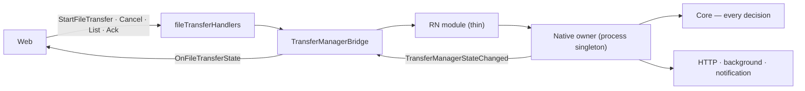

# File transfer

The web hands the shell a transfer instruction — a signed URL and the headers it covers — plus a local
file, and the shell moves the bytes: in the background, cancellable, reporting progress and the
result. Only uploads are implemented; the contract is direction-neutral so a download arrives as one
more `direction` value rather than a second set of messages, module names and handlers.

The shell does not talk to the upload API. Asking the server for an upload slot, and telling it the
upload is done, happen in the web; the shell's part ends when the storage endpoint answers.

## Files

| Layer             | File                                                                                                                                                        |
| ----------------- | ----------------------------------------------------------------------------------------------------------------------------------------------------------- |
| Messages          | `libs/app-messages/src/types/model/file-transfer.ts`                                                                                                        |
| WebView handler   | `src/app/webview/hooks/fileTransferHandlers.ts`, `useFileTransferHandler.ts`                                                                                |
| TS native wrapper | `src/app/bridge/TransferManagerBridge.ts`, `FileManagerBridge.ts` (`writeTempFile`)                                                                         |
| Android           | `io/chatic/dou/transfer/` — `core/` (decisions), `TransferRegistry.kt` (owner), `TransferService.kt` (runs transfers), `TransferManagerModule.kt` (RN face) |
| iOS               | `ios/Bridges/Transfer/` — `Core/` (decisions), `TransferSessionOwner.swift` (owner), `TransferManager.swift` (RN face)                                      |
| Test server       | `scripts/upload-test-server.js`                                                                                                                             |

## Messages

| Request              | Reply                  | What it does                                                          |
| -------------------- | ---------------------- | --------------------------------------------------------------------- |
| `StartFileTransfer`  | `OnStartFileTransfer`  | Accepts a transfer. A successful reply means accepted, not done       |
| `CancelFileTransfer` | `OnCancelFileTransfer` | Cancels a running transfer. `INVALID` when it already ended           |
| `ListFileTransfers`  | `OnListFileTransfers`  | Running transfers plus ended ones not yet acknowledged                |
| `AckFileTransfers`   | `OnAckFileTransfers`   | Drops acknowledged ended transfers                                    |
| `WriteTempFile`      | `OnWriteTempFile`      | Writes base64 bytes to a temporary file and returns its `file://` URI |

Results arrive only as the `OnFileTransferState` event: `running` any number of times, then exactly
one of `responded`, `failed`, `cancelled`.

**The web ships before the app.** A web build that sends these messages to an installed shell that
predates them gets `NOT_FOUND`, so a web caller must treat `NOT_FOUND` as "native transfer is not
available on this build".

## Structure

**The registry lives in one place: a process-wide native owner.** The RN layer holds no state; the
handler only relays. The owner is not the RN module and, on Android, not the foreground service —
the service stops when the last transfer ends, and a registry inside it would take the unacknowledged
results with it. On iOS the owner has to be reachable without React Native at all: the OS can
relaunch the app in the background to deliver a finished transfer before any JavaScript runs.

**Every rule is in the core; the OS layer only executes.** The core is plain Kotlin / plain Swift with
an injected clock and no platform imports. The OS layer feeds it facts (bytes sent, response received,
connection lost, cancel requested) and does what it answers (emit this event, stop that transport,
update the notification). This is what lets the two platforms be tested against the same list of
cases and keep identical behaviour.

## Rules

- **An HTTP response is reported, not judged.** Any status arrives as `responded` with `httpStatus`
  and, for an error, the storage's error code (`providerCode`, the S3 `<Code>`). Whether a status is
  success belongs to whoever knows the upload contract: `412` there means "already stored" and counts
  as success, `403` means an expired signature. `failed` is only for no response at all.
- **Exactly one terminal event, and it is kept until acknowledged.** The event can be missed — the
  WebView may be suspended or reloading when a transfer ends — so the owner keeps the result for
  `ListFileTransfers` until `AckFileTransfers` releases it, capped at 100 held results (oldest
  dropped first). The log upload queue uses the same fetch-then-acknowledge shape for the same reason.
- **Nothing is persisted.** The URL is a credential and it expires; a stored one would be a leak that
  cannot even be reused. Results are held in memory only. If the process dies, the server — which
  checks storage when the web confirms the upload — is the source of truth for what arrived.
- **Progress is bytes, never a ratio,** throttled to one `running` event per transfer per 200 ms. A
  ratio across a batch of files is computed above the shell.
- **No retries in native code.** How often and how soon to retry is the app's decision; the shell
  reports `NETWORK` and stops.
- **Headers the platform owns are dropped** (`content-length`, `host`). A presigned PUT lists
  `content-length` among its signed headers; the platform sets it from the body, which is what was
  signed.
- **Logs carry the host only.** The query string holds the signature.
- **A malformed request is refused at `start` with `INVALID`** — a reused id, `download`, a method
  other than `PUT`, a missing file URI or length, and a URL that is not an absolute http(s) URL with a
  host. Nothing is registered, so no event follows.
- **When no `Content-Type` header is given,** the file's `contentType` is sent, or
  `application/octet-stream`. Android would otherwise send a form-encoded type, which storage keeps as
  the object's type.

## Background

- **Android** runs transfers in a `dataSync` foreground service. Since Android 15 that service type may
  run for 6 hours in a 24-hour period; at the limit the OS calls `onTimeout`, running transfers end as
  `failed` with `SYSTEM`, and the service stops within seconds (otherwise the OS kills the app). The
  timer resets when the user brings the app to the foreground.
- **iOS** uses one background `URLSession` with a fixed identifier and uploads the original file. A
  task's `taskDescription` holds the transfer id only. When the OS relaunches the app to deliver
  results, the owner recreates the session and restores running transfers from the session's tasks.
  The session's total-time limit is left at the 7-day default: it measures the whole transfer, so a
  shorter one would cut slow but healthy large uploads.
  A finished task sometimes arrives with both byte counters at 0 although the server received the
  whole body; the task's progress fraction, applied to the declared length, is then used instead.

Two differences between the platforms are allowed, both forced by where the OS takes over. A caller
handles each the same way on either platform, so neither needs a platform branch.

- **When a connection drops,** iOS keeps the transfer `running` and waits; Android reports
  `failed(NETWORK)`. Retry on `NETWORK`, wait on `running`.
- **When the file is wrong** — missing, unreadable, a different length than declared, or on iOS not a
  local file (a `file://` URI or an absolute path; Android also reads `content://`) — iOS refuses `start` with `SOURCE`, because the OS reads the file itself once the task
  is handed over and nothing can be checked after that. Android finds out while streaming and reports
  `failed(SOURCE)`. Treat `SOURCE` the same whichever way it arrives.

## Notifications

- **Android** — the foreground-service notification shows the file name or the file count and a
  byte-weighted percentage, a Cancel action, and opens the app when tapped. Progress is weighted by
  bytes: nine 10 KB files done and one 4 MB file untouched is about 2 %, not 90 %. When a batch ends
  with a failure, one summary notification stays; a fully successful batch leaves none.
- **iOS, all versions** — when a batch ends with a failure while the app is in the background, one
  local notification: the file's title for a one-file batch, "2 of 5 uploads failed" otherwise — the
  same once-per-batch rule as Android's summary. Success is not announced. Permission is never
  requested here.
- **iOS 26 and later** — a continued-processing task shows system progress and a cancel control. All
  transfers join one task. The OS reports both a user cancellation and its own termination the same
  way, and the app cannot tell them apart, so an expiration is treated as a cancellation. To keep the
  OS from ending a task on its own — it ends tasks that make no progress first — the app closes the
  task itself after 30 seconds without progress, leaving the transfer running; the progress UI then
  stays closed until the next transfer starts.

## Temporary files

`WriteTempFile` exists because the transfer reads only files, while an image the web resized lives
only in web memory. The bytes cross the bridge once as base64 and land in the shell's temporary
directory, where the OS may reclaim them; nothing deletes them eagerly, because a background transfer
may still be reading the file after the WebView is gone.

## Verifying

- JS relay: `yarn workspace @chatic/mobile test fileTransferHandlers`.
- Core, the same numbered cases (`U1`–`U16`) on both platforms. Neither runs in CI.
    - Android, from `apps/mobile/android`: `./gradlew :app:testDevDebugUnitTest`. The build needs
      `app/google-services.json`, which is not in the repo.
    - iOS, from `apps/mobile/ios`:
      `xcodebuild test -project Chatic.xcodeproj -scheme ChaticTransferCoreTests -destination 'platform=iOS Simulator,name=iPhone 17 Pro'`.
      The `ChaticTransferCoreTests` target has no host app and no Pods — it compiles only
      `Bridges/Transfer/Core/`, which is why it runs in about a minute. The core files reach it as
      explicit file references rather than through the synchronized `Bridges` folder, so **a new file
      in `Core/` has to be added to that target by hand.**
- A new core rule gets its test on both platforms under the same `U` number, or a new number on both.
- End to end on an emulator or simulator: start `node scripts/upload-test-server.js`, forward the
  port on Android (`adb reverse tcp:8080 tcp:8080`), open the debug panel's Upload test screen and pick
  a scenario: `ok`, `expired` (403 + `AccessDenied`), `exists` (412), `slow`, `drop`. The screen
  targets port 8080 on whatever host the page was loaded from.
- On a real device, the WebView and the test server are reached over the LAN: build with
  `VITE_WEBVIEW_BASE_URL` set to the machine's LAN address in the local `.env`, serve the web with
  `--host 0.0.0.0`, and allow the app's local-network prompt on the phone. The iOS 26
  continued-processing task only runs on a device; the simulator refuses it.
- The test server does not check signatures. A real presigned URL (MinIO or a dev bucket) is the only
  way to confirm the header filter keeps the signature valid.

## Checklist

- Do the Android and iOS cores pass the same numbered cases?
- Is a status other than 2xx still `responded`, never `failed`?
- Does an ended transfer stay listed until it is acknowledged, and only then disappear?
- Does anything write the URL or headers to disk, a log line, or `taskDescription`?
- After a relaunch on iOS, are running transfers restored and the completion handler called?
