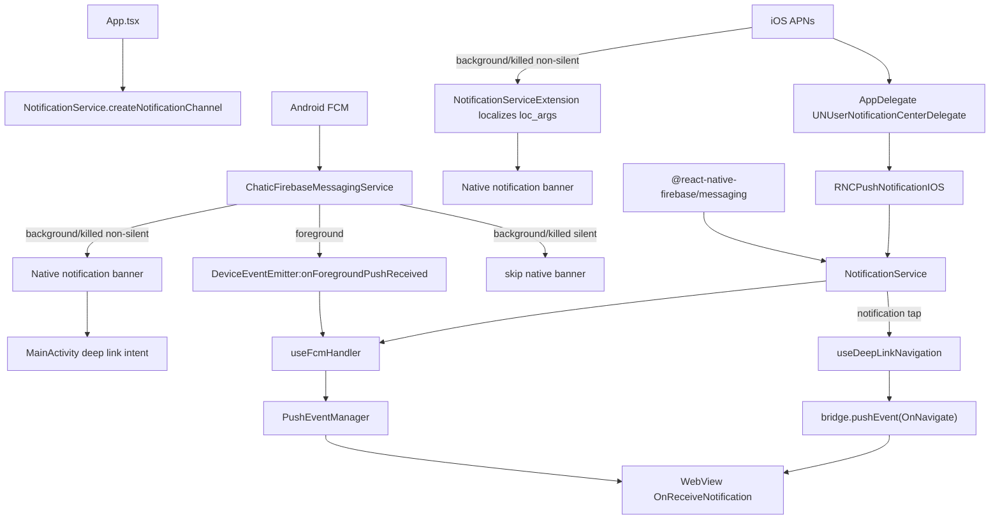
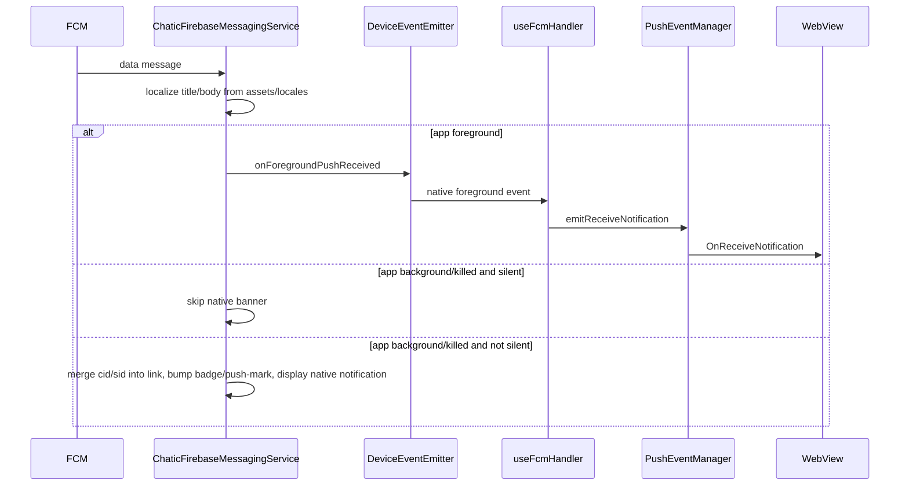
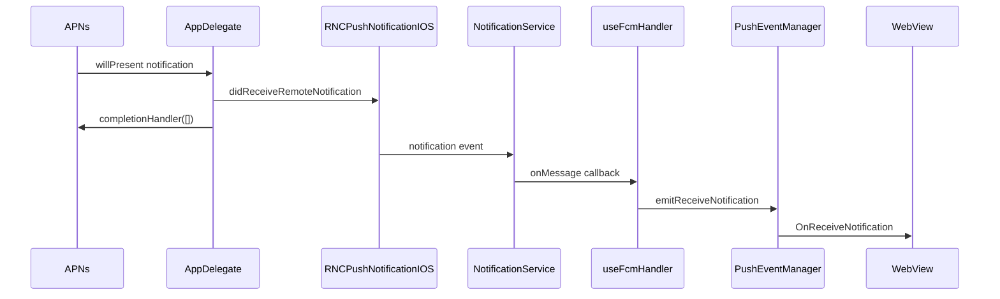
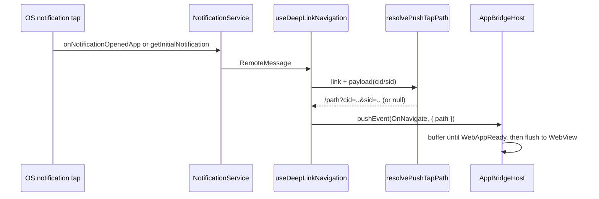

# Push

This shell owns FCM/APNs permission, token registration, Android notification channels, the app-icon
badge, and relaying a foreground push to the WebView. Notification-tap navigation is not handled
here — it is delegated to the deep-link coordinator (`useDeepLinkNavigation`), so a tap and an OS
deep link share one `OnNavigate` owner. See [Click routing](#click-routing).

There is no JS `setBackgroundMessageHandler` and no offline push queue. Android background/killed
delivery is handled by the native `ChaticFirebaseMessagingService`; iOS background/killed banners are
localized by the native `NotificationServiceExtension`. iOS foreground and notification-tap APNs
events arrive through `PushNotificationIOS`.

A background chat push also increments the app-icon badge natively (the socket and the web are
suspended then), and the web re-aggregates the true count on the next foreground. That lifecycle
(foreground aggregation, background increment, resume reconcile) is covered separately in
[badge.md](./badge.md).

## Files

| File                                                               | Role                                                                                                                                                              |
| ------------------------------------------------------------------ | ----------------------------------------------------------------------------------------------------------------------------------------------------------------- |
| `src/app/App.tsx`                                                  | creates the Android notification channels at mount                                                                                                                |
| `src/app/services/notification/NotificationService.ts`             | permission, token, APNs registration, channel creation, badge, FCM/APNs listeners                                                                                 |
| `src/app/services/notification/PushEventManager.ts`                | in-memory foreground-event broker between OS/native events and the WebView bridge                                                                                 |
| `src/app/webview/hooks/useFcmHandler.ts`                           | WebView bridge handler for token, badge and push-mark requests, and the foreground push relay (`OnReceiveNotification`)                                           |
| `src/app/webview/hooks/useDeepLinkNavigation.ts`                   | single owner of inbound navigation: notification taps + OS deep links → `OnNavigate` (paths built by `resolvePushTapPath` / `resolveDeepLink` in `deeplinkUtils`) |
| `src/app/bridge/BadgeSyncBridge.ts`                                | Android-only mirror of the web's true badge total, so a background push increments from it                                                                        |
| `src/app/bridge/PushMarksBridge.ts`                                | drains the cross-cloud push-mark records a background push wrote natively                                                                                         |
| `android/.../push/ChaticFirebaseMessagingService.kt`               | Android FCM receiver: localizes copy, emits the foreground event, writes the badge/push-mark, merges `cid`/`sid` into the tap link                                |
| `android/.../push/BadgeStore.kt`, `PushMarkStore.kt`               | the shared-preferences badge counter and the push-mark ring buffer (cap 100), same file                                                                           |
| `ios/Chatic/AppDelegate.swift`                                     | wires APNs callbacks to `RNCPushNotificationIOS`; suppresses the foreground system banner; hands the badge base to the App Group before backgrounding             |
| `ios/ChaticNotificationServiceExtension/NotificationService.swift` | localizes background/killed banners from `assets/locales/{lang}.json`; increments the shared badge and appends a push-mark record while the app is backgrounded   |

There is no native push diagnostics screen any more — `NotificationTestScreen.tsx` was removed with
the rest of the native debug UI (ADR-0080); the equivalent is the web debug panel's `Push` screen
(`apps/web/src/app/features/debug/overlay/screens/PushScreen.tsx`).

## Structure

## Android delivery

`ChaticFirebaseMessagingService` receives a data message and reads these fields:

| Payload field                    | Meaning                                                                                                     |
| -------------------------------- | ----------------------------------------------------------------------------------------------------------- |
| `id` / `messageId`               | notification identifier                                                                                     |
| `type`                           | app-level notification type                                                                                 |
| `channel_id` / `channelId`       | Android notification channel, defaults to `dou_chat`                                                        |
| `link` / `clickAction`           | the URL the tap routes to                                                                                   |
| `title_loc_key`, `titleLocKey`   | localized title key                                                                                         |
| `title_loc_args`, `titleLocArgs` | localized title args                                                                                        |
| `loc_key`, `bodyLocKey`          | localized body key                                                                                          |
| `loc_args`, `bodyLocArgs`        | localized body args                                                                                         |
| `data` / `payload`               | custom JSON metadata (`cid`/`sid` included); forwarded as the foreground event and merged into the tap link |
| `silent`                         | skips the native banner while the app is background/killed                                                  |

A background/killed **chat** push (channel `dou_chat` or `dou_chat_muted`) also increments the shared
badge counter (`BadgeStore`) and, if the payload carries `cid`/`uid`/`channelId`, appends a raw
cross-cloud push-mark record (`PushMarkStore`, ADR-0056) — see [Cross-cloud push mark](#cross-cloud-push-mark).
Notice, marketing and cloud pushes touch neither.

## iOS delivery

`AppDelegate` sets `UNUserNotificationCenter.current().delegate` and forwards APNs callbacks to
`RNCPushNotificationIOS`.

A foreground APNs notification reaches JS via
`RNCPushNotificationIOS.didReceiveRemoteNotification(...)`, and the system foreground-presentation
callback answers `[]`, so iOS shows no system banner while the app is active.

**A tap** rides a _different_ JS event than foreground receipt. iOS delivers a tap as a
`UNNotificationResponse`, and `AppDelegate.userNotificationCenter(_:didReceive:)` forwards it to
`RNCPushNotificationIOS.didReceive(response)`. On the JS side this surfaces as the **`localNotification`**
event — not the `notification` event (foreground receipt) and not FCM's `onNotificationOpenedApp`
(FCM never sees the tap, because the delegate is wired manually). `NotificationService.onNotificationOpenedApp`
subscribes to `localNotification` on iOS for exactly this reason; without that branch a background/warm
tap on iOS is silently lost and never reaches `OnNavigate`. A cold-start tap instead arrives through
`getInitialNotification()`.

A background/killed non-silent push (sent with `mutable-content: 1`) is intercepted before the banner
is shown by the **Notification Service Extension**
(`ChaticNotificationServiceExtension/NotificationService.swift`). It reads `title_loc_key`/`loc_key`
and `title_loc_args`/`loc_args`, resolves the template from `assets/locales/{lang}.json`, and
substitutes `{0}`-style placeholders into the banner title/body (`dou_chat_muted`/`dou_marketing` also
mute the sound). A silent push never runs the extension.

`loc_args`/`title_loc_args` may arrive as a native JSON array (`["Raine"]` — the real backend's APNs
shape) or as a JSON-encoded string (`"[\"Raine\"]"` — FCM-shaped test tooling), and the extension
accepts both. Missing or unparseable args leave the template unsubstituted, so the banner shows a
literal `{0}`.

## WebView bridge API

Requests `useFcmHandler` answers:

| Request           | Result                                                                                                                                                                                |
| ----------------- | ------------------------------------------------------------------------------------------------------------------------------------------------------------------------------------- |
| `FetchFcmToken`   | requests permission, registers APNs on iOS, returns the APNs token (iOS) or FCM token (Android)                                                                                       |
| `DeleteFcmToken`  | drops the FCM token so the next `FetchFcmToken` mints a fresh one (used by the web debug panel's push screen to test re-registration); reports success whether a token existed or not |
| `FetchBadgeCount` | returns the native launcher badge count                                                                                                                                               |
| `SetBadgeCount`   | sets the native launcher badge count                                                                                                                                                  |
| `FetchBadgeBase`  | returns the shared badge base (`BadgeSyncBridge.getBase()`) — Android only; `null` means unknown on iOS or an older shell, never zero                                                 |
| `FetchPushMarks`  | drains the cross-cloud push-mark records (`PushMarksBridge.drain()`)                                                                                                                  |

It also subscribes to (foreground receipt only):

- `notificationService.onMessage(...)`
- `DeviceEventEmitter.addListener('onForegroundPushReceived', ...)`
- `pushEventManager.onReceiveNotification(...)`

Notification taps (`onNotificationOpenedApp`, `getInitialNotification`) are subscribed by
`useDeepLinkNavigation`, not here.

## Cross-cloud push mark

A background chat push carries the current-cloud badge count, but a device may hold several clouds,
and the socket for the _other_ clouds is suspended the whole time the app is backgrounded — so a
message in one of them never reaches the web at all until the next launch. Android's
`ChaticFirebaseMessagingService` and iOS's `NotificationServiceExtension` each append a raw hint
(`cid`, `uid`, `channelId`, `sid`, `channelName` — whichever the payload carries) to a shared,
platform-local store the moment they bump the badge (ADR-0056). Neither side interprets the hint; that
happens once, on the web (`resolvePushCloudId.ts`).

Both stores are a capped ring buffer of **100** records and are drained (read once, then cleared) by
`FetchPushMarks` → `PushMarksBridge.drain()` on the next launch or foreground, so a cloud whose only
sign of life was a backgrounded push can still be marked unread.

## Click routing

Notification-tap navigation belongs to `useDeepLinkNavigation`, not the push handler. On a tap,
`deeplinkService.resolvePushTap` (implemented by `resolvePushTapPath`) resolves a WEBVIEW_URL-relative
path and hands it straight to the web as an `OnNavigate` bridge event — there is **no** `Linking.openURL`
round-trip. `AppBridgeHost` buffers the event until `WebAppReady`, so a cold-start tap is delivered as
soon as the web handshake completes, with no extra startup delay.

`resolvePushTapPath` reads the notification's `link` (falling back to `clickAction`) and merges the
`cid`/`sid` from `payload` into its query, because the web reads cloud/site context from the
navigation query (see the web's `resolvePushNavigation`). With no link it returns `null` and the tap
only foregrounds the app. Android merges `cid`/`sid` natively (see [Android delivery](#android-delivery)),
so `resolvePushTapPath`'s own merge mainly serves the iOS path.

The route from tap to `useDeepLinkNavigation` differs per platform: Android warm/background taps
arrive through FCM's `onNotificationOpenedApp`, iOS warm/background taps through the
`localNotification` event (see [iOS delivery](#ios-delivery)). Cold-start taps use
`getInitialNotification()` on both platforms.

The `OnNavigate` contract that a push tap and a deep link converge on is covered in
[deeplink.md](./deeplink.md).

## Badge behavior

- `NotificationService.onMessage`, `onNotificationOpenedApp` and `getInitialNotification` all call `clearBadge()`.
- `AppDelegate.applicationDidBecomeActive` also clears the iOS app-icon badge.
- The WebView can explicitly fetch and set the badge count over the bridge.

The full badge lifecycle — background increment, foreground reconcile — is in [badge.md](./badge.md).

## Cloud activation push

When a cloud is first activated, the server sends its owner one notification: over the socket
(`cloud.activated`, handled by the web) if connected, otherwise a push. The push spec:

| Field                  | Value                                                                                          |
| ---------------------- | ---------------------------------------------------------------------------------------------- |
| `type`                 | `cloud` → the push service derives channel `dou_cloud` (the server does not send `channel_id`) |
| `title_loc_key`        | `push_cloud_activate_title`                                                                    |
| `title_loc_args`       | `[cloud name \|\| cloud id]`                                                                   |
| `loc_key` / `loc_args` | **absent** — the title is the whole message                                                    |
| `link`                 | **absent**                                                                                     |
| `data`                 | `cid` (cloud id), `uid` (owner id)                                                             |

### Translation keys

`push_cloud_activate_title` must exist in **all four** locale sets — each has a different consumer, so
a missing one only breaks that path:

| Location                                              | Consumer                         | If missing                               |
| ----------------------------------------------------- | -------------------------------- | ---------------------------------------- |
| `src/app/utils/i18n/locales/{ko,en}.ts`               | native shell UI                  | shell copy only (push unaffected)        |
| `android/app/src/main/assets/locales/{ko,en}.json`    | `ChaticFirebaseMessagingService` | literal key on the Android banner        |
| `ios/assets/locales/{ko,en}.json`                     | iOS app                          | literal key in the app                   |
| `ios/ChaticNotificationServiceExtension/{ko,en}.json` | the extension                    | literal key on the iOS background banner |

The copy is ko `{0} 클라우드가 준비되었습니다`, en `{0} is ready` — the particle is detached from the
variable (Korean grammar picks "이" or "가" by the name's final sound, which cannot be fixed for an
arbitrary name). Every new key that carries a variable follows the same rule.

It is not in `TranslationKey` (`src/app/utils/i18n/types.ts`) — neither is the existing
`push_chat_message_title`. Push keys are assembled natively and never go through the shell's `t()`.

[`localeParity.test.ts`](../src/app/services/notification/localeParity.test.ts) is what keeps the four
sets in sync: it diffs the native three against the shell locale's flat `push_*` key set, checks for
empty values, and checks that the activation title still has a `{0}` slot (a missing arg makes the
fallback title a literal `cloud`).

**The Extension target's bundled resources are outside that test's reach.** If
`ios/ChaticNotificationServiceExtension/*.json` is missing from the Extension target's Copy Bundle
Resources, the file exists but only the banner breaks — check manually.

### Tap destination

With no `link`, the app must apply the spec's "empty `link` means root" rule itself, and **the tap's
route to the web differs per platform, so both need fixing together.**

| Path                             | No-link handling                                                                                                                                                           |
| -------------------------------- | -------------------------------------------------------------------------------------------------------------------------------------------------------------------------- |
| iOS tap (warm, background, cold) | if the type is in `resolvePushTapPath`'s `ROOTED_PUSH_TYPES` (currently just `cloud`), resolves to `'/'`                                                                   |
| Android background/killed tap    | `ChaticFirebaseMessagingService.rootTapLinkFor` puts `<scheme>://` on the intent's data URI, and RN `Linking` → `resolveDeepLink` reads it as `{ kind: 'web', path: '/' }` |

**Android needs its own path** because `displayNotification` attaches no data URI to the intent at all
when the link is empty. RN `Linking` only ever surfaces the data URI (`MainActivity` never reads the
`clickAction` extra), and a data-only push never fires FCM's `onNotificationOpenedApp` either — so a
JS-only fix would leave **Android taps going nowhere**, which is exactly the path a user who keeps the
app closed relies on. The scheme comes from the flavor's `app_scheme` string resource (`chatic` prod,
`chatic-dev` dev).

**Narrowing by type** matters because a missing link means two different things: a cloud push has no
link by contract, but a chat push missing its link is a malformed payload. Sending the latter home too
would steal the screen the user was on. A `link`, when present, always wins regardless of type.

**The two lists are kept in sync by hand** — Kotlin's `PUSH_TYPE_CLOUD` and JS's `ROOTED_PUSH_TYPES`
share no type. Adding a rooted type means updating both.

The tap does not switch to the activated cloud — product decided the destination is home, and the
title alone says which cloud (hence no body).

### Badge and unread

`dou_cloud` is not a chat channel. Android's `isChatChannel(channelId)` gate and iOS's
`applyBadgeIncrementIfNeeded` chat gate already exclude it, so **native code does nothing extra here**
— neither the badge nor a cross-cloud mark moves for this push.

## Constraints

- JS background push handling does not go back into `main.tsx` unless the native Android/iOS lifecycle
  design changes.
- Android localized notification text comes from `ChaticFirebaseMessagingService` reading
  `assets/locales/{lang}.json`, falling back to English when missing.
- iOS background/killed banner text is localized by the Notification Service Extension from
  `assets/locales/{lang}.json` (English fallback); `loc_args`/`title_loc_args` accept both the native
  JSON array (APNs) and a JSON string. `assets/locales/*.json` must be bundled into **both** the app
  target's and the **Extension** target's Copy Bundle Resources.
- Foreground push delivery is deliberately decoupled through `PushEventManager` — the WebView may not
  be mounted yet when the OS/native callback fires.
- Background/killed silent Android pushes currently skip the native banner and are not persisted to a
  JS offline queue.
- `cid`/`sid` reach the web only through the `OnNavigate` path query, never a separate channel: Android
  merges them into the link URI natively, iOS merges them in `resolvePushTapPath`. The web strips them
  in `resolvePushNavigation`.

## Change checklist

- Does the change touch Android native delivery, iOS APNs delivery, or the JS bridge delivery — or more than one?
- Does Android foreground delivery still emit `onForegroundPushReceived` with the fields `useFcmHandler` expects?
- Does the tap payload still carry `link` (or `clickAction`)?
- Do `cid`/`sid` still reach the web — merged into the link query on Android, via `resolvePushPath` on iOS?
- Do `NotificationService.createNotificationChannel` and `ChaticFirebaseMessagingService.createNotificationChannel` still agree on channel behavior?
- If payload localization changed, does the iOS Notification Service Extension still resolve `loc_args` (both native-array and JSON-string shapes) from `assets/locales`, and is that JSON bundled into the Extension target?
- Is the foreground system banner still suppressed on both platforms as intended?
