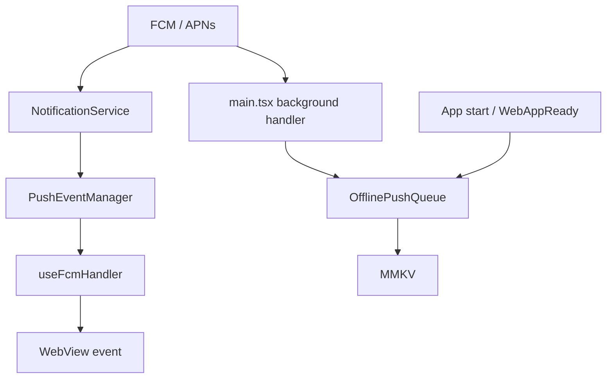
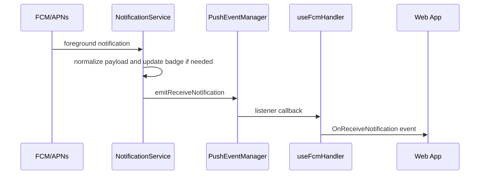
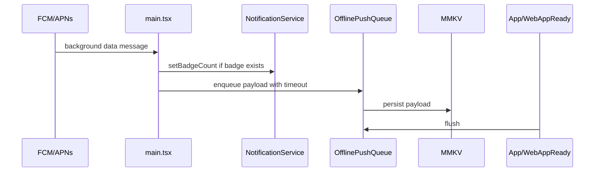

# Push

Push 시스템은 FCM/APNs 수신, notification permission, badge, foreground WebView event, background offline queue를 담당한다.

## 주요 파일

| 파일                                                        | 역할                                                   |
| ----------------------------------------------------------- | ------------------------------------------------------ |
| `src/main.tsx`                                              | background FCM data message handler                    |
| `src/app/App.tsx`                                           | notification channel init, startup queue flush         |
| `src/app/services/notification/NotificationService.ts`      | FCM/APNs permission, token, badge, foreground listener |
| `src/app/services/notification/PushEventManager.ts`         | foreground push event broker                           |
| `src/app/services/notification/OfflinePushQueue.ts`         | MMKV-backed background payload queue                   |
| `src/app/webview/hooks/useFcmHandler.ts`                    | WebView bridge handler for FCM/badge/push events       |
| `src/app/features/debug/screens/NotificationTestScreen.tsx` | manual diagnostics                                     |

## 구조

## Foreground 시나리오

## Background/Killed 시나리오

## 제약

- background/headless context에서 SQLite JSI 사용을 가정하지 않는다.
- background handler는 timeout budget 안에서 끝나야 한다.
- foreground push는 WebView lifecycle보다 먼저 도착할 수 있으므로 `PushEventManager`가 decoupling point다.
- badge는 native launcher state라 WebView state와 별도로 다룬다.

## 변경 체크리스트

- foreground, background, killed 상태를 모두 고려했는가?
- `badge` payload 처리와 WebView event 전파가 분리되어 있는가?
- queue flush 시점이 app start와 `WebAppReady` 양쪽에서 안전한가?
- notification click URL은 deeplink service로 위임되는가?
