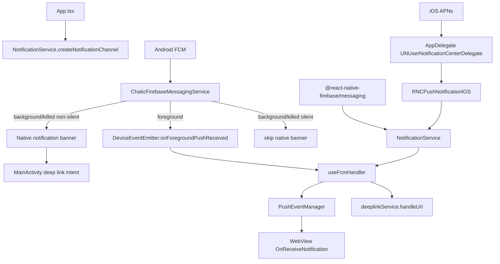
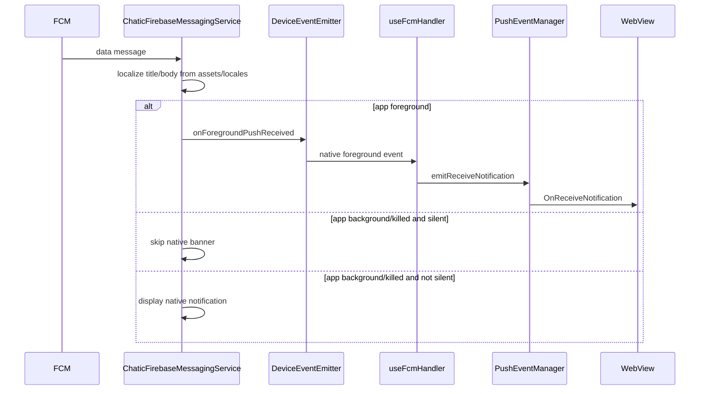
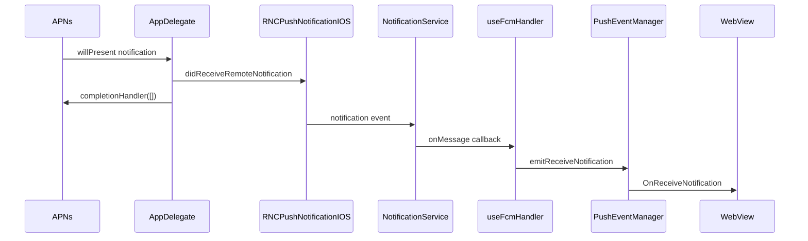
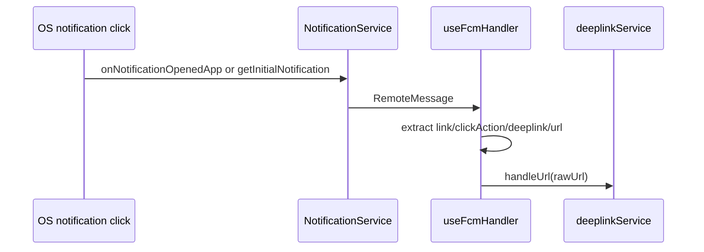

# Push

Push architecture owns FCM/APNs permission, token registration, notification channel setup, badge count, foreground delivery to WebView, and notification-click deeplink routing.

The current architecture does not use a JS `setBackgroundMessageHandler` or `OfflinePushQueue`. Android background/killed delivery is handled by a native `FirebaseMessagingService`; iOS APNs events are forwarded through `PushNotificationIOS`.

## Key Files

| File                                                                             | Role                                                                                               |
| -------------------------------------------------------------------------------- | -------------------------------------------------------------------------------------------------- |
| `src/app/App.tsx`                                                                | creates Android notification channels on app mount                                                 |
| `src/app/services/notification/NotificationService.ts`                           | permission, token, APNs registration, channel creation, badge, FCM/APNs listeners                  |
| `src/app/services/notification/PushEventManager.ts`                              | in-memory foreground event broker between OS/native events and WebView bridge                      |
| `src/app/webview/hooks/useFcmHandler.ts`                                         | WebView bridge handler for token, badge, foreground push events, click routing                     |
| `android/app/src/main/java/io/chatic/dou/push/ChaticFirebaseMessagingService.kt` | Android native FCM receiver, localized notification builder, foreground native-to-JS event emitter |
| `ios/Chatic/AppDelegate.swift`                                                   | iOS APNs delegate bridge into `RNCPushNotificationIOS`; suppresses foreground system banner        |
| `src/app/features/debug/screens/NotificationTestScreen.tsx`                      | manual diagnostics for permission, token, badge, and listener behavior                             |

## Structure

## Android Delivery

`ChaticFirebaseMessagingService` receives data messages and resolves these fields:

| Payload field                    | Meaning                                               |
| -------------------------------- | ----------------------------------------------------- |
| `id` / `messageId`               | notification identity                                 |
| `type`                           | app-level notification type                           |
| `channel_id` / `channelId`       | Android notification channel, default `dou_chat`      |
| `link` / `clickAction`           | URL routed when the user opens the notification       |
| `title_loc_key`, `titleLocKey`   | localized title key                                   |
| `title_loc_args`, `titleLocArgs` | localized title args                                  |
| `loc_key`, `bodyLocKey`          | localized body key                                    |
| `loc_args`, `bodyLocArgs`        | localized body args                                   |
| `data` / `payload`               | custom JSON payload forwarded to JS foreground events |
| `silent`                         | skips native banner when app is background/killed     |

## iOS Delivery

`AppDelegate` sets `UNUserNotificationCenter.current().delegate` and forwards APNs callbacks to `RNCPushNotificationIOS`.

Foreground APNs notifications are passed to JS with `RNCPushNotificationIOS.didReceiveRemoteNotification(...)`, then the system foreground presentation callback receives `[]`, so iOS does not show a system banner while the app is active.

## WebView Bridge API

`useFcmHandler` handles WebView requests:

| Request           | Result                                                                                        |
| ----------------- | --------------------------------------------------------------------------------------------- |
| `FetchFcmToken`   | requests permission, registers APNs on iOS, returns APNs token on iOS or FCM token on Android |
| `FetchBadgeCount` | returns native launcher badge count                                                           |
| `SetBadgeCount`   | sets native launcher badge count                                                              |

It also subscribes to:

- `notificationService.onMessage(...)`
- `notificationService.onNotificationOpenedApp(...)`
- `notificationService.getInitialNotification()`
- `DeviceEventEmitter.addListener('onForegroundPushReceived', ...)`
- `pushEventManager.onReceiveNotification(...)`

## Click Routing

Notification click routing is owned by `useFcmHandler`.

For cold start, `useFcmHandler` delays routing by 1 second to allow app state and `DeepLinkManager` startup.

## Badge Behavior

- `NotificationService.onMessage`, `onNotificationOpenedApp`, and `getInitialNotification` call `clearBadge()`.
- `AppDelegate.applicationDidBecomeActive` also clears the iOS app icon badge number.
- WebView can explicitly fetch and set badge count through bridge requests.

## Constraints

- Do not reintroduce JS background push processing in `main.tsx` unless the native Android/iOS lifecycle design changes.
- Android localized notification text is resolved in `ChaticFirebaseMessagingService` from `assets/locales/{lang}.json`, with fallback to English.
- Foreground push delivery is intentionally decoupled through `PushEventManager`; WebView may not be mounted when OS/native callbacks begin.
- Background/killed Android silent pushes currently skip native banner and are not persisted by a JS offline queue.

## Change Checklist

- Does the change affect Android native delivery, iOS APNs delivery, or JS bridge delivery?
- Does Android foreground delivery still emit `onForegroundPushReceived` with the fields expected by `useFcmHandler`?
- Does notification click payload still include one of `link`, `clickAction`, `deeplink`, or `url`?
- Does channel behavior remain consistent between `NotificationService.createNotificationChannel` and `ChaticFirebaseMessagingService.createNotificationChannel`?
- Are foreground system banners intentionally suppressed on both platforms?
