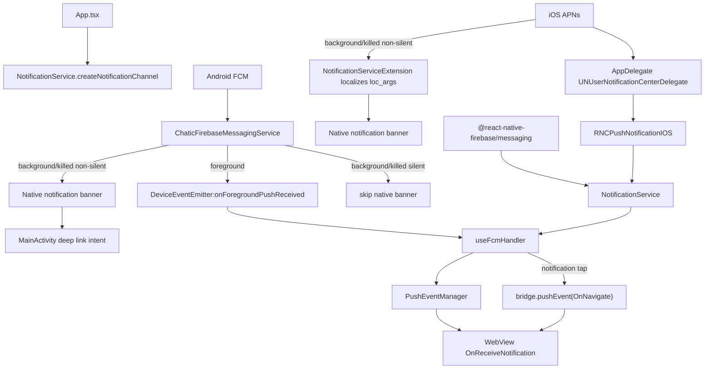
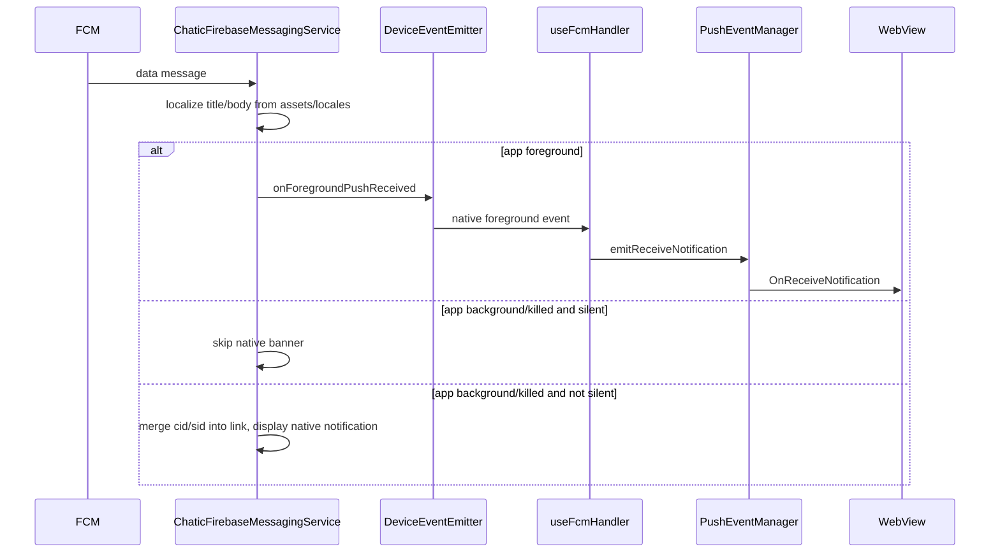
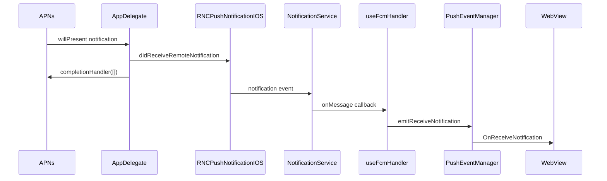
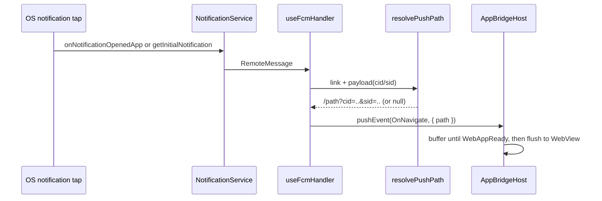

# Push

Push architecture owns FCM/APNs permission, token registration, notification channel setup, badge count, foreground delivery to WebView, and notification-tap navigation.

The current architecture does not use a JS `setBackgroundMessageHandler` or `OfflinePushQueue`. Android background/killed delivery is handled by a native `FirebaseMessagingService`; iOS background/killed banners are localized by a native `Notification Service Extension`, while foreground and notification-tap APNs events are forwarded through `PushNotificationIOS`.

## Key Files

| File                                                                             | Role                                                                                                            |
| -------------------------------------------------------------------------------- | --------------------------------------------------------------------------------------------------------------- |
| `src/app/App.tsx`                                                                | creates Android notification channels on app mount                                                              |
| `src/app/services/notification/NotificationService.ts`                           | permission, token, APNs registration, channel creation, badge, FCM/APNs listeners                               |
| `src/app/services/notification/PushEventManager.ts`                              | in-memory foreground event broker between OS/native events and WebView bridge                                   |
| `src/app/webview/hooks/useFcmHandler.ts`                                         | WebView bridge handler for token, badge, foreground push events, and notification-tap navigation                |
| `src/app/webview/hooks/resolvePushPath.ts`                                       | builds the WebView-relative `OnNavigate` path, merging `cid`/`sid` from the payload into the navigation query   |
| `android/app/src/main/java/io/chatic/dou/push/ChaticFirebaseMessagingService.kt` | Android native FCM receiver, localized notification builder, foreground native-to-JS emitter, `cid`/`sid`→link merge |
| `ios/Chatic/AppDelegate.swift`                                                   | iOS APNs delegate bridge into `RNCPushNotificationIOS`; suppresses foreground system banner                     |
| `ios/ChaticNotificationServiceExtension/NotificationService.swift`               | iOS background/killed banner localizer; resolves `loc_key`/`loc_args` from `assets/locales/{lang}.json`, accepting loc-args as a native array or JSON string |
| `src/app/features/debug/screens/NotificationTestScreen.tsx`                      | manual diagnostics for permission, token, badge, and listener behavior                                          |

## Structure

## Android Delivery

`ChaticFirebaseMessagingService` receives data messages and resolves these fields:

| Payload field                    | Meaning                                                                       |
| -------------------------------- | ----------------------------------------------------------------------------- |
| `id` / `messageId`               | notification identity                                                         |
| `type`                           | app-level notification type                                                   |
| `channel_id` / `channelId`       | Android notification channel, default `dou_chat`                              |
| `link` / `clickAction`           | URL routed when the user opens the notification                               |
| `title_loc_key`, `titleLocKey`   | localized title key                                                           |
| `title_loc_args`, `titleLocArgs` | localized title args                                                          |
| `loc_key`, `bodyLocKey`          | localized body key                                                            |
| `loc_args`, `bodyLocArgs`        | localized body args                                                           |
| `data` / `payload`               | custom JSON metadata (incl. `cid`/`sid`); forwarded to JS foreground events, and its `cid`/`sid` are merged into the tap link |
| `silent`                         | skips native banner when app is background/killed                             |

## iOS Delivery

`AppDelegate` sets `UNUserNotificationCenter.current().delegate` and forwards APNs callbacks to `RNCPushNotificationIOS`.

Foreground APNs notifications are passed to JS with `RNCPushNotificationIOS.didReceiveRemoteNotification(...)`, then the system foreground presentation callback receives `[]`, so iOS does not show a system banner while the app is active.

Background/killed non-silent pushes (sent with `mutable-content: 1`) are intercepted by the **Notification Service Extension** (`ChaticNotificationServiceExtension/NotificationService.swift`) before the banner is shown. It reads `title_loc_key`/`loc_key` and `title_loc_args`/`loc_args`, resolves the template from `assets/locales/{lang}.json`, substitutes `{0}` placeholders, and rewrites the banner title/body (it also silences sound for `dou_chat_muted`/`dou_marketing`). Silent pushes do **not** run the Extension.

`loc_args`/`title_loc_args` may arrive as a native JSON array (`["Raine"]` — the real backend over APNs) or as a JSON-encoded string (`"[\"Raine\"]"` — the FCM-shaped test tooling); the Extension accepts both. Missing or unparseable args leave the template unsubstituted, which surfaces as a literal `{0}` on the banner.

## WebView Bridge API

`useFcmHandler` handles WebView requests:

| Request           | Result                                                                                        |
| ----------------- | --------------------------------------------------------------------------------------------- |
| `FetchFcmToken`   | requests permission, registers APNs on iOS, returns APNs token on iOS or FCM token on Android |
| `FetchBadgeCount` | returns native launcher badge count                                                           |
| `SetBadgeCount`   | sets native launcher badge count                                                              |

It also subscribes to:

- `notificationService.onMessage(...)`
- `notificationService.onNotificationOpenedApp(...)`
- `notificationService.getInitialNotification()`
- `DeviceEventEmitter.addListener('onForegroundPushReceived', ...)`
- `pushEventManager.onReceiveNotification(...)`

## Click Routing

Notification-tap navigation is owned by `useFcmHandler`. On tap it resolves a WebView-relative path with `resolvePushPath` and emits it straight to the web as an `OnNavigate` bridge event — there is **no** `Linking.openURL` round-trip. `AppBridgeHost` buffers events until `WebAppReady`, so a cold-start tap is delivered as soon as the web handshake completes (no startup delay needed).

`resolvePushPath` takes the notification `link` (fallback `clickAction`) and merges `cid`/`sid` from the `payload` into the query, because the web reads cloud/site context from the navigation query (see the web-side `resolvePushNavigation`). It returns `null` when there is no link, in which case the tap simply foregrounds the app. On Android the merge already happened natively (see Android Delivery), so the payload merge in `resolvePushPath` is primarily the iOS path.

See [`deeplink.md`](./deeplink.md) for the shared `OnNavigate` path contract that both push taps and deep links feed into.

## Badge Behavior

- `NotificationService.onMessage`, `onNotificationOpenedApp`, and `getInitialNotification` call `clearBadge()`.
- `AppDelegate.applicationDidBecomeActive` also clears the iOS app icon badge number.
- WebView can explicitly fetch and set badge count through bridge requests.

## Constraints

- Do not reintroduce JS background push processing in `main.tsx` unless the native Android/iOS lifecycle design changes.
- Android localized notification text is resolved in `ChaticFirebaseMessagingService` from `assets/locales/{lang}.json`, with fallback to English.
- iOS background/killed banner text is localized in the Notification Service Extension from `assets/locales/{lang}.json` (fallback English). `loc_args`/`title_loc_args` are accepted both as a native JSON array (APNs) and a JSON string, resolving to the same positional args. The `assets/locales/*.json` files must be bundled in the **Extension target's** Copy Bundle Resources, not just the app target.
- Foreground push delivery is intentionally decoupled through `PushEventManager`; WebView may not be mounted when OS/native callbacks begin.
- Background/killed Android silent pushes currently skip native banner and are not persisted by a JS offline queue.
- `cid`/`sid` reach the web through the `OnNavigate` path query, not a separate channel: Android merges them into the link URI natively, iOS merges them in `resolvePushPath`. The web strips them in `resolvePushNavigation`.

## Change Checklist

- Does the change affect Android native delivery, iOS APNs delivery, or JS bridge delivery?
- Does Android foreground delivery still emit `onForegroundPushReceived` with the fields expected by `useFcmHandler`?
- Does the notification tap payload still include `link` (or `clickAction`)?
- Are `cid`/`sid` still delivered to the web — merged into the link query natively on Android, and via `resolvePushPath` on iOS?
- Does channel behavior remain consistent between `NotificationService.createNotificationChannel` and `ChaticFirebaseMessagingService.createNotificationChannel`?
- If payload localization changed, does the iOS Notification Service Extension still resolve `loc_args` (both native-array and JSON-string forms) from `assets/locales`, and are those JSON files still bundled in the Extension target?
- Are foreground system banners intentionally suppressed on both platforms?
