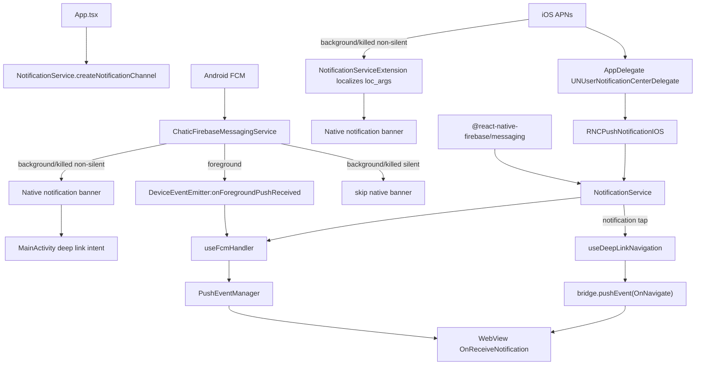
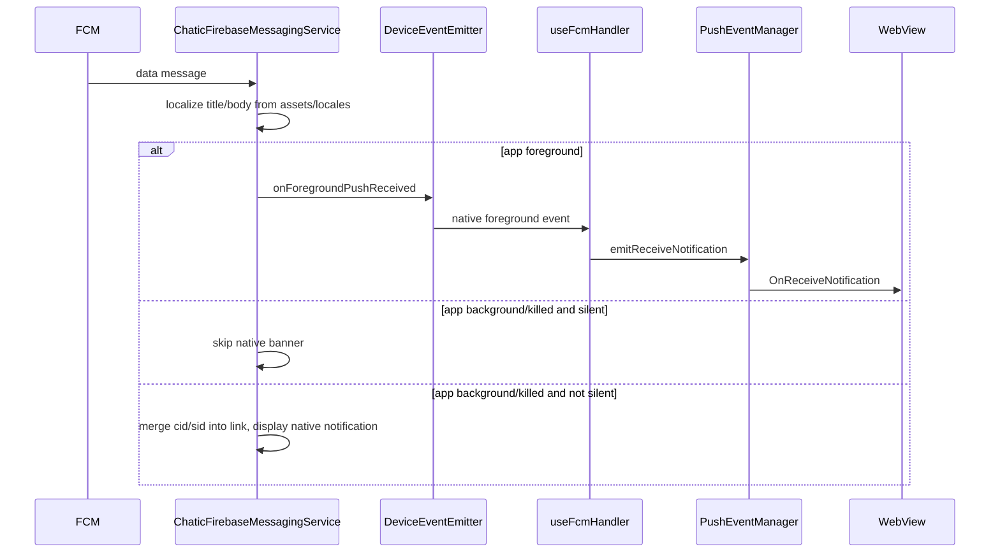
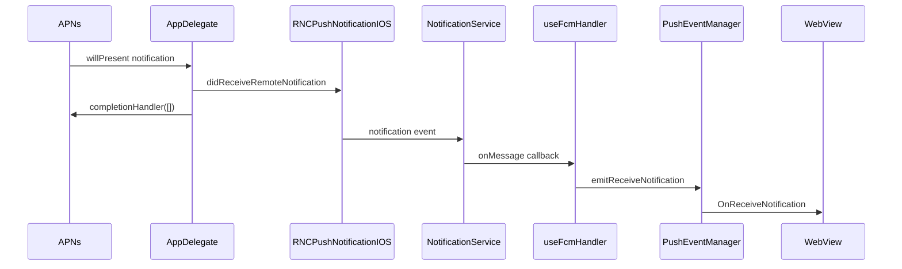
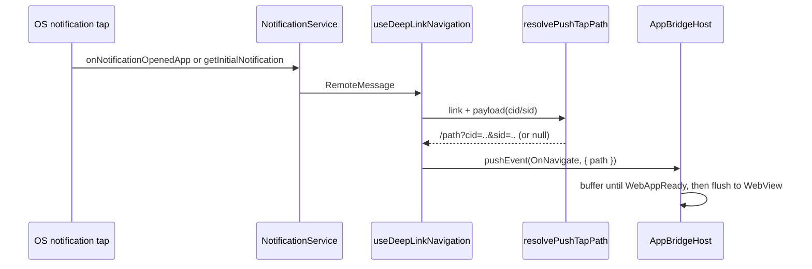

# Push

Push 아키텍처는 FCM/APNs 권한, 토큰 등록, notification channel 설정, 뱃지 카운트, 그리고 WebView로의
포그라운드 전달을 소유한다. 알림 탭 네비게이션은 deep link coordinator(`useDeepLinkNavigation`)에 위임해,
탭과 딥링크가 하나의 `OnNavigate` owner를 공유한다 — Click Routing 참고.

현재 아키텍처는 JS `setBackgroundMessageHandler`나 `OfflinePushQueue`를 쓰지 않는다. Android
백그라운드/killed 전달은 네이티브 `FirebaseMessagingService`가 처리하고, iOS 백그라운드/killed 배너는
네이티브 `Notification Service Extension`이 지역화한다. iOS 포그라운드·알림 탭 APNs 이벤트는
`PushNotificationIOS`를 통해 전달된다.

백그라운드 chat 푸시는 앱 아이콘 뱃지도 네이티브에서 증가시키며(이때 소켓/웹은 suspend 상태), 웹이 다음
포그라운드에서 진짜 카운트를 다시 집계한다. 이 뱃지 lifecycle(포그라운드 집계·백그라운드 증가·복귀 시
reconcile)은 [badge.md](./badge.md)에서 별도로 다룬다.

## 주요 파일

| 파일                                                                             | 역할                                                                                                                                            |
| -------------------------------------------------------------------------------- | ----------------------------------------------------------------------------------------------------------------------------------------------- |
| `src/app/App.tsx`                                                                | 앱 마운트 시 Android notification channel 생성                                                                                                  |
| `src/app/services/notification/NotificationService.ts`                           | 권한, 토큰, APNs 등록, channel 생성, 뱃지, FCM/APNs 리스너                                                                                      |
| `src/app/services/notification/PushEventManager.ts`                              | OS/네이티브 이벤트와 WebView 브릿지 사이의 in-memory 포그라운드 이벤트 broker                                                                   |
| `src/app/webview/hooks/useFcmHandler.ts`                                         | 토큰·뱃지·푸시 마크·포그라운드 푸시(`OnReceiveNotification`)를 담당하는 WebView 브릿지 핸들러 (알림 탭은 제외)                                  |
| `src/app/webview/hooks/useDeepLinkNavigation.ts`                                 | 인바운드 네비게이션 단일 owner: 알림 탭 + OS 딥링크 → `OnNavigate` (경로는 `deeplinkUtils`의 `resolvePushTapPath` / `resolveDeepLink`가 생성)   |
| `android/app/src/main/java/io/chatic/dou/push/ChaticFirebaseMessagingService.kt` | Android 네이티브 FCM receiver, 지역화된 notification builder, 포그라운드 native→JS emitter, `cid`/`sid`→link 병합                               |
| `ios/Chatic/AppDelegate.swift`                                                   | iOS APNs delegate를 `RNCPushNotificationIOS`로 연결; 포그라운드 시스템 배너 suppress                                                            |
| `ios/ChaticNotificationServiceExtension/NotificationService.swift`               | iOS 백그라운드/killed 배너 지역화; `loc_key`/`loc_args`를 `assets/locales/{lang}.json`에서 해석(loc-args는 네이티브 배열/JSON 문자열 모두 수용) |
| `src/app/bridge/PushMarksBridge.ts`                                              | 백그라운드 푸시가 남긴 크로스 클라우드 마크 drain (ADR-0056)                                                                                    |
| `src/app/features/debug/screens/NotificationTestScreen.tsx`                      | 권한·토큰·뱃지·리스너 동작 수동 진단                                                                                                            |

## Structure

## Android 전달

`ChaticFirebaseMessagingService`는 data message를 받아 다음 필드를 해석한다:

| Payload 필드                     | 의미                                                                                                      |
| -------------------------------- | --------------------------------------------------------------------------------------------------------- |
| `id` / `messageId`               | notification 식별자                                                                                       |
| `type`                           | 앱 레벨 notification 타입                                                                                 |
| `channel_id` / `channelId`       | Android notification channel, 기본값 `dou_chat`                                                           |
| `link` / `clickAction`           | 사용자가 알림을 열 때 라우팅되는 URL                                                                      |
| `title_loc_key`, `titleLocKey`   | 지역화 title key                                                                                          |
| `title_loc_args`, `titleLocArgs` | 지역화 title args                                                                                         |
| `loc_key`, `bodyLocKey`          | 지역화 body key                                                                                           |
| `loc_args`, `bodyLocArgs`        | 지역화 body args                                                                                          |
| `data` / `payload`               | 커스텀 JSON 메타데이터(`cid`/`sid` 포함); JS 포그라운드 이벤트로 전달되고, `cid`/`sid`는 탭 link에 병합됨 |
| `silent`                         | 앱이 백그라운드/killed일 때 네이티브 배너를 skip                                                          |

## iOS 전달

`AppDelegate`는 `UNUserNotificationCenter.current().delegate`를 설정하고 APNs 콜백을
`RNCPushNotificationIOS`로 전달한다.

포그라운드 APNs 알림은 `RNCPushNotificationIOS.didReceiveRemoteNotification(...)`으로 JS에 전달되고,
시스템 포그라운드 presentation 콜백은 `[]`를 받으므로 앱이 활성일 때 iOS는 시스템 배너를 띄우지 않는다.

**알림 탭**은 포그라운드 수신과 _다른_ JS 이벤트를 탄다. iOS는 탭을 `UNNotificationResponse`로 전달하며,
`AppDelegate.userNotificationCenter(_:didReceive:)`가 이를 `RNCPushNotificationIOS.didReceive(response)`로
포워딩한다. JS 쪽에서는 이것이 **`localNotification`** 이벤트로 뜬다 — `notification` 이벤트(포그라운드 수신)도
아니고 FCM의 `onNotificationOpenedApp`도 아니다(delegate를 수동으로 배선했기 때문에 FCM은 탭을 못 본다).
그래서 `NotificationService.onNotificationOpenedApp`은 iOS에서 `localNotification`을 구독한다. 이 분기가
없으면 iOS 백그라운드/warm 탭이 조용히 유실되어 `OnNavigate`에 도달하지 못한다. Cold-start 탭은 대신
`getInitialNotification()`으로 들어온다.

백그라운드/killed non-silent 푸시(`mutable-content: 1`로 전송)는 배너 표시 전에 **Notification Service
Extension**(`ChaticNotificationServiceExtension/NotificationService.swift`)이 가로챈다. `title_loc_key`/`loc_key`와
`title_loc_args`/`loc_args`를 읽어 `assets/locales/{lang}.json`에서 템플릿을 해석하고 `{0}` placeholder를
치환해 배너 title/body를 다시 쓴다(`dou_chat_muted`/`dou_marketing`은 소리도 끈다). Silent 푸시는 Extension을
실행하지 **않는다**.

`loc_args`/`title_loc_args`는 네이티브 JSON 배열(`["Raine"]` — 실제 백엔드의 APNs)로도, JSON 인코딩된
문자열(`"[\"Raine\"]"` — FCM 형태의 테스트 도구)로도 도착할 수 있고, Extension은 둘 다 수용한다. args가
없거나 파싱 불가면 템플릿이 치환되지 않아 배너에 리터럴 `{0}`이 남는다.

## WebView 브릿지 API

`useFcmHandler`가 처리하는 WebView 요청:

| 요청              | 결과                                                                  |
| ----------------- | --------------------------------------------------------------------- |
| `FetchFcmToken`   | 권한 요청, iOS는 APNs 등록, iOS는 APNs 토큰 / Android는 FCM 토큰 반환 |
| `FetchBadgeCount` | 네이티브 launcher 뱃지 카운트 반환                                    |
| `SetBadgeCount`   | 네이티브 launcher 뱃지 카운트 설정                                    |
| `FetchPushMarks`  | 백그라운드 푸시가 남긴 크로스 클라우드 마크를 drain (읽고 즉시 비움)  |

또한 구독하는 것(포그라운드 수신만):

- `notificationService.onMessage(...)`
- `DeviceEventEmitter.addListener('onForegroundPushReceived', ...)`
- `pushEventManager.onReceiveNotification(...)`

알림 탭(`onNotificationOpenedApp`, `getInitialNotification`)은 여기가 아니라 `useDeepLinkNavigation`이 구독한다.

## Click Routing

알림 탭 네비게이션은 push 핸들러가 아니라 `useDeepLinkNavigation`이 소유한다. 탭 시 `deeplinkService.resolvePushTap`
(`resolvePushTapPath`가 구현)으로 WebView 상대 경로를 해석해 `OnNavigate` 브릿지 이벤트로 웹에 곧장 넘긴다 —
`Linking.openURL` round-trip이 **없다**. `AppBridgeHost`가 `WebAppReady`까지 이벤트를 버퍼링하므로,
cold-start 탭도 웹 handshake가 끝나는 즉시 전달된다(별도의 시작 지연이 필요 없다).

`resolvePushTapPath`는 notification `link`(fallback `clickAction`)를 받아 `payload`의 `cid`/`sid`를 쿼리에
병합한다. 웹이 클라우드/사이트 컨텍스트를 네비게이션 쿼리에서 읽기 때문이다(웹 쪽 `resolvePushNavigation` 참고).
link가 없으면 `null`을 반환하고, 이 경우 탭은 앱을 포그라운드로 올리기만 한다. Android는 병합이 이미
네이티브에서 일어나므로(Android 전달 참고), `resolvePushTapPath`의 payload 병합은 주로 iOS 경로다.

플랫폼별로 탭이 `useDeepLinkNavigation`에 닿는 경로가 다르다: Android warm/백그라운드 탭은 FCM의
`onNotificationOpenedApp`으로, iOS warm/백그라운드 탭은 `localNotification` 이벤트로 도착한다(iOS 전달 참고).
Cold-start 탭은 양 플랫폼 모두 `getInitialNotification()`을 쓴다.

푸시 탭과 딥링크가 함께 수렴하는 `OnNavigate` 경로 계약은 [`deeplink.md`](./deeplink.md)를 참고한다.

## 뱃지 동작

- `NotificationService.onMessage`, `onNotificationOpenedApp`, `getInitialNotification`은 `clearBadge()`를 호출한다.
- `AppDelegate.applicationDidBecomeActive`도 iOS 앱 아이콘 뱃지 숫자를 클리어한다.
- WebView는 브릿지 요청으로 뱃지 카운트를 명시적으로 가져오고 설정할 수 있다.

> 백그라운드 증가·포그라운드 reconcile을 포함한 뱃지 카운터 lifecycle 전체는 [badge.md](./badge.md)에서 다룬다.

## 클라우드 활성 알림

> 상태: Live · 최종 갱신: 2026-09-07 · 관련 ADR: [[ADR-0075]](../../../docs/adr/0075-cloud-activated-notification-app-readiness.md)

클라우드가 처음 활성이 되면 서버가 소유자에게 알림 한 건을 보낸다. 접속 중이면 웹소켓
(`cloud.activated`, 웹이 처리), 아니면 **푸시**다. 푸시 쪽 규격은 이렇다.

| 필드                   | 값                                                                                        |
| ---------------------- | ----------------------------------------------------------------------------------------- |
| `type`                 | `cloud` → 채널은 푸시 서비스가 `dou_cloud`로 도출한다 (서버가 `channel_id`를 싣지 않는다) |
| `title_loc_key`        | `push_cloud_activate_title`                                                               |
| `title_loc_args`       | `[클라우드 이름 \|\| 클라우드 식별자]`                                                    |
| `loc_key` / `loc_args` | **없다** — 제목 한 줄이다                                                                 |
| `link`                 | **없다**                                                                                  |
| `data`                 | `cid`(클라우드 id) · `uid`(소유자 id)                                                     |

### 번역 키

`push_cloud_activate_title`은 **네 벌 전부**에 있어야 한다. 벌마다 소비자가 다르므로 하나가 빠지면
그 경로에서만 문구가 깨진다.

| 자리                                                  | 소비자                           | 빠지면                          |
| ----------------------------------------------------- | -------------------------------- | ------------------------------- |
| `libs/i18n-mobile/src/locales/{ko,en}.ts`             | 네이티브 셸 UI                   | 셸 문구 (푸시엔 영향 없음)      |
| `android/app/src/main/assets/locales/{ko,en}.json`    | `ChaticFirebaseMessagingService` | Android 배너에 리터럴 키        |
| `ios/assets/locales/{ko,en}.json`                     | iOS 앱                           | iOS 앱 내 문구                  |
| `ios/ChaticNotificationServiceExtension/{ko,en}.json` | NSE                              | iOS 백그라운드 배너에 리터럴 키 |

문구는 ko `{0} 클라우드가 준비되었습니다`, en `{0} is ready`. **조사를 변수에서 뗀 형태다** — 이름
끝 종성에 따라 "이/가"가 갈리므로 임의의 이름에 맞출 수 없다. 변수를 넣는 새 키는 전부 이 규칙을 따른다.

`libs/i18n-mobile/src/types.ts`의 `TranslationKey`에는 넣지 않는다 — 기존 `push_chat_message_title`도
없다. 푸시 키는 네이티브가 조립하고 셸의 `t()`를 타지 않는다.

네 벌이 어긋나는 것은 [`localeParity.test.ts`](../src/app/services/notification/localeParity.test.ts)가
막는다 — 셸 로케일의 평면 `push_*` 키 집합을 기준으로 네이티브 3벌을 대조하고, 값이 비어 있는지와
활성 제목이 `{0}` 자리를 갖는지까지 본다(인자가 빠지면 발송 계층 폴백 제목이 리터럴 `cloud`가 된다).

**Extension 타깃 번들은 그 테스트가 못 잡는다.** `ios/ChaticNotificationServiceExtension/*.json`이
Extension 타깃의 Copy Bundle Resources에 들어 있지 않으면 파일은 있는데 배너만 깨진다. 수동 확인 항목이다.

### 탭 목적지

`link`가 없으므로 규격 정본의 "`link`가 비면 루트"를 앱이 지켜야 하는데, **탭이 웹에 닿는 경로가
플랫폼마다 달라 두 곳을 함께 고쳐야 한다.**

| 경로                          | 무링크 처리                                                                                                                                                      |
| ----------------------------- | ---------------------------------------------------------------------------------------------------------------------------------------------------------------- |
| iOS 탭 (warm·background·cold) | `resolvePushTapPath`의 `ROOTED_PUSH_TYPES`(현재 `cloud` 하나)에 들면 `'/'`                                                                                       |
| Android 백그라운드·종료 탭    | `ChaticFirebaseMessagingService.rootTapLinkFor`가 인텐트 data URI로 `<scheme>://`를 싣고, RN `Linking` → `resolveDeepLink`가 `{ kind: 'web', path: '/' }`로 푼다 |

**Android가 별도인 이유**는 `displayNotification`이 링크가 빈 문자열이면 인텐트에 data URI를 **아예
붙이지 않기** 때문이다. RN `Linking`은 data URI만 노출하고(`clickAction` extra는 `MainActivity`가 읽지
않는다), data-only 푸시라 FCM의 `onNotificationOpenedApp`도 발화하지 않는다. 그래서 JS만 고치면
**Android 탭은 아무 데도 가지 않는다** — 앱을 닫아 둔 사용자가 이 기능의 대상인데 정확히 그 경로다.
스킴은 flavor의 `app_scheme` 문자열 리소스(prod `chatic`, dev `chatic-dev`)에서 읽는다.

**유형으로 좁히는 이유**는 무링크가 두 가지 뜻이기 때문이다. 클라우드 푸시는 계약상 링크가 없지만,
채팅 푸시에 링크가 빠진 것은 잘못 만들어진 페이로드다. 후자까지 홈으로 보내면 사용자가 보던 화면을
잘못된 페이로드가 뺏는다. `link`가 있으면 유형과 무관하게 링크가 이긴다.

**두 목록은 손으로 맞춘다** — Kotlin의 `PUSH_TYPE_CLOUD`와 JS의 `ROOTED_PUSH_TYPES`를 잇는 타입이
없다. 유형이 늘면 양쪽을 함께 늘린다.

해당 클라우드로 전환하지 않는다 — 기획이 이동을 홈으로 확정했고, 그 전제 위에서 제목이 어느
클라우드인지 알리도록 문구가 정해졌다(본문 없이 제목 한 줄인 이유).

### 배지·안 읽음

`dou_cloud`는 대화 채널이 아니다. Android는 `isChatChannel(channelId)`, iOS는
`applyBadgeIncrementIfNeeded`의 chat 게이트가 이미 막고 있으므로 **네이티브는 손대지 않는다.**
배지도, 크로스 클라우드 마크도 이 푸시로는 움직이지 않는다.

## 크로스 클라우드 마크 (ADR-0056)

백그라운드 chat 푸시는 뱃지만 올리는 게 아니라, **어느 클라우드에서 왔는지**를 네이티브 공유
저장소에 한 줄 남긴다. 소켓이 suspend된 시간대라 웹은 그 도착을 영영 보지 못하고, 이 기록이 그
클라우드의 안 읽음 점이 살아남는 유일한 경로다.

| 자리    | 쓰는 곳                                                   | 저장소                                              |
| ------- | --------------------------------------------------------- | --------------------------------------------------- |
| Android | `ChaticFirebaseMessagingService` → `PushMarkStore.append` | `chatic_badge` SharedPreferences (뱃지와 같은 파일) |
| iOS     | NSE `NotificationService.appendPushMarkIfNeeded`          | App Group `push_marks` (최대 100건)                 |

읽기는 **drain 한 번**이다 — `FetchPushMarks` → [`PushMarksBridge.drain()`](../src/app/bridge/PushMarksBridge.ts)이
전부 읽고 같은 호출에서 네이티브 저장소를 비운다. 마크가 정확히 한 번만 웹에 닿게 하려는 것이고,
그래서 읽기와 비우기를 두 호출로 나누면 안 된다. 웹은 부팅(`WebAppReady` 이후)과 포그라운드 복귀에
호출한다.

**모바일은 이 값을 해석하지 않는다.** 저장되는 건 원본 힌트 필드(`cid`/`uid`/`channelId`/`sid`/
`channelName`)뿐이고, 릴레이 sentinel이나 빈 `cid`의 교차 파티션 조회 같은 판정은 전부 웹의
`resolvePushCloudId`가 한 곳에서 한다. 양 플랫폼이 같은 필드 모양을 쓰는 것도 웹의 drain 처리가
플랫폼을 몰라도 되게 하려는 것이다.

## 기기 등록 기록 (ADR-0077)

푸시 토큰 등록은 설치당 1회이고, 그 "했음" 기록은 웹이 아니라 **네이티브 preference**에 산다.
`SavePreference`의 브릿지 쓰기 화이트리스트에 `pushRegistration`이 들어 있는 이유다
([`usePreferenceCacheHandler.ts`](../src/app/webview/hooks/usePreferenceCacheHandler.ts)).

모바일 쪽에서 이 값은 **불투명한 JSON 덩어리**다 — 웹이 쓰고 웹이 읽으며, 네이티브는 아무것도
판정하지 않는다. 그래서 시스템 키(특히 웹뷰 origin을 정하는 `debugSettings`)와 달리 origin 탈취
면을 넓히지 않는다. 웹뷰 스토리지가 아니라 여기 두는 이유는 하나다: 캐시를 지웠다고 등록이 다시
돌면 설치당 1회가 깨진다.

## 제약

- 네이티브 Android/iOS lifecycle 설계가 바뀌지 않는 한 `main.tsx`에 JS 백그라운드 푸시 처리를 다시 넣지 않는다.
- Android 지역화 notification 텍스트는 `ChaticFirebaseMessagingService`가 `assets/locales/{lang}.json`에서 해석하며, 없으면 영어로 fallback한다.
- iOS 백그라운드/killed 배너 텍스트는 Notification Service Extension이 `assets/locales/{lang}.json`에서 지역화한다(fallback 영어). `loc_args`/`title_loc_args`는 네이티브 JSON 배열(APNs)과 JSON 문자열 모두 수용해 동일한 위치 args로 해석한다. `assets/locales/*.json`은 앱 타깃뿐 아니라 **Extension 타깃의** Copy Bundle Resources에 반드시 포함돼야 한다.
- 포그라운드 푸시 전달은 의도적으로 `PushEventManager`로 decouple돼 있다. OS/네이티브 콜백이 시작될 때 WebView가 마운트되지 않았을 수 있다.
- 백그라운드/killed Android silent 푸시는 현재 네이티브 배너를 skip하며 JS offline queue로 persist하지 않는다.
- `cid`/`sid`는 별도 채널이 아니라 `OnNavigate` 경로 쿼리로 웹에 도달한다: Android는 네이티브에서 link URI에 병합하고, iOS는 `resolvePushTapPath`에서 병합한다. 웹은 `resolvePushNavigation`에서 이를 제거한다.

## 변경 체크리스트

- 변경이 Android 네이티브 전달, iOS APNs 전달, JS 브릿지 전달 중 어디에 영향을 주는가?
- Android 포그라운드 전달이 여전히 `useFcmHandler`가 기대하는 필드로 `onForegroundPushReceived`를 emit하는가?
- 알림 탭 payload가 여전히 `link`(또는 `clickAction`)를 포함하는가?
- `cid`/`sid`가 여전히 웹에 전달되는가 — Android는 link 쿼리에 네이티브 병합, iOS는 `resolvePushTapPath` 경유?
- `NotificationService.createNotificationChannel`과 `ChaticFirebaseMessagingService.createNotificationChannel`의 channel 동작이 일관되는가?
- payload 지역화가 바뀌었다면, iOS Notification Service Extension이 여전히 `assets/locales`에서 `loc_args`(네이티브 배열·JSON 문자열 양쪽)를 해석하고, 그 JSON 파일이 Extension 타깃에 번들되는가?
- 포그라운드 시스템 배너가 양 플랫폼에서 의도대로 suppress되는가?
