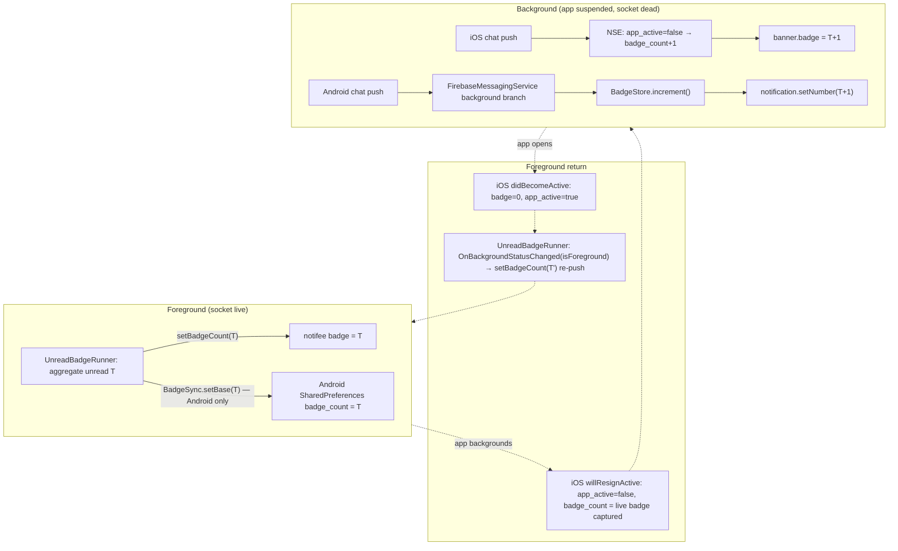

# App icon badge

The app-icon badge count's lifecycle — foreground totals from web, background increments in
native, and reconciliation on foreground return. The push receive pipeline itself is in
[README.md](./README.md).

## Why native has to increment

The web's `UnreadBadgeRunner` (`apps/web/src/app/features/home/UnreadBadgeRunner.tsx`) is the
badge's original writer: it sums unread across the active cloud and pushes an absolute count over
`appBridge.setBadgeCount(n)`, which only works while the socket is alive — i.e. in the foreground.
Once the OS suspends the app, the socket and periodic sync stop, and the badge freezes at its last
foreground value.

The only place code runs while the app is backgrounded is the OS push handler — iOS's
Notification Service Extension (NSE) and Android's `ChaticFirebaseMessagingService`. So a
background badge bump has to happen there, in native code, without JS.

## Single source of truth: a native shared counter

Both writers converge on a counter kept in native shared storage.

| Writer                   | When        | Effect                                                                                                    |
| ------------------------ | ----------- | --------------------------------------------------------------------------------------------------------- |
| Web re-aggregation       | Foreground  | Writes the absolute total `T` into the counter. **Only iOS's OS badge reflects it directly** (see below). |
| Native push handler      | Background  | `+1` per chat push, written straight to the OS badge.                                                     |
| Web foreground reconcile | App resumes | Re-writes the true total `T'`, correcting background drift.                                               |

**Android's absolute write never reaches the launcher icon.** `NotificationService.setBadgeCount`
calls notifee's badge API, and `@notifee/react-native`'s `NotifeeApiModule.ts` guards both
`setBadgeCount` and `getBadgeCount` behind `if (!isIOS)` — off iOS they resolve immediately as a
no-op. The only thing that moves an Android launcher number is `ChaticFirebaseMessagingService.kt`
calling `NotificationCompat.Builder.setNumber(badgeCount)` on each notification it posts, so the
badge is tied to a still-showing notification. Nothing in this repo cancels a notification when
its channel is read, so reading a room can leave the badge showing a stale count as long as the
tray notification stays up — a separate, unfixed track.

The table above is exactly true only on iOS until that gap closes.

Neither background handler can read "what the badge currently shows" — iOS's NSE has no access to
`applicationIconBadgeNumber`, and Android exposes no API to read the launcher badge back. Both
increments therefore start from a **base the handler stores itself**, seeded from the foreground
side. How that base gets seeded differs by platform:

- **iOS** — the app process can read the live badge, so `applicationWillResignActive` captures
  `applicationIconBadgeNumber` into an App Group as the app backgrounds. JS never has to push it.
- **Android** — the app can't read the launcher badge, so the web explicitly writes it: every
  `setBadgeCount` call also calls `BadgeSyncBridge.setBase(n)`, which persists into
  `SharedPreferences` via the `BadgeSync` native module.

## Flow

## What increments, and what doesn't

The same three rules apply to both iOS's NSE (`applyBadgeIncrementIfNeeded`) and Android's FCM
service (`isChatChannel` plus its background branch):

- **Chat channels only**: `dou_chat` and `dou_chat_muted`. Muted counts too — the web's unread
  aggregation does not exclude muted channels, so this keeps them consistent. `dou_notice`,
  `dou_marketing` and `dou_cloud` never increment the badge.
- **Foreground guard**: in the foreground the web already updates the badge over the socket, so
  native increments are skipped to avoid double-counting. iOS checks the App Group `app_active`
  flag; Android checks `isAppInForeground()`.
- **Silent pushes are excluded**: a silent push shows no banner and does not touch the badge.

## Platform detail

### iOS — App Group shared counter

- App Group `group.io.chatic.dou` is registered on both the app (dev/prod) and NSE entitlements.
- App Group keys: `badge_count` (Int), `app_active` (Bool).
- `AppDelegate.applicationDidBecomeActive` clears the badge to 0 and sets `app_active = true`.
- `AppDelegate.applicationWillResignActive` sets `app_active = false` and captures the live badge
  into `badge_count`.
- `NotificationService.applyBadgeIncrementIfNeeded` (NSE) increments `badge_count` and sets
  `content.badge` only when the channel is chat and `app_active` is false.
- **Provisioning (manual, outside the code)**: the Apple Developer portal needs the App Groups
  capability enabled and the provisioning profiles reissued for all four app ids (app × NSE, dev ×
  prod). Confirm `group.io.chatic.dou` is attached under Xcode's Signing & Capabilities.

### Android — SharedPreferences shared counter

- `BadgeStore` (`chatic_badge` prefs, key `badge_count`) exposes get/set/increment.
- `ChaticFirebaseMessagingService`'s background branch (chat, non-silent) calls
  `BadgeStore.increment()` and reflects the result with `NotificationCompat.Builder.setNumber()`.
- **Launcher-dependent**: whether the number renders at all depends on the launcher, the same
  limitation notifee has upstream. Launchers without number support show only a dot.

## Key files

| File                                                                                     | Role                                                                            |
| ---------------------------------------------------------------------------------------- | ------------------------------------------------------------------------------- |
| `apps/web/src/app/features/home/UnreadBadgeRunner.tsx`                                   | Aggregates unread → `setBadgeCount`, re-pushes on foreground return             |
| `src/app/bridge/BadgeSyncBridge.ts`                                                      | `setBase(n)` TS wrapper — calls native only on Android, no-op on iOS            |
| `src/app/services/notification/NotificationService.ts`                                   | `setBadgeCount`/`clearBadge` keep notifee and `BadgeSyncBridge.setBase` in sync |
| `android/.../module/BadgeSyncModule.kt`                                                  | `BadgeSync.setBase` / `getBase` native module                                   |
| `android/.../push/BadgeStore.kt`                                                         | Android shared counter (SharedPreferences)                                      |
| `android/.../push/ChaticFirebaseMessagingService.kt`                                     | Bumps the counter on a background chat push                                     |
| `ios/Chatic/AppDelegate.swift`                                                           | Toggles `app_active`, captures the base on `resignActive`                       |
| `ios/ChaticNotificationServiceExtension/NotificationService.swift`                       | Bumps the App Group counter on a background chat push                           |
| `ios/ChaticNotificationServiceExtension/ChaticNotificationServiceExtension.entitlements` | NSE App Group entitlement                                                       |

## Reconciliation timeline (example)

1. Foreground: web aggregates unread `T=3` → badge 3, counter 3.
2. App backgrounds: (iOS) `resignActive` captures `badge_count=3`, sets `app_active=false`.
3. Two background chat pushes arrive: counter 3→4→5, badge 5.
4. App opens: (iOS) `didBecomeActive` clears the badge and sets `app_active=true` → the web
   reconnects, re-aggregates, and re-pushes `setBadgeCount(T')` → badge and counter both settle on
   the true value.

## Known limits

- **Android is launcher-dependent** — see above; some launchers show only a dot, never a number.
- **`FetchBadgeCount` is only true on iOS**: iOS's notifee `getBadgeCount()` reads the real
  `applicationIconBadgeNumber`; on Android it is a no-op and always answers 0. Reading Android's
  real value goes through the separate `FetchBadgeBase` message (`BadgeSync.getBase`) instead —
  the older message's meaning was left alone because the web ships ahead of the app: an older shell
  answers `NOT_FOUND`, and the web learns from that. Both messages answer "unknown" as `null`,
  never disguised as 0.
- **The web now reads the badge back**: on foreground return, and just before the first push of a
  run, it reads the device value and compares it against the **last value it pushed** — a mismatch
  is logged as a `warn` (ADR-0075, see `apps/web/src/app/runtime/logging/`). It compares against
  the last pushed value rather than the current total because the icon is expected to lag by
  design; comparing against the live total would flag every legitimate read as a divergence.
- **iOS re-background window**: if the app re-backgrounds in the short window between
  `didBecomeActive` (badge cleared) and the web's re-push, the base can be captured as 0. The next
  normal foreground self-heals it.

## Verification

- **Unit**: `BadgeSyncBridge.test.ts`, `NotificationService.test.ts` (mobile),
  `UnreadBadgeRunner.test.tsx` (web).
- **Device (manual)**: send a background chat push, confirm the badge increments; open the app,
  confirm it reconciles; confirm muted channels count and notice/marketing don't; confirm no
  double-count in the foreground. Kotlin and Swift have no unit test harness in this repo, so
  device verification is the only check for the native halves.
