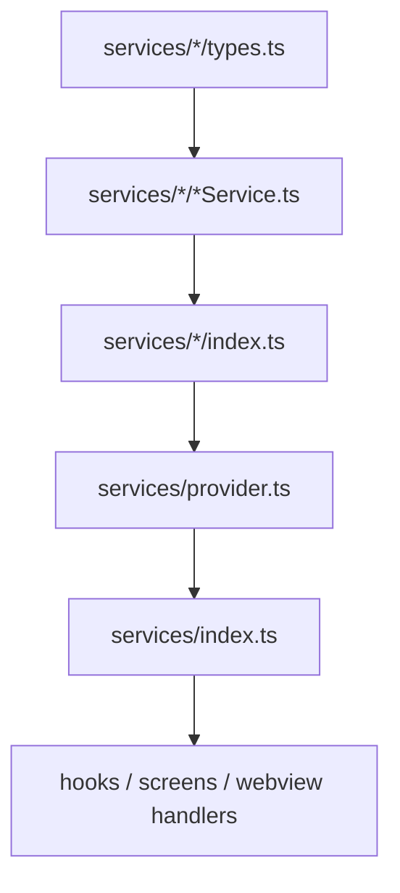
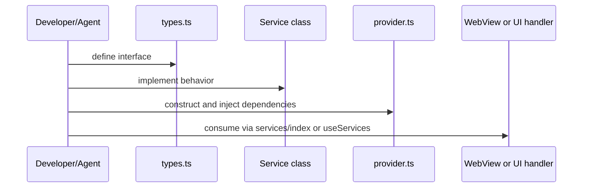

# Service

`src/app/services`는 모바일 앱 기능의 실행 경계다. WebView handler, native screen, debug screen은 service를 통해 기능을 호출한다.

## 구조

## Provider

`src/app/services/provider.ts`는 singleton dependency container다. logging·로그 업로드 큐·MMKV·boot metrics·deeplink·notification·Crashlytics·미전송 리포트 큐는 생성자에서 eager 조립되고, SQLite·data source·cache/upload 등 비필수 서비스는 lazy getter로 최초 접근 시 생성된다 (부팅 임계경로 최소화, boot-optimization.md 4.4).

주요 instance:

| Instance                                                               | 책임                                          |
| ---------------------------------------------------------------------- | --------------------------------------------- |
| `logService`, `logUploadQueueService`                                  | 앱 로깅과 서버로 갈 미전송 로그 큐            |
| `keyValueStorage`                                                      | MMKV key-value 저장                           |
| `sqliteDatabase`                                                       | SQLite 접근                                   |
| `cacheCrudService`, `cacheSearchService`                               | WebView용 로컬 캐시 API                       |
| `uploadService`                                                        | 업로드 lifecycle orchestration                |
| `notificationService`, `pushEventManager`                              | push 권한·토큰·뱃지, 포그라운드 이벤트 broker |
| `deeplinkManager`, `deeplinkService`                                   | OS URL 캡처와 라우팅                          |
| `deviceService`, `clipboardService`, `smsService`, `permissionService` | 기기 기능 wrapper                             |
| `oauthService`, `subscriptionIapService`                               | 계정/결제 연동                                |

콘솔은 provider의 인스턴스가 아니다. ADR-0066 이후 콘솔·Crashlytics·업로드 큐는 각각 `logHub`의
**리스너**이고, provider는 그 셋을 생성자에서 구독시키기만 한다(`createConsoleListener`는 `__DEV__`
한정). 저장소도 하나가 아니다 — 코어 로거의 고정 용량 버퍼와 `logUploadQueueService`의 MMKV 큐는
수명도 목적도 다르다(ADR-0063). 로그 경로 전체는 [webview-debugging.md](./webview-debugging.md) 참고.

## Service 추가 시나리오

## 소유권 규칙

- business/domain behavior는 handler가 아니라 service에 둔다.
- service interface는 `types.ts`에 먼저 정의한다.
- shared instance는 `provider.ts`에 등록한다. `services/index.ts` 배럴의 `export const x = provider.x`는
  **저비용 서비스만** — 배럴이 부팅 경로에서 로드되므로 그 한 줄이 lazy getter를 곧바로 발동시킨다.
  SQLite 계열 5개가 배럴에서 빠져 있는 이유이고(소비처는 `provider.x`로 직접 접근), 새로 추가하는
  서비스도 생성 비용이 있으면 같은 규칙을 따른다.
- storage 접근은 가능하면 service 또는 data source로 캡슐화한다.
- long-running 작업은 service가 retry/recovery/error 정책을 소유한다.

## 변경 체크리스트

- 새 service가 `types.ts`, implementation, `index.ts`, `provider.ts`에 일관되게 연결됐는가? 배럴 export는 위 소유권 규칙을 따랐는가?
- logger/storage/native dependency를 constructor로 주입받는가?
- WebView handler가 얇게 유지되는가?
- 테스트가 필요한 상태 전이가 service 또는 repository 단위로 검증되는가?
