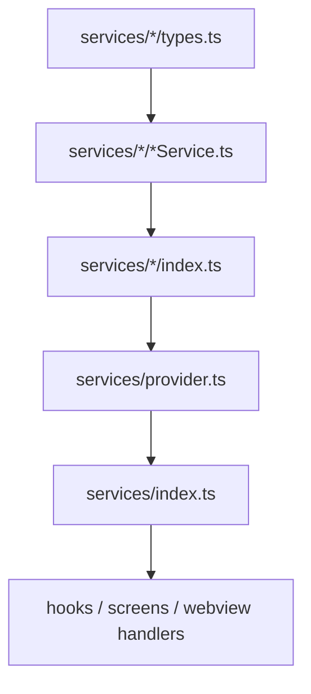
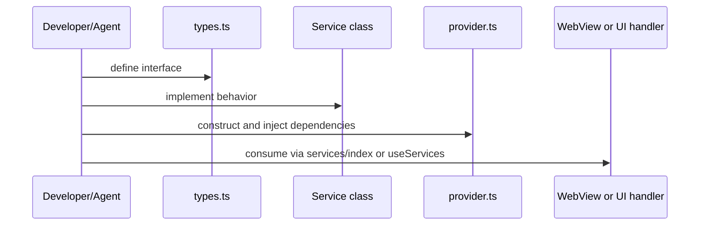

# Service

`src/app/services`는 모바일 앱 기능의 실행 경계다. WebView handler, native screen, debug screen은 service를 통해 기능을 호출한다.

## 구조

## Provider

`src/app/services/provider.ts`는 singleton dependency container다. 여기서 logging, MMKV, SQLite, data source, domain service가 한 번 조립된다.

주요 instance:

| Instance                                                               | 책임                                                                |
| ---------------------------------------------------------------------- | ------------------------------------------------------------------- |
| `logService`, `consoleLogger`, `logBufferService`                      | app logging and in-app log buffer                                   |
| `keyValueStorage`                                                      | MMKV key-value storage                                              |
| `sqliteDatabase`                                                       | SQLite access                                                       |
| `cacheCrudService`, `cacheSearchService`                               | local cache bridge-facing API                                       |
| `uploadService`                                                        | upload lifecycle orchestration                                      |
| `notificationService`, `pushEventManager`                              | push notification permission, token, badge, foreground event broker |
| `deeplinkManager`, `deeplinkService`                                   | OS URL capture and routing                                          |
| `deviceService`, `clipboardService`, `smsService`, `permissionService` | device capability wrappers                                          |
| `oauthService`, `subscriptionIapService`                               | account/payment integrations                                        |

## Service 추가 시나리오

## 소유권 규칙

- business/domain behavior는 handler가 아니라 service에 둔다.
- service interface는 `types.ts`에 먼저 정의한다.
- shared instance는 `provider.ts`에 등록하고 `services/index.ts`에서 export한다.
- storage 접근은 가능하면 service 또는 data source로 캡슐화한다.
- long-running 작업은 service가 retry/recovery/error 정책을 소유한다.

## 변경 체크리스트

- 새 service가 `types.ts`, implementation, `index.ts`, `provider.ts`, `services/index.ts`에 일관되게 연결됐는가?
- logger/storage/native dependency를 constructor로 주입받는가?
- WebView handler가 얇게 유지되는가?
- 테스트가 필요한 상태 전이가 service 또는 repository 단위로 검증되는가?
