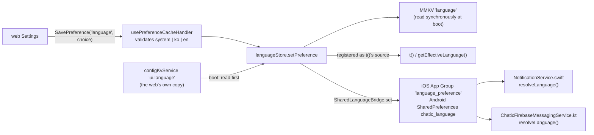

# language — the web's language choice, as the shell and its push services follow it

The web app's Settings owns the choice: **`system`** (the default — follow the device), or a pinned
**`ko`** / **`en`**. The shell never offers one of its own. What this document owns is how that choice
reaches the three places that draw copy without the web: the shell's own screens and alerts, the iOS
Notification Service Extension, and the Android messaging service. The web side — how the choice is
made and how the web resolves `system` — is in
[`apps/web/docs/state/stores.md`](../../../web/docs/state/stores.md#the-language-choice--uilanguage).

## Two values, not one

| Value                                             | Where it comes from                                         | Who reads it                                                                                                    |
| ------------------------------------------------- | ----------------------------------------------------------- | --------------------------------------------------------------------------------------------------------------- |
| **Device language** — `getAppLanguage()`          | `react-native-localize`, the first locale's language code   | the web, as `CHATIC_APP_CURRENT_LANGUAGE`, to resolve its own `system`                                          |
| **Effective language** — `getEffectiveLanguage()` | the pinned choice if there is one, else the device language | every `t()` call — the update dialog, the deep-link error screen, the payment loader, the Android channel names |

The injected value must stay the device's. The web already knows the choice, and it needs the device
language precisely to resolve `system` — inside WKWebView `navigator.language` is the bundle's English,
not the device's.

## How the choice arrives and where it goes

- **Validated at the bridge.** Only `system`, `ko` and `en` get past `usePreferenceCacheHandler`; the
  value picks which locale file the push services open, so a page cannot write anything else there.
  The native modules also coerce anything unknown to `system`.
- **Read synchronously**, like the theme (`languageStorage.ts`). `t()` is synchronous, so a `persist`
  rehydrate would draw the first alert in the device language regardless of the choice.
- **The web's config value wins at boot.** The web writes the choice twice — its config bag
  (`ui.language`, the shell lane, held by `configKvService`) and this `language` key. The shell reads
  the bag first and stores what it finds under `language`. The web deploys before the app updates, so
  a choice made while an older shell was installed reached the bag but was kept by that shell in its
  own format, which is discarded below; reading the bag is what carries it over.
- **The web also resends the choice once per native boot** (`PreferenceLoader` →
  `syncLanguageChoiceToShell`). That covers a shell too old to have kept a config bag, and a
  `SavePreference` that was dropped.
- **`t()` learns the choice by registration**, not by import. `utils/i18n` sits under the services
  (`NotificationService` names its channels with `t`), and the store sits on top of them, so the store
  registers itself when it loads. Before that, `t()` answers with the device language.
- **Copied to shared storage on every change and once per launch.** The push services build banners
  while the app may not be running and cannot reach MMKV. The launch-time copy covers an install that
  upgraded with a choice already stored, and a shared write that failed.
- **The push services fall back to the device language** when nothing is pinned — `system`, no value
  yet, or an unreadable store — which is exactly what they did before a choice existed.

## The legacy value is discarded

`languageStore` used to be a zustand `persist` store under the same `language` key, initialised with
the device language. What it held was that device default, or the language in effect that an older
web mirrored into it (`i18n.language`) — a detector's guess and a person's pick in one value, so
nothing from that era can be read as a choice. Unless the config bag supplies one,
`readLanguagePreference` accepts only a plain `system`/`ko`/`en` and rewrites anything else to
`system`.

## Limits

- A pinned language changes shell copy from the next time it is drawn. Android notification channel
  names follow when a channel is next created: at app start, and on every push, where the messaging
  service re-creates the channel with the name in `resolveLanguage()`'s language.
- iOS injects only the device's first locale. A device whose preferred list is `[ja, ko]` reports `ja`,
  which the web cannot show, and resolves to English.
- The App Group id and key are duplicated across `SharedLanguageModule.m` and `NotificationService.swift`,
  the same way the badge and push-mark keys are; change them together.

## Files

| File                                                                                                                     | Role                                                                                                       |
| ------------------------------------------------------------------------------------------------------------------------ | ---------------------------------------------------------------------------------------------------------- |
| [`stores/languagePreference.ts`](../../src/app/stores/languagePreference.ts)                                             | The value model — `system` / `ko` / `en`, and `resolveAppLanguage`, which `getEffectiveLanguage` uses      |
| [`stores/languageStorage.ts`](../../src/app/stores/languageStorage.ts)                                                   | Synchronous read/write of the `language` key; prefers the web's config value, discards the legacy envelope |
| [`stores/languageStore.ts`](../../src/app/stores/languageStore.ts)                                                       | The store; registers `t()`'s source and copies the choice to shared storage                                |
| [`utils/i18n/index.ts`](../../src/app/utils/i18n/index.ts)                                                               | `t()`, `getEffectiveLanguage()`, `registerLanguageChoice()`                                                |
| [`bridge/SharedLanguageBridge.ts`](../../src/app/bridge/SharedLanguageBridge.ts)                                         | JS side of the `SharedLanguage` native module                                                              |
| `ios/Bridges/SharedLanguageModule.m`                                                                                     | Writes the App Group key `language_preference`                                                             |
| `android/.../push/LanguagePreferenceStore.kt`, `module/SharedLanguageModule.kt`                                          | The `chatic_language` SharedPreferences file and its module                                                |
| `ios/ChaticNotificationServiceExtension/NotificationService.swift`, `android/.../push/ChaticFirebaseMessagingService.kt` | `resolveLanguage()` — pinned choice first, device language otherwise                                       |
