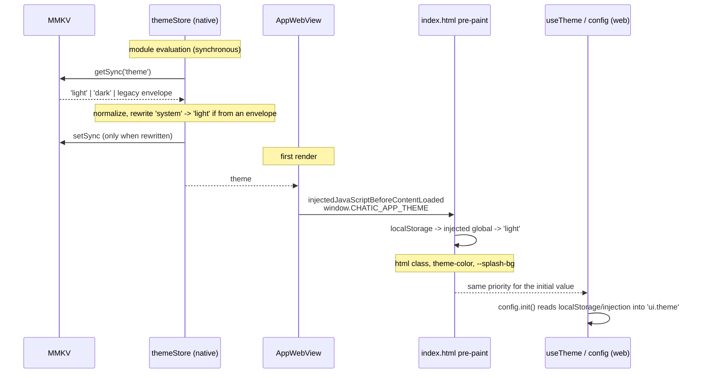
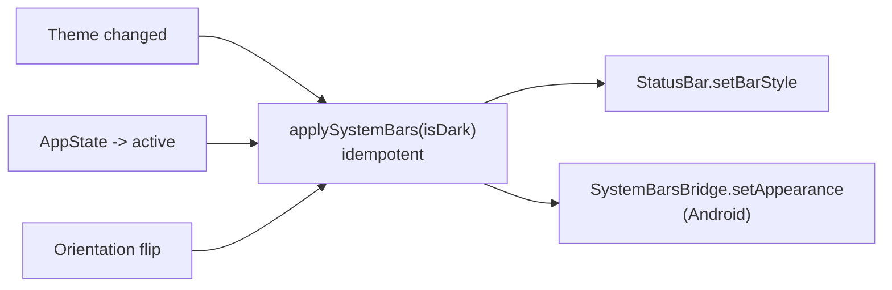

# Theme — light default and the web↔native sync

> Related: [../webview/README.md](../webview/README.md) (the injection table) · [../boot/boot-optimization.md](../boot/boot-optimization.md) (the boot path) · [apps/web theme doc](../../../web/docs/shell/theme.md) (web-internal state and DOM application)

**This document owns the web↔native theme contract** — the value model, the default, the storage
format, and the boot-time sync. `apps/web/docs/architecture/theme.md` covers only the web-internal
wiring on top of this contract and defers here for all of that.

## Purpose

`apps/mobile` is a hybrid app: one WebView, two painters. Web applies theme via an `<html>` class and
CSS tokens; native paints the status bar, the Android system bars, the root background and the resume
overlay. Both have to agree on the same value at the same time, or the screen visibly splits.

Two symptoms motivate every rule below:

1. A light-mode user sees a **dark background flash right after the splash screen**.
2. **The status bar color survives a background resume wrong** and stays wrong.

## Design principles

1. **The default never consults the OS.** With nothing stored, both sides are unconditionally light.
   Letting the OS color scheme into the default path means two independent resolvers (web's
   `matchMedia`, native's `useColorScheme`) can disagree for the frame where only one has resolved.
2. **First-paint values are read synchronously.** The theme is needed by the first frame; an async
   restore that corrects it afterward is a flash by construction.
3. **System-bar application is idempotent and does not gate on a value change.** The OS resets
   appearance flags on resume, rotation and modal dismissal. Code that reapplies "only when the value
   changed" does nothing at those moments and the wrong state sticks.
4. **Only the web writes.** Native stores, applies and restores; it never originates a change. One
   writer means no conflict-resolution rule is needed.
5. **Normalization happens in one place.** Legacy formats are absorbed at the native store's
   initialization; every consumer after it (injection, the bridge handler, the status bar) sees an
   already-normalized value.

## Scope

**In**

- The native `themeStore`'s synchronous MMKV init and legacy-format absorption
- `SystemBars`' idempotent reapplication on resume and rotation
- First-paint background color unification (`getThemeBackgroundColor`)
- `window.CHATIC_APP_THEME` injection — the native stored value, delivered before web's first paint
- Web's light default (store and pre-paint script)
- Web's `ThemeApplier` updates to `meta[theme-color]` and `--splash-bg`
- Normalizing a legacy `'system'` value to light

**Out**

- **A `'system'` selection UI.** The value is stored and interpreted end to end, but nothing lets a
  user choose it — it is unreachable this release (ADR-0054).
- New bridge message **types** — injection already covers the boot path, and native has no theme UI
  to trigger a runtime push. The existing `SavePreference` confirmation round trip is in scope.
- Validating the `'language'` bridge value — only `theme` is validated; the two keys carry different
  guarantees.
- `@chatic/theme` and its consumers (`admin`, `desktop-web`, `landing`).
- Dark splash-asset variants, and the dark-only styling under `features/debug/**` (intentional).

## Scenarios

### 1. Cold start — a light-mode user, OS set to dark

1. `themeStore` reads MMKV synchronously at module evaluation and initializes to `'light'` — no
   restore window.
2. `App.tsx`'s root `View` and `SafeAreaProvider` paint `getThemeBackgroundColor(false)` (`#FFFFFF`)
   on the first commit; `SystemBars` applies `dark-content`.
3. `AppWebView` injects `window.CHATIC_APP_THEME = 'light'` via
   `injectedJavaScriptBeforeContentLoaded`.
4. `index.html`'s pre-paint script reads `localStorage['vite-ui-theme']` → the injected global →
   `'light'`, in that order, and sets the `<html>` class, `theme-color` and `--splash-bg` before the
   first paint.
5. The web store reads the same order and, if the value came from injection, caches it to
   `localStorage` so the next load is self-sufficient.

No step reads the OS color scheme.

### 2. The user switches to dark from the web

1. `setTheme('dark')` (`apps/web/src/app/hooks/useTheme.ts`) makes three independent writes:
   `config.set('ui.theme', 'dark', { lane: 'shell' })`, a confirmed-with-one-retry
   `appBridge.savePreferenceConfirmed({ key: 'theme', value: 'dark' })`, and
   `localStorage.setItem('vite-ui-theme', 'dark')`.
2. `ThemeApplier` updates the `<html>` class, `meta[theme-color]` and `--splash-bg` — no reload needed
   for the mobile status bar area to follow.
3. Native's `usePreferenceCacheHandler` validates the `SavePreference` payload and calls
   `themeStore.setTheme('dark')`, which writes MMKV and flips `SystemBars`, the root background and
   `ResumeOverlay`.

### 3. Background resume

The OS can reset status-bar appearance to its own default on foreground resume. `SystemBars`
reapplies the current theme on `AppState` `'change' → 'active'` even though the value did not change.
A landscape/portrait flip (`Dimensions` `'change'`, filtered to actual orientation changes so a
keyboard resize does not also trigger it) takes the same path.

### 4. First load after a WebView cache wipe

`localStorage` is empty, so the pre-paint script and the web store fall back to the injected global —
still correct on first paint. A shell built before this injection existed sees `undefined` and starts
light; `PreferenceLoader`'s `FetchPreference` is the fallback restore path for that case.

### 5. Cleaning up a legacy stored value

`themeStore` used to persist through zustand's `persist` middleware, so MMKV can still hold an
envelope (`{"state":{"theme":"dark"},"version":0}`) whose era defaulted to `'system'`. The
synchronous init unwraps the envelope and **folds an envelope-carried `'system'` to `'light'`** — it
is a leaked default, not a choice. A **plain-string `'system'`, by contrast, is honored** — only
`writeThemeMode` produces a plain string, and that path only receives bridge-validated values. This
distinction matters: collapsing `'system'` unconditionally on every boot would make native `'light'`
while web keeps honoring its own stored `'system'`, reintroducing the original split-screen symptom.
Whenever the stored bytes differ from the normalized value, they are rewritten in place — that is
what stops `FetchPreference` from ever handing the web an envelope again.

## Diagrams

### Boot-time value flow



### System-bar reapplication triggers



## Implementation

### Native — storage and init

| File                                                                                              | Role                                                                                                                                                                                                                                              |
| ------------------------------------------------------------------------------------------------- | ------------------------------------------------------------------------------------------------------------------------------------------------------------------------------------------------------------------------------------------------- |
| [`stores/themeStore.ts`](../../src/app/stores/themeStore.ts)                                         | `ThemeMode` state, initialized from a synchronous MMKV read. No zustand `persist`.                                                                                                                                                                |
| [`stores/themeMode.ts`](../../src/app/stores/themeMode.ts)                                           | The pure value model — `ThemeMode`, `DEFAULT_THEME_MODE`, `parseThemeMode`. No storage or provider dependency, so a value-only consumer (the bridge handler) does not have to pull in the services provider to be tested against the real parser. |
| [`stores/themeStorage.ts`](../../src/app/stores/themeStorage.ts)                                     | Reads/writes the `theme` key, migrates legacy formats, folds envelope `'system'`.                                                                                                                                                                 |
| [`database/mmkv/MmkvStorage.ts`](../../src/app/database/mmkv/MmkvStorage.ts)                         | `getSync`/`setSync` — MMKV is natively synchronous, so the existing async methods now just wrap these.                                                                                                                                            |
| [`services/preference/PreferenceService.ts`](../../src/app/services/preference/PreferenceService.ts) | Exposes the sync methods; `themeStore` does not bypass this service layer.                                                                                                                                                                        |

[`languageStore`](../../src/app/stores/languageStore.ts) still uses `persist` + `storageAdapter` — language
is not a first-paint value, so an async restore is not a problem there.

**Storage format.** MMKV values follow `MmkvStorage`'s `JSON.stringify`/`JSON.parse` convention.
Writes are always a plain mode string (`"light"`); reads accept three shapes:

| Shape                                      | Source                            |
| ------------------------------------------ | --------------------------------- |
| `'light'` \| `'dark'` \| `'system'`        | current format                    |
| `'{"state":{"theme":"dark"},"version":0}'` | legacy zustand-persist envelope   |
| `{ state: { theme: 'dark' } }`             | the same envelope, already parsed |

An unrecognized value falls back to `'light'`.

### Native — application

| File                                                                                            | Role                                                                                                                          |
| ----------------------------------------------------------------------------------------------- | ----------------------------------------------------------------------------------------------------------------------------- |
| [`features/core/components/SystemBars.tsx`](../../src/app/features/core/components/SystemBars.tsx) | Status bar and Android system bar application; subscribes to `AppState` and `Dimensions` for idempotent reapplication.        |
| [`bridge/SystemBarsBridge.ts`](../../src/app/bridge/SystemBarsBridge.ts)                           | Android native module wrapper.                                                                                                |
| [`hooks/useResolvedTheme.ts`](../../src/app/hooks/useResolvedTheme.ts)                             | `mode` → `resolvedTheme`/`isDark`/`backgroundColor`. `getThemeBackgroundColor` is the single source for the background color. |

Orientation detection filters `Dimensions`' `'change'` event down to an actual landscape/portrait
flip: the raw event also fires on Android `adjustResize` keyboard open/close, and reapplying on every
keyboard toggle would cross the native bridge for no reason.

Background color is unified at three call sites: [`webview/AppWebView.tsx`](../../src/app/webview/AppWebView.tsx),
[`features/core/components/ResumeOverlay.tsx`](../../src/app/features/core/components/ResumeOverlay.tsx)
and [`features/main/screens/MainScreen.tsx`](../../src/app/features/main/screens/MainScreen.tsx) all read
`useResolvedTheme().backgroundColor` instead of a local light/dark constant.
[`features/main/screens/ModalScreen.tsx`](../../src/app/features/main/screens/ModalScreen.tsx) keeps a
hardcoded `#1E1E1E` for its modal surface — out of scope, treated as an intentional surface color, not
a background.

### Bridge input validation

[`usePreferenceCacheHandler.ts`](../../src/app/webview/hooks/usePreferenceCacheHandler.ts)'s `theme` case
validates with `parseThemeMode` before writing to the store; an unrecognized value is rejected with
`PREF_INVALID_VALUE` rather than stored. Without this, an invalid value would persist verbatim and
degrade the status bar to light on every subsequent boot with no trace of why.

### Native → web injection

| File                                                                                | Role                                                                                         |
| ----------------------------------------------------------------------------------- | -------------------------------------------------------------------------------------------- |
| [`webview/utils/injectionScripts.ts`](../../src/app/webview/utils/injectionScripts.ts) | `getThemeScript(mode)` sets `window.CHATIC_APP_THEME`, folded into `getSyncInjectionScript`. |
| [`webview/AppWebView.tsx`](../../src/app/webview/AppWebView.tsx)                       | Passes `useThemeStore`'s mode as an injection parameter.                                     |

`AppWebView`'s `injectedJavaScriptBeforeContentLoaded` runs before the document parses, so
`index.html`'s pre-paint script can read this value. The value is `JSON.stringify`-escaped before
interpolation — it is inlined into a script string handed to `evaluateJavaScript`, so an unescaped
quote or backslash in it would be code, not data. Bridge validation makes this unreachable today, but
the sink still escapes defensively.

**Injection timing differs by platform.** iOS's `WKUserScript` runs `atDocumentStart`, which is
guaranteed before parsing; Android's `onPageStarted` / `evaluateJavascript` can race `index.html`'s
inline script. Three fallbacks cover a miss: the web store's own init reads the injected global next,
and `PreferenceLoader` restores after that — the worst case is starting light, which matches the
default anyway.

The theme injection value is recomputed on every render, but
`injectedJavaScriptBeforeContentLoaded` only takes effect on the next load — a live theme change needs
no push, since the side that changed it (the web) already knows.

### Web side

Web owns `ui.theme` as a `@chatic/config` registry key (`persist: 'shell'`, default `'light'`) — the
consuming detail is the [web theme doc](../../../web/docs/shell/theme.md)'s. This document's
concern is only the second channel that config write does not cover:

| File                                                                             | Role                                                                                                                                                                                                                          |
| -------------------------------------------------------------------------------- | ----------------------------------------------------------------------------------------------------------------------------------------------------------------------------------------------------------------------------- |
| [`hooks/useTheme.ts`](../../../web/src/app/hooks/useTheme.ts)                       | `setTheme` writes `config.set('ui.theme', theme, { lane: 'shell' })`, `localStorage['vite-ui-theme']`, **and** `appBridge.savePreferenceConfirmed({ key: 'theme', value: theme })` — three independent channels for one value |
| [`index.html`](../../../web/index.html)                                             | Pre-paint script: `localStorage['vite-ui-theme'] \|\| window.CHATIC_APP_THEME \|\| 'light'`, unchanged by the `@chatic/config` migration since it runs before `config.init()`                                                 |
| [`runtime/ThemeApplier.tsx`](../../../web/src/app/runtime/ThemeApplier.tsx)         | Updates `<html>` class and `meta[theme-color]` (looked up by `meta[name=...]`)                                                                                                                                                |
| [`runtime/PreferenceLoader.tsx`](../../../web/src/app/runtime/PreferenceLoader.tsx) | Fallback `FetchPreference` read for a shell old enough to predate boot injection, decoded by `parseThemeBridgeValue`                                                                                                          |

**The bridge write exists only because native reads its own separate store.** `config.set(...,
{ lane: 'shell' })` is what `config.get('ui.theme')` resolves from on the _next_ boot, and what
`ConfigKvService`/`getConfigBagScript` inject for `@chatic/config` to hydrate from. But native's
status bar, root background, resume overlay and its own `window.CHATIC_APP_THEME` pre-paint
injection all read the older, separate `themeStore` this document owns — `ConfigKvService` never
touches it. `appBridge.savePreferenceConfirmed` (confirmed, one retry) is what keeps that store
current; it is the one write of the three that does not self-heal, since a lost write leaves native
and web permanently disagreeing until a full restart.

`ThemeApplier` never writes `--splash-bg` — its only consumer is the `#splash` placeholder inside
`index.html`, which React replaces on its first commit, before `ThemeApplier` ever runs. Only the
pre-paint script's write to that variable has any effect.

## How to verify

**Unit tests**

| Covers                                                                                               | Location                                                                                          |
| ---------------------------------------------------------------------------------------------------- | ------------------------------------------------------------------------------------------------- |
| Format absorption, script-escape rejection, closed return type                                       | [`themeMode.test.ts`](../../src/app/stores/themeMode.test.ts)                                        |
| Legacy migration, per-format `'system'` handling, rewrite conditions                                 | [`themeStorage.test.ts`](../../src/app/stores/themeStorage.test.ts)                                  |
| Synchronous init at module evaluation; init alone does not write                                     | [`themeStore.test.ts`](../../src/app/stores/themeStore.test.ts)                                      |
| Resume/rotation reapplication, stale closures, keyboard-resize filtering, iOS branch, unsubscription | [`SystemBars.test.tsx`](../../src/app/features/core/components/SystemBars.test.tsx)                  |
| Injection script carries mode, escaping                                                              | [`injectionScripts.test.ts`](../../src/app/webview/utils/injectionScripts.test.ts)                   |
| Bridge `theme` write, invalid/escape-payload rejection, legacy-envelope acceptance                   | [`usePreferenceCacheHandler.test.ts`](../../src/app/webview/hooks/usePreferenceCacheHandler.test.ts) |
| Light default, native-store confirm-and-retry, three-channel write                                   | [`useTheme.test.tsx`](../../../web/src/app/hooks/useTheme.test.tsx)                                  |
| `meta[theme-color]` update, `name` lookup, `--splash-bg` untouched                                   | [`ThemeApplier.test.tsx`](../../../web/src/app/runtime/ThemeApplier.test.tsx)                        |

```bash
yarn nx test mobile && yarn nx test web
```

**Manual checks** — run each with the **OS set to dark and the app theme set to light**; that
combination is what reproduces every symptom above.

1. Cold start: no dark flash between the splash and the first screen.
2. Background then resume: status bar icon color is unchanged.
3. Rotate: status bar color is unchanged.
4. Switch to dark from the web: status bar, root background and the mobile top system UI color all
   update immediately.
5. First load after clearing the WebView cache: the stored theme applies from the first paint —
   check this one specifically on Android, given the injection race noted above.
6. Android: the navigation bar icon color follows too.
7. Open and close a modal (`ModalScreen`): the status bar should not reset — unverified on iOS; if it
   reproduces, add an `applySystemBars` trigger there too.

A browser-only check is possible against the dev server: with the OS set to dark and
`localStorage['vite-ui-theme']` cleared, a fresh load should show `<html class="light">` and
`theme-color: #ffffff`. Live `'system'` reflection cannot be checked this way, since some devtools
color-scheme emulation does not fire `matchMedia`'s `change` event — that path is unit-tested instead.
