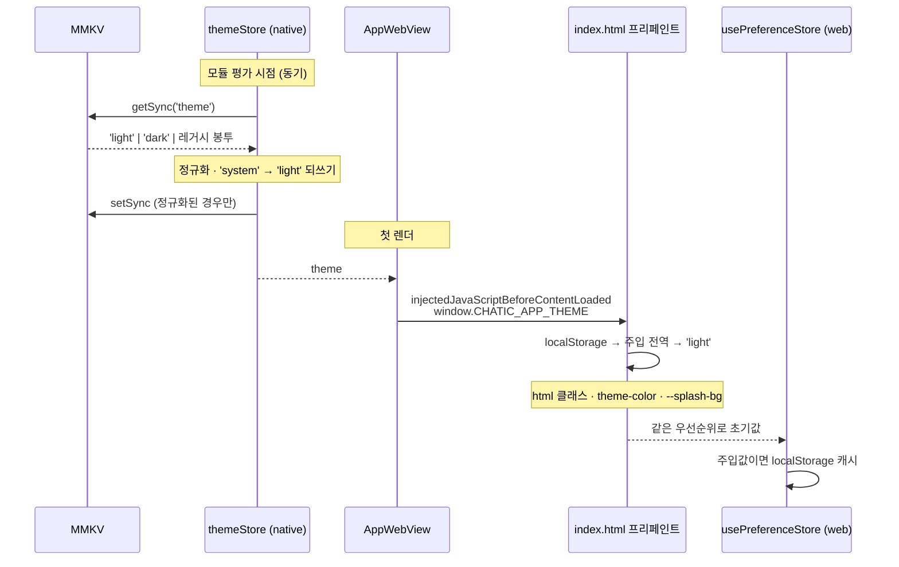
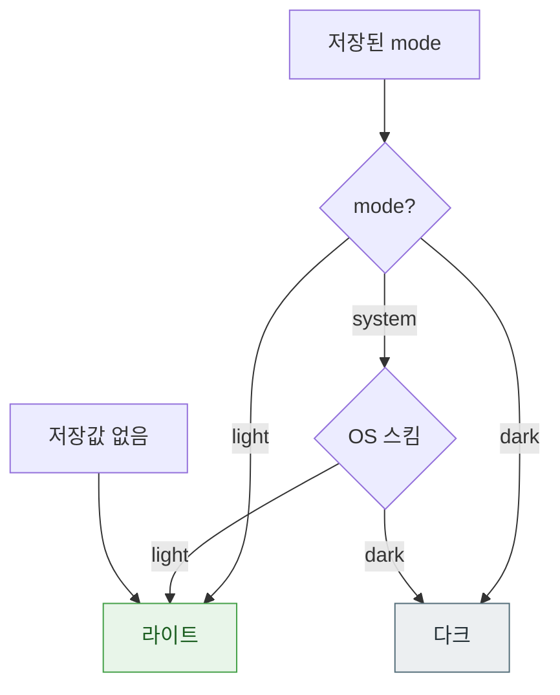
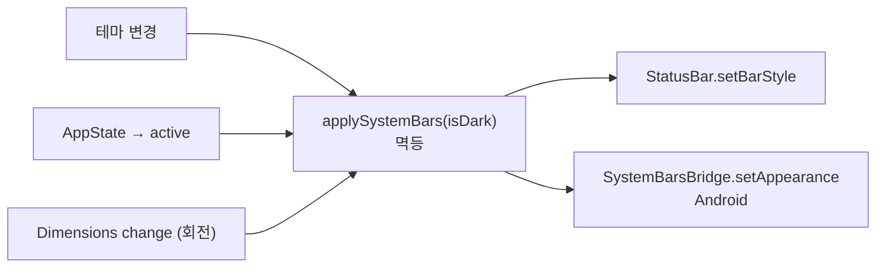

# 테마 (Theme) — 라이트 기본과 웹↔네이티브 동기화

> 상태: Live · 최종 갱신: 2026-08-03 · 관련 ADR: [ADR-0054](../../../docs/adr/0054-theme-light-default-and-web-native-sync.md)
> 관련: [webview](./webview.md)(브릿지 메시지 표) · [boot-optimization](./boot-optimization.md)(부팅 경로) · [apps/web 테마](../../web/docs/architecture/theme.md)(웹 국소 상세)

**문서 소유 범위:** 이 문서가 **웹↔네이티브 테마 계약과 부팅 경로 전체**를 소유한다. `apps/web/docs/architecture/theme.md`는 웹 내부의 상태·DOM 적용 상세만 다루고 계약은 이 문서를 참조한다. 값 모델·기본값·저장 포맷을 바꿀 때는 이 문서를 먼저 고친다.

## 목적

`apps/mobile`은 네이티브 셸이 WebView 하나를 호스팅하는 하이브리드 앱이다. 사용자에게는 한 화면이지만 테마를 적용하는 주체는 둘이다 — 웹은 `<html>` 클래스와 CSS 토큰을, 네이티브는 상태바·내비게이션 바·루트 배경·리줌 오버레이를 칠한다. **두 주체가 같은 값을 같은 시점에 알고 있어야** 화면이 하나로 보인다.

이 문서는 그 단일화를 어떻게 보장하는지 기술한다. 해결하는 구체적 증상은 둘이다:

1. 라이트 모드 사용자인데 **콜드 스타트 직후 다크 배경이 잠깐 보인다.**
2. **백그라운드 복귀 후 상태바 색상이 현재 테마와 맞지 않고, 그대로 굳는다.**

## 설계 원칙

1. **기본값은 OS를 보지 않는다.** 저장된 값이 없으면 양쪽 모두 무조건 라이트다. OS 컬러 스킴 해석이 기본 경로에 개입하면, 해석 주체가 둘이라는 사실만으로 불일치가 발생한다.
2. **첫 페인트에 필요한 값은 동기로 읽는다.** 테마는 첫 프레임에 이미 필요하다. 비동기 복원 뒤에 고치는 방식은 "번쩍임"이라는 형태로 반드시 사용자에게 노출된다.
3. **시스템 바 적용은 멱등하고, 값 변화에 의존하지 않는다.** OS는 앱 복귀·회전·모달에서 appearance 플래그를 되돌린다. "값이 바뀔 때만 적용"하는 코드는 이때 아무 일도 하지 않아 틀린 상태로 굳는다.
4. **변경 권한은 웹만 갖는다.** 네이티브는 저장·적용·복원만 한다. 쓰기 주체가 하나면 충돌 해소 규칙이 필요 없다.
5. **정규화는 한 곳에서만 한다.** 저장 포맷·레거시 값 처리는 네이티브 스토어 초기화 지점에 모으고, 그 뒤의 모든 소비자(주입·브릿지·상태바)는 이미 정규화된 값만 본다.

## 범위

**포함**

- 네이티브 `themeStore`의 MMKV 동기 초기화와 레거시 포맷 흡수
- `SystemBars`의 멱등 재적용 (앱 복귀·회전)
- 첫 페인트 경로의 배경색 단일화 (`getThemeBackgroundColor`)
- `window.CHATIC_APP_THEME` 주입 — 네이티브 저장값을 웹 첫 페인트에 전달
- 웹의 기본값 라이트 전환 (스토어 · 프리페인트 스크립트)
- 웹 `ThemeApplier`의 `meta[theme-color]` · `--splash-bg` 갱신
- 레거시 `'system'` 저장값의 라이트 정규화

**제외**

- **`'system'` 선택 UI.** 값·저장·해석은 전부 지원하지만 사용자가 고를 수단은 만들지 않는다 → 이번 릴리스에서 `'system'`은 도달 불가 상태다. ADR-0054 참조.
- 새 브릿지 메시지 **타입**. `libs/app-messages`는 건드리지 않는다 — 주입이 부팅 경로를 덮고, 네이티브에 테마 변경 UI가 없어 런타임 push 수요가 없다. (기존 `SavePreference`를 `request`로 보내는 확인 경로는 포함한다.)
- `'language'` 브릿지 값 검증. `theme`만 검증하므로 두 케이스는 보호 수준이 다르다 — 별도 작업.
- `libs/theme`와 그 소비자(`admin` · `desktop-web` · `landing`)
- 스플래시 자산의 다크 변종 — 라이트 기본 고정으로 현재의 흰색 하드코딩이 정합해진다
- `features/debug/**`의 다크 전용 하드코딩 — 의도된 디버그 전용 스타일

## 시나리오

### 1. 콜드 스타트 — 라이트를 고른 사용자, OS는 다크

1. 네이티브 JS 번들 평가 시 `themeStore`가 MMKV에서 `theme`을 **동기로** 읽어 `'light'`로 초기화된다. 복원 대기 창이 없다.
2. 첫 커밋에서 `App.tsx`의 루트 `View`와 `SafeAreaProvider`가 `getThemeBackgroundColor(false)` = `#FFFFFF`로 칠해진다. `SystemBars`가 `dark-content`를 적용한다.
3. `AppWebView`가 `injectedJavaScriptBeforeContentLoaded`로 `window.CHATIC_APP_THEME = 'light'`를 주입한다.
4. WebView가 `index.html`을 파싱한다. 프리페인트 스크립트가 `localStorage['vite-ui-theme']` → 주입 전역 → `'light'` 순으로 읽어 `<html>` 클래스·`theme-color`·`--splash-bg`를 라이트로 세팅한다. **첫 페인트가 이미 맞다.**
5. 웹 스토어가 같은 순서로 초기값을 읽고, 주입값에서 왔다면 `localStorage`에 캐시해 다음 로드를 동기화한다.

어느 단계에서도 OS 컬러 스킴을 읽지 않는다.

### 2. 사용자가 웹에서 다크로 전환

1. `setTheme('dark')` → 웹 스토어 갱신 → `localStorage` 캐시 → `SavePreference`로 네이티브 전달.
2. `ThemeApplier`가 `<html>` 클래스와 함께 `meta[theme-color]` · `--splash-bg`를 다크로 갱신한다. 리로드 없이 상단 시스템 UI 색까지 맞는다.
3. 네이티브가 `SavePreference`를 받아 `themeStore.setTheme('dark')` → MMKV 저장 → `SystemBars`·루트 배경·`ResumeOverlay`가 다크로 전환된다.

### 3. 백그라운드 복귀

1. OS가 앱을 포그라운드로 되돌리며 상태바 appearance를 자체 기본값으로 리셋할 수 있다.
2. `SystemBars`가 `AppState` `'change'` → `'active'`를 받아 **값이 바뀌지 않았어도** 현재 테마로 다시 적용한다.
3. 화면 회전(`Dimensions` `'change'`)도 같은 재적용 경로를 탄다.

### 4. WebView 캐시 와이프 후 첫 로드

1. `localStorage`가 비어 있다. 프리페인트 스크립트와 웹 스토어가 **주입 전역**을 읽어 네이티브 저장값으로 복원한다 — 첫 페인트부터 맞다.
2. 주입이 없는 구버전 셸(Capability Skew)에서는 전역이 `undefined`이므로 `'light'`로 시작하고, `PreferenceLoader`의 `FetchPreference`가 보조 복원 경로로 남는다.

### 5. 레거시 저장값 정리

1. 과거 `themeStore`는 zustand persist로 저장했으므로 MMKV에 봉투 형태(`{"state":{"theme":…},"version":0}`)가 남아 있을 수 있고, 그 시절 기본값이 `'system'`이었다.
2. 동기 초기화가 봉투를 읽어 모드를 꺼낸다. **봉투 안의 `'system'`은 `'light'`로 접는다** — 선택이 아니라 흘러든 기본값이기 때문이다.
3. 저장된 바이트가 정규형과 다르면 평문으로 되쓴다. 봉투가 한 번의 부팅으로 사라지므로 이후 `FetchPreference`는 웹에 봉투를 넘기지 않는다.
4. 반대로 **평문으로 저장된 `'system'`은 그대로 존중한다.** 평문은 브릿지 검증을 통과한 명시적 선택만 만들 수 있고, 웹도 저장된 `'system'`을 존중하므로 양쪽이 어긋나지 않는다.

## 다이어그램

### 부팅 시 값 전달 경로



### 테마 해석 결정 트리



`'system'`은 값으로는 살아 있지만 이번 릴리스에서 진입점이 없다 — 저장값 없음은 언제나 라이트로 떨어진다.

### 시스템 바 재적용 트리거



## 상세 구현

### 네이티브 — 저장과 초기화

| 파일                                                                                              | 역할                                                                                                             |
| ------------------------------------------------------------------------------------------------- | ---------------------------------------------------------------------------------------------------------------- |
| [`stores/themeStore.ts`](../src/app/stores/themeStore.ts)                                         | `ThemeMode` 상태. **MMKV 동기 읽기로 초기화**하고 `setTheme`에서 명시 저장한다. zustand `persist`를 쓰지 않는다. |
| [`stores/themeMode.ts`](../src/app/stores/themeMode.ts)                                           | 값 모델 — `ThemeMode`, `DEFAULT_THEME_MODE`, `parseThemeMode`. **저장소·provider 의존이 없다.**                  |
| [`stores/themeStorage.ts`](../src/app/stores/themeStorage.ts)                                     | `theme` 키의 동기 읽기/쓰기, 레거시 포맷 마이그레이션, `'system'` 잔재 정리.                                     |
| [`database/mmkv/MmkvStorage.ts`](../src/app/database/mmkv/MmkvStorage.ts)                         | `getSync`/`setSync`. 기존 async 메서드가 이제 이들에 위임한다 — MMKV는 본래 동기라 중복이 사라졌다.              |
| [`services/preference/PreferenceService.ts`](../src/app/services/preference/PreferenceService.ts) | 동기 메서드를 위임 노출. `themeStore`는 서비스 계층을 우회하지 않는다.                                           |

이전 `themeStore`의 `persist(..., { name: 'theme', storage: storageAdapter })`가 문제의 근원이었다 — [`storageAdapter.ts:16-23`](../src/app/stores/storageAdapter.ts)이 `preferenceService.get`(async)을 거치므로 복원이 첫 프레임 뒤에 왔다. MMKV 자체는 `getString`으로 동기 읽기가 가능하므로, `persist`를 벗고 동기 읽기를 쓰는 것이 이 작업의 핵심 변경이다.

**값 모델이 IO와 분리된 이유.** `themeStorage`는 모듈 로드 시점에 `provider`를 참조하므로, 값 검증만 필요한 소비자(브릿지 핸들러)가 그것까지 끌고 오면 테스트에서 provider 전체를 목으로 대체해야 한다. 그러면 **브릿지가 어떤 값을 받아들이는지를 실제로 배포되지 않는 가짜 파서로 검증**하게 된다. `themeMode.ts`는 순수하므로 핸들러가 배럴을 우회해 직접 import하고, 테스트는 진짜 파서를 쓴다.

[`languageStore`](../src/app/stores/languageStore.ts)는 `persist` + `storageAdapter`를 계속 쓴다 — 언어는 첫 페인트 값이 아니라 비동기 복원이 문제되지 않는다. `storageAdapter`는 그대로 남는다.

**저장 포맷.** MMKV 값은 [`MmkvStorage.ts:17,27`](../src/app/database/mmkv/MmkvStorage.ts)의 `JSON.stringify`/`JSON.parse` 관례를 따른다. 쓰기는 평문 모드(`"light"`)로 통일하고, 읽기는 세 형태를 허용한다:

| 형태                                       | 출처                                |
| ------------------------------------------ | ----------------------------------- |
| `'light'` \| `'dark'` \| `'system'`        | 새 포맷                             |
| `'{"state":{"theme":"dark"},"version":0}'` | 구 zustand persist 포맷             |
| `{ state: { theme: 'dark' } }`             | 파싱 단계가 어긋난 변형에 대한 방어 |

인식할 수 없는 값은 `'light'`로 떨어진다.

**`'system'` 정리는 저장 포맷으로 판별한다.** 레거시 봉투에 담긴 `'system'`은 과거 기본값이 흘러든 잔재이므로 `'light'`로 접는다. 반면 **평문으로 저장된 `'system'`은 명시적 선택으로 존중한다** — 평문은 `writeThemeMode`만 만들고, 그 경로는 브릿지 검증을 통과한 값만 받기 때문이다.

이 구분이 중요한 이유: 매 부팅 무조건 접으면 네이티브는 `'light'`가 되는데 웹은 자기 `localStorage`의 `'system'`을 계속 존중하므로, **OS 다크 기기에서 라이트 셸 안에 다크 웹이 뜨는 원래 증상이 되돌아온다.** 포맷으로 판별하면 양쪽이 같은 결론에 도달하고, 나중에 `'system'` 선택 UI가 생겨도 이 코드를 손댈 필요가 없다.

**포맷 마이그레이션.** 저장된 바이트가 정규형과 다르면(`raw !== mode`) 되쓴다. 파싱된 모드가 아니라 원본을 비교하기 때문에, 모드가 그대로인 레거시 봉투도 평문으로 바뀐다 — 이것이 `FetchPreference`가 웹에 봉투를 계속 넘기지 않게 하는 지점이다. 정규형 값은 되쓰지 않으므로 평범한 읽기는 읽기로 남는다.

웹의 봉투 호환 읽기(`parseTheme`)는 모든 기기가 이 마이그레이션을 한 번 거친 뒤에야 제거할 수 있다. 그 시점을 판별할 계측은 없으므로 다음 메이저에서 검토한다.

### 네이티브 — 적용

| 파일                                                                                            | 역할                                                                                                 |
| ----------------------------------------------------------------------------------------------- | ---------------------------------------------------------------------------------------------------- |
| [`features/core/components/SystemBars.tsx`](../src/app/features/core/components/SystemBars.tsx) | 상태바·안드로이드 시스템 바 적용. `AppState`·`Dimensions` 구독을 추가해 멱등 재적용한다.             |
| [`bridge/SystemBarsBridge.ts`](../src/app/bridge/SystemBarsBridge.ts)                           | 안드로이드 네이티브 모듈 래퍼. 변경 없음.                                                            |
| [`hooks/useResolvedTheme.ts`](../src/app/hooks/useResolvedTheme.ts)                             | `mode` → `resolvedTheme`/`isDark`/`backgroundColor`. `getThemeBackgroundColor`가 배경색 단일 출처다. |

이전 `SystemBars`는 `useEffect` 의존성이 `[barStyle, isDark]`뿐이어서 값이 그대로면 재적용이 없었다. 적용 로직을 `applySystemBars(isDark)`로 분리하고, 테마 변경·앱 복귀(`AppState` → `'active'`)·회전 세 트리거가 모두 그것을 호출한다. `'background'`/`'inactive'` 전환에서는 적용하지 않는다.

회전 감지는 `Dimensions`의 `'change'`를 그대로 쓰지 않고 **가로/세로 전환 여부로 걸러낸다.** `'change'`는 안드로이드 `adjustResize`에서 키보드가 열리고 닫힐 때마다 발화하므로, 무조건 재적용하면 키보드 조작마다 네이티브 브릿지를 건너게 된다. 실제로 시스템 바를 되돌리는 것은 방향 전환뿐이다.

**배경색 단일화** — 첫 페인트 경로의 하드코딩이 `getThemeBackgroundColor`로 수렴했다:

- [`webview/AppWebView.tsx`](../src/app/webview/AppWebView.tsx) — `LIGHT_BG`/`DARK_BG` 상수 제거, `useResolvedTheme().backgroundColor` 사용
- [`features/core/components/ResumeOverlay.tsx`](../src/app/features/core/components/ResumeOverlay.tsx) — 동일
- [`features/main/screens/MainScreen.tsx`](../src/app/features/main/screens/MainScreen.tsx) — 인라인 삼항 두 곳 제거

[`features/main/screens/ModalScreen.tsx:17`](../src/app/features/main/screens/ModalScreen.tsx)은 다크에서 `#1E1E1E`를 쓴다 — 모달 표면색으로 의도된 것일 수 있어 건드리지 않았다. 같은 파일 스타일시트의 `backgroundColor: 'white'`는 호출부 인라인 스타일이 **항상 덮어쓰던 죽은 값**이었으므로, 테마 대응으로 바꾸는 대신 제거했다. `features/debug/**`는 다크 전용이므로 범위 밖이다.

### 브릿지 입력 검증

[`webview/hooks/usePreferenceCacheHandler.ts`](../src/app/webview/hooks/usePreferenceCacheHandler.ts)의 `theme` 케이스는 `parseThemeMode`로 검증한 뒤에만 스토어에 넘긴다. 인식할 수 없는 값은 `PREF_INVALID_VALUE`로 거부한다 — 검증 없이 저장하면 정규화된 값만 존재한다는 원칙이 깨지고, 부팅마다 상태바가 조용히 라이트로 떨어지는데 원인을 설명할 근거가 앱 안에 남지 않는다.

### 네이티브 → 웹 주입

| 파일                                                                                | 역할                                                                                      |
| ----------------------------------------------------------------------------------- | ----------------------------------------------------------------------------------------- |
| [`webview/utils/injectionScripts.ts`](../src/app/webview/utils/injectionScripts.ts) | `getThemeScript(mode)` 추가 → `window.CHATIC_APP_THEME`. `getSyncInjectionScript`에 합류. |
| [`webview/AppWebView.tsx`](../src/app/webview/AppWebView.tsx)                       | `useThemeStore`의 mode를 주입 파라미터로 전달.                                            |

`injectionScripts.ts`의 `getDebugModeScript`가 정확한 선례다 — "재시작된 WebView가 이미 unlock된 상태로 부팅하도록" 영속 상태를 전역으로 주입한다. 테마도 같은 이유로 같은 방식을 쓴다. `AppWebView`의 `injectedJavaScriptBeforeContentLoaded`가 문서 파싱 전에 실행되므로 `index.html`의 프리페인트 스크립트가 이 값을 읽을 수 있다.

값은 `ThemeMode`로 타입되고 `JSON.stringify`로 삽입된다. 이 문자열은 `evaluateJavaScript`로 넘어가므로 값 안의 따옴표·백슬래시·개행은 데이터가 아니라 **코드**가 된다. 브릿지 검증 덕에 현재는 도달 불가이지만, 싱크에서 이스케이프하는 것이 미래의 부주의한 호출자로부터 지켜 주는 유일한 장치다.

**주입 시점은 플랫폼마다 보장 수준이 다르다.** iOS는 `WKUserScript`의 `atDocumentStart`라 문서 파싱 전이 확실하지만, 안드로이드는 `onPageStarted` 시점 `evaluateJavascript`이므로 `index.html` 인라인 스크립트와 경합할 수 있다 — **실기 확인이 남아 있다.** 실패해도 방어가 3중이다: 프리페인트가 놓치면 웹 스토어 초기화(`readInitialTheme`)가 전역을 읽고, 그것도 놓치면 `PreferenceLoader`가 복원한다. 최악의 결과가 "라이트로 시작"이므로 기본값과 일치한다.

주입값은 매 렌더 재계산되지만 `injectedJavaScriptBeforeContentLoaded`는 다음 로드에만 반영된다. 런타임 테마 변경을 웹에 알릴 필요는 없다 — 변경을 시작한 쪽이 웹이므로 웹은 이미 알고 있다.

### 웹 측 변경

계약을 소비하는 쪽의 상세는 [apps/web 테마 문서](../../web/docs/architecture/theme.md)가 다룬다. 이번 작업이 바꾸는 지점만 적는다:

| 파일                                                                             | 변경                                                                                                                |
| -------------------------------------------------------------------------------- | ------------------------------------------------------------------------------------------------------------------- |
| [`stores/preferenceKeys.ts`](../../web/src/app/stores/preferenceKeys.ts)         | `theme.defaultValue` `'system'` → `'light'`                                                                         |
| [`stores/usePreferenceStore.ts`](../../web/src/app/stores/usePreferenceStore.ts) | `readInitialTheme()` 추가 — 로컬 캐시 → `window.CHATIC_APP_THEME` → `'light'`. 주입값에서 온 경우 로컬 캐시에 기록. |
| [`index.html`](../../web/index.html)                                             | 프리페인트 스크립트가 주입 전역을 fallback으로 읽고, 저장값 없음의 기본을 라이트로 확정                             |
| [`runtime/ThemeApplier.tsx`](../../web/src/app/runtime/ThemeApplier.tsx)         | `<html>` 클래스 외에 `meta[theme-color]`도 갱신 (`meta[name]`으로 조회)                                             |
| [`bridge/appBridge.ts`](../../web/src/app/bridge/appBridge.ts)                   | `savePreferenceConfirmed` 추가 — `post`가 아닌 `request`                                                            |
| [`runtime/PreferenceLoader.tsx`](../../web/src/app/runtime/PreferenceLoader.tsx) | 주석 정정 — `theme`은 보조 경로이며, 존재하지 않는 `NativeHandshake` 언급 제거                                      |

**테마 쓰기는 확인 후 1회 재시도한다.** `setTheme`은 범용 `persistPreference`를 쓰지 않고 로컬 캐시 기록 + `savePreferenceConfirmed`를 직접 호출한다. 테마는 유실이 자기 치유되지 않는 유일한 preference다 — 네이티브가 상태바·루트 배경을 소유하는데 `SavePreference`가 유실되면 두 계층이 갈리고, 웹은 자기 캐시를 남겼으므로 `readInitialTheme`이 주입값을 다시 보지 않아 **영구히 어긋난다.** UI는 낙관적으로 즉시 반영하고 확인은 백그라운드에서 하므로, 브릿지가 느리거나 죽어도 토글이 막히지 않는다.

`--splash-bg`는 `ThemeApplier`에서 **건드리지 않는다.** 유일한 소비자가 `#root` 안의 `#splash` 자리표시자이고, React가 첫 커밋에서 이를 교체한 뒤에야 이 컴포넌트가 처음 실행되기 때문이다. 프리페인트 스크립트가 세팅하는 것만 의미가 있다.

`readInitialTheme`은 테스트를 위해 export되어 있다. 프리페인트 스크립트와 **읽기 순서가 동일해야 하며**, 한쪽만 고치면 첫 페인트와 첫 커밋이 갈린다 — 양쪽 주석에 서로를 명시해 두었다.

`parseTheme`([`usePreferenceStore.ts:121-130`](../../web/src/app/stores/usePreferenceStore.ts))은 유지한다. 네이티브가 평문으로 통일해도 아직 새 버전 쓰기를 거치지 않은 기기의 봉투 값을 읽어야 한다.

주입값이 초기값으로 쓰이면서 로컬 캐시에 기록되므로 `hasLocalPreference('theme')`가 참이 되고, [`PreferenceLoader.tsx:28`](../../web/src/app/runtime/PreferenceLoader.tsx)의 브릿지 읽기는 자연히 건너뛰어진다. 늦게 도착한 `hydrate`가 화면을 뒤집는 경로가 사라진다. `PreferenceLoader`는 주입이 없는 구버전 셸을 위한 보조 경로로 남는다.

## 검증 방법

**유닛 테스트**

| 대상                                                                       | 위치                                                                                              |
| -------------------------------------------------------------------------- | ------------------------------------------------------------------------------------------------- |
| 포맷 흡수 · 스크립트 탈출 페이로드 거부 · 반환 타입 폐쇄성                 | [`themeMode.test.ts`](../src/app/stores/themeMode.test.ts)                                        |
| 레거시 마이그레이션 · `'system'` 포맷별 처리 · 되쓰기 조건                 | [`themeStorage.test.ts`](../src/app/stores/themeStorage.test.ts)                                  |
| 동기 초기화(모듈 평가 시점) · 초기화만으로 저장 안 함                      | [`themeStore.test.ts`](../src/app/stores/themeStore.test.ts)                                      |
| 복귀·회전 재적용, 스테일 클로저, 키보드 리사이즈 무시, iOS 분기, 구독 해제 | [`SystemBars.test.tsx`](../src/app/features/core/components/SystemBars.test.tsx)                  |
| 주입 스크립트에 mode 포함 · 이스케이프 형식                                | [`injectionScripts.test.ts`](../src/app/webview/utils/injectionScripts.test.ts)                   |
| 브릿지 `theme` 저장 · 잘못된 값·탈출 페이로드 거부 · 레거시 봉투 수용      | [`usePreferenceCacheHandler.test.ts`](../src/app/webview/hooks/usePreferenceCacheHandler.test.ts) |
| 기본값 라이트 · 주입 전역 fallback · 우선순위 · 확인형 전송과 재시도       | [`usePreferenceStore.test.ts`](../../web/src/app/stores/usePreferenceStore.test.ts)               |
| `meta[theme-color]` 갱신 · `name` 조회 · `--splash-bg` 미변경              | [`ThemeApplier.test.tsx`](../../web/src/app/runtime/ThemeApplier.test.tsx)                        |

```bash
yarn nx test mobile && yarn nx test web
```

> `apps/mobile`의 `useUploadHandler` · `useDeepLinkNavigation` 두 스위트는 `@react-navigation`의 ESM이 `transformIgnorePatterns`에 없어 실패한다 — 테마와 무관한 기존 문제다.

**수동 확인** — 각 항목은 **OS를 다크로 설정한 상태에서 라이트 테마 사용자로** 확인해야 의미가 있다. 이 조합이 모든 증상의 재현 조건이다.

1. 콜드 스타트: 스플래시→첫 화면 사이에 다크 배경이 보이지 않는다.
2. 앱을 백그라운드로 보낸 뒤 복귀: 상태바 아이콘 색이 유지된다.
3. 화면 회전 후: 상태바가 유지된다.
4. 웹에서 다크로 전환: 상태바·루트 배경·상단 시스템 UI 색이 즉시 함께 바뀐다.
5. WebView 캐시 삭제 후 첫 로드: 첫 페인트부터 저장된 테마가 적용된다. **안드로이드에서는 주입 경합 가능성이 있어 특히 이 항목을 확인해야 한다** (상세 구현의 주입 절 참고).
6. 안드로이드: 내비게이션 바 아이콘 색도 함께 따라온다.
7. 모달(`ModalScreen`)을 열고 닫은 뒤 상태바 유지 — iOS에서 모달이 appearance를 되돌리는지는 미확인이다. 재현되면 `applySystemBars` 트리거를 추가한다.

**웹 단독(브라우저) 확인은 dev 서버로 가능하다.** OS를 다크로 두고 `localStorage['vite-ui-theme']`를 비운 뒤 로드하면 `<html class="light">` · `theme-color: #ffffff`여야 한다. 단, 브라우저 개발도구의 컬러 스킴 에뮬레이션은 `matchMedia`의 `change` 이벤트를 발화하지 않는 경우가 있어 **`'system'`의 실시간 반영은 수동으로 확인할 수 없다** — 그 경로는 유닛 테스트가 커버한다.
