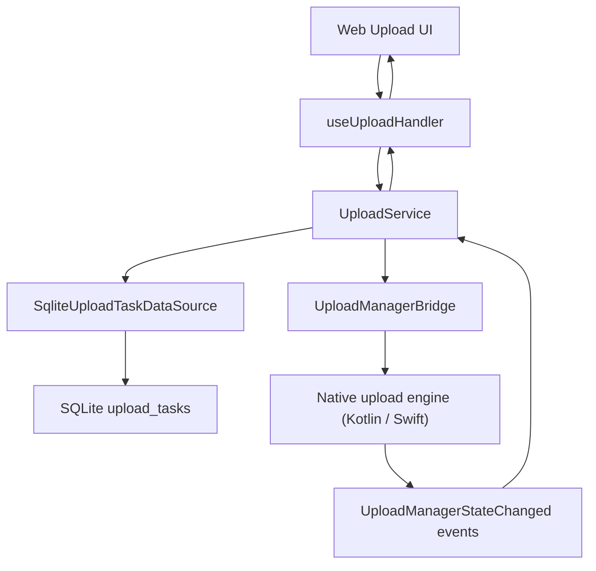
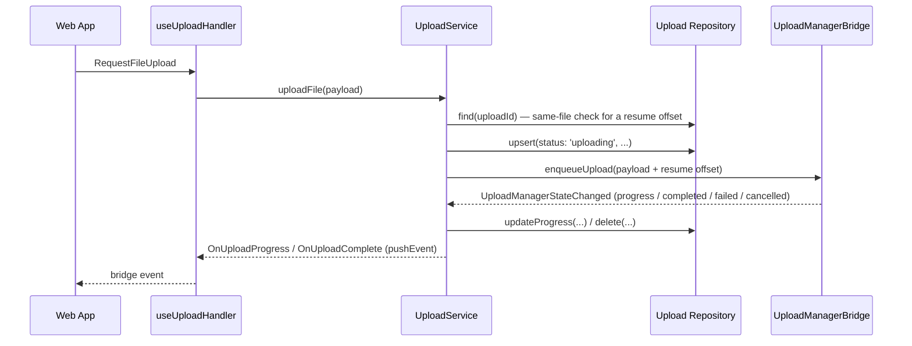
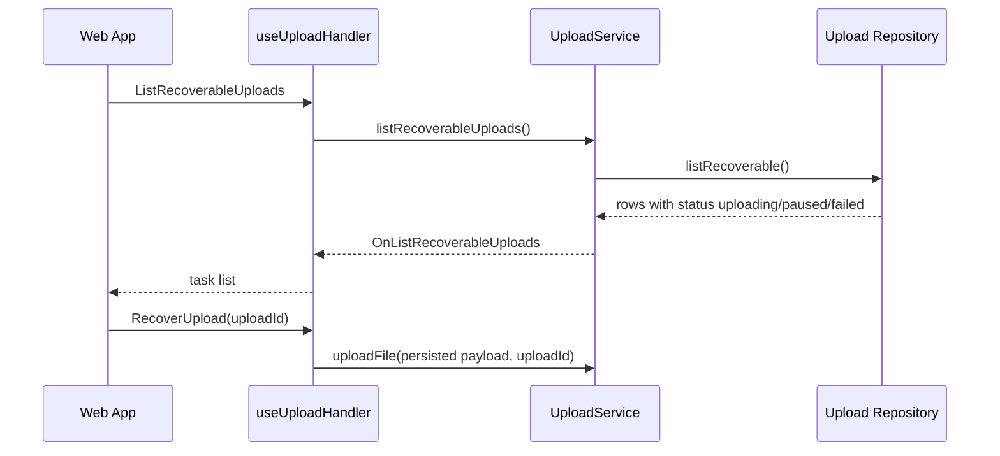

# Upload

Large-file upload started from the WebView, handed to the native upload engine, and tracked in
SQLite so an interrupted transfer can be recovered after the app restarts.

## Files

| Area              | File                                                                           |
| ----------------- | ------------------------------------------------------------------------------ |
| WebView handler   | `src/app/webview/hooks/useUploadHandler.ts`                                    |
| Service           | `src/app/services/upload/UploadService.ts`                                     |
| Types             | `src/app/services/upload/types.ts`                                             |
| Repository        | `src/app/services/upload/repository/SqliteUploadTaskDataSource.ts`             |
| TS native bridges | `src/app/bridge/UploadManagerBridge.ts`, `src/app/bridge/FileManagerBridge.ts` |
| Android           | `UploadManagerModule.kt`, `UploadBackgroundService.kt`, `UploadWorker.kt`      |
| iOS               | `ios/Bridges/Upload/UploadManager.swift`, `UploadManager.m`                    |
| Debug             | `src/app/features/debug/screens/UploadTestScreen.tsx`                          |

## Structure

`UploadService` (`provider.uploadService`, lazily constructed — see
[boot-optimization.md](./boot-optimization.md)) is a singleton holding an in-memory
`Map<uploadId, UploadTaskState>` alongside the SQLite row: the map carries this session's live
callbacks, the row is what survives a restart.

## Starting an upload

`uploadFile` persists the task before calling `enqueueUpload`, so a row exists even if the native
call fails or the app is killed right after. It resumes from the row's `uploadedBytes` /
`lastChunkIndex` only when the incoming `fileUri`/`fileName`/`fileSize`/`mimeType` match the
persisted payload exactly — a different file reusing the same `uploadId` starts from zero instead of
resuming into the wrong content.

## Recovery

`listRecoverable` reads every row with status `uploading`, `paused`, or `failed`, downgrading a
lingering `uploading` row to `paused` on read — the app process ended mid-transfer with no chance to
update it, so recovery stays manual, never auto-resumed. `RecoverUpload` on an unknown `uploadId`
answers `NOT_FOUND`. Completed and cancelled tasks are deleted from the table, not kept as history.

## Constraints

- The WebView never carries file bytes or base64 across the bridge — only metadata and progress.
- The native module owns the transfer itself; `UploadService` only persists state and relays events.
- A task is written to SQLite before native is asked to start, so recovery data exists even if the
  native call never returns.
- Pause/resume/cancel/retry must keep `UploadService`'s in-memory state and the native module in
  sync — `pauseUpload`'s `task.status !== 'uploading'` guard is what catches a mismatch.

## Checklist

- Does every task state transition reach the repository, not just the in-memory map?
- Do the Android and iOS implementations answer the same events and error codes?
- Is a native `progress`/`completed`/`failed`/`cancelled` event normalized before reaching the web?
- After a restart, does `listRecoverable` still return the task, and does the same-file check refuse
  to resume a different file under a reused `uploadId`?
