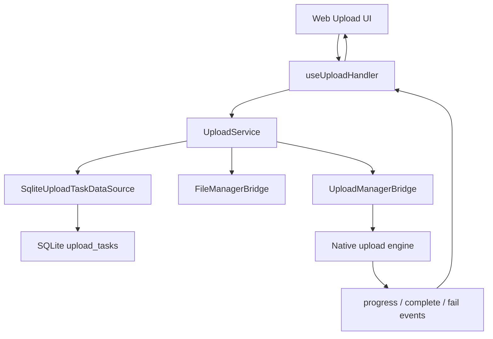
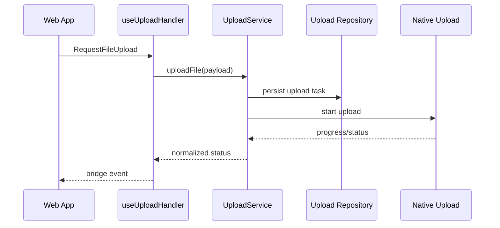
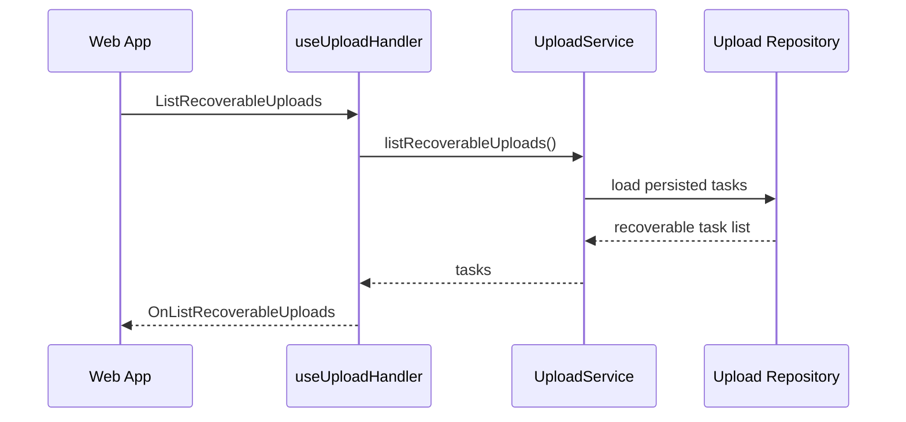

# Upload

Upload 시스템은 WebView에서 시작된 대용량 파일 업로드를 native module과 local repository로 안정적으로 처리한다.

## 주요 파일

| 영역             | 파일                                                                           |
| ---------------- | ------------------------------------------------------------------------------ |
| WebView handler  | `src/app/webview/hooks/useUploadHandler.ts`                                    |
| Service          | `src/app/services/upload/UploadService.ts`                                     |
| Types            | `src/app/services/upload/types.ts`                                             |
| Repository       | `src/app/services/upload/repository/SqliteUploadTaskDataSource.ts`             |
| TS native bridge | `src/app/bridge/UploadManagerBridge.ts`, `src/app/bridge/FileManagerBridge.ts` |
| Android          | `UploadManagerModule.kt`, `UploadBackgroundService.kt`, `UploadWorker.kt`      |
| iOS              | `ios/Bridges/Upload/UploadManager.swift`, `UploadManager.m`                    |
| Debug            | `src/app/features/debug/screens/UploadTestScreen.tsx`                          |

## 구조

## Start Upload 시나리오

## Recovery 시나리오

## 제약

- WebView JavaScript가 file binary/base64 전송을 직접 담당하지 않는다.
- 장시간 전송은 native upload engine이 맡는다.
- upload task metadata는 native 시작 전에 SQLite에 저장한다.
- pause/resume/cancel/retry는 service와 native module 양쪽 상태가 일치해야 한다.

## 변경 체크리스트

- upload task state transition이 repository에 남는가?
- Android/iOS native behavior가 동일한 contract를 지키는가?
- progress/completion/error event가 WebView로 normalize되어 전달되는가?
- app restart 후 recoverable task가 누락되지 않는가?
