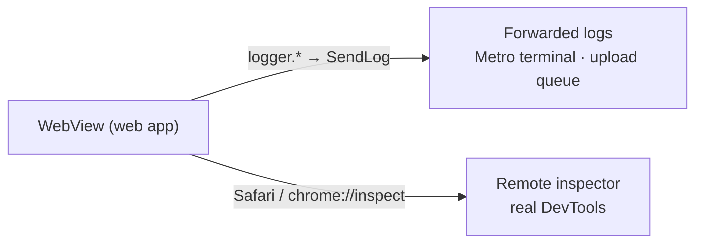

# WebView remote debugging

How to observe the WebView running inside the mobile app **down to source lines** — by attaching
the platform's own remote inspector (Safari Web Inspector on iOS, Chrome DevTools on Android)
directly to it.

## Why not just read the forwarded logs

The app already forwards WebView logs to native, landing in the Metro terminal and the upload
queue:

```
[web] logger.*(...)              libs/bridges/src/logger/logger.ts
  → SendLog message, one per entry   libs/bridges/src/logger/appLogInfoCodec.ts
  → [app] useLogHandler → ingestLogEntry → logHub
      ├─ console sink (__DEV__ only, all levels)
      ├─ Crashlytics breadcrumb (non-debug)
      └─ LogUploadQueueService (non-debug — the queue the debug/monitoring UI reads)
```

**`debug` is console-only.** Both persistent sinks drop it, so on a `prodRelease` build a `debug`
entry never lands anywhere durable — it exists only for the terminal on `prodDebug`/`dev*` builds.
That is also why a debug-level entry never shows up in the in-app log viewer; it is expected, not a
bug. To see `debug`-level flow on a release device, raise the call site to `info` or above, or use
the remote inspector.

This path is good for **skimming a flow quickly**, but every value is flattened through
`safeSerializable` before it travels, so object structure, the original error stack, and "which
line in the web code" are all collapsed into a string. For example:

```
[WEBVIEW] error {name:'Error', message:'503 SOCKET NOT CONNECTED', stack:'@http://…sockets-lib.js:3510:28\n…'}
```

The stack is one escaped line — following it back to an actual source location is hard.

**For anything past a quick skim, attach the remote inspector.** It gives the WebView real
DevTools:

| DevTools tab | What it gives you                                                                         |
| ------------ | ----------------------------------------------------------------------------------------- |
| Console      | Real objects to expand, not strings — plus live expression evaluation                     |
| Sources      | Source-mapped stacks — click a frame to jump to the original `.tsx` line, set breakpoints |
| Network      | The WebView's actual requests/responses, including socket messages                        |
| Elements     | The rendered DOM/CSS — e.g. injected safe-area variables                                  |

## Prerequisite: the debugging flag

The remote inspector only finds the WebView if its debug flag is on, and the default differs by
platform.

| Platform | Default                                                                                                                                                                                                    | Action                                                 |
| -------- | ---------------------------------------------------------------------------------------------------------------------------------------------------------------------------------------------------------- | ------------------------------------------------------ |
| Android  | **On automatically for Debug builds.** react-native-webview calls `setWebContentsDebuggingEnabled(true)` when `ReactBuildConfig.DEBUG` is true.                                                            | Nothing to do for Debug/Dev builds; Release stays off. |
| iOS      | **Off by default.** WKWebView's `inspectable` flag is only set via the `webviewDebuggingEnabled` prop. iOS below 16.4 exposes dev-built WKWebViews to Safari anyway, but **16.4 and above need the prop.** | Already set — see below.                               |

### iOS: `webviewDebuggingEnabled` is already on

`AppWebView` (`../src/app/webview/AppWebView.tsx`) passes `webviewDebuggingEnabled={__DEV__}` to
its `<WebView>`, so any dev build exposes the WebView to Safari and a production build does not.
If a dev build's WebView still doesn't show up in Safari's list, this prop isn't the cause — check
the device's Web Inspector toggle and confirm the build actually has `__DEV__` set.

> The deployment target is 15.6, so both 16.4+ devices/simulators (which need the prop) and older
> ones (which don't) are in play.

## iOS — Safari Web Inspector

1. **Enable Safari's Develop menu**: Safari → Settings → Advanced → check "Show features for web
   developers" (older macOS: "Show Develop menu in menu bar").
2. **(Real device only) Enable Web Inspector on the device**: Settings → Safari → Advanced → **Web
   Inspector** ON. Simulators don't need this.
3. Connect the device to the Mac over USB (simulators are detected automatically).
4. Launch the app (Dev scheme, `io.chatic.dou.dev`) and navigate to the WebView screen.
5. In Safari's **Develop** menu, pick the device/simulator, then the WebView's URL (a local run is
   `localhost:5003`) — the Web Inspector window opens.
6. Use Console/Sources/Network as usual — e.g. clicking the `SocketManager.ts:121` frame from the
   503 log above in Sources jumps straight to that source line.

> If the WebView isn't in the list, check [the prerequisite](#prerequisite-the-debugging-flag)
> first.

## Android — Chrome DevTools (`chrome://inspect`)

1. Enable **USB debugging** on the device (Settings → Developer options → USB debugging).
   Emulators have it on by default.
2. Install a **Debug/Dev build** on the device or emulator — Release builds can't be inspected.
3. Open `chrome://inspect/#devices` in desktop Chrome.
4. With "Discover USB devices" checked, confirm the device appears.
5. Launch the app and navigate to the WebView screen — a `WebView in io.chatic.dou.dev` entry (plus
   its loaded URL) appears under the device → click **inspect** to open Chrome DevTools.
6. Console/Sources/Network work exactly like a regular web page.

## Remote inspector vs. forwarded logs



| Situation                                                      | Use                                           |
| -------------------------------------------------------------- | --------------------------------------------- |
| Quick skim of a flow, remote on a real device                  | Forwarded logs (terminal / in-app log viewer) |
| Root-causing at the code level, expanding objects, breakpoints | Remote inspector                              |
| Inspecting a network/socket payload                            | Remote inspector (Network tab)                |

## Troubleshooting

- **iOS: the WebView isn't in the Develop menu** — most often iOS 16.4+ without
  `webviewDebuggingEnabled` (should already be on for dev builds; check it's actually a dev build),
  or the device's Web Inspector toggle is off.
- **Android: device/WebView doesn't show in `chrome://inspect`** — check USB debugging, that it's a
  Debug build, the USB trust prompt, and (if needed) the manufacturer's USB driver.
- **Inspector connects but sources only show the bundle** — confirm you're pointed at the dev
  server (Vite) build with source maps; a production bundle is minified and code-level tracing is
  limited.
