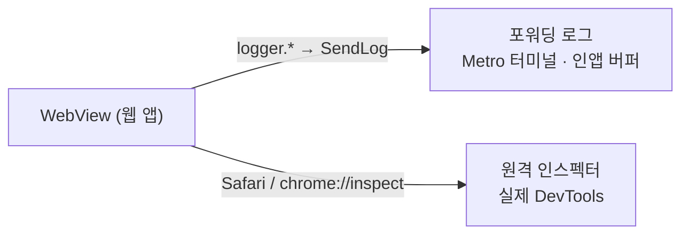

# WebView 원격 디버깅 (원격 인스펙터로 웹뷰 관측)

모바일 앱 안에서 도는 웹뷰의 로그·에러·네트워크를 **코드 레벨까지** 관측하는 방법이다.
플랫폼이 제공하는 원격 인스펙터(iOS Safari Web Inspector, Android Chrome DevTools)로 웹뷰에
직접 붙는다.

## 왜 원격 인스펙터인가

앱은 웹뷰 로그를 네이티브로 포워딩해 Metro 터미널/인앱 버퍼에 남긴다.

```
[웹] logger.error(...)        libs/bridges/src/logger/logger.ts
  → SendLog 메시지            libs/bridges/src/logger/adapters/nativeBridgeAdapter.ts
  → [앱] useLogHandler        src/app/webview/hooks/useLogHandler.ts
  → LogService → ConsoleLogger(터미널) / LogBufferService(인앱 버퍼: DebugLogBufferPage)
```

이 경로는 **흐름을 빠르게 훑기엔 좋지만**, 값이 `safeSerializable`로 문자열화되어 담기기 때문에
객체 구조, 원본 에러 stack, "웹뷰의 어느 코드 라인에서 났는지"는 뭉개진다. 예를 들어 아래 로그는
stack이 이스케이프된 한 줄로 눌려 있어 실제 위치(`SocketManager.ts:121`)를 눈으로 좇기 어렵다.

```
[WEBVIEW] error {name:'Error', message:'503 SOCKET NOT CONNECTED', stack:'@http://…sockets-lib.js:3510:28\n…'}
```

**상세 관측이 필요하면 원격 인스펙터를 쓴다.** 웹뷰에 실제 DevTools가 붙으므로:

| DevTools 탭 | 얻는 것                                                                  |
| ----------- | ------------------------------------------------------------------------ |
| Console     | 문자열이 아닌 **실제 객체**를 펼쳐서 확인, 직접 표현식 평가              |
| Sources     | **소스맵된 stack** — 프레임을 클릭하면 원본 `.tsx`의 해당 줄로 점프, 브레이크포인트 |
| Network     | 웹뷰가 보낸 실제 요청/응답 (소켓 메시지 포함)                            |
| Elements    | 렌더된 DOM/CSS (safe-area 변수 주입 결과 등)                             |

## 사전 조건 (중요)

원격 인스펙터가 웹뷰를 인식하려면 웹뷰의 디버깅 플래그가 켜져 있어야 한다. 플랫폼마다 다르다.

| 플랫폼  | 기본 동작                                                                                                    | 조치                                                                 |
| ------- | ------------------------------------------------------------------------------------------------------------ | -------------------------------------------------------------------- |
| Android | **Debug 빌드는 자동 활성화.** react-native-webview가 `ReactBuildConfig.DEBUG`일 때 `setWebContentsDebuggingEnabled(true)` 호출 ([RNCWebViewManagerImpl.kt:91](../../../node_modules/react-native-webview/android/src/main/java/com/reactnativecommunity/webview/RNCWebViewManagerImpl.kt)) | 별도 조치 불필요 (Debug/Dev 빌드). Release는 불가.                    |
| iOS     | **자동 활성화 없음.** WKWebView의 `inspectable`은 `webviewDebuggingEnabled` prop으로만 켜진다 ([RNCWebViewImpl.m:571](../../../node_modules/react-native-webview/apple/RNCWebViewImpl.m)). iOS 16.4 미만은 OS가 dev에서 자동 노출하지만, **16.4 이상은 이 prop 없이는 Safari에 안 뜬다.** | `AppWebView`에 prop 추가 필요 (아래 스니펫). 현재 미설정 상태.        |

### iOS: `webviewDebuggingEnabled` 켜기

`AppWebView`([src/app/webview/AppWebView.tsx](../src/app/webview/AppWebView.tsx))의 `<WebView>`에 dev 한정으로 추가한다.
프로덕션에서 웹뷰가 인스펙터에 노출되지 않도록 `__DEV__` 게이트를 쓴다.

```tsx
<WebView
    // …기존 props
    webviewDebuggingEnabled={__DEV__}
/>
```

> iOS 배포 타깃이 15.6이라 16.4 이상 기기·시뮬레이터가 관측 대상이 된다. 이 prop 없이 "웹뷰가
> Safari 목록에 안 뜬다"면 대개 이 문제다.

## iOS — Safari Web Inspector

1. **Mac Safari 개발자용 메뉴 활성화**: Safari → 설정 → 고급 → "메뉴 막대에서 개발자용 메뉴 보기"
   체크. (macOS 버전에 따라 "웹 개발자용 기능 표시" 문구일 수 있음)
2. **(실기기) 기기에서 웹 검사기 허용**: 설정 → Safari → 고급 → **웹 검사기(Web Inspector)** ON.
   시뮬레이터는 이 단계가 필요 없다.
3. 기기를 Mac에 USB로 연결한다. (시뮬레이터는 자동 인식)
4. 앱(Dev 스킴, `io.chatic.dou.dev`)을 실행해 웹뷰 화면까지 진입한다.
5. Safari → 상단 **개발자용** 메뉴 → `[기기 또는 시뮬레이터 이름]` → 웹뷰 URL(예: `192.168.1.129:5003`)
   선택 → Web Inspector 창이 열린다.
6. Console/Sources/Network를 연다. 예: 위 503 로그의 `SocketManager.ts:121` 프레임을 Sources에서
   클릭하면 원본 코드 줄로 점프한다.

> 목록에 웹뷰가 안 보이면 위 [사전 조건 — iOS](#ios-webviewdebuggingenabled-켜기)를 먼저 확인한다.

## Android — Chrome DevTools (`chrome://inspect`)

1. 기기에서 **USB 디버깅**을 켠다. (설정 → 개발자 옵션 → USB 디버깅) 에뮬레이터는 기본 활성.
2. **Debug/Dev 빌드**를 기기·에뮬레이터에 설치한다. (Release 빌드는 디버깅 비활성)
3. 데스크톱 Chrome에서 `chrome://inspect/#devices`를 연다.
4. "Discover USB devices"가 체크된 상태에서 기기가 목록에 나타나는지 확인한다.
5. 앱을 실행해 웹뷰 화면까지 진입하면, 기기 아래에 `WebView in io.chatic.dou.dev`(+ 로드된 URL)
   항목이 나타난다 → **inspect** 클릭 → Chrome DevTools 창이 열린다.
6. Console/Sources/Network 사용법은 일반 웹과 동일하다.

## 원격 인스펙터 vs 포워딩 로그 — 언제 무엇을



| 상황                                        | 권장 수단                          |
| ------------------------------------------- | ---------------------------------- |
| 흐름을 빠르게 훑기, 실기기에서 원격으로 확인 | 포워딩 로그 (터미널 / DebugLogBufferPage) |
| 코드 레벨 원인 추적, 객체 펼치기, 브레이크포인트 | 원격 인스펙터                      |
| 네트워크/소켓 payload 확인                  | 원격 인스펙터 (Network 탭)         |

## 트러블슈팅

- **iOS: 웹뷰가 개발자용 메뉴에 안 뜸** → iOS 16.4+인데 `webviewDebuggingEnabled` 미설정이 가장
  흔한 원인. Release 빌드가 아닌지, 기기의 웹 검사기 토글이 켜졌는지도 확인.
- **Android: 기기/웹뷰가 `chrome://inspect`에 안 뜸** → USB 디버깅, Debug 빌드 여부, USB 신뢰
  프롬프트, (필요 시) 제조사 USB 드라이버를 확인.
- **원격 인스펙터 연결은 되는데 소스가 번들로만 보임** → dev 서버(Vite) 소스맵으로 접속했는지 확인.
  프로덕션 번들은 minify되어 코드 레벨 추적이 제한된다.
```
