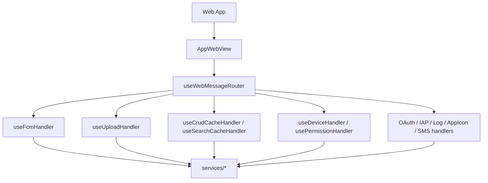
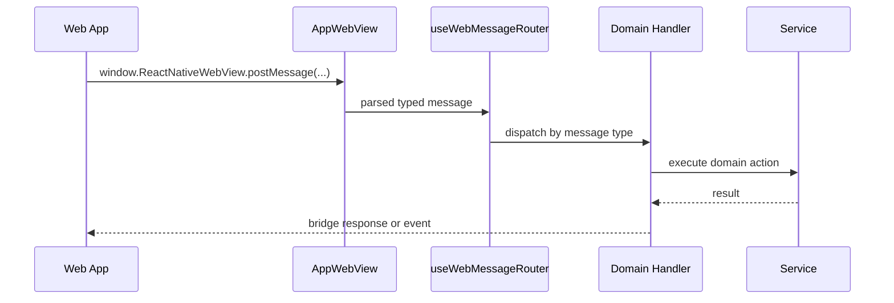

# WebView

WebView는 웹 앱과 모바일 shell의 경계다. 웹 앱은 typed message를 보내고, 모바일은 handler/service/native module을 통해 결과를 반환한다.

## 주요 파일

| 파일                                           | 역할                                                         |
| ---------------------------------------------- | ------------------------------------------------------------ |
| `src/app/webview/AppWebView.tsx`               | WebView render, runtime script injection, readiness handling |
| `src/app/webview/core/bridge.ts`               | low-level JSON post/receive helper                           |
| `src/app/webview/hooks/useWebMessageRouter.ts` | central message router                                       |
| `src/app/webview/hooks/*Handler.ts`            | domain-specific handlers                                     |
| `src/app/webview/utils/injectionScripts.ts`    | safe area, device info, console override injection           |
| `src/app/webview/hooks/useAppBridge.ts`        | bridge creation and WebView message binding                  |

## 구조

## Message 시나리오

## Runtime Messages

`AppWebView.tsx` intercepts these messages before normal bridge routing:

| Message                       | 동작                                                                     |
| ----------------------------- | ------------------------------------------------------------------------ |
| `WebAppReady`                 | loading state 해제, debug runtime state 갱신, `offlinePushQueue.flush()` |
| `ResumeReady`                 | iOS resume overlay 해제                                                  |
| `SavePreference` with `theme` | native theme store 갱신                                                  |

## Injection

WebView load 전에 다음 runtime data가 script로 주입된다.

- safe area inset
- keyboard height
- device/platform/app version/build number
- Firebase installation id
- latest version check result
- console override script

## 변경 체크리스트

- 새 WebView message type이 typed package와 handler/router에 모두 반영됐는가?
- handler가 service 호출만 하고 domain logic을 과도하게 갖지 않는가?
- WebView ready 전후로 호출되어도 안전한가?
- bridge response/event 이름이 web contract와 일치하는가?
