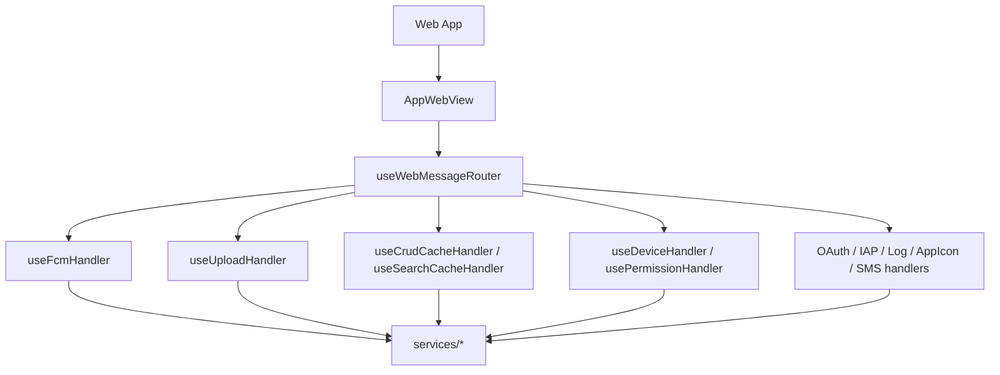
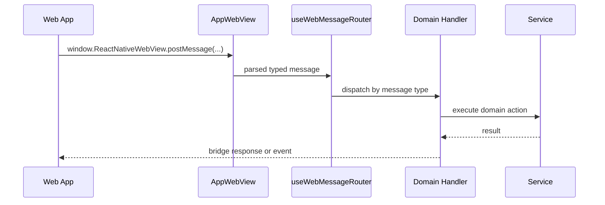

# WebView

WebView는 웹 앱과 모바일 shell의 경계다. 웹 앱은 typed message를 보내고, 모바일은 handler/service/native module을 통해 결과를 반환한다.

> 웹뷰 로그·에러를 코드 레벨까지 관측하려면(Safari Web Inspector / `chrome://inspect`) [webview-debugging.md](./webview-debugging.md) 참고.

## 주요 파일

| 파일                                           | 역할                                               |
| ---------------------------------------------- | -------------------------------------------------- |
| `src/app/webview/AppWebView.tsx`               | WebView 렌더, 런타임 스크립트 주입, readiness 처리 |
| `src/app/webview/core/bridge.ts`               | low-level JSON post/receive 헬퍼                   |
| `src/app/webview/hooks/useWebMessageRouter.ts` | 중앙 message router                                |
| `src/app/webview/hooks/*Handler.ts`            | 도메인별 핸들러                                    |
| `src/app/webview/utils/injectionScripts.ts`    | safe area, device info, 디버그·테마 전역 주입      |
| `src/app/webview/hooks/useAppBridge.ts`        | bridge 생성과 WebView message 바인딩               |

## 구조

## Message 시나리오

## 셸 상태를 움직이는 메시지

세 메시지는 웹의 요청에 답하는 대신 네이티브 셸 자신의 상태를 바꾼다. **가로채는 지점은 없다** —
셋 다 평범한 라우터 경로를 탄다.

| Message                       | 받는 곳                                      | 동작                                                                                                         |
| ----------------------------- | -------------------------------------------- | ------------------------------------------------------------------------------------------------------------ |
| `WebAppReady`                 | `useAppBridge` → `MainScreen.handleAppReady` | 로딩 오버레이 해제, `web-app-ready` 부팅 마크, 버퍼된 push 이벤트 flush                                      |
| `DismissResumeOverlay`        | `useAppStateHandler`                         | iOS resume 오버레이 해제 ([useResumeOverlay](../src/app/webview/hooks/useResumeOverlay.ts), 1.5초 폴백 있음) |
| `SavePreference` with `theme` | `usePreferenceCacheHandler`                  | `parseThemeMode` 검증 후 네이티브 theme store 갱신 ([theme.md](./theme.md))                                  |

`WebAppReady`는 특히 늦게 오거나 아예 안 올 수 있다. `MainScreen`이 1초 폴백 타이머로 자체 해제하고,
`AppBridgeHost`는 그때까지 push 이벤트를 버퍼링하므로 cold-start 딥링크·푸시 탭이 유실되지 않는다.

## Injection

`injectedJavaScriptBeforeContentLoaded`로 문서 파싱 전에 한 덩어리(`getSyncInjectionScript`)가 주입된다.
전체가 `try/catch`로 감싸여 있어, 실패하면 `SendLog`(태그 `INJECTION`)로 스스로를 보고하고 조용히
넘어간다 — 불투명한 "Script error."로 새지 않는다.

| 전역                                                                                  | 내용                                                                                     |
| ------------------------------------------------------------------------------------- | ---------------------------------------------------------------------------------------- |
| safe area inset · keyboard height                                                     | CSS 변수로 세팅                                                                          |
| `CHATIC_APP_DEVICE_ID`                                                                | `deviceId:firebaseInstallId` 조합 (아래 참고)                                            |
| `CHATIC_APP_INSTALLATION_ID` · `CHATIC_APP_UNIQUE_DEVICE_ID`                          | 둘 다 원시 device id. 앞은 deprecated, 등록은 뒤로 이관 중                               |
| `CHATIC_APP_FIREBASE_INSTALLATION_ID`                                                 | Firebase installation id 단독                                                            |
| `CHATIC_APP_PLATFORM` · `_APPLICATION` · `_DEVICE_MODEL` · `_OS_VERSION`              | 기기·앱 식별 정보                                                                        |
| `CHATIC_APP_CURRENT_VERSION` · `_BUILD_NUMBER` · `_LATEST_VERSION` · `_SHOULD_UPDATE` | 버전 비교 결과 ([app-update.md](./app-update.md))                                        |
| `CHATIC_APP_STAGE` · `CHATIC_APP_CURRENT_LANGUAGE`                                    | 실행 환경과 앱 언어                                                                      |
| `CHATIC_APP_RUN_ID`                                                                   | 이번 앱 실행의 id. 웹이 브릿지 왕복 없이 네이티브와 같은 샘플 판정에 도달한다 (ADR-0071) |
| `CHATIC_APP_CONSOLE_ENABLED`                                                          | 웹의 `debug` 엔트리를 앱으로 넘길지 — 앱 콘솔이 살아 있을 때만 참                        |
| `CHATIC_APP_DEBUG_MODE`                                                               | 영속된 디버그 언락. 재시작한 웹뷰가 언락된 채로 뜬다                                     |
| `CHATIC_APP_LOG_UPLOAD_HOLD`                                                          | 영속된 로그 업로드 보류 플래그                                                           |
| `CHATIC_APP_THEME`                                                                    | 영속된 테마. 웹 프리페인트가 첫 페인트에 읽는다 ([theme.md](./theme.md))                 |

레거시 `__console__` 오버라이드 릴레이는 없다. 웹→네이티브 로그 채널은 구조화된 `SendLog` 하나뿐이다
(ADR-0047) — [webview-debugging.md](./webview-debugging.md) 참고.

> device id는 원시 `DeviceInfo.getUniqueId`에 Firebase installation id를 이어붙인 값이다([`buildInjectedUniqueId.ts`](../src/app/webview/utils/buildInjectedUniqueId.ts)). Firebase id는 비동기 조회([`useFirebaseInstallId.ts`](../src/app/webview/hooks/useFirebaseInstallId.ts))라 아직 없으면 원시 device id만 들어간다.

## 변경 체크리스트

- 새 WebView message type이 typed package와 handler/router에 모두 반영됐는가?
- handler가 service 호출만 하고 domain logic을 과도하게 갖지 않는가?
- WebView ready 전후로 호출되어도 안전한가?
- bridge response/event 이름이 web contract와 일치하는가?
