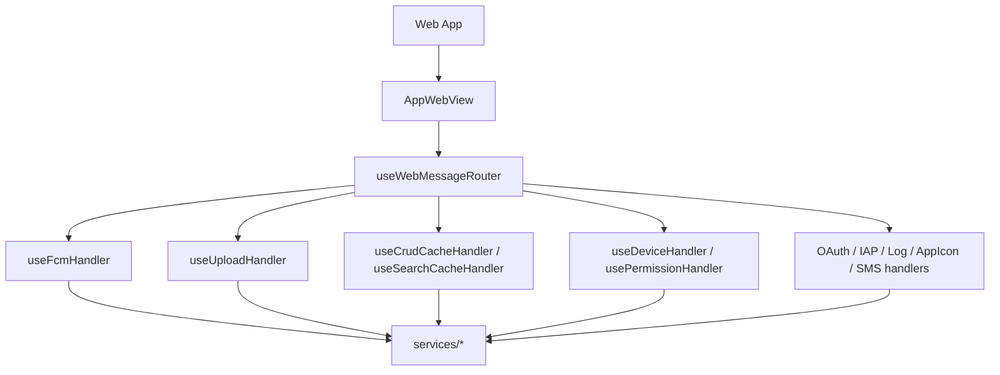
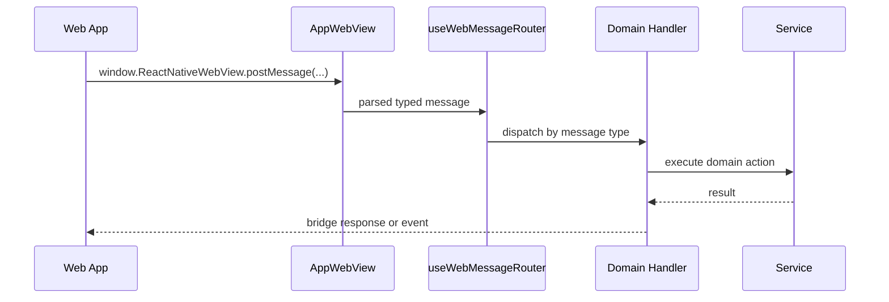

# WebView

WebView는 웹 앱과 모바일 shell의 경계다. 웹 앱은 typed message를 보내고, 모바일은 handler/service/native module을 통해 결과를 반환한다.

> 웹뷰 로그·에러를 코드 레벨까지 관측하려면(Safari Web Inspector / `chrome://inspect`) [webview-debugging.md](./webview-debugging.md) 참고.

## 주요 파일

| 파일                                           | 역할                                               |
| ---------------------------------------------- | -------------------------------------------------- |
| `src/app/webview/AppWebView.tsx`               | WebView 렌더, 런타임 스크립트 주입, readiness 처리 |
| `src/app/webview/core/bridge.ts`               | low-level JSON post/receive 헬퍼                   |
| `src/app/webview/hooks/useWebMessageRouter.ts` | 중앙 message router                                |
| `src/app/webview/hooks/*Handler.ts`            | 도메인별 핸들러                                    |
| `src/app/webview/utils/injectionScripts.ts`    | safe area, device info, console override 주입      |
| `src/app/webview/hooks/useAppBridge.ts`        | bridge 생성과 WebView message 바인딩               |

## 구조

## Message 시나리오

## Runtime Messages

`AppWebView.tsx` intercepts these messages before normal bridge routing:

| Message                       | 동작                                         |
| ----------------------------- | -------------------------------------------- |
| `WebAppReady`                 | loading state 해제, debug runtime state 갱신 |
| `ResumeReady`                 | iOS resume overlay 해제                      |
| `SavePreference` with `theme` | native theme store 갱신                      |

## Injection

WebView load 전에 다음 runtime data가 script로 주입된다.

- safe area inset
- keyboard height
- device id (`CHATIC_APP_DEVICE_ID` = `deviceId:firebaseInstallId` 조합) / platform / app version / build number
- installation id (`CHATIC_APP_INSTALLATION_ID` = 원시 device id) / latest version check result
- console override script

> device id는 원시 `DeviceInfo.getUniqueId`에 Firebase installation id를 이어붙인 값이다([`buildInjectedUniqueId.ts`](../src/app/webview/utils/buildInjectedUniqueId.ts)). Firebase id는 비동기 조회([`useFirebaseInstallId.ts`](../src/app/webview/hooks/useFirebaseInstallId.ts))라 아직 없으면 원시 device id만 들어간다.

## 변경 체크리스트

- 새 WebView message type이 typed package와 handler/router에 모두 반영됐는가?
- handler가 service 호출만 하고 domain logic을 과도하게 갖지 않는가?
- WebView ready 전후로 호출되어도 안전한가?
- bridge response/event 이름이 web contract와 일치하는가?
