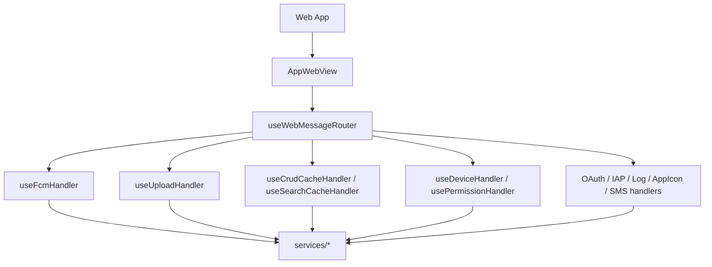
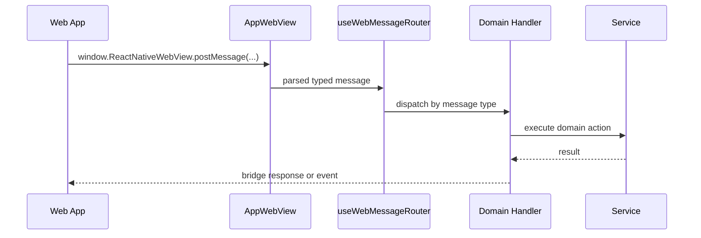

# WebView

The WebView is the message boundary between the web client and the native shell: the web posts a
typed message, and a handler hook answers it through a service.

> To inspect webview console output and errors at the code level (Safari Web Inspector /
> `chrome://inspect`), see [webview-debugging.md](./webview-debugging.md).

## Key files

| File                                           | Role                                                                          |
| ---------------------------------------------- | ----------------------------------------------------------------------------- |
| `src/app/webview/AppWebView.tsx`               | Renders the `WebView`, wires the injected runtime scripts, tracks ready state |
| `src/app/webview/hooks/useBaseBridge.ts`       | Builds the `AppBridgeHost` (`@chatic/bridges`) and its `onMessage` handler    |
| `src/app/webview/hooks/useAppBridge.ts`        | Thin wrapper exposing `{ bridge, onMessage }` to `MainScreen`                 |
| `src/app/webview/hooks/useWebMessageRouter.ts` | Central message router; queues and dispatches to 25 handler hooks             |
| `src/app/webview/hooks/*Handler.ts`            | 25 domain handlers, one per capability group                                  |
| `src/app/webview/utils/injectionScripts.ts`    | Builds the scripts injected before the WebView loads                          |

`webview/core/bridge.ts` (`createBridge`, `postAppMessage`, `receiveWebMessage`) has no importer
anywhere in `apps/mobile/src` — the bridge actually in use is `AppBridgeHost` from `@chatic/bridges`,
assembled in `useBaseBridge.ts`.

```bash
grep -rln "from '.*core/bridge'" apps/mobile/src
```

## Structure



## Message flow



`useWebMessageRouter` queues incoming messages and processes them one at a time, so a slow handler
cannot let a later message overtake it.

## The WebAppReady handshake

`WebAppReady` is not one of the 25 routed messages — `AppBridgeHost` (`@chatic/bridges`) answers it
internally, inside `handleMessage`, before a message ever reaches `useWebMessageRouter`. It is a
capability handshake, not a plain ready ping: the reply reports the app's local-cache schema version
and supported cache types (read from the SQLite install, warmed in parallel with the WebView's bundle
load) so a web build newer than this app can route unsupported cache domains to its own storage
instead of a silent void. `useBaseBridge.ts` passes an `onAppReady` callback into `AppBridgeHost`;
`MainScreen` uses it to clear the `ResumeOverlay`-adjacent loading state and mark the
`bootMetricsService` `web-app-ready` timestamp. `DismissResumeOverlay`, by contrast, is a normal
routed message — `useAppStateHandler` answers it like any other handler — that fires when the web's
own repaint animation after a resume has finished, and is what actually hides `ResumeOverlay`.

| Message                       | What it does                                                                                                                |
| ----------------------------- | --------------------------------------------------------------------------------------------------------------------------- |
| `WebAppReady`                 | Handshake, answered inside `@chatic/bridges`; buffers and flushes any push events queued before it                          |
| `DismissResumeOverlay`        | Routed handler (`useAppStateHandler`); clears the resume overlay after the web's repaint                                    |
| `SavePreference` with `theme` | Routed handler (`usePreferenceCacheHandler`); updates the native theme store — see [../system/theme.md](../system/theme.md) |

## Injection

Before the WebView loads, `injectionScripts.ts` assembles one script (`getSyncInjectionScript`) that
sets these globals, guarded so a runtime failure reports itself through `SendLog` (tag `INJECTION`)
instead of surfacing as an opaque "Script error.":

- safe-area insets and keyboard height, as CSS variables
- device info: run id, platform, stage, app/OS version, build number, language, device model
- `CHATIC_APP_CONSOLE_ENABLED` — whether relaying `debug` logs to native is worth it in this build.
  The legacy `__console__` relay script it replaced is gone; `SendLog` is now the only web→native log
  channel (ADR-0097).
- device identity: `CHATIC_APP_UNIQUE_DEVICE_ID` (raw device id) and
  `CHATIC_APP_FIREBASE_INSTALLATION_ID` (empty until the async Firebase lookup resolves), plus two
  `@deprecated` globals kept for older web bundles — `CHATIC_APP_DEVICE_ID`
  (`uniqueDeviceId:firebaseInstallId`, built by
  [`buildInjectedUniqueId.ts`](../../src/app/webview/utils/buildInjectedUniqueId.ts)) and
  `CHATIC_APP_INSTALLATION_ID` (confusingly named — it is the bare device id, not a Firebase id)
- the persisted theme (`CHATIC_APP_THEME`), read by the web's pre-paint script — see
  [../system/theme.md](../system/theme.md)
- `CHATIC_APP_CONFIG_BAG` — `@chatic/config`'s shell-lane KV bag, so `config.init()` can hydrate
  synchronously before the web's first paint

All string values are `JSON.stringify`-interpolated rather than quoted directly: an unescaped quote
or backslash from native data (a localized app name, an odd Android device-model string) would
otherwise break out of the literal and throw inside a script with no `<script src>` to attribute the
error to.

## Change checklist

- Is a new WebView message type reflected in `@chatic/app-messages` and in both a handler and the
  router?
- Does a handler only call a service, without carrying its own domain logic?
- Is it safe to call before and after WebView ready?
- Do the bridge response/event names match the web contract?
